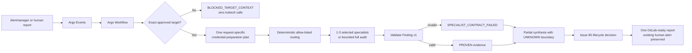

# Selective read-only SRE orchestrator

This POC evolves the existing smart-triage Alertmanager/Argo Events path into a
deterministic selective investigation. Argo Workflows owns target validation,
budgets, concurrency and failure boundaries. Existing kagent specialists remain
the optional A2A reasoning plane. The POC creates no specialist Deployment and
contains no Kubernetes write tool.



## Target boundary

An incident must resolve one approved registry row and provide an approved
namespace and stable workload unless it is explicitly cluster-scoped.
Conflicts or ambiguity produce `BLOCKED_TARGET_CONTEXT` before credentials or
kubectl.

The plan records exactly one command equivalent to:

```text
az aks get-credentials --subscription PROTECTED_RUNTIME_VALUE \
  --resource-group <approved-rg> --name <approved-cluster> \
  --file /tmp/aks-triage/<run-id>.kubeconfig --overwrite-existing
```

`--admin`, shared kubeconfig use, `az account set` and `kubectl config
use-context` are forbidden. The public fixture records the plan but does not
execute Azure or Kubernetes commands. A work-environment adapter must resolve
the protected subscription reference and execute the preparation once before
selected specialists run.

## Routing

| Signal | Selected capabilities |
|---|---|
| CrashLoop/OOM/ImagePull/NotReady | Kubernetes workload plus bounded log/metrics evidence |
| FailedScheduling/capacity | Kubernetes, deployment/placement and metrics evidence |
| Certificate/workload identity | Policy/identity plus Kubernetes evidence; no Secret/token retrieval |
| Job/CronJob | Kubernetes and deployment/controller evidence |
| Network/DNS/ingress | Network, Kubernetes and metrics evidence |
| Deployment/Flux/Helm | Deployment, GitOps draft and cited knowledge |
| Explicit full-health audit | All eight existing capabilities, concurrency capped at three |

Ordinary incidents are capped at three specialists. The deterministic fixture
measures three selected path calls for CrashLoop routing (two specialist steps
plus synthesis), compared with nine for unconditional eight-way fan-out plus
synthesis. Fixture mode makes zero model calls; live mode records the selected
specialist and commander A2A/model calls separately.

## Contracts and failure containment

- Every selected specialist result must satisfy the checked-in
  `smart-triage-finding/v1` runtime contract from issue #85.
- Invalid JSON or schema output becomes `SPECIALIST_CONTRACT_FAILED`.
- Timeout or access denial becomes an `UNKNOWN` evidence boundary and a
  `PARTIAL_EVIDENCE` report, never a false all-clear.
- Per-specialist output is capped at 4096 bytes and total synthesis evidence at
  16384 bytes. Truncation emits `TOOL_OUTPUT_TRUNCATED` with original and
  retained sizes and a narrowing instruction.
- Incident fields, logs and annotations are untrusted evidence. Prompt-like or
  credential-like input is detected and is not copied into finding evidence.
- Lifecycle `notify=false` suppresses all specialist and synthesis calls.
- `STATE_UNAVAILABLE` preserves the report/human-alert path and keeps ticket
  action at `NONE`.

## Modes

`fixture` is the public-safe default. It exercises real routing, contract
validation, concurrency, lifecycle calls, report generation and metrics using
deterministic specialist findings.

`live` sends A2A JSON-RPC only to selected existing specialist endpoints. Any
free-text or otherwise invalid response is rejected as
`SPECIALIST_CONTRACT_FAILED`; live agents must return one JSON Finding v1.
Neither mode executes remediation.

See [HOMELAB-EVIDENCE-2026-08-20.md](HOMELAB-EVIDENCE-2026-08-20.md) for the
Alertmanager-to-Workflow runs, routing/call-count measurements, blocked-target
proof and the Sensor integration defect found during live testing.

## Bounded A2A trajectory receipt

`a2a_trajectory_receipt.py` wraps the shared
`scripts/kagent-a2a-invoke.sh` helper for one checked-in read-only target. Every
run must name an explicit Kubernetes context, namespace, Agent, timeout,
expected final-line marker, allow-listed target and output path. Before calling
the model, the wrapper reads the existing Agent CRs and fails closed unless the
root Agent is Accepted and Ready, every configured delegate is Ready, and every
Agent exactly matches the checked-in read-only tool/delegate inventory in
`a2a-readonly-targets.json`. It never creates or changes a Kubernetes resource.

The receipt uses schema `kagent-a2a-trajectory-receipt/v1` and contains exactly
these bounded fields:

| Field | Meaning |
|---|---|
| `schema_version` | Versioned receipt contract. |
| `target` | Public alias for the exact allow-listed route. |
| `context_alias`, `namespace`, `agent` | Explicit route identity; never a server endpoint or kubeconfig value. |
| `terminal_outcome` | `PASS` only for a completed, safe, untruncated reply with the exact expected final line; otherwise `FAIL`. |
| `failure_reason` | Bounded reason enum; `none` only on `PASS`. |
| `reply_source` | `artifact`, `history-fallback`, or `none`; never reply text. |
| `elapsed_ms` | Non-negative bounded-call duration reported by the helper. |
| `expected_marker_match` | Whether the final non-whitespace line exactly equals the required marker. |
| `response_digest` | SHA-256 of the bounded reply after safety redaction, or `null` when no valid reply exists. |
| `redaction_status`, `truncation_status` | `applied` or `not_needed`; either unsafe content or truncation prevents `PASS`. |

The checked-in live result is
[HOMELAB-A2A-TRAJECTORY-RECEIPT.json](HOMELAB-A2A-TRAJECTORY-RECEIPT.json).
Run the deterministic offline fixtures with:

```bash
python3 -m unittest discover \
  -s a2a/smart-triage-fanout-demo/selective-orchestrator/tests -v
sh a2a/smart-triage-fanout-demo/selective-orchestrator/verify.sh
```

Capture the same bounded live route (and overwrite only the public-safe receipt)
with:

```bash
python3 a2a/smart-triage-fanout-demo/selective-orchestrator/a2a_trajectory_receipt.py \
  --context kind-homelab \
  --namespace kagent \
  --agent evaluated-k8s-readonly-triage-agent \
  --timeout 120 \
  --expected-marker KAGENT_A2A_READONLY_OK \
  --target kind-homelab-evaluated-readonly \
  --output a2a/smart-triage-fanout-demo/selective-orchestrator/HOMELAB-A2A-TRAJECTORY-RECEIPT.json
```

### Evidence boundary and cleanup

The prompt and full reply exist only in the helper's private temporary
directory and the wrapper process memory. The durable file excludes prompts,
replies, reasoning, tool requests/results, credentials, Secret values,
kubeconfig content, tokens and endpoints. Credential-like, kubeconfig/Secret,
endpoint, prompt-injection, malformed, incomplete, timeout, marker-mismatch and
oversized paths all fail closed. A digest is computed only after the retained
reply is safety-redacted; it is not a raw-response hash.

The existing helper owns and removes its port-forward and private temporary
directory on every exit. The wrapper atomically removes its temporary receipt
file after publication. No Agent, Deployment, ServiceAccount, Role or
RoleBinding is created, so there is no Kubernetes cleanup. A disposable local
receipt can be removed with `rm -- <receipt-path>`; the checked-in evidence file
should remain for audit.

## Validate

```bash
sh a2a/smart-triage-fanout-demo/selective-orchestrator/verify.sh
kubectl --context kind-homelab apply --dry-run=server \
  -k a2a/smart-triage-fanout-demo/selective-orchestrator
```

## Install in the POC namespace

Install issue #85 first, then the selective WorkflowTemplate and updated
Sensor:

```bash
kubectl apply -k a2a/smart-triage-fanout-demo/finding-lifecycle
kubectl apply -k a2a/smart-triage-fanout-demo/selective-orchestrator
kubectl apply -f a2a/smart-triage-fanout-demo/sensors/alertmanager-to-fanout-sensor.yaml
```

Do not set `execution_mode=live` until the existing specialist Agents are
Ready, their prompts return Finding v1 JSON, the target-preparation adapter is
connected to the approved AKS-MCP flow, and the work environment has verified
read-only Azure/Kubernetes authorization.
