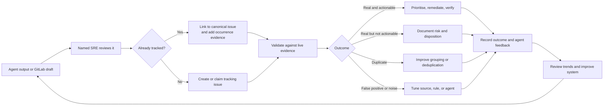

# SRE guide: reviewing agent triage output and closing the feedback loop

## Purpose

The triage agents are producing reports and GitLab issue drafts about possible
problems across the cluster fleet. Producing that output is not the end of the
process. An SRE must decide whether each finding is real, useful, duplicated,
or noise, and record what happened.

This guide establishes a lightweight operating loop so that:

- credible incidents receive an owner and an appropriate response;
- repeated reports are grouped instead of creating an ignored queue;
- false positives and low-value alerts are reduced at their source; and
- feedback improves the agent's tools, prompts, context, and evidence quality.

The agent output is a lead, not proof that a cluster is broken. The receiving
SRE remains responsible for validating it against current system evidence.

## The operating loop



## Minimum team commitment

Assign an SRE reviewer for each review period. The reviewer does not have to
fix every issue personally, but must make sure each new output is acknowledged,
deduplicated, classified, and either owned or explicitly closed with evidence.

Agree these values with the SRE team rather than leaving them implicit:

| Decision | Team value |
|---|---|
| Review queue or GitLab project | `{{TRIAGE_QUEUE_OR_PROJECT}}` |
| Review frequency | `{{FOR_EXAMPLE_EACH_WORKING_DAY}}` |
| First-review target | `{{TARGET_DURATION}}` |
| Critical escalation route | `{{ON_CALL_OR_INCIDENT_ROUTE}}` |
| Agent-feedback owner | `{{PLATFORM_OR_AGENT_OWNER}}` |
| Noise-review cadence | `{{FOR_EXAMPLE_WEEKLY}}` |

Severity and escalation must follow the existing incident-management process.
This guide does not replace on-call escalation for an active high-impact event.

## What the reviewing SRE does

### 1. Acknowledge and establish ownership

For each new agent output:

1. Check whether a canonical issue already exists for the same stable
   workload, symptom, cluster, namespace, and likely cause.
2. If it exists, link the new occurrence to it. Do not create another issue
   solely because a pod name, timestamp, or generated message changed.
3. Otherwise, create or claim a GitLab issue in the agreed project.
4. Assign an owner and record the next review time or target date.
5. Escalate immediately through the normal incident process when the supplied
   impact warrants it; do not wait for the feedback meeting.

An unassigned issue is not an accepted handover.

### 2. Validate the finding

Read the agent's routing, evidence, likely cause, tool audit, access failures,
and confidence labels. Then compare them with current authoritative evidence.
Use the exact subscription, cluster, kube context, namespace, and workload;
never assume the agent targeted the right place merely because its output looks
plausible.

At minimum, answer:

- Does the affected object or condition still exist?
- Did the agent query the intended cluster and namespace?
- Is there user, service, SLO, capacity, security, or operational impact?
- Does the evidence establish the claimed cause, or only correlate with it?
- Is this a new problem, an expected transient condition, planned work, a test,
  or another occurrence of an existing problem?
- Did permissions, missing context, stale data, or tool failure prevent a valid
  conclusion?

Do not mark a report as confirmed based only on the agent's prose. Record the
live evidence or existing incident/change record that supports the decision.

### 3. Choose one outcome

Use one primary outcome so the results can be measured consistently:

| Outcome | Meaning | Required action |
|---|---|---|
| `CONFIRMED_ACTIONED` | Real issue; a response or fix was required | Link the change/incident, record verification and any rollback |
| `CONFIRMED_TRACKED` | Real issue; accepted backlog, risk, or observation | Record owner, priority, reason, and review date |
| `VALUABLE_NO_ACTION` | Correct and useful context, but no action was appropriate | Explain the value and why no action was needed |
| `DUPLICATE` | Same underlying condition is already tracked | Link the canonical issue and add occurrence evidence |
| `EXPECTED_TRANSIENT` | Real but expected to recover within an agreed window | Link the runbook/change and confirm recovery |
| `FALSE_POSITIVE` | Agent conclusion was unsupported or wrong | Identify the faulty evidence, reasoning, context, or tool behaviour |
| `NOISE_SOURCE` | Input should not have entered triage at this frequency or severity | Create an alert/log-source tuning action |
| `BLOCKED_VALIDATION` | Access, routing, retention, or missing evidence prevented a decision | Assign the unblock action and re-review date |

“Closed”, “not a problem”, and “ignored” are not sufficient outcomes without a
reason and supporting evidence.

### 4. Record whether the agent helped

Review the agent separately from the underlying incident. A real incident can
have a poor agent report, and a false alarm can still demonstrate good agent
reasoning.

Record:

- whether the target subscription, cluster, context, and namespace were right;
- whether the evidence was current, bounded, relevant, and safely redacted;
- whether the diagnosis separated proven facts from hypotheses;
- what the agent found faster or more clearly than the normal investigation;
- which important check, tool, context, or runbook it missed;
- whether any command was unnecessary, unsafe, too broad, or unsuccessful;
- whether the recommended human actions were safe and useful; and
- one specific improvement, or `NO_AGENT_CHANGE` when none is justified.

Avoid feedback such as “agent was bad”. Prefer testable statements, for example:

> The agent diagnosed application failure from one restarted pod but did not
> inspect the Deployment or sibling replicas. Require workload-level health
> evidence before claiming service impact.

### 5. Feed the result back

Add the completed review to the canonical issue and route the improvement:

| Finding | Send improvement to |
|---|---|
| Wrong or ambiguous target | Cluster registry, caller input contract, routing prompt |
| Missing domain knowledge | Agent system message, skill, runbook, approved context source |
| Wrong tool or parameters | Tool contract, agent prompt, MCP implementation |
| Unsupported conclusion | Evidence and confidence rules, evaluation fixture |
| Unsafe or excessive access | Tool allowlist, Azure RBAC, Kubernetes RBAC, policy |
| Duplicate reports | Fingerprint/deduplication logic and canonical issue linking |
| Poor alert quality | Alert owner, thresholds, duration, labels, routing, inhibition |
| Missing telemetry | Workload or platform observability backlog |

Turn repeatable failures into an evaluation case before changing the agent.
Retain a sanitized example input, expected behaviour, and the unacceptable
behaviour. Re-run that case after the change so improvement is demonstrated,
not assumed.

## Copyable GitLab review template

Append this to the agent draft or use it in the canonical tracking issue:

```markdown
## SRE review

- Reviewer: @{{SRE_REVIEWER}}
- Reviewed at: {{ISO_8601_TIMESTAMP}}
- Canonical issue: {{THIS_ISSUE_OR_LINK}}
- Related incident/change: {{LINK_OR_NONE}}
- Outcome: {{ONE_OUTCOME_FROM_GUIDE}}
- Priority/severity: {{TEAM_CLASSIFICATION}}
- Owner: @{{ACTION_OWNER}}
- Re-review date: {{DATE_OR_NOT_REQUIRED}}

### Validation performed

- Target verified: {{YES_NO_AND_METHOD}}
- Current condition: {{PRESENT_RECOVERED_NOT_REPRODUCED_UNKNOWN}}
- Impact verified: {{EVIDENCE_OR_NONE}}
- Evidence checked: {{SANITIZED_COMMAND_RESULT_DASHBOARD_OR_RUNBOOK_LINKS}}

### SRE conclusion

{{WHAT_IS_ACTUALLY_HAPPENING_AND_WHY_THIS_OUTCOME_WAS_SELECTED}}

### Action and verification

{{ACTION_TAKEN_OR_TRACKED_OR_REASON_NO_ACTION_WAS_REQUIRED}}

### Agent assessment

- Targeting: {{CORRECT_INCORRECT_UNKNOWN}}
- Evidence quality: {{USEFUL_PARTIAL_POOR}}
- Diagnosis quality: {{CORRECT_PARTIAL_INCORRECT_UNPROVEN}}
- Recommendation quality: {{USEFUL_NEEDS_CHANGE_UNSAFE_NOT_APPLICABLE}}
- Time or effort saved: {{SHORT_DESCRIPTION_OR_NONE}}
- Agent improvement: {{ONE_SPECIFIC_CHANGE_OR_NO_AGENT_CHANGE}}
- Alert/source improvement: {{ONE_SPECIFIC_CHANGE_OR_NO_SOURCE_CHANGE}}
```

## Reducing repeated noise

Do not solve noise by silently ignoring the queue or broadly disabling useful
monitoring. Identify the source and preserve detection of genuine impact.

For repeated findings:

1. Group occurrences under one canonical issue using a stable fingerprint such
   as environment, cluster, namespace, stable workload identity, condition,
   and likely source. Avoid literal pod names because normal pod replacement
   changes them.
2. Measure occurrence count, duration, affected targets, and whether each event
   self-resolved or required action.
3. Determine whether duplication is introduced by the alert rule, log pipeline,
   event router, triage invocation, agent, or GitLab creation step.
4. Choose the narrowest safe treatment: aggregation window, cooldown,
   inhibition, stable deduplication key, severity adjustment, transient grace
   period, expected-change suppression, or routing correction.
5. Give every suppression an owner, rationale, review date, and a test showing
   that a sustained or higher-impact failure will still fire.
6. Validate the changed rule with real produced and received evidence. A valid
   manifest or successful deployment alone does not prove that noise stopped or
   that important alerts still work.

Never suppress an alert solely because nobody has been reviewing it.

## Weekly improvement review

Keep the meeting short and evidence-led. Review:

- new outputs, reviewed outputs, and still-unowned outputs;
- confirmed/actioned rate and false-positive rate;
- duplicate and repeated-occurrence rate;
- time to first SRE review and time to disposition;
- `BLOCKED_VALIDATION` causes;
- examples where the agent saved effort;
- top agent-quality failures and alert-source noise;
- overdue remediation, evaluation, or suppression-review actions; and
- one or two bounded improvements to make next.

Do not use raw issue volume as the success measure. The useful outcomes are
faster validated detection, safer investigation, reduced repeated noise, clear
ownership, and demonstrated improvements from completed feedback.

## Definition of done for an agent output

An output is complete only when:

- it has a named reviewer and canonical tracking location;
- the target and current condition were independently checked;
- one standard outcome and supporting evidence were recorded;
- any required operational action has an owner and verification criteria;
- agent quality and alert-source quality were assessed separately;
- concrete feedback was routed to the correct owner; and
- duplicate or noisy conditions have a tracked tuning decision rather than
  being left to fire indefinitely.
