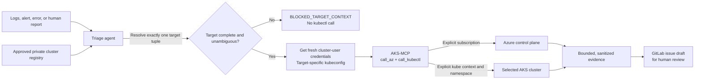

# AKS multi-subscription triage agent

This bundle defines a read-only triage kagent agent for investigating one AKS incident
at a time across an approved fleet of clusters and Azure subscriptions. It uses
the existing `aks-mcp` `RemoteMCPServer`, with only the `call_az` and
`call_kubectl` tools, and returns a human-readable GitLab issue draft. It does
not change Azure or Kubernetes resources and does not submit the issue to
GitLab.

## Why explicit targeting matters

A shared AKS-MCP pod may serve several agents and users. Commands that change
the active Azure subscription or current kube context create shared mutable
state: one request can silently redirect another request to the wrong cluster.
This agent therefore resolves a complete target tuple and pins every call:

- every Azure CLI call includes `--subscription <resolved-subscription-id>`;
- every incident obtains fresh cluster-user credentials for its resolved AKS
  cluster with `az aks get-credentials`;
- credentials are written to a target-specific kubeconfig under `/tmp`, never
  the shared default kubeconfig;
- every kubectl call includes that exact `--kubeconfig` and
  `--context <resolved-kube-context>`;
- namespaced kubectl calls also include `--namespace <resolved-namespace>`;
- `az account set`, `kubectl config use-context`, and `--admin` credentials are
  forbidden.



## What must already exist

Before deployment, the AKS-MCP service account or workload identity must have
the Azure Kubernetes Service Cluster User Role (or the minimum equivalent
permission needed to obtain cluster-user credentials) for every approved AKS
cluster. The resulting identity must have read-only Kubernetes RBAC. The pod
also needs network and DNS connectivity to each private AKS API endpoint it is
expected to inspect and a writable `/tmp` for target-specific kubeconfig files.

The current upstream AKS-MCP implementation permits `az aks get-credentials`
only when the server is configured with `accessLevel: admin`. That setting is
therefore required for this flow even though the agent itself remains limited
to diagnostic Kubernetes operations. Enforce the real boundary with the
managed identity's Azure roles, Kubernetes RBAC, the agent's two-tool allowlist,
and runtime auditing. Never grant the managed identity AKS Cluster Admin and
never use `az aks get-credentials --admin`.

Do not give this triage agent an apply, delete, exec, secret-reading, credential
retrieval, or GitLab-writing tool. If automated ticket creation is later
required, put that behind a separate approval-gated workflow or writer agent;
keep this agent responsible for evidence and the draft only.

The referenced `RemoteMCPServer` must be named `aks-mcp` in the selected kagent
namespace and must discover these exact tools:

- `call_az`, accepting a complete read-only Azure CLI command; and
- `call_kubectl`, accepting kubectl arguments and enforcing read-only use.

Confirm the installed AKS-MCP version and its discovered tool names in
`RemoteMCPServer.status` before rollout. A prompt is a behavioural guardrail,
not a substitute for least-privilege Azure roles, Kubernetes RBAC, MCP-side
read-only filtering, network policy, and audit logs.

## Configure the approved fleet

Copy the two templates to their ignored, environment-specific files:

```bash
cd agents/kagent-triage/aks-multi-subscription-triage
cp cluster-registry.template.md cluster-registry.private.md
cp work-values.env.template work-values.env
```

Edit `cluster-registry.private.md` and add one row per approved AKS target. Each
row maps a unique human-facing alias to the exact Azure subscription, resource
group, cluster, kube context, environment, and owner. Do not store credentials,
tokens, kubeconfig content, private endpoints, or incident data in the file.
Aliases must use only lowercase letters, numbers, and hyphens because they form
part of the dedicated kubeconfig filename.

Edit `work-values.env` to select the kagent namespace, ModelConfig, and existing
AKS-MCP `RemoteMCPServer`. The files are ignored because real subscription and
cluster identifiers may be internal. The templates remain placeholder-safe.

## Validate and deploy

Run the local deterministic checks:

```bash
sh agents/kagent-triage/aks-multi-subscription-triage/verify.sh
```

Inspect the exact rendered resources before applying them:

```bash
kubectl kustomize agents/kagent-triage/aks-multi-subscription-triage
kubectl apply --dry-run=server -k agents/kagent-triage/aks-multi-subscription-triage
kubectl apply -k agents/kagent-triage/aks-multi-subscription-triage
```

The server-side dry run and apply require access to a cluster with compatible
kagent CRDs. For a GitOps deployment, commit a sanitized overlay or supply the
private registry from the environment's secret-safe configuration mechanism;
do not commit the local private file.

After deployment, require all of the following before calling it usable:

1. `RemoteMCPServer/aks-mcp` is Accepted and exposes exactly `call_az` and
   `call_kubectl` to this agent.
2. The Agent is Accepted and Ready; use `scripts/kagent-verify-agent.sh`.
3. A smoke request names one non-production cluster alias and namespace.
4. The tool audit proves every incident obtained fresh credentials for the
   resolved cluster and that every Azure command used its subscription.
5. Every kubectl command uses the matching target-specific kubeconfig, resolved
   context, and namespace; it never relies on shared current state.
6. A negative test with an unknown or ambiguous alias returns
   `BLOCKED_TARGET_CONTEXT` without a kubectl call.
7. The resulting Markdown is reviewed as a GitLab issue draft and contains no
   secrets, credentials, kubeconfig, or unnecessarily sensitive log content.

Example invocation using the repository helper:

```bash
scripts/kagent-a2a-invoke.sh \
  aks-multi-subscription-triage-agent \
  'Incident INC-{{ID}}: cluster alias {{ALIAS}}, namespace {{NAMESPACE}}, workload deployment/{{WORKLOAD}} reports CrashLoopBackOff. Triage the supplied symptom and draft the GitLab issue.'
```

## Input contract

The caller should send enough routing data to resolve one row. Prefer an
incident envelope equivalent to:

```yaml
incidentId: INC-{{ID}}
source: {{ALERT_OR_LOG_SOURCE}}
clusterAlias: {{UNIQUE_APPROVED_ALIAS}}
namespace: {{NAMESPACE}}
workload: deployment/{{WORKLOAD}}
observedAt: {{ISO_8601_TIMESTAMP}}
symptom: {{SANITIZED_ERROR_OR_ALERT_SUMMARY}}
```

The full subscription, resource group, cluster, and kube-context tuple may be
provided instead of the alias. If supplied fields conflict with the registry,
the agent stops rather than choosing one. Cluster-scoped incidents may omit the
namespace only when the symptom is explicitly cluster-scoped.

## Output and operating boundary

The system message in `agent.yaml` requires one fixed Markdown issue format:
routing, summary, impact, evidence, likely cause, recommended human actions,
acceptance criteria, security handling, and a sanitized tool audit. Findings
are marked `PROVEN`, `LIKELY`, or `UNKNOWN`; recommended remediations are not
executed.

This bundle validates manifest shape and prompt/tool contracts locally. It does
not prove Azure authorization, Kubernetes RBAC, private-cluster reachability,
runtime tool discovery, target-specific credential-file handling, concurrent
request isolation, or the quality of a live
triage result. Those require the deployment-time checks above and an actual
bounded end-to-end incident test.
