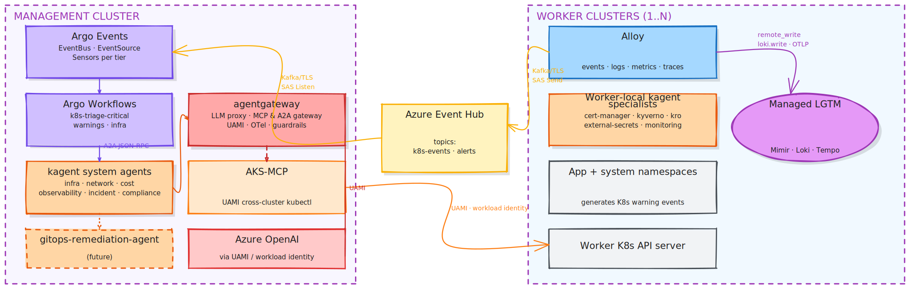
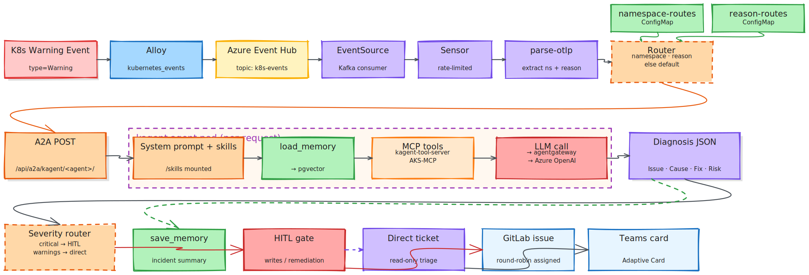
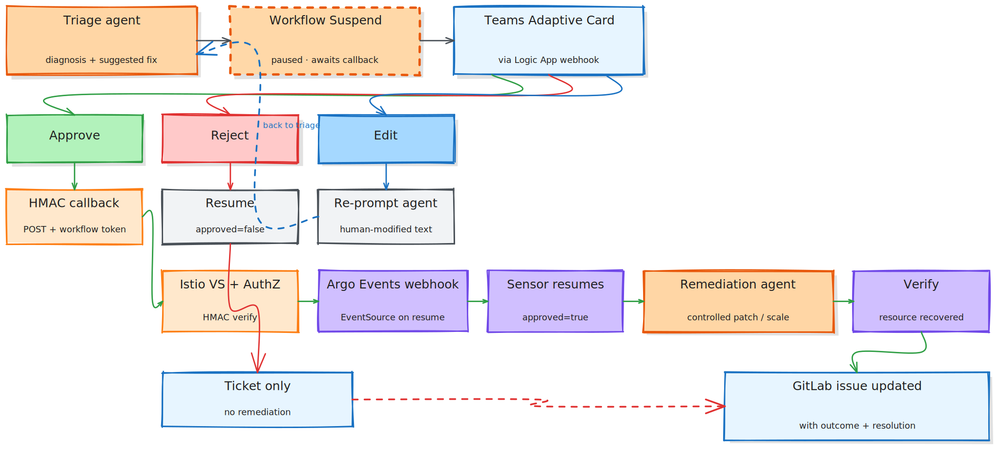
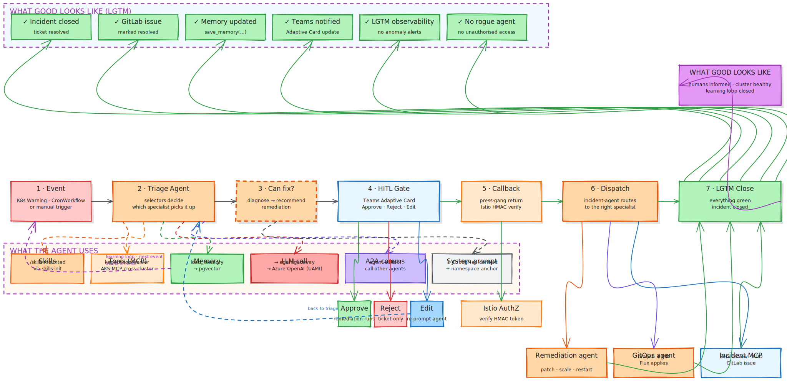

<!-- _class: lead -->
<!-- _paginate: false -->
<!-- _footer: '' -->

### Companion to CDA v1.1

# K8s Event Triage Platform

## Project Status — Implementation Snapshot

<div style="margin-top: 60px; display: flex; gap: 32px; justify-content: center;">
  <div style="text-align: left;">
    <div style="font-family:'Outfit'; font-weight:600; font-size:0.55em; color: #ffffff; text-transform:uppercase; letter-spacing:0.18em;">Owner</div>
    <div style="font-size:0.78em; color: #ffffff; margin-top:4px;">Platform Engineering Team</div>
  </div>
  <div style="text-align: left;">
    <div style="font-family:'Outfit'; font-weight:600; font-size:0.55em; color: #ffffff; text-transform:uppercase; letter-spacing:0.18em;">Version</div>
    <div style="font-size:0.78em; color: #ffffff; margin-top:4px;">1.0 — Draft</div>
  </div>
  <div style="text-align: left;">
    <div style="font-family:'Outfit'; font-weight:600; font-size:0.55em; color: #ffffff; text-transform:uppercase; letter-spacing:0.18em;">Date</div>
    <div style="font-size:0.78em; color: #ffffff; margin-top:4px;">2026-04-28</div>
  </div>
  <div style="text-align: left;">
    <div style="font-family:'Outfit'; font-weight:600; font-size:0.55em; color: #ffffff; text-transform:uppercase; letter-spacing:0.18em;">Companion to</div>
    <div style="font-size:0.78em; color:var(--accent); margin-top:4px;">CDA v1.1</div>
  </div>
</div>

---

### Agenda

# What we'll cover

| # | Section | Contents |
|---|---------|----------|
| **01** | **Executive Snapshot** | State of every component |
| **02** | **System Design** | Components · topology · routing · skills · HITL |
| **03** | **Component Status** | HITL · A2A · LGTM · agentgateway · skills · memory |
| **04** | **Architecture Decisions** | 14 key calls + rationale |
| **05** | **Agent Cards** | ~20 agents · 5 grouped patterns |
| **06** | **Open Work** | Pending items + owners |

---

<!-- _class: lead -->

### Section 01

# Executive Snapshot

## Where every moving part is today

---

### State of every component (1/2)

# What's already in production

| Theme | State | Detail |
|-------|-------|--------|
| Event ingestion (Alloy → Event Hub → Argo Events) | <span class="tag tag-prod">Production</span> | Three-tier pipeline tested e2e on `{{CLUSTER_NAME}}` |
| Argo Workflows triage DAG | <span class="tag tag-prod">Production</span> | parse-otlp → fan-out → A2A → GitLab + Teams |
| KAgent A2A protocol | <span class="tag tag-prod">Production</span> | JSON-RPC 2.0 · `message/send` · agent-as-tool proven |
| **agentgateway** (replaced LiteLLM) | <span class="tag tag-prod">Production</span> | UAMI to Azure OpenAI · OTel native · MCP & A2A gateway |
| HITL Teams bot PoC | <span class="tag tag-prod">PoC Done</span> | End-to-end proven · Istio VS+AuthZ · `smoke-test.sh` |
| GitLab ticketing | <span class="tag tag-prod">Production</span> | Direct REST today · MCP migration on roadmap |
| Specialist agent roster | <span class="tag tag-phase">Phase 2</span> | 11 namespace agents deployed · ~20 planned |
| Skills (kagent 0.8.0+) | <span class="tag tag-phase">Sparse</span> | Mechanism deployed · library grows via learning loop |

---

### State of every component (2/2)

# What's designed · in flight · future

| Theme | State | Detail |
|-------|-------|--------|
| Memory (pgvector backend) | <span class="tag tag-phase">In flight</span> | pgvector deployed · `load_memory` wiring per-agent |
| Full A2A → HITL demo | <span class="tag tag-phase">In flight</span> | Joining Suspend → Adaptive Card → callback to specialist agents |
| Round-robin GitLab assignment | <span class="tag tag-design">Designed</span> | Needs dedicated GitLab project + roster ConfigMap |
| Managed LGTM integration | <span class="tag tag-design">Designed</span> | `managed-lgtm-integration/` · pending platform-team Q&A |
| GitLab MCP integration | <span class="tag tag-design">Future</span> | Sequenced after HITL demo |
| ServiceNow / Azure DevOps MCP | <span class="tag tag-design">Future</span> | After GitLab MCP |
| `gitops-remediation-agent` build | <span class="tag tag-design">Future</span> | After GitLab MCP |
| Real Teams Bot (replace Logic App) | <span class="tag tag-design">Future</span> | App registration + Bot Framework |

---

### Headline numbers

# The shape of the thing

| Metric | Value | What it means |
|--------|-------|---------------|
| **Agents** | **~20** | Specialist agents · 11 deployed · 9 planned |
| **Triage time** | **~60s** | Event → diagnosis · vs. 30–60 min manual |
| **Tiers** | **3** | critical · warnings · infra · per consumer group |
| **Dedup layers** | **3** | Alloy · Sensor · Script TTL |
| **Notification surface** | **2** | GitLab issues · Teams Adaptive Cards |
| **Cluster coverage** | **N+1** | One management cluster · N worker clusters |

> **Goal state:** zero unresolved events — every K8s warning either auto-resolved by an agent or round-robin assigned to a human within minutes.

---

<!-- _class: lead -->

### Section 02

# System Design

## Topology · routing · skills · output

---

### What we're building

# AI-driven triage for Kubernetes warning events

A management cluster watches **N worker clusters**. When a K8s warning event fires, it flows through Argo Events → Argo Workflows, gets dispatched to a **specialist kagent agent** that diagnoses the root cause via LLM, and the result becomes a **GitLab issue + Teams Adaptive Card**. Write actions are gated by a **Human-in-the-Loop** approval before any cluster change.

| Component | Role |
|-----------|------|
| **Alloy** | Per-cluster log/metric/event collector — forwards K8s warnings to Event Hub |
| **Azure Event Hub** | Cross-cluster event bus — Kafka-protocol, SAS-authenticated |
| **Argo Events** | EventBus (NATS) · EventSource (Kafka consumer) · per-tier Sensors |
| **Argo Workflows** | Triage DAG — `parse-otlp` → fan-out → A2A → output |
| **kagent** | Specialist agent runtime — system prompt + skills + memory + tools |
| **agentgateway** | LLM proxy + MCP & A2A gateway · UAMI to Azure OpenAI · OTel native |
| **AKS-MCP** | Cross-cluster `kubectl` for the agents · UAMI / workload identity |
| **HITL gate** | Teams Adaptive Card via Logic App · Istio HMAC-verified callback |
| **GitLab + Teams** | Output surfaces — ticket destination + notifications |

---

### Mgmt cluster orchestrating workers

# Brain in the centre, eyes everywhere



---

### Why split mgmt vs worker

# Different concerns, different blast radius

| Concern | Management cluster | Worker cluster |
|---------|--------------------|-----------------|
| **Cross-cluster orchestration** | Yes — AKS-MCP, multi-cluster routing | No — only sees self |
| **System namespaces of interest** | `argo`, `argo-events`, `kagent`, `agentgateway-system`, `aks-mcp` | `cert-manager`, `kyverno`, `kro`, `external-secrets`, `monitoring`, `istio-system`, `flux-system` |
| **Triage location** | Aggregates events from N workers | Local triage when EventHub round-trip is unnecessary |
| **LLM access** | Yes (via agentgateway) | Yes (via agentgateway, mgmt or local) |
| **Latency** | Slower — round-trip via Event Hub | Faster — local A2A |

<div style="margin-top: 14px; font-size: 0.65em; color: #ffffff;">
<strong>Worker-local triage</strong> shortens loops from seconds to milliseconds for namespaces that don't need cross-cluster context (cert-manager, kyverno, kro etc.).
</div>

---

### Namespace → Agent routing

# Two ConfigMaps drive the dispatch

```
Event arrives ─▶ parse-otlp extracts: namespace, reason
                       │
                       ▼
                 Reason match? (Evicted, NodeNotReady, FailedMount, …)
                   YES → reason-route agent
                   NO  → namespace-route agent
                          │
                          └── No match → sre-triage-agent (default)
                       │
                       ▼
                 Workflow calls A2A: POST /api/a2a/kagent/<agent>/
                       │
                       ▼
                 Agent loads:
                   • System prompt (in CRD)
                   • Skills (mounted /skills via skills-init)
                   • Memory (load_memory · pgvector — when re-enabled)
                   • Tools (kagent-tool-server via MCP)
                       │
                       ▼
                 Diagnosis JSON returned to workflow
```

<div style="margin-top: 12px; font-size: 0.65em; color: #ffffff;">
Routing config: <code>eventhub-otlp-pipeline/tier-critical/agent-routing.yaml</code>
</div>

---

### Skills · Context · Memory

# How agents pick up domain knowledge

| Layer | Source | Loaded When | Mechanism |
|-------|--------|-------------|-----------|
| **System prompt** | `Agent.spec.declarative.systemMessage` | Pod start | Inline in CRD |
| **A2A skill metadata** | `a2aConfig.skills` | Pod start | Discovery / catalog only — not executed |
| **Executable skills** | `spec.skills.gitRefs` or OCI | Pod start | `skills-init` initContainer clones to `emptyDir` at `/skills` |
| **Tools** | `spec.declarative.tools` (MCP) | Per-request | RemoteMCPServer or Service · agentgateway can be central MCP gateway |
| **Memory** | `spec.declarative.memory` (when re-enabled) | Per-request | `load_memory(query)` · `save_memory(text)` · pgvector |
| **Prompt template data** | `promptTemplate.dataSources` | Per-request | ConfigMap-backed builtins + per-namespace overrides |

<div style="margin-top: 14px; font-size: 0.65em; color: #ffffff;">
<strong>Critical naming rule:</strong> <code>spec.skills</code> (executable bundles) ≠ <code>a2aConfig.skills</code> (metadata only).
</div>

---

### Per-request triage flow

# Event → routing → agent → diagnosis → output



---

### Output via Teams HITL

# Approve · Reject · Edit — gate before any write



---

### What good looks like

# End-to-end journey — event → fix → close



---

### Ticketing integrations

# Where triage lands

| Integration | Status | Mechanism | Use case |
|-------------|--------|-----------|----------|
| **GitLab** (REST API today) | <span class="tag tag-prod">Production</span> | Direct API · workflow step | Default ticket destination · round-robin assignment |
| **Microsoft Teams** | <span class="tag tag-prod">Production</span> | Logic App webhook | Adaptive Card notifications · HITL surface |
| **GitLab MCP** | <span class="tag tag-design">Future</span> | `gitlab-mcp-server` | Replace REST calls with MCP for richer ticket interactions |
| **ServiceNow MCP** | <span class="tag tag-design">Future</span> | `servicenow-mcp` | Enterprise incident · severity mapping · escalation chains |
| **Azure DevOps MCP** | <span class="tag tag-design">Future</span> | `ado-mcp` | Work item creation in Boards |

<div style="margin-top: 12px; font-size: 0.65em; color: #ffffff;">
All three MCPs sequenced <strong>after</strong> the full A2A → HITL demo lands. The <strong>incident-agent</strong> will select target(s) by severity + namespace ownership when MCPs are wired.
</div>

---

<!-- _class: lead -->

### Section 03

# Component Status

## Six pillars · where each one is

---

### Human-in-the-Loop (HITL)

# Workflow + Teams PoC done · A2A integration in flight

| Element | Status |
|---------|--------|
| Teams Adaptive Card payload via Logic App | <span class="tag tag-prod">Production</span> |
| Argo Events webhook EventSource (callback) | <span class="tag tag-prod">Production</span> |
| Istio VirtualService + AuthorizationPolicy (HMAC) | <span class="tag tag-prod">Production</span> |
| Workflow `Suspend` → Adaptive Card → resume | <span class="tag tag-prod">PoC Done</span> |
| Mock Teams bot (stand-in until real bot lands) | <span class="tag tag-prod">PoC Done</span> |
| **Full A2A → HITL demo** (specialist agents) | <span class="tag tag-phase">In flight</span> |
| Real Teams bot (replacing Logic App) | <span class="tag tag-design">Future</span> |

> **Current focus:** join the proven gate to specialist-agent A2A so a triage agent's *suggested remediation* can suspend, surface in Teams, and resume on approval.

---

### Agent-to-Agent (A2A) protocol

# JSON-RPC 2.0 with sharp edges

```
POST /api/a2a/kagent/<agent>/

{ "jsonrpc": "2.0", "id": "...", "method": "message/send",
  "params": { "message": { "role": "user",
              "parts": [{"kind":"text","text":"..."}] } } }
```

| Common gotcha | Symptom |
|---------------|---------|
| Missing trailing slash on URL | 404 silent |
| Method `tasks/send` (old docs) | "method not supported" |
| `parts` missing `"kind": "text"` | parse error |
| Session API used for sending | 403 even with right user |

> **Agent-as-tool pattern:** kagent supports `tools: [{type: Agent, agent: {name, namespace}}]` natively. Proven March 2026 with the Kimi coordinator (6/6 consecutive tool calls including a revision loop). Same path: `cert-manager-agent` → `gitops-remediation-agent`.

---

### Managed LGTM integration

# Alloy is the only handle — bidirectional

| Direction | Pattern | Component |
|-----------|---------|-----------|
| Push metrics | ServiceMonitor / PodMonitor → remote_write | `prometheus.operator.*` → `prometheus.remote_write` |
| Push logs | Pod logs + K8s events | `loki.source.kubernetes` + `loki.source.kubernetes_events` |
| Push traces | OTLP receiver → Tempo | `otelcol.receiver.otlp` → `otelcol.exporter.otlp` |
| Provision rules | PrometheusRule + LokiRule CRDs → managed Ruler | `mimir.rules.kubernetes` + `loki.rules.kubernetes` |
| Loop alerts back | AM webhook → Kafka → Event Hub | `loki.source.api` → `otelcol.exporter.kafka` |
| Agent anomalies | Recording-rule baselines + z-score / cohort | LogQL loop detection |
| Triage prompt enrichment | Workflow queries Mimir/Loki at triage-time | Splices context into KAgent prompt |

<div style="margin-top: 12px; font-size: 0.65em; color: #ffffff;">
<span class="tag tag-design">DESIGNED</span> · Pending answers from platform team on Q1–Q14 · `aks-mgmt-stack/k8s-event-triage/managed-lgtm-integration/`
</div>

---

### agentgateway

# LiteLLM replaced · agentgateway is current state

> ✓ **Migration complete.** All agents route LLM, MCP, and A2A traffic through agentgateway. LiteLLM removed. PostgreSQL retained for kagent memory.

| Why we moved | What stayed |
|--------------|-------------|
| **UAMI / workload identity** to Azure OpenAI — no keys to rotate | **kagent Agent CRDs** — only ModelConfig `baseUrl` changed |
| **OTel native** — `agentgateway_gen_ai_*` token + latency metrics | **A2A protocol** — same JSON-RPC 2.0 contract |
| **MCP gateway** for centralised auth + federation | **Argo Workflows DAGs** — no change at all |
| **A2A gateway** for inter-agent routing + auth | **PostgreSQL** — retained for kagent memory |
| **Per-route budgets + guardrails** (regex / moderation / custom webhooks) | |

---

### Skills mechanism

# Git-versioned, mounted via initContainer

```
Agent CRD spec.skills.gitRefs:
  - url: https://github.com/your-org/your-skills-repo.git
    ref: main
    path: skills/cert-diagnostics
    name: cert-diagnostics
                       │
                       ▼
        kagent injects "skills-init" initContainer
                       │
                       ▼
        Clones repos to emptyDir at /skills
                       │
                       ▼
        Main agent container mounts /skills read-only
        Discovers skills via SKILL.md frontmatter
        Executes scripts via built-in BashTool (sandboxed)
```

<div style="display: grid; grid-template-columns: 1fr 1fr; gap: 14px; margin-top: 14px;">

  <div style="background: var(--card); border: 1px solid var(--border); border-radius: 10px; padding: 18px;">
    <div class="eyebrow">Status</div>
    <div style="font-size:0.7em; color:#ffffff; margin-top:6px;">Mechanism deployed and proven · library currently shallow</div>
  </div>

  <div style="background: var(--card); border: 1px solid var(--border); border-radius: 10px; padding: 18px;">
    <div class="eyebrow">Growth</div>
    <div style="font-size:0.7em; color:#ffffff; margin-top:6px;">Driven by the <strong>learning loop</strong> — every triaged ticket closes only when an agent skill is updated</div>
  </div>

</div>

---

### Memory status

# Designed · backend ready · integration in flight

> **In flight** — pgvector deployed · `load_memory` / `save_memory` designed · wiring into specialist agents alongside the A2A → HITL demo.

| Element | Status |
|---------|--------|
| PostgreSQL + pgvector backend | <span class="tag tag-prod">Deployed</span> |
| Embedding ModelConfig | <span class="tag tag-design">Designed</span> · separate from inference |
| `load_memory` / `save_memory` tools | <span class="tag tag-phase">Wiring</span> per-agent |
| Memory + A2A design doc | <span class="tag tag-prod">Done</span> |
| Cross-incident pattern matching | <span class="tag tag-design">Designed</span> · keys: `event_reason` + `namespace` |
| pgvectorscale upgrade path | <span class="tag tag-design">Optional</span> for StreamingDiskANN |

> **Goal:** agents check past incidents before re-investigating · *"Seen before — incident #142, ACME fix worked"* · 90-day TTL.

---

<!-- _class: lead -->

### Section 04

# Architecture Decisions

## 14 calls that shaped the design

---

### Decisions 1 – 7

# Specialisation, safety, contracts

| # | Decision | Rationale |
|---|----------|-----------|
| 1 | **Specialist agents per namespace, not generalist** | Smaller models hallucinate when omniscient · focused prompts win |
| 2 | **Read-only by default · write only via promotion** | Blast radius is the hard control · RBAC-enforced not prompt-enforced |
| 3 | **Namespace anchoring** (`CRITICAL: use exact namespace "X"`) | Empirical fix for Qwen 14B typos · belt-and-braces alongside Kyverno |
| 4 | **A2A as the inter-agent contract** | Standardised JSON-RPC · kagent native · agentgateway-routable |
| 5 | **No `kubectl edit` from agents — `patch` / `apply` only** | Interactive editors via MCP break · `patch` is deterministic + auditable |
| 6 | **GitOps remediation via MR, not direct cluster writes** | Agent never `kubectl apply`s · opens MR · Flux applies · auditable, reversible |
| 7 | **Triage agent ≠ remediation agent** | Two CRDs, two SAs, two RBAC levels · never an upgrade in place |

---

### Decisions 8 – 14

# Operations, gates, scaling

| # | Decision | Rationale |
|---|----------|-----------|
| 8 | **HITL gate before any write action** | Approve/Reject/Edit · auto-graduates to no-gate after N successes |
| 9 | **Worker-local triage where possible** | Eliminates Event Hub round-trip for self-contained namespaces |
| 10 | **Round-robin GitLab assignment, no namespace ownership** | Builds breadth · visible at standups via Kanban |
| 11 | **Skills are git-versioned, not in-line in CRDs** | `gitRefs` · skills library reviewable in PRs · CRD stays small |
| 12 | **Agent prompts committed to Git** | `systemMessage` is a code artefact · changes go through PR review |
| 13 | **3-layer dedup** (Alloy / Sensor rate / script TTL) | Single layer brittle under storms · three layers means one can fail |
| 14 | **agentgateway as single LLM exit point** | One place for token tracking, guardrails, UAMI auth, OTel · agents don't know about Azure OpenAI directly |

---

<!-- _class: lead -->

### Section 05

# Agent Cards

## ~20 agents · 5 grouped patterns

---

### Common card fields

# Shared across all cards (unless flagged)

| Field | Common value |
|-------|--------------|
| **Process** | Receive A2A `message/send` → load skills + memory → call MCP tools → summarise → return JSON-RPC result. Optional A2A call to `gitops-remediation-agent` for fixes. |
| **Communication** | Inbound: A2A from Argo Workflow. Outbound: A2A to other agents · MCP to `kagent-tool-server`, `aks-mcp`, `gitlab-mcp-server`, `git-mcp-server`. |
| **Tools (read)** | `k8s_get_resources` · `k8s_describe_resource` · `k8s_get_pod_logs` · `k8s_get_events` · `k8s_get_resource_yaml` |
| **Tools (write — remediation tier only)** | `k8s_patch_resource` · `k8s_apply_manifest` · `k8s_delete_resource` · `k8s_label_resource` · `k8s_annotate_resource` · `k8s_execute_command` |
| **Knowledge** | System prompt + `/skills` git bundle + (when enabled) pgvector memory + `kagent-builtin-prompts` ConfigMap |
| **Evaluation** | Output schema enforced (Issue/Affected/Root Cause/Remediation/Risk/Verification) · workflow grades fields and rejects malformed |
| **Security** | Read-only RBAC default · write via explicit RoleBinding to specific namespaces · UAMI scope per cluster · prompt constraints |
| **Model routing** | All → agentgateway → Azure OpenAI (UAMI) or local vLLM · same `default-model-config` |

---

### Card A — Triage Specialist

# The dominant pattern (covers ~20 agents)

<div style="display: grid; grid-template-columns: 1fr 1fr; gap: 14px; margin-top: 14px;">

  <div style="background: var(--card); border: 1px solid var(--border); border-radius: 10px; padding: 18px;">
    <h3>Process</h3>
    <div style="font-size:0.66em; color:#ffffff; margin-top:6px; line-height:1.65;">Reactive — invoked by workflow on K8s Warning event. Optionally proactive via CronWorkflow (compliance, cost, security).</div>
  </div>

  <div style="background: var(--card); border: 1px solid var(--border); border-radius: 10px; padding: 18px;">
    <h3>User persona</h3>
    <div style="font-size:0.66em; color:#ffffff; margin-top:6px; line-height:1.65;">SRE / Platform Engineer responding to a triage notification — wants structured diagnosis + ranked remediation + exact kubectl commands.</div>
  </div>

  <div style="background: var(--card); border: 1px solid var(--border); border-radius: 10px; padding: 18px;">
    <h3>Problem</h3>
    <div style="font-size:0.66em; color:#ffffff; margin-top:6px; line-height:1.65;">Domain-specific K8s failures hit a namespace · on-call lacks deep specialist knowledge · agent collapses 30–60 min into seconds.</div>
  </div>

  <div style="background: var(--card); border: 1px solid var(--border); border-radius: 10px; padding: 18px;">
    <h3>Role</h3>
    <div style="font-size:0.66em; color:#ffffff; margin-top:6px; line-height:1.65;">Read-only investigator + remediation suggester. Writes nothing. Returns analysis JSON to the workflow.</div>
  </div>

</div>

<div style="margin-top: 14px; font-size: 0.62em; color: #ffffff;">
<strong>Applies to:</strong> cert-manager · kyverno · kro · external-secrets · reloader · flux-system · gatekeeper-system · istio-ingress · istio-system · kube-system · dns · database · observability · cost · change · network · storage · infra · security · compliance.
</div>

---

### Card A — Specialist skills

# What lives in `/skills/<agent>/`

| Agent | Skills bundle |
|-------|---------------|
| `cert-manager-agent` | `cert-diagnostics` · ACME challenge inspection · issuer status · expiry scans |
| `network-agent` | `cni-health-probe` · `ingress-backend-walker` · `istio-config-analyse` |
| `storage-agent` | `pvc-binding-trace` · `longhorn-volume-health` · `csi-driver-probe` |
| `infra-agent` | `node-condition-decoder` · `kubelet-log-grep` · `inotify-pressure-check` |
| `security-agent` | `pss-violation-decoder` · `falco-event-correlator` · `rbac-audit` |
| `cost-agent` | `right-size-recommender` · `idle-resource-finder` · `node-utilisation-report` |
| `compliance-agent` | `label-compliance-scan` · `quota-coverage-scan` · `network-policy-coverage` |
| `observability-agent` | `prometheus-target-health` · `loki-stream-audit` · `cardinality-explorer` |

<div style="margin-top: 12px; font-size: 0.65em; color: #ffffff;">
Full per-agent definitions: <code>aks-mgmt-stack/k8s-event-triage/AGENT-ROSTER.md</code>
</div>

---

### Card B — Remediation Agent

# Limited write · gated by HITL approval

<div style="display: grid; grid-template-columns: 1fr 1fr; gap: 14px; margin-top: 14px;">

  <div style="background: var(--card); border: 1px solid var(--border); border-radius: 10px; padding: 18px;">
    <h3>Process</h3>
    <div style="font-size:0.66em; color:#ffffff; margin-top:6px; line-height:1.65;">Invoked only after HITL approval. Receives diagnosis + approval token. Executes recommended kubectl actions in a controlled subset.</div>
  </div>

  <div style="background: var(--card); border: 1px solid var(--border); border-radius: 10px; padding: 18px;">
    <h3>Allowed actions</h3>
    <div style="font-size:0.66em; color:#ffffff; margin-top:6px; line-height:1.65;"><code>patch</code> · <code>scale</code> · <code>restart</code> · <code>label/annotate</code></div>
  </div>

  <div style="background: var(--card); border: 1px solid var(--border); border-radius: 10px; padding: 18px;">
    <h3>Forbidden</h3>
    <div style="font-size:0.66em; color:#ffffff; margin-top:6px; line-height:1.65;">Delete CRDs · delete PVCs with data · restart all replicas at once · anything outside approved namespace</div>
  </div>

  <div style="background: var(--card); border: 1px solid var(--border); border-radius: 10px; padding: 18px;">
    <h3>Security</h3>
    <div style="font-size:0.66em; color:#ffffff; margin-top:6px; line-height:1.65;">Approval token verified against workflow HMAC · replay protection · action whitelist enforced server-side · failures escalate, never retry</div>
  </div>

</div>

<div style="margin-top: 14px; font-size: 0.62em; color: #ffffff;">
<strong>Applies to:</strong> <code>sre-remediation-agent</code>. All writes go through GitOps where possible · direct cluster writes only for break-glass.
</div>

---

### Card C — GitOps Remediation Agent

# Future · branch + commit + MR · never `kubectl apply`

<div style="background: var(--card); border-left: 3px solid var(--blue); padding: 14px 18px; margin-top: 14px;">
  <div style="font-family:'Outfit'; font-weight:600; font-size:0.78em; color:#fff;">Future work — sequenced after the A2A → HITL demo lands</div>
  <div style="font-size:0.66em; color:#ffffff; margin-top:6px; line-height:1.65;">
    Concept proven via the Kimi 6/6 A2A pattern · build starts once GitLab MCP integration begins.
  </div>
</div>

<div style="display: grid; grid-template-columns: 1fr 1fr; gap: 14px; margin-top: 14px;">

  <div style="background: var(--card); border: 1px solid var(--border); border-radius: 10px; padding: 18px;">
    <h3>Process</h3>
    <div style="font-size:0.66em; color:#ffffff; margin-top:6px; line-height:1.65;">Receives A2A call from triage agent describing needed config change. Clones GitOps repo · branch · diff · commit · MR. Never pushes to main.</div>
  </div>

  <div style="background: var(--card); border: 1px solid var(--border); border-radius: 10px; padding: 18px;">
    <h3>User persona</h3>
    <div style="font-size:0.66em; color:#ffffff; margin-top:6px; line-height:1.65;">SRE reviewing the MR — wants clean single-purpose diff with agent diagnosis as MR description and GitLab triage issue linked.</div>
  </div>

  <div style="background: var(--card); border: 1px solid var(--border); border-radius: 10px; padding: 18px;">
    <h3>Tools needed</h3>
    <div style="font-size:0.66em; color:#ffffff; margin-top:6px; line-height:1.65;"><code>git-mcp-server</code> (clone/checkout/commit/push/diff/file_*) · <code>gitlab-mcp-server</code> with <code>requireApproval</code> on <code>create_merge_request</code></div>
  </div>

  <div style="background: var(--card); border: 1px solid var(--border); border-radius: 10px; padding: 18px;">
    <h3>Safety controls (planned)</h3>
    <div style="font-size:0.66em; color:#ffffff; margin-top:6px; line-height:1.65;">Bot account scoped to single GitOps project · MR title <code>[Auto-Fix]</code> · one change per MR · GPG-signed · detect-secrets pre-commit.</div>
  </div>

</div>

---

### Card D — System Agents (mgmt cluster)

# Cluster-wide read · scheduled CronWorkflow

| Agent | Specialist skills | Mostly |
|-------|------------------|--------|
| `incident-agent` | `incident-correlator` · `severity-escalator` · `mttr-calculator` | Process management |
| `change-agent` | `rollout-watcher` · `canary-comparator` · `argocd-sync-checker` | Deployment health |
| `compliance-agent` | `weekly-compliance-report` · `audit-evidence-exporter` | Reports + scorecards |
| `cost-agent` | `weekly-cost-report` · `right-sizing-recommender` | FinOps reports |
| `observability-agent` | `monitoring-stack-health` · `cardinality-explosion-detector` | Stack-of-stacks monitoring |

<div style="margin-top: 14px; font-size: 0.65em; color: #ffffff;">
<strong>User persona:</strong> Engineering leadership · FinOps · SRE management. <strong>Outputs:</strong> weekly reports as GitLab issues · weekly Teams summaries · ServiceNow / Azure DevOps tickets when those MCPs land. <strong>RBAC:</strong> read across all namespaces · incident-agent has write access to ticketing systems only.
</div>

---

### Card E — UK8S Certification Agent

# Cluster-readiness certifier · agent-graded verdict

> Reuses `sre-triage-agent` · invoked from the `uk8s-certification-v2` RGD. Argo Workflow runs validation tasks → ConfigMap aggregation → A2A handoff → strict-schema verdict back into Argo `outputs.parameters`.

| Aspect | Detail |
|--------|--------|
| **Process** | Per-workflow ConfigMap captures pass/fail counts · `aggregate-certification` sums to CERTIFIED / FAILED · `agent-triage` sends report over A2A · agent returns `{severity, blast_radius, failed_checks[], first_remediation}` |
| **User persona** | Cluster operator certifying a new or updated cluster — wants a single gate plus an AI-graded list of what to fix first |
| **Outputs** | `severity` (CRITICAL / WARNING / INFO / AGENT_UNAVAILABLE / PARSE_ERROR) and `verdict` as Argo output params — branchable by Teams / exit hook / GitLab issue |
| **Optional gating** | `failOnCritical` (off by default) fails the workflow when severity = CRITICAL — upstream alerting fires |
| **Source** | `infra-stack/kro-stack/definitions/uk8s-certification-v2.yaml` · doc: `UK8S-CERTIFICATION-V2.md` |

---

<!-- _class: lead -->

### Section 06

# Open Work

## Pending items + ownership

---

### Pending items (1/2)

# In flight + designed

| Item | Status | Owner | Blocker |
|------|--------|-------|---------|
| **Full A2A → HITL demo** | <span class="tag tag-phase">In flight</span> | Engineering | Wiring specialist agents into proven HITL gate |
| Memory integration into specialist agents | <span class="tag tag-phase">In flight</span> | Engineering | `load_memory` / `save_memory` per-agent rollout |
| Specialist agents on workers | <span class="tag tag-phase">11 of ~20</span> | Engineering → SRE | Phase 3 of `ENGINEERING-ROLLOUT.md` |
| Skills library expansion | <span class="tag tag-phase">Continuous</span> | All engineers | Driven by learning loop |
| LGTM integration deployment | <span class="tag tag-design">Designed</span> | Engineering + Platform | OPEN-QUESTIONS Q1–Q14 |
| Round-robin GitLab assignment | <span class="tag tag-design">Designed</span> | Engineering | Needs dedicated GitLab project + roster ConfigMap |

---

### Pending items (2/2)

# Future · sequenced after HITL demo

| Item | Status | Owner | Blocker |
|------|--------|-------|---------|
| GitLab MCP integration | <span class="tag tag-design">Future</span> | Engineering | After HITL demo · replaces direct REST calls |
| `gitops-remediation-agent` build | <span class="tag tag-design">Future</span> | Engineering | After GitLab MCP lands |
| ServiceNow MCP integration | <span class="tag tag-design">Future</span> | TBD | After GitLab MCP |
| Azure DevOps MCP integration | <span class="tag tag-design">Future</span> | TBD | After ServiceNow MCP |
| Real Teams Bot (replace Logic App) | <span class="tag tag-design">Future</span> | TBD | App registration + Bot Framework deploy |

---

### Document map

# Where to go for the detail

| Document | Purpose |
|----------|---------|
| `docs/CDA-DESIGN-AUTHORITY.md` *(v1.1)* | Formal design authority position |
| `docs/PROJECT-STATUS.md` | Long-form companion to this deck |
| `docs/CDA-SLIDES.md` *(v1.1)* | CDA as slides |
| `docs/SAD-THREAT-MODEL.md` | STRIDE threat model |
| `docs/SAD-LOGGING-MONITORING-AUTH.md` | Logging/monitoring/auth |
| `docs/SAD-LOGGING-MONITORING-LLM.md` | LLM governance |
| `worker-cluster-bundle/SKILLS-AND-REMEDIATION.md` | Skills loading mechanism |
| `worker-cluster-bundle/MEMORY-AND-A2A-REMEDIATION-DESIGN.md` | Memory + A2A remediation design |
| `worker-cluster-bundle/AGENTGATEWAY-TRANSITION.md` | LiteLLM → agentgateway migration |
| `aks-mgmt-stack/k8s-event-triage/managed-lgtm-integration/` | Managed LGTM design + agent anomalies |
| `aks-mgmt-stack/k8s-event-triage/AGENT-ROSTER.md` | Full per-agent specifications |
| `aks-mgmt-stack/k8s-event-triage/ENGINEERING-ROLLOUT.md` | Three-phase team rollout plan |

---

<!-- _class: lead -->
<!-- _paginate: false -->
<!-- _footer: '' -->

### Thank You

# Questions?

<div style="margin-top: 40px; font-size: 0.75em; color: #ffffff;">
Platform Engineering Team<br>
Companion document: <code>docs/PROJECT-STATUS.md</code><br>
Render: <code>marp PROJECT-STATUS-SLIDES.md --pdf --allow-local-files</code>
</div>
