# R1: human-approved cluster remediation — component map

R1 here means the direct cluster-repair route shown in the latest demo. The same component boundaries support an alert or scheduled health check, workflow-first or agent-first diagnosis, and different ticket systems. This is a proposed workplace decomposition informed by the home-lab rehearsal; it is not a workplace deployment receipt.

Read the stages from left to right. Solid arrows carry the main flow. Dotted arrows carry tool requests, authority checks or reporting. The components are logical roles: several can share a service while retaining separate identities and permissions. Both gateway boxes represent routes on the same gateway. The ticket updater records every stage; the diagram shows its final handoff to keep the main path readable.

## Component diagram

[Open the diagram at full size](r1-remediation-components.svg). The Mermaid source below remains editable.

```mermaid
flowchart LR
    subgraph SIGNAL["1. Produce and consume the signal"]
        direction TB
        P["Producer<br/>Alert rule, scheduled health check<br/>or application log / Kubernetes Event"]
        N["Signal adapter<br/>Normalize, bound and redact evidence"]
        Q["Delivery adapter<br/>Webhook or queue / topic<br/>Kafka is optional"]
        C["Consumer / incident intake<br/>Authenticate source, resolve workload owner<br/>deduplicate and claim incident"]
        P --> N --> Q --> C
    end

    subgraph DIAGNOSIS["2. Gather evidence and propose a repair"]
        direction TB
        ENTRY{"Diagnosis entry"}
        W["Workflow-first<br/>Short Argo intake workflow"]
        D["Read-only diagnostic agent<br/>Find cause and propose bounded repair"]
        G["agentgateway<br/>Authenticated A2A and MCP routing"]
        R["Read MCP tools<br/>Workload, rollout, logs and Events"]
        V["Proposal validator / coordinator<br/>Check policy and current state<br/>Freeze target, action and proposal digest"]
        ENTRY -->|"Workflow-first"| W --> D
        ENTRY -->|"Agent-first: incident context"| D
        D -. "Read calls" .-> G
        G -. "Read route" .-> R
        D -->|"Structured proposal"| V
    end
    C --> ENTRY

    subgraph APPROVAL["3. Persist the request and wait for the human"]
        direction TB
        B["Approval broker + durable ledger<br/>Bind proposal, target, workflow UID<br/>approver policy, expiry and execution key"]
        A["Separate Argo remediation workflow<br/>SUSPENDED while approval is pending"]
        CARD["Approval transport adapter<br/>Teams card at work<br/>Labelled mock card in the lab"]
        H["Human<br/>Review exact target and repair<br/>Approve or reject"]
        DEC{"Broker validates decision<br/>identity, binding, expiry and replay"}
        STOP["Rejected, expired or invalid<br/>No repair; record outcome"]
        RES["Persist valid decision and resume<br/>the bound Argo workflow<br/>Recheck approval before dispatch"]
        V -->|"Validated proposal"| B
        B -->|"Create fixed workflow suspended"| A
        A -->|"Request bound card"| CARD --> H
        H -->|"Decision callback"| DEC
        DEC -->|"Reject / expire / invalid"| STOP
        DEC -->|"Valid approval"| RES
    end

    subgraph EXECUTION["4. Execute through the approved write tool"]
        direction TB
        M["Separate remediation agent<br/>Receives scoped authority<br/>Selects only the approved operation"]
        T["Approved-command write MCP<br/>execute_approved_commands<br/>approval_id, proposal_sha256, execution_key"]
        E["Execution guard inside write tool<br/>Check approval ledger and current target<br/>Claim one effect; reject changed state"]
        K["Cluster API<br/>Writer service account + RBAC<br/>Admission limits the allowed change"]
        RES -->|"Resumed workflow dispatches"| M
        WG["agentgateway write route<br/>Remediation identity only"]
        M --> WG --> T
        T --> E -->|"Exact approved patch"| K
    end

    subgraph RECOVERY["5. Check recovery and update the same ticket"]
        direction TB
        CHECK["Independent read-only recovery checker<br/>Verify target identity, observed generation<br/>rollout and sustained application health"]
        RESULT{"Recovery verified?"}
        OK["Verified recovery<br/>Record fresh evidence"]
        FAIL["Failed, timed out or execution uncertain<br/>Record evidence; reconcile or request review"]
        U["Ticket updater + durable outbox<br/>Retry reporting without repeating repair"]
        ISSUE["One incident ticket<br/>Signals, diagnosis, proposal, human decision<br/>command receipt and verified outcome"]
        K -->|"Execution receipt"| CHECK
        E -. "Uncertain outcome" .-> FAIL
        CHECK --> RESULT
        RESULT -->|"Yes"| OK --> U
        RESULT -->|"No / unknown"| FAIL --> U
        U --> ISSUE
    end

    STOP -. "Outcome" .-> U

    classDef human fill:#fff3cd,stroke:#856404,color:#332701;
    classDef read fill:#e8f4fd,stroke:#23618a,color:#12364d;
    classDef write fill:#fde9e7,stroke:#b33b2e,color:#562018;
    classDef durable fill:#e9f5e9,stroke:#39713b,color:#18351a;
    class H,CARD,A,DEC human;
    class D,R,CHECK read;
    class M,T,E,K write;
    class B,U,ISSUE durable;
```

## What each component owns

| Component | Responsibility and handoff |
|---|---|
| Producer | Detect a symptom. Emit source identity, timestamp, target hint and bounded evidence; an alert is evidence to investigate, not permission to repair. |
| Signal adapter | Normalize the event contract, redact sensitive content and cap payload size. Logs and Events can be correlated without requiring identical source formats. |
| Delivery adapter | Carry the event by webhook or queue/topic. Define delivery, acknowledgement and replay behavior; a direct webhook does not require Kafka. |
| Consumer / intake | Validate the source, resolve the real workload owner and claim an incident. Use stable workload identity plus an incident episode so pod churn does not create duplicate repairs. |
| Short intake workflow | Optional diagnosis orchestrator. Dispatch the diagnostic agent, persist the handoff and finish; the human wait belongs to a separate remediation workflow. |
| Diagnostic agent | Use bounded read tools to explain the fault, propose a precise action and report uncertainty. It has no write-tool or cluster mutation permission. |
| agentgateway | Authenticate callers and route A2A/MCP requests with separate read/write permissions. Gateway access alone is not approval to execute a change. |
| Read MCP tools | Return selected workload, rollout, log and Event evidence with explicit limits. Bind the cluster context and target. |
| Proposal validator | Validate the operation against the policy envelope and current workload. Freeze the reviewed action and its digest before asking the human. Agent prose alone is not executable authority. |
| Approval broker / ledger | Persist pending request, exact target/action, workflow UID, expiry, approver policy, decision, execution claim and receipt. Authenticate callbacks and prevent replay or scope substitution. |
| Approval transport | Display the proposal and return the authenticated decision. Teams, another workplace UI and the lab mock can implement this role with different identity assurance. |
| Human | Approve or reject the displayed action. A changed proposal needs a fresh decision. |
| Suspended Argo workflow | Retain the pending execution state. The broker resumes only the bound workflow after a valid decision; the resumed execution path checks approval again. |
| Remediation agent | Receive the scoped authority and call the approved operation. It does not rewrite the proposal or receive unrestricted cluster credentials. |
| Approved-command write MCP | The new write tool is distinct from the read tools. Load the frozen action from trusted state, recheck authority/target, claim the execution slot and execute fixed arguments without a shell. Return a structured receipt. |
| Cluster enforcement | The tool's writer identity holds the narrow mutation permission. RBAC, admission and network controls constrain the effect independently of the prompt. |
| Recovery checker | Read fresh state and test application health independently of the agent's success claim. Verify the same target, converged rollout and sustained health; command exit zero is only an execution result. |
| Ticket updater / outbox | Append every phase to the same incident. Retry failed reporting independently of execution. An updater retry must never rerun the repair. |

The logical roles do not require one deployment each. For example, the lab broker includes approval persistence and reporting, while the recovery workflow runs the checker. Preserve the authority boundaries even when components share a process.

## The two entry options

| Entry | Flow before the shared approval path | Practical tradeoff |
|---|---|---|
| Workflow-first | Producer → delivery → consumer → short Argo workflow → diagnostic agent → validated proposal. | Argo gives intake retries, visible state and a durable handoff. Useful when an existing event pipeline already submits workflows. |
| Agent-first | Producer → delivery → consumer → diagnostic agent → validated proposal → broker and separate remediation workflow. | Fits an existing agent-facing alert/health endpoint. The intake still owns authentication, incident correlation and the durable handoff; an agent conversation alone does not replace these roles. |

Both options converge before approval. An alert or health check can use either; the trigger type does not determine who owns execution authority. Keep the workplace's existing producer and ticket system where they already meet the contracts.

## What suspension means

Use a separate remediation workflow created in a suspended state, or a fixed approval suspend step, depending on the installed version and the reviewed template. Argo stops scheduling new steps while suspended; a resumed workflow still needs to check the broker's decision. A manual resume or automatic timer expiry is not human approval. See the official [Argo suspension documentation](https://argo-workflows.readthedocs.io/en/latest/walk-through/suspending/).

The write tool must independently refuse pending, rejected, expired, mismatched and already-consumed authority. If the workload changes after approval, stop and obtain a fresh proposal/decision. If an execution response is uncertain, reconcile the target and receipt before retrying. Failed recovery requires review or a separately approved recovery action.

## Relationship to the demo and the GitOps route

The 1 October lab rehearsal recorded the direct path with real signals, local Kafka delivery, Argo intake, read diagnosis, a labelled mock human decision, one guarded MCP repair and sustained recovery checks. Its approval identity was a local simulator. Workplace Teams authentication and authorization still require implementation and acceptance evidence.

GitLab MR creation/CI, approval-triggered merge and Flux reconciliation form the separate GitOps route, outside this R1 diagram. That route can reuse intake, diagnosis, proposal validation, approval and reporting. Its execution tools become a draft-MR adapter and an approval-bound merge adapter; its checker also verifies the applied Git revision and Flux convergence. Choose that route for a Flux-owned desired state rather than directly patching a controller-managed resource.

This map describes component contracts, not live workplace proof. Before a workplace demonstration, bind the components to the installed versions, selected cluster context, actual approved tools, human identity and ticket system, then collect fresh receipts for the demonstrated path.
