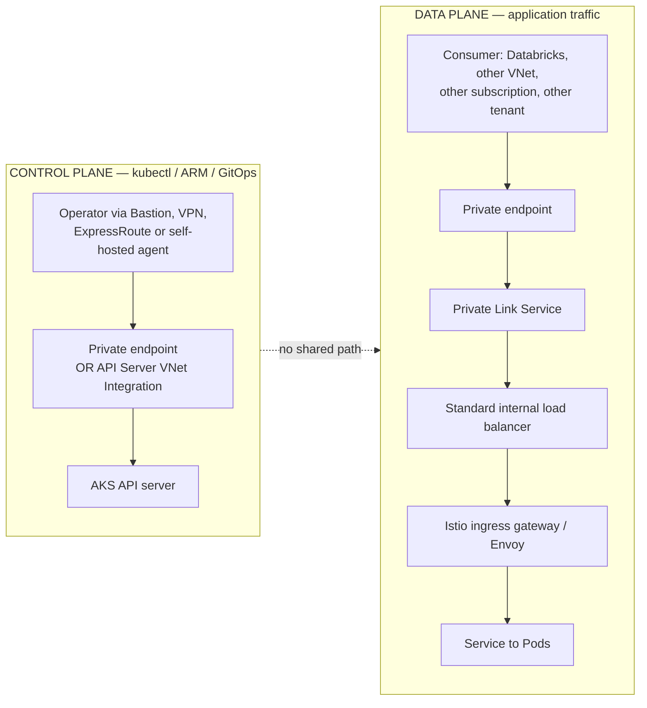
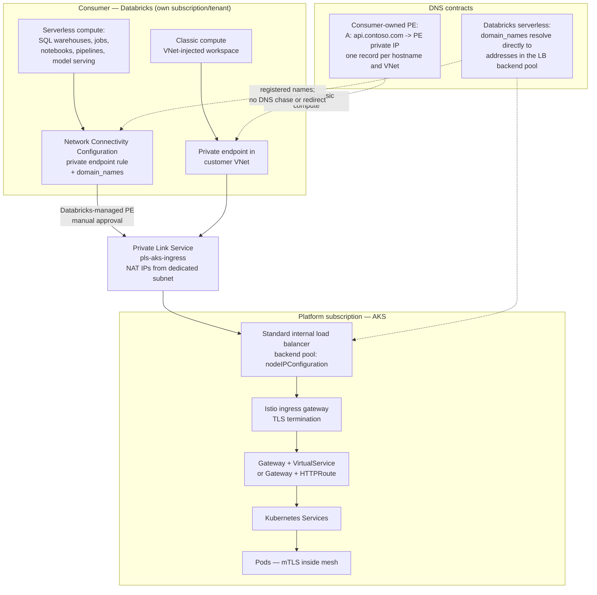
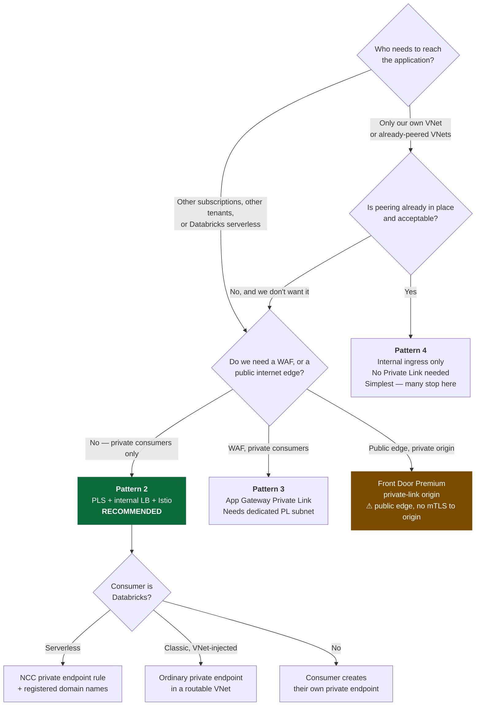
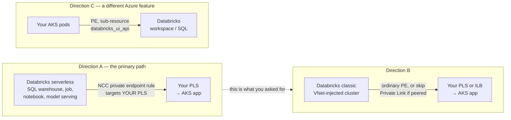
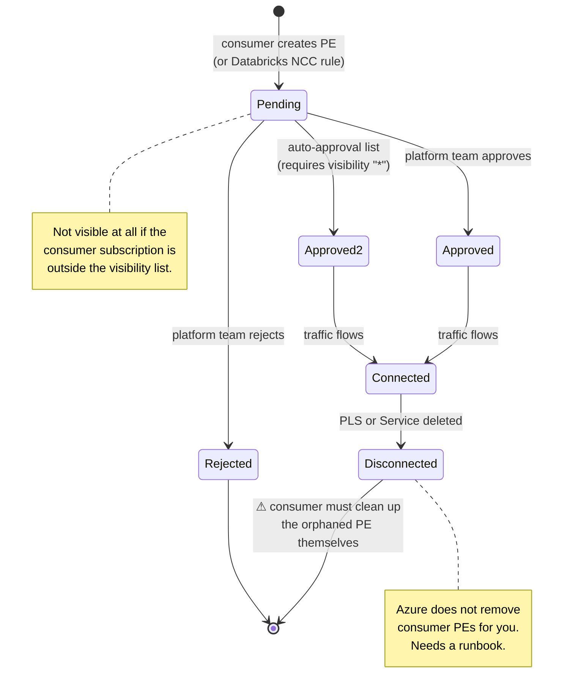
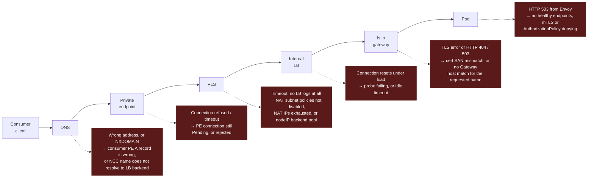
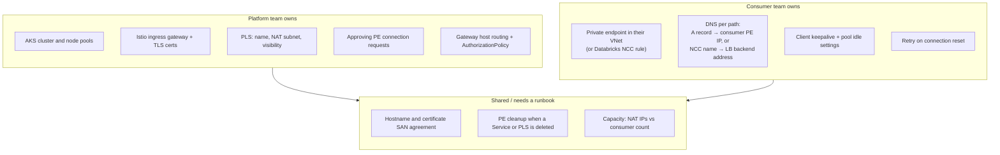

# AKS + Private Link — fact-check, diagrams, and the Databricks path

Reviewed: `rm.md`, `isito.md`, `pls.md`. Verified against Microsoft Learn as of 2026-07-30.

**Verdict:** the shape of all three documents is right. Pattern 2 (Private Link Service in front of an internal
load balancer) is the correct answer for what you want to build, and it is 100% first-party Azure — no
open-source or third-party product is required for the network path. `pls.md` reaches the right
recommendation. But across the three drafts there are **27 factual errors or material omissions** that
will bite during implementation, and two of them (`.internal` domain names; a missing
`azure-pls-create` annotation) break the build outright.

---

## 1. Corrections to `rm.md`

| # | Claim in doc | Status | Correction |
|---|---|---|---|
| 1 | Pattern 1: "private AKS API server" is *the* control-plane story | Incomplete | There are **two** mechanisms. `--enable-private-cluster` uses Private Link (API server in an AKS-managed VNet, private endpoint in your node subnet). **API Server VNet Integration** projects the API server into your own subnet and uses **no Private Link or tunnel at all** — this is the direction AKS is moving, and private-cluster mode can be layered on top of it. |
| 2 | "Hub DNS using Azure Private DNS Resolver" | Wrong name | The product is **Azure DNS Private Resolver**. |
| 3 | Implied: you can have a fully private cluster with no private DNS zone | Wrong | `--private-dns-zone none` **together with** `--disable-public-fqdn` is explicitly **not supported**. Pick one: BYO/system private zone + disable public FQDN, or `none` + keep public FQDN. Also: conditional forwarding does not support subdomains. |
| 4 | Pattern 2 cited to reference `[2]` (the AGIC sample) | Wrong citation | Canonical source is **[Create an internal load balancer in AKS → "Connect Azure Private Link service to internal load balancer"](https://learn.microsoft.com/en-us/azure/aks/internal-lb)**. Reference `[2]` is the App Gateway + AGIC sample, which is Pattern 3. |
| 5 | Pattern 2 presented as Azure-side plumbing | Understated | The PLS is created **declaratively from Kubernetes** via `service.beta.kubernetes.io/azure-pls-*` annotations on the Service. You never touch ARM on the provider side. That is the whole reason this pattern is good. |
| 6 | Pattern 3 diagram: `Private Link → Application Gateway → WAF → Ingress` | Wrong | **WAF is not a hop.** It is a SKU/feature of Application Gateway (`WAF_v2`). Also missing three hard requirements: Private Link needs a **dedicated subnet separate from the App Gateway subnet**, that subnet must have **`privateLinkServiceNetworkPolicies` disabled**, and the Private Link config must be **associated to an App Gateway frontend IP** or the feature silently does nothing. Max 8 IPs per PL config; ~65,536 concurrent TCP connections per IP. |
| 7 | Pattern 4 lists "Cilium Gateway" as an ingress option | Wrong on AKS | **Azure CNI Powered by Cilium does not expose Gateway API.** AKS manages the Cilium config and it cannot be modified. You get L3/L4 `CiliumNetworkPolicy` only. Cilium Gateway API requires **BYO CNI** with self-installed Cilium — you own upgrades, and you leave the managed-networking support boundary. |
| 8 | Pattern 4 lists NGINX / Traefik as steady-state | Time-bombed | Upstream **ingress-nginx maintenance ended March 2026**. The AKS application routing add-on's NGINX is patched by Microsoft only **through November 2026**. Forward options: application routing **Gateway API** implementation, **Istio Gateway API** (GA in the add-on), or **Application Gateway for Containers**. |
| 9 | "Growing interest in Application Gateway for Containers… some feature gaps around fully private ingress" | Too vague | Be concrete: **AGC supports public frontends only.** No private/internal frontend IP, and **no Private Link support**. A private/dual frontend is an open feature request (Azure/AKS #5739). AGC is therefore **not a candidate** for your architecture today. |
| 10 | "With Private Link every consumer simply creates a Private Endpoint" | Missing limits | PLS has real ceilings: **TCP/UDP only, IPv4 only, a fixed and non-tunable ~5-minute idle timeout (300s)** — on top of the load balancer's own idle timeout, which defaults to a tighter **4 minutes** — max **8 NAT IPs** per PLS, per-LB and per-subscription PLS caps, and **PLS is not supported when the AKS load balancer backend pool type is `nodeIP`** — you must be on the default `nodeIPConfiguration`. Also unsupported on Basic LB and on Standard LB whose backend pool is IP-configured. |
| 11 | "DNS becomes the difficult part → use Private DNS Zones" | Missing the actual gotcha | For a **consumer-owned private endpoint to your PLS**, there is no Azure-managed `privatelink.*` zone or automatic DNS zone group; maintain A records to that PE IP. **Databricks serverless is different:** Databricks owns its endpoint, and NCC `domain_names` must resolve directly to addresses represented in the load balancer backend pool. |
| 12 | Cross-tenant "supported" | Correct, with nuance | Cross-tenant visibility works through **RBAC-only** visibility, or `restricted-by-subscription` for pre-approval. Note the asymmetry: **`azure-pls-auto-approval` only takes effect when visibility is `"*"`** (least restrictive). You cannot have tight visibility *and* auto-approval. |

Also: reference `[4]` is a Reddit thread. Fine as colour, not as design authority — don't cite it next to Learn docs.

---

## 2. Corrections to `isito.md`

The framing sentence is exactly right and worth keeping:

> Private Link doesn't know anything about Istio. It only connects to an Azure Load Balancer.

| # | Claim | Status | Correction |
|---|---|---|---|
| 1 | Step 2 YAML has only `azure-load-balancer-internal: "true"`, then "Azure then creates … Private Link Service" | **Wrong — this will not work** | An internal LB annotation alone creates **only** an ILB. You must add `service.beta.kubernetes.io/azure-pls-create: "true"`. Nothing creates a PLS implicitly. |
| 2 | Implies you can annotate the add-on's managed gateway Service | Not a supported path | The Istio add-on documents a **specific supported annotation set** for `aks-istio-ingressgateway-external/-internal`. **No `azure-pls-*` annotation is in it.** Use one of the three supported routes in §4 instead. |
| 3 | "The add-on is increasingly aligned with Gateway API" | Understated / now stale | Istio **Gateway API ingress is supported** on add-on revision `asm-1-26`+ and requires **Managed Gateway API** enabled on the cluster. Two constraints: it **cannot be enabled alongside the application routing Gateway API implementation**, and Gateway API for **egress** is manual-deployment-model only. |
| 4 | Option B: end-to-end TLS passthrough | Conditional | Works via Istio `Gateway` with `tls.mode: Passthrough`. Via **Gateway API `TLSRoute` (SNI passthrough) it is not supported on `asm-1-29`** — support lands `asm-1-30`+. |
| 5 | "Scaling … autoscaling the ingress gateway still works normally" | True but incomplete | The risk isn't HPA, it's **LB frontend lifecycle**. PLS is bound to the **LB frontend IP configuration**, not to the Service. A **minor revision upgrade of the add-on creates a second gateway deployment and Service** → new frontend. And when a Service is deleted, "a PLS may still exist", active PE connections are dropped, **PEs become obsolete, and you are responsible for cleaning them up**. Treat PLS identity as a pinned, named resource (`azure-pls-name`, `azure-pls-resource-group`). |
| 6 | "Health probes: ensure the LB probe matches the gateway" | Right instinct, missing specifics | The add-on **manages probe annotations for ports 80/443**. If you set `spec.externalTrafficPolicy: Local`, you must **explicitly unset** `port_80_health-probe_{port,protocol,request-path}` in the GatewayClass or per-Gateway ConfigMap. |
| 7 | "Client IP preservation: configure Envoy and the LB accordingly" | Missing the blocker | PLS **always destination-NATs**: your app sees the **PLS NAT IP**, never the consumer IP. Recovering the real client IP requires **PROXY protocol v2** (`azure-pls-proxy-protocol: "true"`), and then **every backend must parse it or connections fail — including health probes**. On the Istio add-on that means an `EnvoyFilter`, which sits outside the allow-listed customizations. Extra traps: proxy protocol must be set on **all** PLS sharing that LB/backend pool, and it is **unsupported when the `Microsoft.Network/AllowMaxPrivateLinkServicesPerLoadBalancerOptimization` flag is registered**. Assume you cannot have the client IP; use mTLS or JWT identity instead. |
| 8 | `externalTrafficPolicy: Local` presented as free | Constraint | With `Local`, **the PLS subnet must be different from the pod subnet**. Plan a dedicated PLS NAT subnet regardless — 8+ free IPs recommended. |
| 9 | Hostnames `api.company.internal`, `*.company.internal` | **Breaks Databricks** | Databricks NCC private endpoint rules reject **private-use TLDs (`.internal`, `.localhost`, `.test`)**. Use a real registered domain in a private DNS zone (`api.contoso.com`). See §5. |

---

## 2b. Corrections to `pls.md`

This is the most accurate of the three drafts. The core claims are right and worth keeping:

- **"PLS Gateway" is not an Azure construct.** Correct. There is no such resource. The only
  gateway-shaped Private Link things are Application Gateway Private Link and Front Door private-link
  origins — both distinct products.
- **SNI/Host routing belongs in Envoy/Istio, not in Private Link.** Correct, and for a concrete reason:
  **PLS is L4 (TCP/UDP, IPv4 only)**. It cannot see a Host header or SNI. Envoy is the first hop that can.
- **Option A is the right reading of the requirement** — Databricks as client, your app in AKS. That
  matches §5 Direction A.
- The responsibilities table is accurate.

| # | Claim | Status | Correction |
|---|---|---|---|
| 1 | Cites `docs.databricks.com/aws/en/security/network/serverless-network-security/pl-to-internal-network` | **Wrong cloud** | That is the **AWS** article (VPC endpoint services, different constraints and different console flow). The Azure article is [learn.microsoft.com/…/serverless-network-security/pl-to-internal-network](https://learn.microsoft.com/en-us/azure/databricks/security/network/serverless-network-security/pl-to-internal-network). The Azure flow is NCC + private endpoint rule + `domain_names`; don't design from the AWS page. |
| 2 | "Databricks would resolve your API's private FQDN via Private DNS" | Half true for serverless | For **classic** compute, yes — normal private DNS resolution in the workspace VNet. For **serverless**, resolution is driven by the **`domain_names` you register on the NCC rule**, and **DNS chasing/redirects are not supported** — names must resolve directly to addresses represented in the load balancer backend pool. You are not pointing Databricks at its managed PE IP. |
| 3 | "Azure Front Door (Private Link origin)" listed as a pre-Istio option | Correct but with a large caveat | AFD **Premium** does support **internal load balancers, explicitly including AKS**, as a private-link origin. But **Front Door is a public edge** — adopting it re-introduces the public endpoint you were eliminating. Also: **AFD does not support mTLS to private-link origins**, health probes follow the same private path, and there's a **7,200 RPS per regional cluster per profile** limit. Only reach for AFD if you actually want public/internet exposure with a private origin. Not for Databricks-to-AKS. |
| 4 | "Azure Application Gateway" as a pre-Istio option | Valid, with the §1 #6 corrections | Needs a dedicated Private Link subnet with `privateLinkServiceNetworkPolicies` disabled and a frontend association. WAF is a SKU of App Gateway, not a separate hop. |
| 5 | "Wildcard certificates / multiple hostnames" through one PLS | True, one addition | Split the DNS flows. For a **consumer-owned private endpoint**, create one A record per hostname pointing to that PE IP. For **Databricks serverless**, Databricks owns the endpoint; register every hostname in the NCC rule (max 100), and each name must resolve directly to an address represented in the load balancer backend pool. |
| 6 | "An L4 TCP proxy" / "DDoS mitigation at the edge" as reasons for another gateway | Not applicable here | Traffic arriving over Private Link never touches the internet, so edge DDoS is moot. And PLS is itself the L4 hop. Neither justifies a second gateway on this path. |

**Bottom line: pls.md's recommendation is the correct one** — PLS + Istio ingress gateway, Envoy does the
SNI/Host routing, no extra gateway. Fix the AWS citation and the serverless DNS assumption.

---

## 3. The corrected picture

### Control plane vs data plane — they are separate problems



`rm.md` Pattern 1 is the top lane. Patterns 2–4 are the bottom lane. They share nothing — a private
cluster does not make your apps private, and private apps do not require a private cluster.

### Target architecture: Databricks → AKS over Private Link



### Who does what, in order

```mermaid
sequenceDiagram
  participant P as Platform team (AKS)
  participant A as Azure control plane
  participant C as Consumer team (Databricks)
  P->>A: 1. Dedicated PLS NAT subnet<br/>privateLinkServiceNetworkPolicies = Disabled
  P->>A: 2. Apply Service with azure-load-balancer-internal<br/>+ azure-pls-create + azure-pls-name
  A-->>P: 3. ILB + PLS created; returns alias
  P->>C: 4. Share PLS resource ID / alias
  alt Databricks serverless
    C->>A: 5a. Create NCC rule with PLS resource ID + domain_names
    C->>C: 6a. Verify each name resolves directly to an LB backend address
  else Consumer-owned private endpoint
    C->>A: 5b. Create private endpoint in consumer VNet
    C->>C: 6b. Create DNS A record -> consumer-owned PE private IP
  end
  A-->>P: 7. Connection request = Pending
  P->>A: 8. Approve (or pre-approve via auto-approval)
  C->>P: 9. Traffic flows; app sees PLS NAT IP as source
```

---

## 4. Provider-side build — the three supported ways to attach a PLS

### Option A — your own Service (most control, recommended for a platform ingress)

Run a self-managed Istio ingress gateway (or any ingress) so you own the Service object:

The example deliberately pins the PLS in `rg-platform-network`. Before applying it, grant the AKS
control-plane identity **Network Contributor** scoped to that resource group. The identity has Contributor
on the node resource group by default, not on arbitrary resource groups. If you omit
`azure-pls-resource-group`, AKS creates the PLS in the node resource group instead.

```yaml
apiVersion: v1
kind: Service
metadata:
  name: ingress-internal
  namespace: platform-ingress
  annotations:
    service.beta.kubernetes.io/azure-load-balancer-internal: "true"
    service.beta.kubernetes.io/azure-load-balancer-internal-subnet: "ilb-subnet"
    service.beta.kubernetes.io/azure-pls-create: "true"
    # Pin the identity so upgrades/recreates don't orphan consumer endpoints.
    service.beta.kubernetes.io/azure-pls-name: "pls-aks-platform-ingress"
    service.beta.kubernetes.io/azure-pls-resource-group: "rg-platform-network"
    # Dedicated NAT subnet, required if externalTrafficPolicy is Local.
    service.beta.kubernetes.io/azure-pls-ip-configuration-subnet: "pls-nat-subnet"
    service.beta.kubernetes.io/azure-pls-ip-configuration-ip-address-count: "8"
    # Visibility: subscription list, or "*" if you need auto-approval.
    service.beta.kubernetes.io/azure-pls-visibility: "<consumer-sub-id> <databricks-sub-id>"
    # Move the LB idle timer out of the way; the fixed PLS 300s still binds. Minutes, 4-30.
    service.beta.kubernetes.io/azure-load-balancer-tcp-idle-timeout: "30"
    service.beta.kubernetes.io/azure-load-balancer-disable-tcp-reset: "false"
spec:
  type: LoadBalancer
  selector:
    istio: platform-ingress
  ports:
    - name: https
      port: 443
      targetPort: 8443
```

Full annotation reference: [aks/internal-lb](https://learn.microsoft.com/en-us/azure/aks/internal-lb) and
[cloud-provider-azure PLS integration](https://cloud-provider-azure.sigs.k8s.io/topics/pls-integration/).

### Option B — Istio Gateway API, automated deployment (the managed-add-on path)

The Gateway API path **does** support arbitrary load balancer annotations, unlike the classic managed
gateway Service. Requires Managed Gateway API + add-on revision `asm-1-26`+:

```yaml
apiVersion: gateway.networking.k8s.io/v1
kind: Gateway
metadata:
  name: platform-gateway
spec:
  gatewayClassName: istio
  infrastructure:
    annotations:
      service.beta.kubernetes.io/azure-load-balancer-internal: "true"
      service.beta.kubernetes.io/azure-pls-create: "true"
      service.beta.kubernetes.io/azure-pls-name: "pls-aks-platform-ingress"
      service.beta.kubernetes.io/azure-pls-ip-configuration-subnet: "pls-nat-subnet"
  listeners:
    - name: https
      port: 443
      protocol: HTTPS
      tls:
        mode: Terminate
        certificateRefs:
          - name: platform-credential
```

Verify the annotations land on the generated Service (`<gateway-name>-istio`) before promising it to a
consumer — Gateway-generated resources are reconciled by the add-on.

### Option C — out-of-band PLS against the add-on's ILB frontend

If you must use `aks-istio-ingressgateway-internal` as-is, create the PLS in ARM/CLI against that ILB's
frontend IP configuration. Works, but the PLS is now outside cluster reconciliation: if the gateway
Service is recreated (revision upgrade, `disable`/`enable`), the frontend changes and consumer endpoints
break. Only take this if A and B are both blocked.

### Option D — application routing add-on (NGINX), if you are not on Istio

`NginxIngressController.spec.loadBalancerAnnotations` accepts arbitrary LB annotations, so `azure-pls-*`
works there too. Weigh against the November 2026 NGINX support horizon.

---

## 5. Databricks specifically — this is the part that needs care

"Expose applications over Private Link into our Kubernetes clusters" splits into three different
Azure features. Don't conflate them.

| Direction | What it is | Mechanism |
|---|---|---|
| **A. Databricks serverless → your AKS app** | Serverless SQL warehouses, jobs, notebooks, pipelines, model serving calling an API you run in AKS | **NCC private endpoint rule** targeting your **PLS resource ID** + `domain_names`. This is the primary path. |
| **B. Databricks classic compute → your AKS app** | VNet-injected workspace clusters calling your AKS app | Ordinary private endpoint in a VNet routable from the workspace VNet. If the VNets are already peered you can skip Private Link entirely and hit the ILB IP. |
| **C. AKS pods → Databricks workspace/SQL** | Your workloads calling the Databricks REST API or SQL endpoints privately | Private endpoint with sub-resource **`databricks_ui_api`** in the AKS VNet + `privatelink.azuredatabricks.net` zone. This is Databricks **front-end/back-end Private Link** — a different feature, nothing to do with your PLS. |

### Direction A — the confirmed serverless path

Databricks NCC private endpoint rules support a **generic customer Private Link Service** as a target
([Configure private connectivity to resources in your VNet](https://learn.microsoft.com/en-us/azure/databricks/security/network/serverless-network-security/pl-to-internal-network)).
Flow: create NCC (account console, region must match workspace) → add private endpoint rule with your
PLS resource ID + the domain names → **approve the pending connection on your PLS** → status goes
`PENDING` → `ESTABLISHED` → attach NCC to workspaces → restart serverless compute.

Hard constraints, all verified:

- **Premium plan** and **account admin** required.
- Region ceilings: **10 NCCs per region**, **100 private endpoints per region**, **50 workspaces per NCC**, **100 domain names per rule**.
- **`domain_names` must resolve directly to addresses represented in the load balancer backend pool.** No DNS chasing, no redirects, no CNAME chains.
- **Private-use TLDs (`.internal`, `.localhost`, `.test`) are rejected.** ⚠️ Both draft docs use `api.company.internal` / `*.company.internal`. **Pick a real registered domain** (e.g. `api.contoso.com`) hosted in a private DNS zone.
- Enter the **specific instance hostname**, not a service-level or wildcard domain.
- Databricks **bills networking cost** for serverless workloads reaching customer resources.
- App Gateway v2 as a target needs the **REST API**, not the console UI (extra `group_id` + `domain_names`). Not relevant if you front with an ILB.

### Databricks-shaped gotchas on top of generic PLS

1. **Idle timeouts. This is a configuration and documentation problem, not something to build around** — every lever is a managed-service setting.

   **First, scope it correctly: this is an *idle* timeout, not a connection lifetime cap.** It closes
   sockets where **no data has flowed in either direction** for the window. Active traffic resets the timer
   continuously, so a busy connection stays up indefinitely. Any connection without bytes or keepalives can
   expire, including an idle pooled connection, a quiet stream, or a request waiting silently for a response.

   A common risk case is a long-running request where the server computes for minutes and sends nothing
   back over the socket — the connection *looks* idle even though work is in progress. That is what
   keepalive exists to prevent. This is not Private Link-specific or AKS-specific; it is the same behaviour
   every Azure Load Balancer path has had for years.

   There are **two** idle timers on this path, and the load balancer's is the tighter one at defaults:

   | Timer | Default | Tunable? |
   |---|---|---|
   | Standard load balancer rule idle timeout | **4 minutes (240s)** | Yes — 4 to 30 minutes, via `service.beta.kubernetes.io/azure-load-balancer-tcp-idle-timeout` (integer minutes) |
   | **Private Link Service idle timeout** | **~5 minutes (300s)** | **No. Fixed. Not exposed.** |

   So at stock settings the binding constraint is **240s, not 300s**. Raising the LB annotation moves that
   timer out of the way, but the PLS 300s remains a hard ceiling you cannot raise. **Treat ~240s as the
   number to design against, and never assume an idle TCP connection survives 5 minutes.**

   Three config levers, all first-party, no custom component:

   - **Cap client connection-pool idle time below the timeout.** Evict idle sockets at, say, 120–180s so a
     dead connection is never handed back to a caller. This is the robust lever and the only one that
     works on Databricks **serverless**, where you cannot set socket options on the host.
   - **Send application-level keepalive under the timeout.** HTTP/2 PING, gRPC `keepalive_time`, or a
     cheap heartbeat request. Keeps the connection genuinely non-idle rather than racing the timer.
   - **Raise the LB idle timeout** so only the PLS 300s binds:
     `service.beta.kubernetes.io/azure-load-balancer-tcp-idle-timeout: "30"`. Do this *and* the above —
     it removes one timer, it does not remove the problem.

   AKS enables **TCP reset on idle by default** so an expired connection fails fast with an RST instead of
   hanging until the client's own timeout. Keep that reconciled default; if you need to make it explicit on
   the Service, set `service.beta.kubernetes.io/azure-load-balancer-disable-tcp-reset: "false"` rather than
   changing the managed load balancer directly. Make callers **retry idempotent requests on connection
   reset** — with two timers on the path, an occasional reset is normal operation, not an incident.

   OS-level `SO_KEEPALIVE`/`TCP_KEEPIDLE` tuning on the Istio gateway's *downstream* listener would need an
   `EnvoyFilter`, which sits outside the add-on's allow-listed customizations — same constraint as PROXY
   protocol. Don't go there; the three levers above are sufficient.

   **Document this once, in the consumer onboarding guide.** It is the single most likely cause of
   "the query randomly died" reports, and it is entirely preventable by client configuration.
2. **Source IP is the PLS NAT IP.** Any allowlist in your app, `AuthorizationPolicy`, or NSG must permit the PLS NAT subnet — never "Databricks IPs". Databricks identity must come from mTLS or a JWT, not the network.
3. **PLS is L4.** Host/SNI routing still works because Istio reads the Host header, but the TLS certificate must be valid for exactly the hostnames you registered in the NCC rule.
4. **TCP/UDP and IPv4 only.** No HTTP/3 over QUIC through this path.
5. **Approval is manual by default.** Databricks-created endpoints arrive as `Pending` on your PLS. If you want auto-approval you must set visibility to `"*"` — a real trade-off; prefer manual approval as a platform gate.

---

## 6. Is any of this open source or third-party?

**No.** The entire network path is first-party Azure:

| Layer | Component | Vendor |
|---|---|---|
| Consumer connection | Private Endpoint | Microsoft |
| Exposure | Private Link Service | Microsoft |
| L4 | Standard internal Load Balancer | Microsoft |
| Provider automation | `cloud-provider-azure` in AKS (annotations) | Microsoft (ships in AKS) |
| L7 in-cluster | Istio-based service mesh add-on (Envoy) | **CNCF OSS, delivered and supported as a Microsoft managed add-on** |
| Certificates | Azure Key Vault + Secrets Store CSI Driver add-on | Microsoft |
| DNS | Azure Private DNS Zones, Azure DNS Private Resolver | Microsoft |
| Consumer side | Databricks NCC / private endpoint rules | Microsoft (first-party Azure Databricks) |

The only OSS in the picture is **inside** the cluster — Envoy/Istio, or NGINX/a Gateway API
implementation — and Microsoft ships and supports those as add-ons. Optional OSS you might add for
convenience: `external-dns` (to write A records into Azure private DNS zones), `cert-manager` (if you
prefer it over Key Vault + CSI). Neither is required. If you ever need real client IPs you'd need an
`EnvoyFilter` for PROXY protocol v2 — that's an OSS Istio API, and it falls outside the add-on's
allow-listed customizations.

**Nothing here needs a third-party product.**

---

## 7. Recommended architecture, with the corrections applied

```text
Databricks serverless (NCC PE rule)  ─┐
Databricks classic (VNet PE)         ─┤
Other subscription (PE)              ─┼─► Private Link Service "pls-aks-platform-ingress"
Other tenant (PE, RBAC visibility)   ─┘        NAT IPs: dedicated pls-nat-subnet, 8 IPs
                                                        │
                                        Standard internal Load Balancer
                                            backend pool: nodeIPConfiguration
                                                        │
                                        Istio ingress gateway — TLS terminate
                                          cert from Key Vault via Secrets CSI
                                                        │
                                        Gateway + HTTPRoute  (or VirtualService)
                                                        │
                                          Services ─► Pods, mTLS in mesh
```

Non-negotiables for this to work:

- [ ] AKS load balancer backend pool type is **`nodeIPConfiguration`** (default). PLS is unsupported on `nodeIP`.
- [ ] **Dedicated PLS NAT subnet** with `privateLinkServiceNetworkPolicies` **Disabled**, ≥8 free IPs, in the same VNet as the backend pool, **different from the pod subnet**.
- [ ] PLS **pinned by name and resource group** so revision upgrades don't orphan consumer endpoints.
- [ ] AKS **control-plane identity has Network Contributor** on the custom PLS resource group; otherwise use the node resource group.
- [ ] **Real registered domain** for consumer hostnames — never `.internal`.
- [ ] **DNS path documented per consumer**: consumer-owned PE uses A records to its PE IP; Databricks serverless uses NCC `domain_names` resolving directly to LB backend addresses.
- [ ] **Idle-timeout hygiene documented for every consumer**: client pool idle eviction below ~240s, app-level keepalive, LB idle timeout raised via `azure-load-balancer-tcp-idle-timeout`, AKS TCP reset default retained, retry-on-reset for idempotent calls. Pure config — nothing to build.
- [ ] Identity from **mTLS/JWT**, not source IP.
- [ ] Manual PE approval as the platform gate; auto-approval only if you accept `visibility: "*"`.
- [ ] Runbook for PE cleanup when a Service or PLS is deleted — Azure will not do it for you.

## 8. Where the kagent/MCP tooling idea actually pays off

Both drafts end with "this would be an interesting MCP enhancement". Agreed, and now the checks are
concrete and mechanical — every one of these is a real failure mode with a real signal:

1. Assert LB backend pool type is `nodeIPConfiguration`, not `nodeIP`.
2. Assert `privateLinkServiceNetworkPolicies: Disabled` on the PLS NAT subnet, and that free IP count ≥ requested NAT IP count.
3. Assert the PLS is pinned (`azure-pls-name` set) and that its frontend still matches the live gateway Service.
4. Diff PLS `privateEndpointConnections` against expected consumers; surface `Pending` and orphaned entries.
5. Resolve each consumer hostname from the consumer VNet and assert it returns the **PE IP**, not the ILB IP; assert no CNAME chain and no private-use TLD.
6. Assert the gateway TLS cert SANs cover every hostname registered in each Databricks NCC rule.
7. Probe end-to-end and localise the break: PE → PLS → ILB → gateway → backend.
8. Report the effective idle-timeout ceiling: read `azure-load-balancer-tcp-idle-timeout` off the Service (default 4 min) and surface the binding number against the fixed PLS 300s, so onboarding docs quote the real value rather than a guess. A read of existing config, not a workaround.

---

## 9. Reference diagrams

### Which pattern do I actually need?



### The three Databricks traffic directions — don't conflate them



### Idle timers — what actually expires, and when

Both timers watch for **silence**, not elapsed connection age. Any byte in either direction resets them;
an idle pool entry or quiet stream can still expire.

```text
  t=0s        t=120s       t=240s              t=300s
   │            │            │                   │
   ├────────────┼────────────┼───────────────────┤
   │            │            │                   │
   │            │            ▼                   ▼
   │            │      LB idle timeout      PLS idle timeout
   │            │      DEFAULT 4 min        FIXED ~5 min
   │            │      tunable 4–30 min     NOT tunable
   │            │
   │            └── recommended keepalive / pool-eviction window
   │                (120–180s — comfortably under both)
   │
   └── connection established

  ACTIVE TRAFFIC  ──►  timers continuously reset  ──►  connection lives indefinitely
  SILENT SOCKET   ──►  first timer to fire wins   ──►  connection closed (RST if TCP reset on)
```

The risk case is not a long connection. It is a **long silence** — e.g. a request where the server
computes for six minutes and streams nothing back.

### Private endpoint connection lifecycle



### Where it breaks — diagnostic map

Each hop fails with a different signature. Work left to right.



### Ownership split — who is on the hook for what



---

## Sources

- [Create an internal load balancer in AKS (PLS annotations)](https://learn.microsoft.com/en-us/azure/aks/internal-lb)
- [What is Azure Private Link service? (properties, visibility, TCP Proxy v2, limitations)](https://learn.microsoft.com/en-us/azure/private-link/private-link-service-overview)
- [cloud-provider-azure — Private Link Service integration](https://cloud-provider-azure.sigs.k8s.io/topics/pls-integration/)
- [Private Link service Direct Connect (public preview)](https://learn.microsoft.com/en-us/azure/private-link/configure-private-link-service-direct-connect)
- [Create a private AKS cluster](https://learn.microsoft.com/en-us/azure/aks/private-clusters)
- [Databricks — Configure private connectivity to resources in your VNet](https://learn.microsoft.com/en-us/azure/databricks/security/network/serverless-network-security/pl-to-internal-network)
- [Databricks — Configure private connectivity to Azure resources (NCC)](https://learn.microsoft.com/en-us/azure/databricks/security/network/serverless-network-security/serverless-private-link)
- [Istio add-on — external or internal ingress gateways](https://learn.microsoft.com/en-us/azure/aks/istio-deploy-ingress)
- [Istio add-on — Gateway API ingress](https://learn.microsoft.com/en-us/azure/aks/istio-gateway-api)
- [Application routing add-on — NGINX configuration](https://learn.microsoft.com/en-us/azure/aks/app-routing-nginx-configuration)
- [Configure load balancer TCP reset and idle timeout](https://learn.microsoft.com/en-us/azure/load-balancer/load-balancer-tcp-idle-timeout)
- [cloud-provider-azure — LoadBalancer annotations](https://cloud-provider-azure.sigs.k8s.io/topics/loadbalancer/)
- [Azure Application Gateway Private Link](https://learn.microsoft.com/en-us/azure/application-gateway/private-link)
- [Azure CNI Powered by Cilium](https://learn.microsoft.com/en-us/azure/aks/azure-cni-powered-by-cilium)
- [AGC private/internal frontend feature request — Azure/AKS #5739](https://github.com/Azure/AKS/issues/5739)
