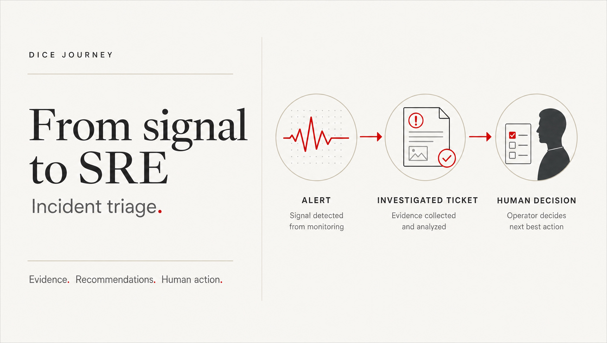
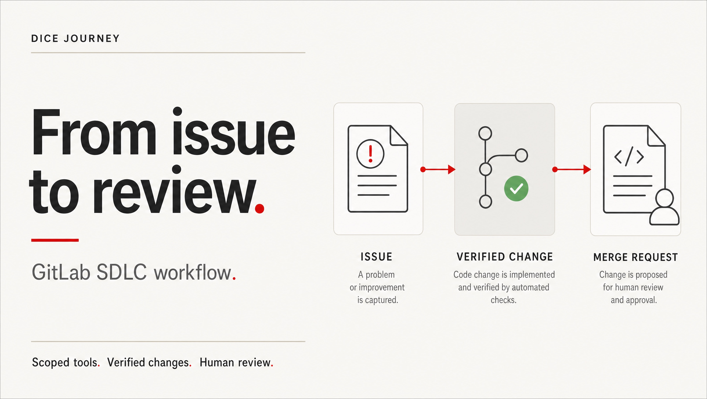

# DICE journey: triage and SDLC upload pack

Prepared 9 October 2026. Two presenter-free, narrated chapters extend the
existing five-chapter collection. The voice is the approved Daniel narration;
the story and audio have not been regenerated for this export.

The MP4s are staged in the **DICE journey: triage and SDLC upload pack** draft
on the [GitHub releases page](https://github.com/davidmarkgardiner/kagent-public/releases).
Only authorised signed-in repository users can access the draft. It is not a
public download, a SharePoint page or a workplace delivery receipt. GitHub may
change a draft's direct URL when its target revision changes, so use the stable
releases page and select the named draft. Review both
exports with sound before publishing to the selected audience. No employer
name, email address, tenant or internal endpoint is part of this pack.

## Files to upload

| Collection chapter | MP4 | Cover | Alt text |
|---|---|---|---|
| 06 · Incident triage | `dice-journey-triage-v6.mp4` | [Download JPG](dice-triage-cover.jpg) | Alert becomes an investigated ticket, then a human decision. |
| 07 · GitLab SDLC workflow | `dice-journey-sdlc-gitlab-v1.mp4` | [Download JPG](dice-sdlc-cover.jpg) | Issue progresses through a verified code change to a merge request for human review. |

Triage: **1:59.4, 8.1 MB**. SDLC: **1:56.1, 7.3 MB** (decimal sizes).
Both are 1080p, 30 fps, H.264 video with AAC narration and fast-start metadata.
MP4 technical details and checksums are in [upload-assets.json](upload-assets.json).
The videos are kept as release attachments rather than committed binaries.
The JPGs are the cover artwork, not screenshots or evidence of tool execution.

## Incident triage cover



## SDLC cover



Both illustrations were generated through Higgsfield using GPT Image 2, then
saved as lightweight JPGs without changing their content. The original PNGs
are included in the draft release. No portrait, employer branding or customer
data was supplied to the generation service.

## Upload sequence

1. Download the two MP4s and covers from the draft release while signed in.
   If GitHub is unavailable on the destination device, use an approved transfer
   process; do not circumvent attachment or download restrictions.
2. Watch each entire exported film with sound. Check pronunciation, transitions,
   the last sentence and the end card. Mark the content Ready for review until
   the chapter owner has accepted it. Automated checks are not human approval.
3. Follow the [SharePoint guide](sharepoint-publishing-guide.md): upload the
   reviewed MP4s into the restricted Journey Videos library, then create the
   two chapter pages using section 7's copy-ready text.
4. Upload the JPGs to the same restricted site and select them as the chapter
   tile/page thumbnails where your site offers that control. If unavailable,
   place the cover in an Image web part above the introduction. Supply its
   alt text, and keep the actual player immediately below the introduction.
5. Add chapter 06 after Kubernetes MCP and chapter 07 after triage. Update
   Previous / All chapters / Next links and republish changed navigation pages.
6. Verify the index, each page, each cover and the direct MP4 with an intended
   reader and an excluded account before sharing the collection link.

The collection order is editorial navigation, not a change to the films.
Triage's closing line introduces the planned PostgreSQL story. SDLC introduces
the vector knowledge base. Neither of those later MP4s is included here; do not
create a player or link that promises an exported chapter that is not available.

## Copy-ready post: incident triage

Replace `[chapter-page URL]` with the published restricted SharePoint page URL.
Attach the triage JPG for the post's cover. Link to the page, not GitHub or
YouTube, so readers get the video, context, discussion and chapter navigation.

```text
From signal to SRE: incident triage

An alert tells us something is wrong. An investigated ticket gives an SRE
something to work with.

This two-minute DICE chapter follows Alloy → Vector → Kafka → Argo,
then read-only MCP investigation. Argo adds the findings to a GitLab
ticket: evidence, diagnosis, confidence and recommended next steps.

The handoff stays human: notify the SRE, review the evidence, then decide
how to fix the issue or investigate further. The agent does not change
the cluster.

Watch: [chapter-page URL]

What evidence would make an incident ticket useful before you pick it up?

#DICE #IncidentTriage #SRE
```

Alternative opening: **Less alert chasing. More useful investigation.**
Keep the rest of the post unchanged; do not add unsupported time-saving figures.

## Copy-ready post: GitLab SDLC workflow

Attach the SDLC JPG and use the restricted SDLC chapter page URL.

```text
From issue to review: GitLab SDLC workflow

One issue. One scoped change. Evidence that matches the current commit.

This DICE chapter follows a coordinating agent and its specialists through
planning, implementation, pipeline feedback, repair and review. GitLab
MCP provides the scoped tools; agent-to-agent delegation connects the work.

A failed check sends the change back for repair. A passing pipeline and
matching review support the draft merge request—not an automatic merge
or deployment. The human still owns that decision.

Watch: [chapter-page URL]

What should an agent-prepared merge request include before you review it?

#DICE #SDLC #GitLab #MCP
```

Alternative opening: **A green pipeline is evidence, not permission to merge.**

## Connect the posts

On the triage page: **Next in this collection: GitLab SDLC workflow**.
On the SDLC page: **Previous: Incident triage**.
On both: **All chapters: DICE journey** and **Contribute the next story**.

Use a private, correctly scoped discussion destination if posting to Viva
Engage. Mention only relevant chapter owners or reviewers, with their consent.
Hashtags and audience targeting do not restrict who can open the underlying
page or video. Keep page, file and discussion permissions aligned.

## Final owner checks

- [ ] Full sound-on review of each MP4 completed.
- [ ] Facts, technical names and privacy accepted by the chapter owner.
- [ ] Thumbnail text readable; supplied alt text added.
- [ ] Reviewed captions or a checked text alternative provided.
- [ ] Restricted page, file and image permissions verified.
- [ ] All real chapter links work; no placeholder URL remains.
- [ ] Only then publish the pages and copy the posts to the selected audience.

No SharePoint, Viva Engage or YouTube publication has been performed by
preparing this upload pack. Making the GitHub draft release public is a
separate publication decision.
