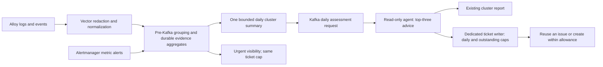

# Unattended ticket budgets and daily cluster advice

Status: planning only, 1 October 2026. This is the revised requirement and
supersedes the ticket-budget policy in the earlier namespace alert/digest plans.
The user subsequently authorized the isolated home-lab transport test, which
passed and was cleaned up. A strict transport follow-up removes all urgent
publication bypasses and tests accelerated daily rollover, concurrency, restart
and recovery; its separate receipt records the verified scope. Ticket-policy implementation and rollout remain
planning work; the transport result does not certify ticket caps.

## Problem and required outcome

The previous system was left running without active ownership and accumulated
excessive tickets. The replacement must remain bounded even if nobody reviews,
acknowledges or stops it.

Default to **one new automatic ticket per namespace per cluster per day**, with
a configurable hard maximum of **two**. This is a ceiling, not a target. Healthy
namespaces create zero tickets. The daily agent review continues to summarize
cluster-wide themes and recommend fixes even when ticket creation is blocked.

## Independent controls

| Control | Proposed policy | Why |
| --- | --- | --- |
| New tickets | Default 1, maximum 2 per cluster/namespace/local day | Hard bound on actual externally created tickets |
| Outstanding tickets | Maximum 2 per cluster/namespace, including pending or ambiguous creations | Prevent accumulated unattended backlog |
| Cluster and fleet totals | Separate creation and outstanding caps; values to agree against SRE capacity | Many namespace allowances can still overwhelm SRE |
| Ticket updates | Maximum one consolidated update per issue/day | Stop comment and update-notification floods |
| Cluster summary | One existing report updated daily | Avoid a new summary ticket every day |
| Agent assessment | One scheduled assessment per cluster/day, with a fixed retry/tool budget | Avoid per-signal model and workflow queues |
| Advice | Up to three cluster priorities per day | Focus remediation on the most consequential themes |

The outstanding cap is an additional recommendation: even two new tickets per
namespace/day can accumulate 60 per namespace in 30 days. Reuse existing open
issues by stable workload/theme. When capacity is full, retain new findings in
the cluster summary; do not auto-close existing issues to create room.

Use Europe/London calendar days, with a proposed 09:00 daily assessment. The
preceding 24-hour evidence window is separate from the local-day ticket budget.
Cluster identity is explicit: two clusters with the same namespace name have
separate namespace budgets, subject to the shared fleet ceiling.

**No automatic ticket-cap exception for critical incidents.** Critical findings
stay prominent and may use the existing urgent notification route, but any
automatic ticket creation from that route uses the same writer and cap. Manual
overrides require a separately recorded human decision and are outside this
unattended automation.

## Proposed flow

Pre-Kafka aggregation prevents individual repeated signals from becoming
individual Argo workflows or agent calls. Preserve metric and log/event source
ownership and versioned contracts. Retain bounded counts, trends and redacted
examples, with approved archived logs/events for deeper detail.

**The hard ticket guarantee belongs at the final ticket writer too.** A maximum
of two Kafka messages does not guarantee two tickets if agents, retries or other
consumers can create more. Only the dedicated writer holds the creation identity;
all automatic writers and both signal lanes must use it. The agent has no
ticket-writing or cluster-changing tools.

## Durable creation boundary

Use an approved transactional store for daily allowances, outstanding capacity,
stable issue mappings, report slots and immutable creation intents.

1. Reuse the mapped open issue when the same workload/theme recurs. Bound updates
   separately. Daily rollover does not create a replacement ticket.
2. Before a new ticket, atomically reserve namespace daily and outstanding
   capacity plus applicable cluster/fleet allowances, then record its creation
   intent. Concurrent replicas cannot independently spend the same allowance.
3. Key budgets by cluster + namespace + local date; key issue identity separately
   from date. Policy changes, restarts and Kafka replay do not refill budgets.
4. Pending and ambiguous API creations consume their slots. Retry only with
   receiver-supported idempotency, or reconcile the existing result first.
   An uncertain response must never cause a blind replacement creation.
5. If state or reconciliation is unavailable, create no new tickets. Preserve
   evidence/reporting where available and expose the operational fault.
6. After outages, recompute the current summary. Never drain suppressed historic
   findings as a catch-up ticket queue. Use bounded current-state aggregates,
   retention and expiry rather than an indefinitely growing deferred backlog.
7. After database restore, keep creation disabled until today's actual tickets,
   pending intents and outstanding mappings are reconciled. An old backup is
   not evidence of unused allowance.

If the cluster summary itself is a ticket, its initial creation must also be
accounted for under a defined namespace/scope and the cluster/fleet caps. Reuse
it afterward. Prefer an existing report/page plus retained daily report history,
so summaries do not add an extra daily ticket stream.

## Daily evidence and agent advice

Summarize every cluster's principal themes, not just the findings that obtained
a ticket: log/error groups, Kubernetes Warning Events, current metric alerts,
affected workloads/namespaces, recent changes, persistence, trends, open issues,
and deferred counts. Use stable controller identity, not literal replacement-pod
names. Separate received-record counts from Kubernetes Event occurrence deltas.

Rank by confirmed impact/SLO violation, severity, breadth, persistence and
worsening trend. Aggregate shared causes only when evidence supports them;
otherwise label them as hypotheses. Select cluster candidates before namespace
trimming. Missing, stale or truncated telemetry means incomplete coverage,
not healthy status or recovery.

Give the agent a schema-validated bounded evidence package, initially 32 KiB,
with source references and explicit coverage gaps. Request up to three issues,
each with:

- Observed impact, supporting evidence and root-cause hypothesis/confidence.
- Immediate read-only checks and practical fixes or remediation proposals.
- Validation and rollback guidance where applicable, plus a recovery measure.
- Proposed owner and any action requiring human authorization.

The agent may make narrowly scoped, bounded read-only checks within a fixed
daily call/tool budget. It must not automatically paginate through logs, write
tickets, send messages or apply fixes. Daily recommendations continue even when
ticket allowance or outstanding capacity is exhausted. Unsupported output is
rejected; model failure leaves the deterministic summary with visible failure
status rather than a fabricated diagnosis.

## Future acceptance test

When testing is requested again, first prove Alloy → Vector → aggregation →
Kafka using isolated synthetic pod logs and Warning Events. Then separately
prove the external ticket writer and daily agent/report behavior.

Simulate a week left unattended with continuous noise across several namespaces
and clusters. Count actual external tickets, not messages or reserved slots.
Require:

- No cluster/namespace/day exceeds the configured 1 or 2 new tickets.
- Outstanding, cluster/fleet, comment and notification caps hold.
- The same issue recurs without generating replacement tickets.
- Concurrency, pod churn, restarts, replay, ambiguous API responses and restore
  cannot recreate spent allowance or cause a catch-up burst.
- Daily cluster summaries and evidence-backed advice remain available when no
  new ticket can be created.
- Critical incidents remain visible within the same automatic creation cap.
- No automatic remediation is executed.

## Current evidence and gaps

The existing [pre-Kafka prototype](../../work-agent-bundles/namespace-alert-admission/README.md)
has [local Docker validation](../../work-agent-bundles/namespace-alert-admission/EVIDENCE.md).
The strict follow-up accepts only one or two selections, includes critical
findings in that quota and removes all urgent publication bypasses. It
atomically reserves final-publisher allowances and audits committed Kafka
history before transactional publication.
It does **not** satisfy this revised ticket guarantee and must not be enabled
as if it did. Metric intake, the dedicated budgeted ticket writer, outstanding
limits and the daily agent/report connection remain design/build work.

The initial isolated home-lab setup was stopped and removed when planning-only
was requested. After testing was authorized again, the
[home-lab transport proof](../../work-agent-bundles/namespace-alert-admission/evidence/2026-10-01-home-lab-transport.md)
passed: 195 real collected synthetic records, 30 resolved groups, and exactly
1/2/2 records consumed from isolated Kafka. Both attempted test runs were
cleaned up. No ticket writer or agent was exercised.

The [strict recovery receipt](../../work-agent-bundles/namespace-alert-admission/evidence/2026-10-01-strict-admission.md)
records the successful restart, concurrency, seven accelerated dates, database
rollback and transaction/topic-recreation checks. Final retention runtime
verification remains pending the scoped GitHub CI check.
