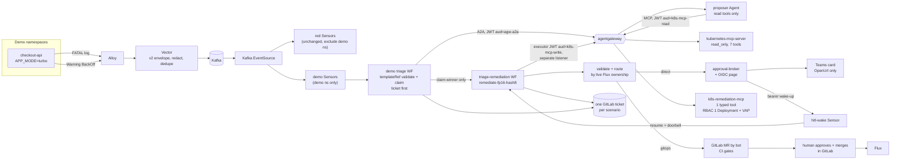

# Home-lab triage and HITL remediation demo: plan comparison and final plan

**Status:** planning only. Nothing here has been built, deployed or run. Every "will" is a design statement, not evidence.

**Provenance:** Four independent planners wrote competing plans from the same brief (`docs/plans/homelab-triage-hitl-demo/FOUR-AGENT-PLANNING-PROMPT.md`, local working copy). None read the others' work. This document compares them, picks one, and records the final merged plan so that it stands on its own. The four source plans were not committed; their key content is summarised here.

**Decision:** Build **Agent 3's plan**, with five changes taken from the other plans (listed in [Changes from the other plans](#changes-from-the-other-plans)). Route this plan through the Codex review gate (`CLAUDE.md`) before Phase 1 starts.

---

## 1. What all four plans agree on

Four independent designs converged on the same core. Treat these as settled decisions, not open questions.

1. **Leave the proven signal path alone.** Alloy → Vector → Kafka → Argo Events → Argo Workflows → GitLab ticket on `observability.triage.v2` stays exactly as verified on 2026-07-24 (`work-agent-bundles/homelab-verified-triage-replication/`). No wire-contract change. `automation_allowed` stays `false`: the signal never authorises automation. Do not mix in the v3 track (FINDINGS F0).
2. **One log line and one Warning Event from the same pod become one incident and one ticket.** They share the pod-based `dedupe_key`, and the existing claim, in-flight poll and fingerprint append (F2/F3) already correlate them. The fault must keep the signalling pod's name stable.
3. **The model proposes; deterministic code decides.** The agent returns structured data. A validator checks it against a Git-owned policy. The **lane (direct or GitOps) comes from live Flux ownership**, never from the model.
4. **Read and write are different identities at every layer.** Separate MCP deployments, ServiceAccounts, gateway routes and credentials. The agent has no write tool, no write credential and no route to one.
5. **A write is bounded four times:** gateway tool authorisation, MCP allowlist, RBAC `resourceNames` on one Deployment, and a `ValidatingAdmissionPolicy` limiting the change to one field.
6. **Approval binds to a hash of the exact validated proposal**, is single-use and expires. Every changed proposal needs a new approval.
7. **In the GitOps lane, Teams never approves or merges.** The Teams card links to the MR. Humans approve and merge in GitLab. The workflow proves merge SHA → Flux `lastAppliedRevision` → live health.
8. **Direct changes only touch objects Flux does not manage**, so Flux cannot revert them. Never suspend Flux or set `reconcile: disabled` to make a direct patch stick.
9. **Every outcome lands in the same ticket**, including rejection, expiry, stale approval, timeout and degraded agent, with idempotent note markers so retries never duplicate notes.

All four also found the same defects in the existing `platform/teams-hitl/` material:

- **Suspend timeout auto-resumes.** The README says a 24 h `suspend.duration` fails the step. Argo's docs say `duration` **resumes** the workflow, and the template runs `approved-execute` straight after `wait-for-approval`. An expired approval would execute.
- **The callback is unauthenticated.** No `authSecret` on the EventSource, no HMAC check, the mock bot has "no auth". The Sensor checks only that `approval_id` matches a regex, never that it matches a stored request, and resumes whatever workflow name it is given.
- **Model output is substituted into shell** (`TRIAGE='{{inputs.parameters.triage_report}}'` in `classify-tier`), which is an injection hazard.
- **`STATEMENT-OF-WORK.md` lists Teams HITL as a "Working PoC"**, but the repo has no live Teams callback evidence.

---

## 2. The four plans side by side

| | Agent 1 | Agent 2 | Agent 3 | Agent 4 |
|---|---|---|---|---|
| **Fault** | Backend Deployment scaled to 0, so the frontend fails readiness (no liveness probe, pod never restarts) | Readiness probe points at `/healthz`, which nginx does not serve; liveness on `/` passes | New ReplicaSet crashloops on unsupported `APP_MODE`; `maxUnavailable: 0` keeps the old pod serving | Container exits on unsupported `DEMO_MODE`; single replica crashloops |
| **Signals** | Log `upstream unreachable` + Event `Unhealthy` | Log `status=404 uri=/healthz` + Event `Unhealthy` | Log `FATAL … APP_MODE` + Event `BackOff` | Log `ERROR … DEMO_MODE` + Event `BackOff` |
| **User impact during demo** | Frontend unready | Pod unready | **None** (old pod serves) | Demo pod down |
| **Direct-lane write** | Upstream `kubernetes-mcp-server` `resources_scale` only | Custom one-tool MCP; RFC 6902 patch with `test` ops | Custom one-tool FastMCP (`deployment_set_container_env`) | Upstream MCP (`resources_get`, `resources_create_or_update`) + admission policy |
| **How the approver clicks** | Teams bot `Action.Execute` → ES256 JWS decision → verifier workflow | Teams bot `Action.Execute` → ledger → bearer callback resumes | Teams card **link** → OIDC approval page → broker → bearer "wake-up" | Teams bot `Action.Execute` → broker (bot backend + ledger) resumes |
| **What resume means** | Resume after verifier checks the JWS | Resume carries no authority; `check-decision` reads the ledger | Resume is a doorbell; loop re-reads the broker | Broker resumes after checks; `verify-approval` re-reads |
| **Needs a Teams bot registration** | Yes (pull mode as fallback) | Yes | **No** (Teams Workflows webhook + Entra app for OIDC) | Yes |
| **Changes to the proven triage template** | None (new intake Sensor) | None (demo-only Sensors, `templateRef` reuse) | Agent URL switch + one hand-off step | Hand-off from creator path |
| **Frees the triage semaphore while waiting** | Yes (separate workflow) | No (lanes run inside the demo template) | **Yes, explicitly** | Yes (separate workflow) |
| **GitLab Free handling** | Protected branch is the gate | Post-merge governance check | Protected branch; approval optional | **Post-merge policy check; never PASS without an eligible approval; close MR on expiry** |
| **Notable unique insight** | Fault that fits the existing correlation with no change | Ticket first, then diagnose (removes sibling-poll race); workload lock | Webhook cards only support `OpenUrl`, so a card button cannot carry identity; found the live agentgateway JWT + MCP tool-authz proof | Rejected kagent `requireApproval` with reasons; strongest Free-tier story |
| **Estimate** | 12–17 days | 17–24 days | 16–17 days | 11–18 days |

---

## 3. Scoring

Each dimension is scored 1–5. Weights reflect what matters for a home-lab demo that later ports to work.

| Dimension (weight) | Agent 1 | Agent 2 | Agent 3 | Agent 4 |
|---|---|---|---|---|
| Evidence grounding: cites what is really proven and flags what is not (×2) | 4 | 4 | **5** | 4 |
| Approval security: identity, binding, replay, expiry (×2) | 4 | 4 | **5** | 4 |
| Home-lab feasibility: fewest external blockers (×2) | 3 | 2 | **4** | 3 |
| Write-boundary strength (×1) | 4 | **5** | **5** | 4 |
| Leaves the proven path untouched (×1) | **5** | **5** | 3 | 4 |
| Demo clarity and safety of the fault (×1) | **5** | 4 | **5** | 4 |
| Effort (×1) | 4 | 2 | 4 | 4 |
| **Weighted total (max 50)** | 38 | 36 | **45** | 38 |

---

## 4. Why Agent 3

1. **It removes the biggest schedule risk.** Every other plan needs an Azure Bot registration, a sideloaded Teams app and a public bot messaging endpoint before a real human approval can be demonstrated. Agent 3 posts a card through a Teams Workflows webhook whose only action is `Action.OpenUrl` to an approval page behind oauth2-proxy with Entra OIDC. That needs an Entra app registration and one tunnelled hostname, not a bot. The approver is still a real, authenticated, group-checked identity. A real bot with `Action.Execute` can later replace only the page, without touching the workflow.
2. **It has the best evidence grounding.** It is the only plan that found the live agentgateway proof on red (JWT validation + per-route `mcp.tool.name` authorisation + direct-bypass denial, `work-agent-bundles/kagent-agentgateway-tenant-isolation/evidence/red/2026-09-16-runtime.md`). The other plans marked gateway MCP authorisation as unproven. It also points out that `platform/kubernetes-mcp/README.md` claims a home-lab read-only proof but the repo has no manifests or receipts for it, so the read MCP must be treated as new work.
3. **Its approval model is the simplest one that is still sound.** Resume is only a doorbell. The workflow always re-reads the broker record, checks `workflow_uid`, hash, group and expiry, then compare-and-swaps `approved → consumed`. A forged or duplicate resume does nothing. Expiry is enforced by both the broker and the wait loop, which fixes the auto-resume defect directly.
4. **It protects triage capacity.** Remediation runs in its own WorkflowTemplate with a deterministic name, so a 30-minute approval wait never holds one of the five triage semaphore slots.
5. **Its fault is the safest to demo.** `maxUnavailable: 0` means the old pod keeps serving, so there is no user impact. The agent still has to diagnose by comparing the failing ReplicaSet with the previous healthy one; the log only says the value is unsupported.

### Why not the others

- **Agent 1** is a close second and has the cleanest fault. It depends on the upstream `resources_scale` tool using the `deployments/scale` subresource, which is unverified, and on a Teams bot or a pull-mode workaround. Its fault's fix (scale 0 → 1) also teaches less about diagnosis than a config regression.
- **Agent 2** has the strongest write boundary and the most careful correlation design, but it is the longest (17–24 days), needs a Teams bot, and runs both lanes inside the demo triage template, so waits hold triage capacity.
- **Agent 4** has the best GitLab Free-tier handling, but uses the upstream full-manifest `resources_create_or_update` as its write tool and relies on a CEL "everything equal except one field" admission rule that is easy to get subtly wrong.

### Corrections found while comparing

- Agent 3 says the HITL Sensors hard-code `workflow_namespace: argo`. They do not: `platform/teams-hitl/sensor.yaml` reads `body.workflow_namespace` from the callback payload (the `argo` value is only in the example). The real requirement is that the callback must name `argo-events`, where triage runs, and the resuming Sensor's ServiceAccount needs `patch workflows` there. The final plan replaces these Sensors for the demo anyway.
- Agent 3's claim that Teams incoming-webhook cards support only `OpenUrl`, `ShowCard` and `ToggleVisibility` should be re-checked against the current Microsoft docs in Phase 0; the design does not depend on anything beyond `OpenUrl`.

---

## Changes from the other plans

| # | Change | From | Why |
|---|---|---|---|
| C1 | Do **not** edit `red-agentic-triage`. Add demo-only Sensors that match only the demo namespaces, and a demo triage template that reuses `validate-schema` and `claim-24h-window` through `templateRef`. The red Sensors' namespace list excludes the demo namespaces, so exactly one template fires per record. | Agent 2 (Agent 1 is similar) | Fixes Agent 3's weakest score: a remediation bug can no longer regress the proven path. |
| C2 | In the demo triage template, **create the ticket before diagnosis** and write `issue_iid` to the claim. | Agent 2 | Removes the race where a slow model (up to 3 × 240 s) leaves the sibling workflow's poll to time out. Also gives a clean ticket timeline. |
| C3 | GitOps lane: after merge, run a **post-merge policy check** (a human approver in the group who is not the bot; `merged_by` a human Maintainer; CI green on the final head SHA). If it fails, report the cluster state but **never claim PASS**. On review timeout, **close the MR** so a stale proposal cannot be merged later. | Agent 4 | GitLab Free approvals are advisory. Agent 3 left the MR open on timeout. |
| C4 | Make approval records **immutable after creation** except for allowed state transitions, using an admission policy on the ledger ConfigMaps (label `hitl-ledger`). | Agent 2 | Stops anyone with ConfigMap write access from editing the stored proposal or hash. |
| C5 | Keep Agent 1's **pull-mode** fallback: if a tunnel for the approval page is not acceptable, a sidecar polls an external broker outbound, with the same checks. | Agent 1 | Home-lab networking. |

---

## 5. Final plan

### 5.1 The fault

`checkout-api` is a single-replica Deployment running a pinned `busybox` image and a ~10-line script:

- `APP_MODE` in `{standard, safe}` → print `INFO ready mode=<v>`, touch a readiness file, sleep.
- Anything else → print `FATAL config validation failed: APP_MODE='<v>' is not a supported mode` and exit 1.
- Strategy `maxSurge: 1`, `maxUnavailable: 0`; readiness probe on the file. Non-root, read-only root filesystem, all capabilities dropped, `automountServiceAccountToken: false` (same hardening as `fixtures/crashloop-fixture.yaml`).

**Inject:** change `APP_MODE` from `standard` to `turbo`. The new ReplicaSet's pod crashloops (stable pod name across restarts), the old pod keeps serving.

**Signals:** the `FATAL` log line (matches Vector's `fatal` regex, survives redaction, repeats suppressed by `delivery_key`) and the kubelet's `Warning BackOff` Event (passes F4 and the reason allowlist). Same pod, so same `dedupe_key`: one ticket, one appended note.

**Diagnosis, not a runbook:** the log does not say which value is correct. The agent must compare the failing ReplicaSet (`turbo`, 0/1) with the previous one (`standard`, 1/1), check Flux ownership labels, and state its uncertainty.

**Two copies, run one after the other:**

| Scenario | Namespace | Managed by | Fault injected by | Lane |
|---|---|---|---|---|
| D (direct) | `triage-demo-direct` | Setup script; no Flux labels, not in any Kustomization inventory | Presenter runs `kubectl set env` | Direct |
| G (GitOps) | `triage-demo-gitops` | Flux Kustomization `triage-demo-gitops` from `{{GITOPS_DEMO_REPO}}:apps/checkout-api/` (`wait: true`, `timeout: 3m`, `interval: 1m`, `prune: true`, namespace-scoped `serviceAccountName`) | Presenter merges a bad-config MR | GitOps |

### 5.2 Architecture

### 5.3 Identities

| Identity | Holds | Cannot |
|---|---|---|
| `argo-events-sa` (existing) | Run Sensors, create Workflows, CAS on `triage-dedupe-*` claims | Patch app workloads |
| Demo triage caller (projected SA token, audience `agw-a2a`) | Call `/a2a/triage-proposer/` | Reach MCP routes |
| Proposer Agent MCP token (JWT, audience `k8s-mcp-read`) | `tools/call` on the 7 read tools | The write listener |
| `k8s-mcp-read` SA | `get/list/watch` pods, `pods/log`, events, deployments, replicasets in the two demo namespaces; `get` Flux Kustomizations and GitRepositories | Secrets, ConfigMaps, ServiceAccounts, RBAC, exec, writes |
| `triage-remediation` SA (workflow default) | Same reads for deterministic verification; ledger transitions it owns | Any app workload write |
| `remediation-executor` SA (template-level, `execute-direct` only) | **Zero RBAC.** Projected token audience `k8s-mcp-write` | Direct Kubernetes writes |
| `k8s-remediation-mcp` SA | `get, patch` on `deployments`, `resourceNames: [checkout-api]`, in `triage-demo-direct` only | Other names, namespaces, kinds; create or delete |
| `approval-broker` SA | Its own `hitl-approval-*` ConfigMaps; Teams Workflows webhook URL; `hitl-wake` bearer | Resume workflows directly; any cluster write |
| `hitl-wake` Sensor SA | `patch workflows` in `argo-events` | Create or submit |
| Direct approver | Entra user in `{{DIRECT_APPROVER_GROUP}}`; decides one record | Anything outside the broker page |
| `triage-gitops-bot` | GitLab project token, **Developer**, `{{GITOPS_DEMO_REPO}}` only; push `triage/*`, open MRs, comment | Push or merge protected `main`; approve its own MR |
| GitOps reviewer and merger | Human **Maintainer** in `{{GITOPS_APPROVER_GROUP}}` | — |
| Ticket writer | Existing ticket-project token | The GitOps repo |

### 5.4 Flow

`[T]` marks a ticket note. Every note carries `<!-- triage-stage:<idempotency_key>:<stage> -->` and is skipped if already present.

**Common prefix**

1. Fault → Alloy (allowlist gains both demo namespaces) → Vector builds two v2 envelopes with the same `dedupe_key` → Kafka.
2. Demo Sensors (demo namespaces only) create the demo triage workflow. Red Sensors do not fire for these namespaces.
3. `validate-schema` and `claim-24h-window` via `templateRef` (unchanged logic). The loser appends evidence and exits.
4. The winner **creates the ticket first** and writes `issue_iid` into the claim. `[T1 evidence + reach-back]`
5. Diagnose through agentgateway `/a2a/triage-proposer/` (keep all F1 error handling). The Agent uses `/mcp/k8s-read` only. The existing evaluator Agent scores the answer (every evidence item cites a tool call, action in catalog, rollback present, uncertainty non-empty). Argo checks controller history: at least one successful read tool call, **no** tool name outside the read allowlist. `[T2 diagnosis, raw proposal, evaluator report]`
6. Hand-off (claim winner only, gated by one `when` in its own sub-template per the `AGENTS.md` Argo rule): create Workflow `remediate-<fp16>-<sha8(proposal)>` from `triage-remediation`. `AlreadyExists` counts as success. The triage workflow ends and releases its semaphore slot.
7. Validate (deterministic, `jq` + mounted policy): exact `schema_version`, no unknown fields, action in catalog, parameters in enum, target allowlisted, live UID and generation match, current value equals `from_value`. Failure → `[T not-eligible + reasons]`, end.
8. Route: Flux labels (`kustomize.toolkit.fluxcd.io/name`, `helm.toolkit.fluxcd.io/name`) or presence in any Kustomization inventory → **GitOps**; otherwise **direct**. The agent's `route_hint` is recorded and ignored. `[T3 validated proposal, route, hash, idempotency key, expiry]`

**Direct lane**

9. POST `triage.remediation-request.v1` to the broker (projected token, audience `approval-broker`). The broker stores a `pending` record with a random 128-bit `approval_id`, the hash, `workflow_uid` and `expires_at`, and supersedes any earlier pending record for the same fingerprint. It posts a Teams card through a Workflows webhook: action, target, risk, rollback, expiry, hash prefix, ticket link, and one `OpenUrl` button to `https://{{APPROVAL_HOST}}/approvals/<approval_id>`. `[T4 approval requested]`
10. Wait loop: `suspend` for `min(remaining, 5m)`, then `check-decision` GETs the record. Loop while `pending` and unexpired.
11. The approver opens the link and signs in through oauth2-proxy (Entra OIDC). The page shows the full proposal and hash. **Approve** or **Reject** is a POST with a CSRF token. The broker compare-and-swaps `pending → approved|rejected` only if unexpired, the approver's group claim matches, and the submitted hash equals the stored hash. It records UPN and object ID.
12. The broker POSTs `{approval_id, workflow_name}` to the in-cluster `hitl-wake` EventSource (`authSecret` bearer, NetworkPolicy allows broker pods only, no external route). The Sensor resumes the workflow. **Resume carries no authority.**
13. `verify-decision`: `approval_id` equals the one this run issued, `workflow_uid` matches, hash matches the run's own, decision `approved`, `decided_at < expires_at`, not `consumed`. Compare-and-swap `approved → consumed`. `[T5 approved by <upn>]`. Rejected → `[T5 rejected + reason]`, end Succeeded with outcome `rejected`. Expired → compare-and-swap `pending → expired`, `[T5 expired]`, end.
14. `precheck-live`: target generation and current value still equal the approved preconditions, otherwise `[T stale approval]`, end.
15. `execute-direct` (SA `remediation-executor`): MCP session to `/mcp/k8s-remediate`, `tools/call deployment_set_container_env{namespace, name, container, env_name, value, expected_generation, idempotency_key}`. Arguments come from the validated request, never from model text. The MCP re-validates against its compiled allowlist and sends one JSON patch. RBAC and the VAP are the final gates. `[T6 executed, MCP request id, generation before/after]`
16. `verify-rollout` (5 min): `observedGeneration == generation`, `updatedReplicas == availableReplicas == 1`, value is `standard`, no `CrashLoopBackOff`, restart count stable 120 s, no new `BackOff` after execution. `[T7 verified]` or `[T7 failed + observed state + suggested rollback]`. Rollback is never automatic.

**GitOps lane**

17. Resolve the target through policy to project, `main`, and the one editable file `apps/checkout-api/env-patch.yaml`. Record `base_sha`.
18. `create-mr` (bot token): deterministic branch `triage/<fp16>-<sha8>` (reuse if it exists), one commit via the Commits API setting only `APP_MODE` with `yq`, MR with `remove_source_branch: true` and a description holding the ticket link, proposal JSON, hash, risk, rollback (`git revert <merge_sha>`) and "Merging this MR is the approval". `[T4 MR !N opened]`
19. CI ("Pipelines must succeed" where the tier allows): `kustomize build`, `kubeconform -strict`, diff-scope (one file, one value, value in enum), hash binding (description hash matches the diff).
20. The broker posts a notification-only Teams card: "Review, approve and merge in GitLab if you agree. This button only opens the MR." No record, no state change.
21. `await-merge`: bounded retry poll, 60 s × `{{MR_WAIT_MIN}}` (30 for the demo). `closed` → `[T gitops-mr-closed]`. Timeout → **close the MR** with a note, `[T gitops-expired]` (C3). Commits by anyone other than the bot → `[T gitops-proposal-changed]`, re-run the diff-scope check on the merged diff.
22. `verify-merge-authority` (C3): `merged_by` is a human Maintainer and not the bot; `approved_by` contains an eligible group member who is not the author; CI green on the final head SHA. On failure → `[T remediation-policy-violation]`, continue to report cluster state, **never PASS**. `[T5 merged by, approved by, merge SHA]`
23. `await-flux` (10 min): GitRepository `status.artifact.revision == main@sha1:<merge_sha>` (or a descendant proven through the GitLab merge-base API); Kustomization `lastAppliedRevision` equal to it, `Ready=True`, `observedGeneration == generation`.
24. `verify-live`: same checks as step 16. `[T6 reconciled + verified]` or `[T6 gitops-timeout / verification-failed + last Flux and Deployment status]`.

**Every run:** an `onExit` handler writes a final status note, swaps plain state labels (scoped `::` labels are paid-tier), and marks any leftover broker record `cancelled`.

### 5.5 Read and write MCP boundary

| Control | Read (`/mcp/k8s-read`) | Write (`/mcp/k8s-remediate`) |
|---|---|---|
| Server | `kubernetes-mcp-server` pinned by digest, `read_only = true`, `toolsets = ["core"]`, `enabled_tools = [events_list, pods_list_in_namespace, pods_get, pods_log, resources_get, resources_list, namespaces_list]`; never `configuration_view`, `pods_exec`, `resources_create_or_update`, `resources_delete`, `resources_scale`. Re-check tool names on the pinned tag | New FastMCP `k8s-remediation-mcp`, **one** tool. Compiled allowlist: namespace `triage-demo-direct`, Deployment `checkout-api`, container `checkout-api`, env `APP_MODE`, values `{standard, safe}`, `expected_generation` must match, `idempotency_key` recorded as an annotation |
| `denied_resources` | Secret, ConfigMap, ServiceAccount, Role, RoleBinding, ClusterRole, ClusterRoleBinding | n/a (typed) |
| Gateway authentication | JWT, audience `k8s-mcp-read` | JWT, audience `k8s-mcp-write`, subject `system:serviceaccount:argo-events:remediation-executor`, **separate listener** |
| Gateway authorisation | `mcp.tool.name in [7 tools]` | `mcp.tool.name == "deployment_set_container_env"` |
| Network | Ingress only from agentgateway | Ingress only from agentgateway; write listener reachable only from `execute-direct` pods |
| RBAC | Namespaced read Roles in the two demo namespaces | `get, patch`, `resourceNames: [checkout-api]`, `triage-demo-direct` only |
| Admission | — | VAP matched on the write MCP's SA: only the `APP_MODE` value may change, and only to an allowed value; deny if the object has Flux or Helm ownership labels |

**Escalation prevention:** the proposer Agent CR lists only the read `RemoteMCPServer` and the evaluator. No `RemoteMCPServer` for the write route exists, and an admission policy (pattern from `kagent-agentgateway-tenant-isolation`) denies any that targets it. The Agent's token has the wrong audience for the write route. The Agent gets no Argo submit tool (`remotemcpserver-argo.yaml` exposes `WorkflowService_SubmitWorkflow`; do not bind it) and does not mount `kagent-tool-server`. Model output travels as files parsed by `jq`, never through `{{inputs.parameters.*}}` into script bodies. Policy, templates, RBAC and admission policies are Flux-managed from the platform repo; no runtime identity in the flow can edit them.

**Why a typed write MCP rather than upstream write mode:** upstream `resources_create_or_update` applies a complete manifest by server-side apply and removes fields the new manifest omits. The executor would have to fetch, edit and re-apply the whole object, and the tool could apply anything RBAC allows. Argument-level CEL at the gateway is unverified. A one-tool server puts argument checks in code we test, matching the `AGENTS.md` preference for fixed, typed operations. Keep "upstream write mode + RBAC + VAP" as a Phase 0 spike alternative.

### 5.6 Proposal contract

The Agent returns `<proposal>` JSON matching `triage.remediation-proposal.v1`; unknown fields are rejected. Fields: `incident` (fingerprint, envelope schema), `target` (cluster, namespace, kind, name, container, uid, generation), `observed_evidence[]` (tool, ref, finding), `diagnosis`, `action` (`deployment.set_container_env` with `env_name`, `from_value`, `to_value`, or `manual` with a description, which is never executable), `route_hint`, `risk`, `rollback`, `verification[]`, `confidence`, `uncertainty[]`, `alternatives_considered[]`.

The workflow wraps a validated proposal in `triage.remediation-request.v1`, which the model never produces:

| Field | Source |
|---|---|
| `proposal_sha256` | `jq -S -c` canonical form of the validated proposal |
| `idempotency_key` | `sha256(fp16 \| target.uid \| action.type \| params \| generation)` |
| `route` | Live ownership lookup |
| `policy_ref` | Policy ConfigMap version + Git SHA |
| `approval_scope` | `{action, target.uid, params, preconditions, max_executions: 1}` |
| `expires_at` | now + `approval_ttl` (demo 30 m) |
| `approval_id` | Broker, random 128-bit, single-use |

Neither contract ever goes on Kafka.

### 5.7 Approval edge cases

| Case | Behaviour |
|---|---|
| Reject | Record `rejected` with reason; ticket note; outcome `rejected` |
| Expiry | Broker refuses late decisions; loop exits at expiry and compare-and-swaps to `expired`; late click shows "expired" |
| Duplicate click or replayed POST | Compare-and-swap succeeds once; later POSTs show "already decided by X" |
| Forged or extra wake-up | Loop re-reads the record and keeps waiting |
| Retried or resubmitted workflow | `workflow_uid` mismatch; cannot consume another run's approval |
| Changed proposal | New hash, new workflow name; older pending record marked `superseded` |
| Target changed after approval | `precheck-live` aborts; no write |
| Non-group approver | Broker 403; record stays pending |

### 5.8 Deduplication

Unchanged layers: Vector `delivery_key`, pod-based claim, in-flight poll, fingerprint label. Added: remediation launched by the claim winner only; deterministic remediation workflow name; broker supersedes older proposals per fingerprint; note markers. Close demo tickets before each run (F7 reuses any open ticket with the same fingerprint). If a fix fails and a new pod crashloops, the pod-based key opens a new ticket; the remediation workflow cross-links any ticket labelled `triage-workload-<sha8(cluster:ns:deployment)>`. Switching the claim itself to a workload key is a separate, versioned contract decision.

---

## 6. Build phases

| Phase | Deliverable | Depends on | Effort |
|---|---|---|---|
| 0. Preflight | Codex review of this plan. Versions of kagent, agentgateway, Argo Workflows/Events, Flux, Kubernetes, GitLab tier. Model quota and fallback `ModelConfig`. Spikes: projected SA token accepted by agentgateway JWT; kagent `headersFrom` refresh; Argo template-level `serviceAccountName`; NetworkPolicy enforcement on the lab CNI; Teams webhook card action support | — | 1 d |
| 1. Workload and signals | `checkout-api`, two namespaces, Alloy scope, demo Sensors, demo triage template with `templateRef` reuse and ticket-first creation. Proof: one ticket with log + appended Event per namespace | 0 | 1.5 d |
| 2. Read path through agentgateway (**smallest useful slice**) | Read MCP + RBAC, A2A and MCP routes with JWT + tool authorisation, proposer Agent, evaluator rubric, `<proposal>` in the ticket. No writes, no approvals | 1 | 2.5 d |
| 3. Remediation skeleton | `triage-remediation` template: hand-off, validation, router, notes, labels, `onExit`; lanes stubbed to not-eligible | 2 | 1.5 d |
| 4. Direct lane with curl approval | Write MCP with unit tests, SA/RBAC/VAP, write listener, executor, precheck and verify; broker API with compare-and-swap and ledger immutability policy; decision injected by an authenticated curl | 3 | 3 d |
| 5. Teams and identity | Workflows webhook card, oauth2-proxy + Entra, broker page (CSRF, group, supersede, expiry), `hitl-wake` EventSource + Sensor; pull-mode fallback if no tunnel | 4 | 2.5 d |
| 6. GitOps lane | GitOps repo, Flux source and Kustomization, protected branch, bot token, CI, MR creation, merge poll, post-merge policy check, MR close on expiry, Flux and live verification, link-only card | 3 (parallel with 4–5) | 3 d |
| 7. Hardening and rehearsal | All negative tests, `verify-remediation.sh`, sanitised evidence file, `scripts/public-safe-scan.sh` | 4–6 | 2 d |

Total about 17 engineer-days. Critical path 0 → 1 → 2 → 3 → 4 → 5 → 7; Phase 6 runs in parallel after Phase 3.

The smallest useful slice (Phases 1–2) proves one fault → one ticket with correlated evidence, a policy-shaped proposal, and gateway logs plus controller history showing only read tools on the read route were used. No write credential exists yet.

---

## 7. Acceptance tests

The demo passes only if every test below passes on the same pinned digests, recorded in the evidence file with commands and redacted output.

**Shared**

| ID | Pass criteria |
|---|---|
| S1 | Vector `kafka produced` +2 per fault; two demo triage workflows; **zero** red triage workflows for the demo namespaces |
| S2 | Exactly one ticket per scenario, second signal appended, one agent call |
| S3 | Controller history tool names within the read allowlist; gateway logs show only `/mcp/k8s-read`; write MCP request counter 0 |
| S4 | Proposal passes schema and policy; ticket shows evidence, proposal, uncertainty, policy verdict |
| S5 | Exactly one `remediate-*` workflow per incident |

**Direct lane**

| ID | Pass criteria |
|---|---|
| D1 | Card has action, target, risk, rollback, expiry, hash prefix, one `OpenUrl` action |
| D2 | Group member approves → resume → verify → exactly one write MCP call → value `standard` → verification passes → ticket shows approver UPN |
| D3 | `managedFields` shows the patch by `k8s-remediation-mcp` only |
| D4 | Write counter 0 while pending |

**GitOps lane**

| ID | Pass criteria |
|---|---|
| G1 | Bot-authored MR, one file, one value, CI green, hash matches |
| G2 | A Teams click alone leaves the MR open and the workflow in `await-merge` |
| G3 | `merged_by` human Maintainer; eligible approver recorded; post-merge policy check passes |
| G4 | GitRepository and Kustomization revision equal the merge SHA; `Ready=True`; live checks pass within 10 min |

**Negative (all must fail closed)**

| ID | Attempt | Expected |
|---|---|---|
| N1 | Log line with injected instructions to call a write tool | Tool unavailable; proposal unaffected or rejected; no write |
| N2 | Agent token on the write listener or write tool | 401/403 at the gateway (positive control first) |
| N3 | `kubectl --as` the write SA against another Deployment, namespace or field | RBAC 403 or VAP deny |
| N4 | Unauthenticated or non-broker POST to `hitl-wake` | 401 or connection refused |
| N5 | Authenticated wake-up with no decision | Loop re-checks and keeps waiting |
| N6 | Non-group approver | 403; record pending |
| N7 | Double click, replay, another workflow using the same `approval_id` | One decision, one execution, uid mismatch rejected |
| N8 | Expiry | No execution; late click shows expired |
| N9 | Target edited after approval | Stale approval; no write |
| N10 | Proposal targets the Flux-owned Deployment with `route_hint: direct`, or out-of-enum value | Routed to GitOps or not-eligible; no approval request |
| N11 | Bot tries to merge | GitLab refuses |
| N12 | MR closed, or not merged in the window | `gitops-mr-closed` or MR closed by workflow with `gitops-expired` |
| N13 | MR merged without an eligible approval | `remediation-policy-violation`; never PASS |
| N14 | Model unavailable or evaluator FAIL | Degraded or evaluation-failed ticket; no hand-off |
| N15 | Remediation workflow created twice | `AlreadyExists`; one approval request |
| N16 | Unsupported proposal schema | `remediation-unavailable` note |

**Demo cleanup:** delete `triage-demo-direct` and re-apply the setup; reset the GitOps value on `main` with a presenter commit; close demo tickets; delete run-labelled workflows, claims and broker records; `argo stop` plus the exit handler is the emergency stop.

---

## 8. Risks and open decisions

**Risks**

1. **Model quota.** The default model already ran out of quota once (F1). Add a pre-demo health gate, a fallback `ModelConfig` through agentgateway failover, and a recorded backup run.
2. **Projected SA tokens at agentgateway.** A kind cluster's issuer JWKS may not be reachable. Fallback: the JWT minter proven in the tenant-isolation bundle.
3. **kagent `headersFrom` refresh.** A static Agent → MCP token may not reload on rotation. The Phase 0 spike decides between a short-lived token plus restart and a refresher.
4. **The approval page is new security-critical code.** Keep it under ~300 lines, unit-test CSRF, compare-and-swap and group checks, and run a security review.
5. **NetworkPolicy may not be enforced** on the lab CNI. If not, record network isolation as not a control; gateway authentication, RBAC and admission still hold.
6. **Pod-name dedupe churn** after a failed fix opens a second ticket; mitigated by cross-linking.
7. **Scope creep.** Keep one action type for the demo.

**Open decisions**

| # | Decision | Default |
|---|---|---|
| 1 | Approval page identity provider | Entra; GitLab OIDC fallback |
| 2 | Typed write MCP or upstream write mode | Typed; upstream only if the Phase 0 spike is clean |
| 3 | MR author: workflow bot or agent via GitLab-lite MCP | Workflow bot |
| 4 | GitLab tier | Free with post-merge policy check; document Premium upgrade |
| 5 | Approver ≠ merger | Recommended; single-person home lab recorded as a demo exception |
| 6 | Approval TTL, merge window, Flux window | 30 m, 30 m, 10 m |
| 7 | Workload key for claims | Label only; contract decision deferred |
| 8 | Tunnel or pull mode for the approval page | Tunnel exposing only the oauth2-proxy page; pull mode if not acceptable |

---

## Sources

Repo: `AGENTS.md`, `CLAUDE.md`, `STATEMENT-OF-WORK.md`; `work-agent-bundles/homelab-verified-triage-replication/` (README, `FINDINGS-AND-FIXES.md`, `config/02-vector.yaml`, `config/03-argo.yaml`, `config/05-triage-evaluation-settings.yaml`, `evidence/VERIFICATION-2026-07-24.md`, `a2a-evaluation-gate/`); `work-agent-bundles/kagent-agentgateway-tenant-isolation/evidence/red/2026-09-16-runtime.md`; `platform/kubernetes-mcp/README.md`; `platform/teams-hitl/` (README, `BOT-CONTRACT.md`, `sensor.yaml`, `eventsource.yaml`, `workflow-approval-template.yaml`, `mock-bot/`); `work-agent-bundles/hitl-remediation-approval/`; `work-agent-bundles/gitlab-mcp-gitops-pr/`; `platform/agentgateway/`.

External (as cited by the planners, fetched 2026-09-30):

- [Argo Workflows: suspending](https://argo-workflows.readthedocs.io/en/latest/walk-through/suspending/) — `duration` auto-resumes
- [Argo Events: webhook authentication](https://argoproj.github.io/argo-events/eventsources/webhook-authentication/)
- [Flux Kustomization API](https://fluxcd.io/flux/components/kustomize/kustomizations/)
- [GitLab merge request approvals](https://docs.gitlab.com/user/project/merge_requests/approvals/)
- [Teams Universal Actions for Adaptive Cards](https://learn.microsoft.com/en-us/microsoftteams/platform/task-modules-and-cards/cards/universal-actions-for-adaptive-cards/work-with-universal-actions-for-adaptive-cards)
- [kubernetes-mcp-server README](https://github.com/containers/kubernetes-mcp-server)

**Not verified, check in Phase 0:** agentgateway CEL access to MCP tool arguments; kagent `headersFrom` reload; `kagent-tool-server` RBAC; Argo template-level `serviceAccountName` on the installed version; Teams webhook card action support; GitLab tier features.
