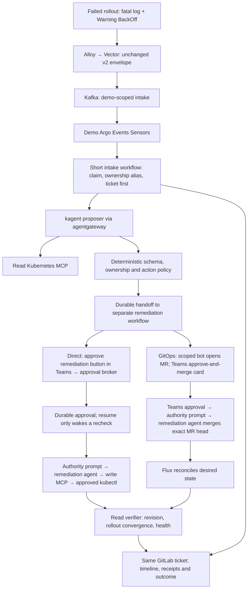

# Final plan: diagnose a failed rollout, approve its repair, prove recovery

Status: consolidated planning decision, ready for Phase 0. Implementation and live demo acceptance remain to be done. No cluster, Teams or GitLab writes were performed to create this plan. Date: 2026-09-30. Updated to the user-confirmed Teams approval and remediation-agent execution model.

The demo follows one configuration regression through the entire system. A new application pod emits a fatal log and Kubernetes emits a Warning BackOff Event. Alloy and Vector carry both to Kafka; Argo turns them into one incident ticket. A read-only kagent agent investigates through agentgateway and a read Kubernetes MCP, compares the failing rollout with the previous healthy ReplicaSet, and proposes a precise configuration repair without using a runbook. We demonstrate the same fault twice: an unmanaged fixture repaired through an approved write Kubernetes MCP, then a Flux-managed fixture repaired through an agent-merged GitLab MR authorized by the Teams button. Each trial produces one ticket containing its two signals, reasoning, approval, action and fresh verification evidence.

The companion `DEMO-WALKTHROUGH.html` explains the two paths interactively. Its states are illustrations, not runtime evidence or approval controls.

## Decisions taken from the reviews

The Claude and Cursor reviews rank different independent planner snapshots. Their agent numbers are not a common scorecard. This final plan selects concrete mechanisms rather than inheriting a ranking.

| Decision | Final choice | Contribution and reason |
|---|---|---|
| Failure scenario | Rolling configuration regression; old healthy replica continues serving | Cursor's previous-ReplicaSet comparison requires evidence gathering and confines the impact |
| Teams approval | An actionable Microsoft Teams card is the single human gate | User-confirmed requirement supersedes the earlier approval-page recommendation |
| Diagnostic agent | New demo proposer; read MCP only; existing triage agent prompt unchanged | Claude's separate planner and Cursor's isolated intake avoid changing diagnosis for ordinary incidents |
| Execution | Argo invokes a write-capable remediation kagent with an explicit authority prompt; approved kubectl commands run through the write MCP | User-confirmed agent execution, with proposal-bound enforcement at the tool |
| Workflow isolation | Intake ends after durable handoff; remediation waits in its own workflow | Cursor's capacity finding prevents human waits from occupying the five triage slots |
| Field and identity limits | Separate routes/identities, RBAC on one named Deployment, fail-closed field admission, fixed executor-template admission | Claude's admission additions plus run-02 escalation checks close the service-account substitution gap |
| Approval authority | Durable proposal-bound decision, independently checked at the point of effect | All reviews agree resume is only a wake-up; our plans add early-callback and lost-response recovery |
| GitOps completion | Teams approval authorizes the remediation agent to merge the exact MR head; Flux then applies it | No subsequent human PR review; retain revision, rollout and health proof |
| Review timeout | Close a still-open demo MR under the pre-authorized lifecycle scope; keep the incident visible | Claude/Cursor recommendation, with a merge-race/late-merge observation rule added below |
| Pod churn | Keep v2 wire fields; demo-only ownership alias and episode record, no global producer rekey | Run-02 plans address the duplicate-ticket gap noted in the Cursor review |
| Model on write path | Separate remediation agent receives explicit scoped authority after Teams approval | Tool enforcement constrains the agent to the approved commands or MR; prompt wording alone is not the access control |

## What the audience will see

| Trial | Fault and diagnosis | Human action | Repair and proof |
|---|---|---|---|
| Direct | New pod fails on `APP_MODE=turbo`; previous healthy ReplicaSet used `standard` | Click **Approve remediation** in Microsoft Teams after reading the proposed commands | Argo sends an authority prompt to the remediation agent; it runs the approved `kubectl` commands through the write Kubernetes MCP; rollout and health proof reach the ticket |
| GitOps | Same regression in a separately Flux-managed fixture | Click **Approve and merge PR** in Microsoft Teams after reading the diff and exact MR head | Argo authorizes the remediation agent to merge that MR automatically; Flux applies the change; revision, rollout and health proof reach the ticket |

The human-in-the-loop request goes to Microsoft Teams. The human's button click in Teams is the final human approval. There is no separate approval page, no subsequent human review in GitLab and no manual merge step. The card includes the precise commands or repository diff, target, risk, evidence, expiry and incident/MR links before the click. Links are optional inspection aids; clicking the approval action records authority and releases the agent. Reject or expiry releases no write authority.

These are two separate trials. If a future proposal combines commands and a merge, the card must explicitly include both effects before a single click can authorize both. The agent may not enlarge the approved scope.

## The fixture and its safety boundary

Use two namespaces, `triage-demo-direct` and `triage-demo-gitops`, with one `checkout-api` Deployment in each. They run the same small application and are demonstrated sequentially. The direct fixture is operator-owned and outside Flux/Helm/other controller inventory; the GitOps fixture is owned continuously by a dedicated namespace-scoped Flux Kustomization. Unknown ownership is a manual-review outcome, never proof that direct repair is safe.

At baseline the application accepts `APP_MODE=standard` and serves a small HTTP health endpoint on an unprivileged port. Inject `turbo`: the new pod logs `FATAL configuration validation failed: unsupported APP_MODE` and exits nonzero. The log does not disclose the expected answer. The agent reads the failing pod, its owning ReplicaSet/Deployment and the previous healthy ReplicaSet to find the configuration difference and consider alternatives. Do not attach runbook lookup or a symptom-to-action recipe to this proposer.

Use `maxSurge: 1`, `maxUnavailable: 0`, one desired replica and an actual readiness check. The previous healthy replica remains available while the new pod crashloops. Therefore the failure being remediated is a stuck rollout, not a complete service outage. Merely showing a healthy HTTP response from that old replica does not prove repair.

Pin the fixture image by digest, set small resource limits, run non-root, drop capabilities, use a read-only root filesystem and disable service-account token mounting. If the fixture writes a readiness file or serves generated content, give it a bounded writable `emptyDir`; a read-only root filesystem without that mount would introduce a second unintended fault. Wait briefly before the fatal exit so collection can capture the log. Confirm the actual Event type/reason and collected fields during Phase 1.

Healthy setup, fault injection, ticket reporting, sandbox MR preparation and cleanup are described in an operator-approved demo session scope. That scope does not approve a cluster repair or give the GitLab bot merge authority before the Teams decision. An approved inverse that restores `turbo` would reintroduce the fault; it is not an automatic recovery strategy. If verification fails, preserve the available healthy replica, record the observations and ask for a fresh decision on a known-healthy reset or other rollback. No automatic rollback.

## Architecture and component ownership



Do not edit the existing triage agent's instructions or make the unchecked `platform/teams-hitl` snippets authoritative. Use demo-specific Sensors and a demo intake WorkflowTemplate, reusing canonical v2 validation and claim behavior where a checked template interface allows it. Add only the required demo namespaces to Alloy and Vector collection. Existing ordinary Sensors must exclude them; demo Sensors must include only them. Verify mutually exclusive routing before introducing the fault. If a new EventSource is needed, give it an independent consumer group so it cannot steal records from the current path.

The canonical settings currently call the kagent controller directly and require `kagent-tool-server`; the new proposer must explicitly prove gateway-mediated A2A and Kubernetes MCP calls. Historical gateway support is better established than the older README suggests: the September 16 tenant-isolation receipt documents a dedicated agentgateway v1.5.0 canary with JWT, tool authorization and direct-bypass denial. It is historical evidence for that canary, not proof of this demo's selected routes or the current default controller.

## Execution and trust boundaries

| Principal | Allowed capability | Boundary |
|---|---|---|
| Demo intake/coordinator | Validate evidence, claim incident, record ticket, invoke the proposer, hand off a fixed remediation template | No target mutation credentials or arbitrary executor pod/template selection |
| Diagnostic kagent | Bounded Pods, logs, Events, Deployments and ReplicaSets through read MCP | No writes, exec, secrets, kubeconfig export, Argo submit/resume, approval writes or GitLab repository tools |
| Read Kubernetes MCP | Read-only namespace Roles and exact nonempty discovery/tool allowlist | Explicit context/GVK/namespace checks before requests; deny sensitive resources and direct bypass |
| Approval broker / Teams bot | Immutable proposals, authenticated Teams identity/group-checked decisions, delivery/wake outbox | No target API credentials; no model determines user identity or approval state |
| Remediation workflow and agent | Receive authority prompt after Teams approval; invoke approved commands or MR merge using a separate execution identity | No direct cluster credentials; no action beyond the proposal; no ability to self-approve |
| Write Kubernetes MCP | Execute the approved kubectl argv for `checkout-api` in `triage-demo-direct` only | Field admission rejects every spec change except the approved `APP_MODE` value; no create/delete/exec/scale |
| GitLab draft bot | One project, branch prefix and manifest path; open/comment/close its demo MR | No merge credential; separate approval-gated merge identity |
| GitLab merge adapter | Merge the exact approved project/MR/head through the GitLab API for the remediation agent | Approval ledger checked at effect; scoped protected-target merge permission; no direct push or settings changes |
| Human | Approve or reject the proposed commands or merge directly in Teams | One human gate; no subsequent PR review or manual merge |
| Flux | Reconcile the designated GitOps namespace from Git | Never manage the direct fixture |
| Independent verifier | Read specific Flux and workload status through the read service or a fixed read-only verifier identity; fixed health request | No remediation or arbitrary URL/exec capability |

Use separate workload identities, credentials and agentgateway routes for read and write. Protect all reachable MCP transport/discovery endpoints and authenticate the gateway-to-backend hop; network policy is an additional control only if the lab CNI actually enforces it. Gateway policy must be validated against the installed CRDs and runtime. Do not assume request arguments are available in gateway CEL; typed server-side validation and Kubernetes authorization enforce target and field limits.

A Workflow that can select a privileged service account can escape the intended gate even without a write tool. Admission must allow only approved platform identities to create a fixed executor workflow with its approved `workflowTemplateRef` and the limited proposal ID/digest parameters. Reject inline templates, service-account overrides, pod patches, injected volumes/hooks and unrelated template references. Runtime agents cannot edit templates, Agent/tool bindings, gateway policy, RoleBindings or admission policy.

Use a separate remediation **Workflow** with its own `spec.serviceAccountName`. Do not depend on template-level service-account switching, which the Cursor plan correctly listed as an unresolved version spike. The broker and tools authenticate the remediation execution identity and independently look up the proposal and approval; possessing a gateway token alone never authorizes an arbitrary action.

## Common incident flow and correlation

1. Admit two bounded v2 records; leave `automation_allowed: false`. Keep transport `delivery_key` separate from incident identity. Unknown/malformed versions have a visible quarantine path; Sensor filters must not silently consume them without an outcome.
2. Resolve the signal pod to its real controller owner chain before writing a demo issue. Retain pod-name/UID aliases in a demo episode record keyed by trusted cluster, namespace and Deployment UID. Use one CAS claim/lease and one ticket writer. Both initial records retain their original v2 keys but map to one issue IID. Missing/deleted-pod ownership is visible unresolved evidence and cannot authorize execution; never infer ownership by stripping name suffixes.
3. Create the ticket before the model call and persist its IID promptly. A concurrent second signal can append without waiting for a long diagnosis. A create-response timeout is reconciled by the incident marker under the same lease; if ambiguous, stop rather than create another issue.
4. Invoke the new read-only proposer through gateway A2A. Preserve canonical handling of HTTP-200 application errors, task state and non-whitespace output. Actual tool history must show successful read calls. Keep any existing evaluator advisory or explicitly gated; its score is never approval authority.
5. Validate the proposal, re-read target identity/spec and ownership, freeze its digest, and record the exact proposed diff, evidence, uncertainty, policy result and rollback considerations in the ticket. Unsupported actions remain useful manual recommendations.
6. Hand off once to a fixed remediation workflow that invokes the write-capable remediation agent identified by incident episode and proposal digest. It uses its own concurrency controls and releases the intake semaphore. Guard each conditional Argo chain in a sub-template so skipped-step output references cannot fail the template.
7. A per-Deployment/episode lock prevents concurrent remediation and contains any replacement-pod evidence. During a failed rollout or failed repair, resolve replacement pod aliases to the same still-open demo episode and append to its ticket. Once the episode closes, a new operator-run ID creates a new incident. Do not globally redefine the v2 producer key or use a label absent from pure Events.

Ticket stages: detected → diagnosed → proposed → awaiting Teams approval → approved/merged → executing/reconciling → verifying → verified, rejected, expired, blocked, failed or outcome-unknown. Notes carry deterministic stage markers. Durable pending notes are retried without repeating the action. Every failed or stopped workflow has a finalizer/outbox outcome; ticket-update-pending is not end-to-end success.

## Proposal, approval and effect contracts

The model supplies diagnosis, evidence references, alternatives, uncertainty and a proposed action. Fixed code validates and constructs the execution request, including the exact kubectl executable/argument list or project/MR/head/diff binding. Its immutable fields include: schema version, full incident ID and issue IID, workflow UID, proposal version, policy Git revision, trusted context, namespace/kind/name/UID, observed generation and relevant-spec hash, exact old/new env value, approved command argv/templates for direct repair or project/MR/base/head/path/diff digest for GitOps merge, route, risk/verification/rollback description, max executions=1, expiry and canonical SHA-256 digest. Unknown fields, unapproved commands and shell interpolation are rejected. Store command argv separately from explanatory prompt text. A proposal change requires a new hash and approval.

For the first demo admit one operation: restore `APP_MODE` on this fixture to the known supported value established by the healthy ReplicaSet evidence. A field/value allowlist limits effects; it does not prescribe diagnosis. The branch comes from registry ownership, live labels and controller inventory. Absence of a Flux label by itself is insufficient.

Approval is a durable record tied to request ID, workflow UID, full proposal digest, verified Teams tenant/user subject and eligible group, server receipt time, expiry and execution budget. Choose a single broker replica with transactional SQLite on a dedicated persistent volume for this bounded lab; if an approved PostgreSQL service already exists, it can replace storage without changing the contract. Broker-controlled transactions enforce immutable proposal fields and allowed decision transitions. Runtime models and workflow clients cannot edit decisions directly. A signed receipt is useful for audit, but a still-valid authoritative ledger state is required at execution.

The write MCP adapter is proposed new code, not a claim about an existing upstream tool. It exposes `execute_approved_commands(approval_id, proposal_sha256, execution_key)`. The remediation agent calls it after receiving the authority prompt. The adapter loads the approved kubectl argv from broker-owned state, authenticates the agent execution identity, rechecks the live decision and claims the execution slot. It runs the approved `kubectl` executable with fixed argument arrays, without a shell. The first demo allows a narrow JSON Patch restoring `APP_MODE`; no unrestricted terminal or arbitrary YAML. The write MCP's workload identity owns the Kubernetes mutation credentials, keeping the chat/front door separate from execution permissions.

Compare approved UID, generation and spec hash before executing. Status-only resourceVersion churn does not alter the approved spec. Construct approved-command templates with current resourceVersion and old-value JSON Patch tests immediately before the effect; only those explicit concurrency placeholders may be resolved at runtime. Other changes require new evidence and a new Teams approval. Store actual rendered argv, stdout/stderr, exit status and API before/after evidence in the ticket, with sensitive material excluded.
Kubernetes RBAC limits the object; a fail-closed ValidatingAdmissionPolicy or reviewed admission webhook limits the entire diff to that one env value. It must reject image, command, resources, service account, replicas, other env entries, volumes, ownership removal and privilege changes. Merely removing the whole env list from a comparison would be insufficient. Only the platform operator may change this policy.

A response lost after PATCH is `outcome-unknown`. Reconcile the action ledger, live state and API receipt before retry; never blindly repeat the effect. Approved expiry is checked again immediately before the effect. Rollback requires another explicit approved scope.

## Direct approval path

Persist the pending request and outbox before sending the actionable card to the Microsoft Teams channel. Use a registered Teams bot with Adaptive Card `Action.Execute` approval/rejection callbacks; validate actual tenant support in Phase 0. An `Action.OpenUrl` link or incoming notification alone cannot implement this approval gate. Verify the bot transport authentication, tenant, conversation/card binding and actor identity; obtain verified user identity/group membership using Teams/Entra authentication where required. Never trust an identity claimed in card data. The existing mock-bot is useful only for mechanical tests and does not satisfy this gate.

The card says **Do you want me to proceed with this remediation?**, shows the exact cluster target and proposed kubectl commands, and offers **Approve remediation** and **Reject**. One eligible human click in Teams atomically records the first valid decision bound to the immutable proposal. The broker updates the card and incident and wakes the remediation workflow. No further human confirmation is requested.

The broker derives the bound workflow/node from stored state. Early callbacks are retained until the suspend node exists; outbox reconciliation and bounded decision polling recover lost wakes. Timer/manual resume never authorizes execution: the workflow and tool must re-read approval state.

### Authority prompt sent to the remediation agent

After approval, Argo sends the remediation agent a prompt with the following meaning, populated from immutable server-owned state:

```text
You have the authority to run the approved kubectl commands and fix the
specified issue on the specified cluster. The human approved this remediation
in Microsoft Teams. Proceed now without asking for another human review.

Incident: {{INCIDENT_ID}}; ticket: {{ISSUE_IID}}
Approval: {{APPROVAL_ID}}; proposal digest: {{PROPOSAL_SHA256}}
Target: {{CLUSTER_CONTEXT}} / {{NAMESPACE}} / {{KIND}} / {{NAME}} / {{UID}}
Approved commands (exact argv): {{APPROVED_COMMANDS}}
Approved GitOps merge, if included: {{PROJECT_MR_HEAD_SHA_AND_DIFF_DIGEST}}
Authority expires: {{EXPIRES_AT}}; execution key: {{EXECUTION_KEY}}

Use only the approved write MCP or GitLab merge tool. Execute the approved
scope, capture the command or merge receipts, verify the result and update
this same ticket. Do not expand the action. If preconditions or checks fail,
record the failure and stop; a changed remediation needs a new Teams decision.
```

The GitOps variant explicitly says: **You have the authority to merge this exact approved MR head now. No further human PR review is required.** The prompt is the agent handoff; tools still check the authenticated approval ledger at execution. Arbitrary prompt text cannot grant permission.

Reject, missing approval or expiry causes zero kubectl mutations and zero merges. Use a 30-minute approval TTL for rehearsal and a short expiry for the negative test. Replayed clicks and agent/workflow retries retain one decision and at most one reconciled effect.

## GitOps approval and convergence path

The pre-approved demo-session scope lets the draft bot create one deterministic branch/MR containing the validated single-file proposal. CI checks rendered manifests, pinned schemas, public safety and the exact allowed diff, without cluster credentials. Prepare the MR and green CI before requesting Teams approval. Freeze project, MR IID, base/head SHA, path and diff digest into the proposal; the card displays those details and an optional inspection link.

Teams asks **Do you want to approve this PR?** with **Approve and merge PR** and **Reject** actions. The Teams click is the sole human review and authorizes automatic merge. Argo sends the GitOps authority prompt to the remediation agent; it invokes a scoped GitLab merge adapter. The adapter rechecks authenticated Teams approval, expiry, exact current head/diff, CI success and mergeability, then merges via the GitLab API with the expected source head SHA. No human opens GitLab to approve or merge as a required step. Changed head/diff, failing CI, conflicts or missing authority stops execution; a changed proposal requires a fresh Teams decision.

Give the merge adapter identity the necessary protected-target merge permission in this sandbox project. Preserve a separate draft identity with no merge capability. Configure the demo project's branch rules so no additional human approval is required after the Teams click. If the current project mandates a further reviewer, use an isolated demo project with appropriate rules; document this in Phase 0. All non-human checks remain in force. Do not queue an indefinite auto-merge that can execute after authority expiry; perform an immediate SHA-bound merge after checks, and reconcile any ambiguous response before retry.

Wait at most 30 minutes for the Teams decision. On expiry, re-read state, comment and close a still-open MR under the session lifecycle scope. Keep a durable observer for races, external merges or late reopen/merge during the run's retention window. An unapproved external merge is a visible policy violation, not evidence of a successful approved attempt.

After the agent's merge, wait initially 30 seconds and poll every 10 seconds for up to 10 minutes. Record actual merge/squash target commit, Source artifact and Kustomization applied revision/Ready/observed generation. For a later superseding commit, prove ancestry and unchanged approved manifest contents. Then require current Deployment observed generation, desired updated/available replicas, obsolete failed ReplicaSet scaled down, correct desired env and 120 seconds of stable health/restart observations. A fixed sleep, merged MR or traffic from the old healthy replica is insufficient proof. Old Events may remain; compare fresh occurrence/count timestamps.

Flux remains the cluster writer for this fixture. No direct kubectl fallback touches it. A timeout records last revisions/conditions honestly. A GitOps rollback/reset requires another scoped Teams approval and the same merge-to-cluster verification.

## Build order and first deliverable

| Phase | Deliverable | Gate before the next phase | Estimate |
|---|---|---|---:|
| P0 | Current version/image/CRD/identity inventory, Flux availability, model quota, Teams bot/action callback feasibility, GitLab merge permissions/branch rules, CNI enforcement and fixed executor-spec validation | Capabilities/uncertainties documented; no inherited historical PASS | 1 day |
| P1 | Both fixtures and paired signals; isolated demo routing; ticket-first claim/owner aliases; new read proposer via gateway and read MCP | One ticket per episode, successful real read-tool history and policy-shaped proposal; no writer installed | 2–3 days |
| P2 | Separate remediation workflow, lock, broker ledger/outbox, timing/expiry/manual-resume tests | Durable human authority and no-write negative cases pass | 2–3 days |
| P3 | Approved-command write MCP and remediation-agent handoff, named-object RBAC, field/template admission and direct verification | Exact approved effect once; all target/field/escalation denials pass | 2–3 days |
| P4 | Real Teams actionable approval/rejection card end-to-end | Attributable real user decision; mocks do not satisfy this gate | 1–2 days |
| P5 | Bot draft/CI, Teams-authorized agent merge, Flux revision/rollout verification and expiry observer | Full GitOps evidence chain and timeout policy demonstrated | 2–3 days |
| P6 | Rehearsal, cleanup/reset instructions, evidence pack and screen-safe recording | Both branches and required negative cases pass on the same pinned release set | 1–2 days |

The earlier 11–17 engineering-day estimate is provisional; re-estimate in P0 for the actionable Teams bot, remediation agent and merge adapter. It excludes tenant/application registration wait or absent Flux prerequisites. P5 can be prepared after P1/P2 while direct-path work continues. The smallest useful deliverable is P1: genuine signals, one honest ticket, evidence-based read-only reasoning and a validated proposal. Execution enablement is off by default until its gates pass.

P0 must use existing read-only helpers where applicable; use `scripts/kagent-verify-agent.sh`, `scripts/kagent-a2a-invoke.sh` and `scripts/public-safe-scan.sh` rather than rebuilding their command flows. No helper was edited for this planning task. Fix or clearly retire the unsafe shared Teams examples in a separate implementation change; the final design does not copy their unauthenticated resume or shell interpolation of model text.

## Rehearsal and acceptance evidence

Presenter sequence: show healthy baseline and old replica → inject the bounded direct regression → show fatal log and BackOff plus one ticket → show actual read calls and proposed fix → show pending Argo with zero writes → click Approve remediation in Teams → show authority prompt and kubectl receipt, converged rollout and final ticket. Repeat with the GitOps fixture: fault commit → same diagnosis → one MR/diff and Teams approval card → click Approve and merge PR → show agent prompt and automatic merge → initial wait/poll → Flux revision, converged rollout and final ticket. Finally show reject/expiry as a zero-write outcome and the documented cleanup/reset.

| Required check | PASS evidence |
|---|---|
| Transport and correlation | Both signal kinds actually consumed, one issue IID, both evidence references, no ordinary Sensor crossover or duplicate remediation |
| Genuine diagnosis | Successful bounded read calls, healthy/failing ReplicaSet comparison, alternatives/uncertainty, no runbook or write tool |
| Authority boundaries | Read caller denied write route; absent/wrong context denied; unauthorized executor/template/Agent binding and forbidden field changes denied |
| Human gate | Verified Teams actor/tenant/group, full proposal/workflow binding, no effect while pending/rejected/expired; manual resume and timer expiry still zero writes |
| Race/restart recovery | Early decision, replay, broker/workflow restart and response-loss drill retain one decision and at most one reconciled effect |
| Direct proof | Separate write-MCP API identity, exact allowed env change, current desired/observed generation and stable health; preserved ticket timeline |
| GitOps proof | Teams decision bound to MR head/diff, agent merge identity, green CI, approved diff, applied target revision/ancestry, complete rollout and stable health |
| Failure honesty | Missing model/approval/audit/revision/health yields blocked/degraded/failed/unknown; never PASS from HTTP 200, a merged MR or old Ready |
| Lifecycle | MR expiry and late merge are visible; cleanup is ownership-aware and pre-authorized; audit records retained and execution grants expired |

Capture sanitized Teams card/action screenshots, Argo pending/action/final nodes, GitLab evidence timeline/MR/CI/Teams approver/agent merger, gateway traces and Kubernetes API receipts, Flux JSON status, rollout generations and health/restart observations. A screenshot supports the narrative; structured receipts establish ordering and identity. No new runtime receipts exist yet.

## Sources and coverage

All requested sources were reviewed. The original four plans remain preserved; run-02 provides the additional independent safety/recovery designs. The two comparison documents refer to separate planner sets, whose uncommitted files cannot all be reconstructed from the comparison alone.

- `run-02/plan-01-primary.md`, `run-02/plan-02-independent.md`, `run-02/plan-03-independent.md`, `run-02/plan-04-independent.md`.
- `agent-1.md` through `agent-4.md` and their Claude comparison: `../homelab-triage-hitl-demo-claude-opus/COMPARISON-AND-RECOMMENDATION.md`.
- Cursor comparison: `../homelab-triage-hitl-demo-cursor/COMPARISON-AND-FINAL-PLAN.md`, retrieved byte-for-byte without switching the working branch from commit `bd34aa6ca662b982da9126f8ddd9d483820c7de2`: https://github.com/davidmarkgardiner/kagent-public/blob/bd34aa6ca662b982da9126f8ddd9d483820c7de2/docs/plans/homelab-triage-hitl-demo-cursor/COMPARISON-AND-FINAL-PLAN.md .
- Canonical triage: `work-agent-bundles/homelab-verified-triage-replication/README.md`, `FINDINGS-AND-FIXES.md`, `config/02-vector.yaml`, `config/03-argo.yaml`, `config/05-triage-evaluation-settings.yaml` and `evidence/VERIFICATION-2026-07-24.md`.
- Historical gateway receipt: `work-agent-bundles/kagent-agentgateway-tenant-isolation/evidence/red/2026-09-16-runtime.md`.
- Boundaries/designs: `platform/kubernetes-mcp/README.md`, `platform/agentgateway/README.md`, `platform/teams-hitl/` and `work-agent-bundles/gitlab-mcp-gitops-pr/`.

Official behavior checks made for this consolidation:

- Argo timed-suspend semantics: https://argo-workflows.readthedocs.io/en/latest/fields/ .
- Teams actionable approval via bot `Action.Execute` / `adaptiveCard/action`; verify authentication and client/tenant support in Phase 0: https://learn.microsoft.com/en-us/microsoftteams/platform/task-modules-and-cards/cards/universal-actions-for-adaptive-cards/work-with-universal-actions-for-adaptive-cards .
- Flux revision and health status: https://fluxcd.io/flux/components/kustomize/kustomizations/ .
- Kubernetes conditional API updates and admission: https://kubernetes.io/docs/reference/using-api/api-concepts/ and https://kubernetes.io/docs/reference/access-authn-authz/validating-admission-policy/ .
- GitLab immediate SHA-bound merge API: https://docs.gitlab.com/api/merge_requests/ .

Working directory: `/Users/davidgardiner/Desktop/repo/kagent-public`.
Plan: `/Users/davidgardiner/Desktop/repo/kagent-public/docs/plans/homelab-triage-hitl-demo/FINAL-PLAN.md`.
Visualization: `/Users/davidgardiner/Desktop/repo/kagent-public/docs/plans/homelab-triage-hitl-demo/DEMO-WALKTHROUGH.html`.
