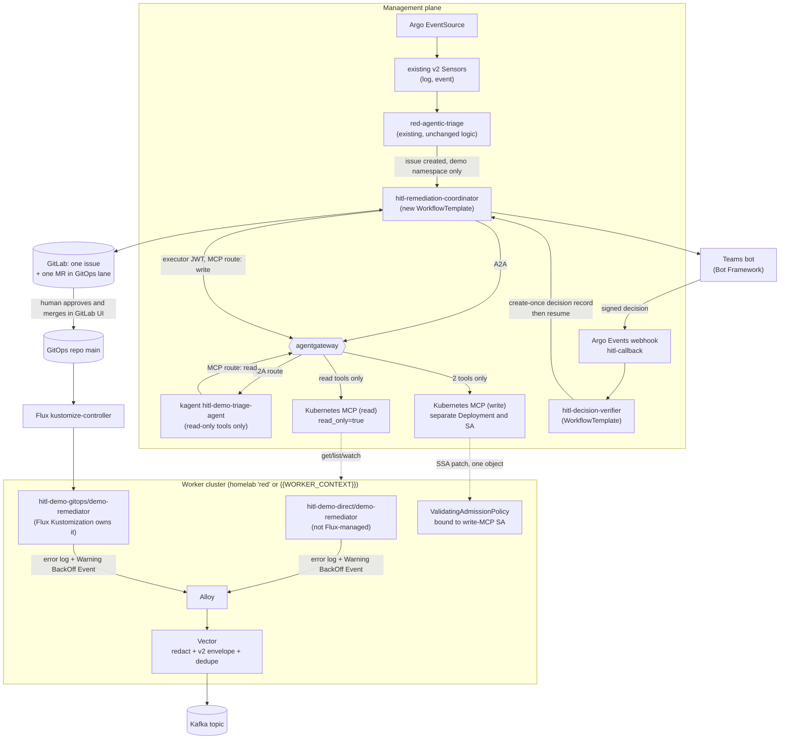

# Agent 1 plan: one incident, one ticket, two remediation lanes enforced by the cluster

**Proposal.** Reuse the verified `observability.triage.v2` home-lab path unchanged as the intake, and add a separate **remediation coordinator** WorkflowTemplate that starts only after the existing triage workflow has created the incident's GitLab issue. A deliberately broken but harmless Deployment emits one error log line and a Kubernetes `Warning` `BackOff` Event. Both signals share the existing pod-keyed `dedupe_key` and therefore land in one issue. The coordinator asks a read-only kagent agent, reached through agentgateway, for an open-ended diagnosis and a structured proposal. It then applies a deterministic policy to decide whether the proposal is executable at all. The **workflow**, not the model, picks the remediation lane from live ownership metadata. A target that Flux does not own takes the direct lane: Teams approval, then a separate executor identity calls a separate write-capable Kubernetes MCP. A target that Flux owns takes the GitOps lane: a workflow-owned GitLab bot opens a merge request, a human approves and merges it in GitLab, and Flux reconciles it. The distinctive safety choice in this plan is that **the final guard is inside the target cluster, not in the gateway or the prompt**. A `ValidatingAdmissionPolicy` bound to the write MCP's service account permits only the approved field change on the approved object, rejects any Flux-managed object, and requires the approved proposal digest as an annotation. The plan also treats an Argo "resume" as a signal, not as an authorisation. The post-resume step re-reads a create-once decision record and fails closed if that record is missing, stale, or does not match the proposal.

## Architecture

## Existing evidence

The table separates what the repository proves from what it only proposes. I did not touch any cluster, so "installed version" statements below come from repository evidence and local upstream clones, not from live inspection.

| Source | What it proves | What it does not prove |
|---|---|---|
| `work-agent-bundles/homelab-verified-triage-replication/README.md`, `evidence/VERIFICATION-2026-07-24.md` | Alloy → Vector → Kafka → Argo Events → Argo Workflow → read-only kagent → GitLab was run end to end on the `red` kind cluster (Kubernetes v1.32.2, Vector 0.45.0) against real Confluent Cloud and real gitlab.com, for both logs and Events, including dedupe, redaction, agent-failure handling and concurrency. | Any write path, any approval, any Flux-mediated change. The bundle states that the agent "diagnoses only" and every envelope carries `automation_allowed: false`. |
| `work-agent-bundles/homelab-verified-triage-replication/FINDINGS-AND-FIXES.md` | F1 (kagent A2A errors arrive as HTTP 200 inside `result.history[].metadata.kagent_error_code`, and the old empty-output guard could never fail), F2 (a live sibling claim was treated as dead), F3 (silent evidence loss on duplicates), F4 (Warning-only event filtering). F0 warns that the `observability.triage.v3` track is wire-incompatible with the v2 Sensors. | That correlation survives pod replacement. |
| `.../config/02-vector.yaml` lines 126–146 | `dedupe_key = sha2(cluster:namespace:pod)`, event `delivery_key = sha2(dedupe_key:reason)`, and `automation_allowed = false` on every record. | A workload-level key. |
| `.../config/03-argo.yaml` | Sensors filter on `schema_version == observability.triage.v2`, `automation_allowed == false`, `cluster == red`, a namespace allowlist, `signal_kind`, and (for events) a reason allowlist. `validate-schema` quarantines unknown schemas, unknown clusters, and records older than 24 hours. `claim-24h-window` and the GitLab fingerprint label (`triage-fingerprint-<16 hex>`) give idempotent issue creation and append. | Anything after the issue is created. |
| `.../config/05-triage-evaluation-settings.yaml` | The agent URL is a ConfigMap value, currently `http://kagent-controller.kagent:8083/api/a2a/kagent/evaluated-k8s-readonly-triage-agent/`. | **The verified path does not go through agentgateway today.** It calls the kagent controller directly, and the required tool server is kagent's built-in `kagent-tool-server`, not the Kubernetes MCP. Moving to agentgateway is new work, although it only needs a changed URL and a new route. |
| `platform/kubernetes-mcp/README.md` | A documented read-only security boundary for `containers/kubernetes-mcp-server` v0.0.66. The home lab proved an exact eight-tool inventory, denied Secret, ServiceAccount, RBAC, mutation, exec and token-creation calls, and 20 alternating calls across two contexts with no crossover. | Server-side rejection of a missing context, caller authentication at work, or any write endpoint. The document states that `context` is optional in v0.0.66 and falls back to the kubeconfig's current context. |
| Local clone `../kubernetes-mcp-server` (v0.0.66-28-g5d42192), `pkg/toolsets/core/resources.go`, `pkg/kubernetes/resources.go` | `resources_create_or_update` takes a complete YAML or JSON document and performs server-side apply with `Force: true` and the field manager set to the binary name. `read_only = true` exposes only tools annotated `readOnlyHint`, and `enabled_tools` / `denied_resources` exist (`docs/configuration.md`). | That the write tool can be restricted to one field. Forced server-side apply will take field ownership from any other manager, including Flux, which is why the direct lane must never touch a Flux-owned object. |
| Local clone `../agentgateway` (commit 4ae9c32, May 2026), `schema/cel.md` | `mcp.tool.name`, `mcp.tool.target` and `mcp.tool.arguments` exist as CEL attributes, but the schema states that **request-time CEL only includes identity fields such as `tool`**. The repository's installed baseline is agentgateway v1.3.1 (`platform/agentgateway/README.md`). | That agentgateway can authorise on tool **arguments** at request time. This plan therefore does not rely on argument-aware gateway policy. It must be tested against the installed version before anyone does. |
| `platform/agentgateway/policy-argo-openapi-mcp.yaml` | The `AgentgatewayPolicy` `backend.mcp.authorization.policy.matchExpressions` shape with `mcp.tool.name in [...]`. The file itself is marked "DO NOT APPLY" because its backend target was blocked. It notes that `x-kagent-*` headers are only as trustworthy as the ingress in front of them. | Caller authentication. Header-based identity is defence in depth only. |
| `platform/teams-hitl/README.md`, `BOT-CONTRACT.md`, `eventsource.yaml`, `sensor.yaml`, `workflow-approval-template.yaml`, `mock-bot/` | A proposed suspend/resume pattern with Argo Events as the callback receiver, a bot contract, and a mock bot. | A working Teams bot, callback authentication, or binding of a decision to a proposal. The checked-in Sensor resumes **any workflow named in the body** after only a regex check on `approval_id`. It does not verify the HMAC the contract describes, and it does not compare the decision with a stored request. The template also has a T0/T1 `auto-execute` branch, which this demo must not include. |
| `work-agent-bundles/hitl-remediation-approval/` | A definition of done: the action is blocked before approval, proceeds only after approval, and the decision lands in a durable audit trail. | Any implementation. It contains a request template and an empty evidence template. |
| `work-agent-bundles/gitlab-mcp-gitops-pr/OFFICIAL-GITLAB-MCP-SPIKE-2026-06-07.md` | The official GitLab.com MCP endpoint was **not** usable from kagent `RemoteMCPServer` (OAuth-only, and a 404 after authentication). The proven path for branch, file, MR and note creation is an in-cluster GitLab API wrapper. | Official GitLab MCP in any environment. |
| `STATEMENT-OF-WORK.md`, `AGENTS.md` | The intended architecture: Flux is the only delivery plane, GitLab CI validates only, agents submit workflows while workflow service accounts hold write permissions, and read-only agents carry no apply or delete tools. `AGENTS.md` also records the Argo skipped-step `when` hazard and the pod-name fingerprint hazard. | That Flux is installed on the `red` lab cluster. I found no repository evidence either way, so Phase 0 must confirm it. |

## Demo scenarios

### The fault

The demo uses one tiny, disposable application, `demo-remediator`, deployed twice from the same manifest. It runs a `busybox:1.36` (or `{{DEMO_IMAGE}}`) container under the same restricted security context as the existing fixtures in `work-agent-bundles/homelab-verified-triage-replication/fixtures/`. The container's command reads an environment variable `DEMO_MODE`:

- When `DEMO_MODE=fail`, it prints one line, `ERROR demo-remediator startup refused: DEMO_MODE=fail is not a serving mode`, and exits with status 1.
- When `DEMO_MODE=healthy`, it writes a readiness file and sleeps, so the readiness probe passes.

With `replicas: 1` and the default `restartPolicy: Always`, the kubelet restarts the container in place. The pod name therefore stays the same while it crash-loops, and Kubernetes emits a `Warning` Event with reason `BackOff` whose involved object is that pod. This matters for correlation. The existing Vector transform sets the event's `pod` field from the involved object's name, so the log record and the Event record carry the same `cluster:namespace:pod` and the same `dedupe_key`. The existing claim logic (with the F2 in-flight fix) then turns them into one issue plus one appended note. This is exactly the scenario that F2 was verified against.

The error text contains the words `ERROR` and `refused`, which match the Vector log filter at `config/02-vector.yaml` line 176, and the word "refused" classifies it under the existing reason heuristics. The text contains no credentials, so the redaction scrub will not mangle it. The fault is safe because the fixture has no Service, no data, and no dependants, and deleting its namespace restores the baseline completely.

The fix is small, reversible, and has an obvious rollback: change one environment value from `fail` to `healthy`, and change it back to reproduce the fault. I chose a configuration fault instead of, for example, a memory limit, because the diagnosis requires reading both the log line and the Deployment spec. A model that only reads the Event would see "BackOff" and could not know the cause. That makes it a fair test of evidence gathering without a runbook, while the executable change stays trivially checkable.

### Two instances, two lanes

| | Direct lane | GitOps lane |
|---|---|---|
| Namespace | `hitl-demo-direct` | `hitl-demo-gitops` |
| Who creates the fixture | The demo script with `kubectl apply`. The object carries no Flux labels. | A Flux `Kustomization` named `hitl-demo-gitops` pointing at `{{GITOPS_REPO_PATH}}/hitl-demo-gitops/`. The object carries `kustomize.toolkit.fluxcd.io/name` and `kustomize.toolkit.fluxcd.io/namespace` labels. |
| How the lane is chosen | The coordinator reads the live Deployment's labels. If the labels are absent, it uses the direct lane. | The Flux ownership labels are present, so it uses the GitOps lane. |
| What changes | One server-side apply by the write MCP's service account, with the proposal digest annotation. | One line in the Git manifest, merged by a human. |
| What cannot happen | Flux cannot revert the fix, because Flux does not own the object. | No cluster write by any demo identity. The admission policy denies the write MCP on Flux-labelled objects, and the executor path is not even rendered for this lane. |

The two lanes are demonstrated as two separate runs with separate incidents and separate issues. Running them together would make the audience wonder which approval fixed which pod.

### Should the log and the Event correlate into one incident?

Yes, for this demo. They are two symptoms of one cause on one pod within seconds of each other, and the operator wants one conversation about one remediation. The existing v2 mechanism already achieves that for a single crash-looping pod. The ticket keeps them as two separate evidence entries: the issue body from the first signal, and an appended "correlated evidence" note from the second. That shows that both paths worked, instead of hiding one inside the other.

I am deliberately **not** changing the key to a workload identity for this demo. `AGENTS.md` records that Events do not reliably carry the `app` or `service` label, so a correct workload key requires deriving the same string from fields both paths carry (for example, stripping the ReplicaSet and pod hash from the pod name, with a fallback). That is a real improvement, but it changes the dedupe behaviour for every namespace the v2 path already serves, and it is not needed to prove remediation. It is listed as a follow-up with its own regression test. The demo is designed so that the limitation never triggers before approval. The pod name is stable while it crash-loops, and the only replacement happens because of the fix, after which the new pod is healthy and emits no signals.

One consequence to state plainly in the demo: if the fix fails and the new pod also crash-loops, its signals will have a new `dedupe_key` and will open a **second** issue. The coordinator handles this by writing the new pod name into the original issue during verification. It also adds a `hitl-superseded-by` note if a new issue with the same namespace and workload prefix appears within the verification window. Phase 5 tests this case explicitly.

## Flow and trust boundaries

### Identities

| Identity | Where | Can do | Cannot do |
|---|---|---|---|
| `alloy` SA | worker | read pods, logs, and events in allowlisted namespaces | anything else |
| `argo-events-sa` | management | create Workflows, and manage claim ConfigMaps in `argo-events` (existing) | resume arbitrary workflows (the new callback Sensor only *creates* a verifier Workflow) |
| `hitl-coordinator` SA | management, namespace `{{ARGO_NAMESPACE}}` | read and write its own proposal and decision ConfigMaps, call agentgateway's A2A route, call the GitLab API with the issue token | obtain a write-MCP token (it has no projected token with that audience) |
| `hitl-direct-executor` SA | management | obtain a projected token with audience `{{WRITE_MCP_AUDIENCE}}`, which agentgateway accepts on the write-MCP route only | reach the read route with write rights, reach A2A, or read Secrets |
| `hitl-decision-verifier` SA | management | read the pending proposal, *create* decision ConfigMaps, and `patch` Workflows (resume) in `{{ARGO_NAMESPACE}}` only | edit proposals or delete decisions |
| kagent agent `hitl-demo-triage-agent` | `kagent` | call the read-MCP route through agentgateway | reach the write route (gateway policy denies its identity, and network policy denies it direct access to the write MCP pod) |
| read MCP SA `k8s-mcp-read` | worker (or via kubeconfig) | `get`/`list`/`watch` on pods, pods/log, events, deployments, replicasets in the two demo namespaces | Secrets, ConfigMaps, ServiceAccounts, RBAC, exec, any write |
| write MCP SA `k8s-mcp-write-demo` | worker | `get` and `patch` on `deployments` with `resourceNames: [demo-remediator]` in `hitl-demo-direct` only | any other object or namespace, and any change the admission policy rejects |
| GitLab issue token | management Secret `gitlab-credentials` (existing) | create and update issues and notes | push code |
| GitLab MR bot token | management Secret `gitlab-mr-bot` | Developer role on `{{GITOPS_PROJECT}}`: push non-protected branches and open MRs | push to or merge into the protected `main` branch, or approve (GitLab prevents authors approving their own MR when the project setting is enabled) |
| Human approver | Teams and GitLab | approve a direct action in Teams; approve an MR in GitLab | merge, unless they also hold the Maintainer role |
| Human merger | GitLab | merge an approved MR to `main` | — |
| Flux `kustomize-controller` | worker | reconcile `{{GITOPS_REPO_PATH}}/hitl-demo-gitops/` | — |

### Numbered end-to-end flow

Steps 1 to 6 are the existing verified path, with only allowlist additions.

1. **Fault.** The demo script applies the fixture to one lane's namespace. The container logs the error line and exits. The kubelet emits `Warning BackOff` for the pod.
2. **Collection.** Alloy tails logs and watches Events in its namespace allowlist, which gains `hitl-demo-direct` and `hitl-demo-gitops` (`config/01-alloy.yaml` line 80). It stamps `cluster` from `TRIAGE_CLUSTER_NAME`.
3. **Normalisation.** Vector redacts the message, builds the v2 envelope with `signal_kind`, `reason`, `dedupe_key`, `delivery_key` and `automation_allowed: false`, drops identical repeats by `delivery_key`, and produces to Kafka. Delivery must be proven with a produced **and consumed** record, because `AGENTS.md` records that a Vector disk buffer on 0.45.0 accepted writes and never drained them.
4. **Routing.** The existing `red-log-triage` and `red-event-triage` Sensors (with the two namespaces added to their allowlists) each submit a `red-agentic-triage` Workflow. Nothing about `schema_version` or `automation_allowed` changes.
5. **Triage.** The first workflow validates the record, wins the claim, runs `diagnose-readonly`, and creates issue `#N` labelled `automated-triage` and `triage-fingerprint-<fp>`. The second workflow sees a live sibling claim, waits for `issue_iid`, and appends its evidence to `#N`.
6. **Hand-off.** A new final step in the `process-new-incident` path of `red-agentic-triage` runs only when `namespace` is in the ConfigMap list `hitl-demo-namespaces`. It creates a `hitl-remediation-coordinator` Workflow with parameters `issue_iid`, `fingerprint`, `cluster`, `namespace`, `pod`, and `triage_workflow_uid`. The step is isolated in its own sub-template gated by a single `when`, as `AGENTS.md` requires. It never runs for duplicates, so only one coordinator exists per incident. The coordinator carries the label `hitl.demo/fingerprint=<fp>`. Before creating it, the step lists Workflows with that label and does nothing if one is active, which covers a retried triage workflow. **Issue update:** a note is added saying "remediation assessment started" with a link to the coordinator workflow.
7. **Settle.** The coordinator waits up to 90 seconds for the issue to show both a `log` and an `event` signal. It reads the issue and its notes through the GitLab API and looks for the fingerprint table rows. It proceeds either way and records "event signal observed: yes/no" as an input to uncertainty. **Issue update:** a signal checklist.
8. **Diagnosis and proposal.** The coordinator calls `hitl-demo-triage-agent` over A2A **through agentgateway** (`{{AGW_A2A_URL}}/hitl-demo-triage-agent`), with the issue's evidence wrapped in `<untrusted_evidence>` exactly as the existing template does. It uses the F1 error checks unchanged. The agent has no runbook. Its instructions ask it to investigate using its read tools, explain the cause, state its confidence and what would change its mind, and return a JSON proposal in the contract below. The agent may propose anything, including "no safe automated action". It cannot execute anything, because its only tools are read tools. **Issue update:** the diagnosis, the raw proposal, the tool calls that the kagent controller recorded (not what the model claims it called), and the uncertainty statement.
9. **Deterministic validation.** A script step (no model) validates the proposal's JSON against a schema, then against the **action catalogue** `hitl-action-catalogue` (a ConfigMap owned by the platform, never by the agent). For this demo the catalogue has exactly one executable action, `set_env_value`. Its constraints: kind `Deployment`, namespace in the demo list, name `demo-remediator`, container `app`, env name `DEMO_MODE`, and new value in `[healthy]`. The step then re-reads the live object with the coordinator's own read-only Kubernetes access and fills in the facts from the cluster, not from the model: `uid`, `resourceVersion`, the current value, and the ownership labels. If the model's claimed current value does not match the live value, the proposal is rejected as inconsistent. The step computes `proposal_sha256` over the canonical JSON. A proposal outside the catalogue is not an error. It becomes "recommendation recorded, not executable by automation", and the workflow ends after updating the issue. **Issue update:** a policy verdict and the proposal digest.
10. **Lane selection.** The same step sets `lane=gitops` if the live object has `kustomize.toolkit.fluxcd.io/name`, and otherwise `lane=direct`. The model's own `lane` hint is recorded but ignored. **Issue update:** the lane and the reason.

**Direct lane**

11. **Persist the pending request.** The coordinator creates the ConfigMap `hitl-proposal-<approval_id>`, where `approval_id` is a random 128-bit value generated by the workflow. The ConfigMap holds the canonical proposal, digest, workflow UID, expiry (now + 30 minutes for the demo), approver group, and `state=pending`. It is immutable (`immutable: true`). The coordinator then posts the approval request to the bot using the `BOT-CONTRACT.md` shape, extended with `workflow_uid`, `proposal_sha256`, `issue_url`, `risk`, `rollback`, and `expires_at`. **Issue update:** "approval requested from `{{APPROVER_GROUP}}`, expires at …".
12. **Suspend.** The coordinator enters a `suspend` node with `duration` equal to the expiry plus 60 seconds.
13. **Human decision.** The Teams card shows the exact action ("set env `DEMO_MODE` from `fail` to `healthy` on Deployment `hitl-demo-direct/demo-remediator`"), the target, the evidence summary, risk, rollback, the first 12 hex characters of the digest, the expiry, and links to the issue and the Argo run. It offers **Approve** and **Reject** buttons, using Adaptive Card `Action.Execute` so that the bot receives the clicking user's Entra object ID from the Teams channel. The bot resolves that ID to a UPN and checks group membership, or leaves membership to the workflow's allowlist. It then signs a canonical string, `approval_id|workflow_uid|proposal_sha256|decision|approver_oid|decided_at`, with HMAC-SHA256 using `{{HITL_CALLBACK_HMAC_SECRET}}`, and POSTs the decision to the callback URL with an `Authorization: Bearer` token.
14. **Callback intake.** The Argo Events webhook EventSource `hitl-callback` checks the bearer token (`authSecret`). A new Sensor, `hitl-decision-sensor`, **does not resume anything**. It creates a `hitl-decision-verifier` Workflow and passes it the body. This replaces the resume-by-name pattern in `platform/teams-hitl/sensor.yaml`.
15. **Verification of the decision.** The verifier:
    - recomputes the HMAC over the canonical fields (a canonical string, not the raw body, because Argo Events re-serialises JSON bodies);
    - loads `hitl-proposal-<approval_id>` and checks that `workflow_uid` and `proposal_sha256` match it;
    - checks that `decided_at` is before `expires_at` and that the current time is before `expires_at`;
    - checks that `approver_oid` is in `hitl-approvers` and is not the identity of any automation;
    - checks that the target Workflow exists, has that UID, and is currently suspended at the approval node.

    It then **creates** `hitl-decision-<approval_id>`, an immutable ConfigMap holding the decision, approver, time, and signature. `create` fails if the ConfigMap exists, so a duplicate click, bot retry, or replay has no further effect. Only after that create succeeds does it resume the Workflow. For `rejected`, it writes the decision and then resumes the Workflow as well, so that the coordinator records the rejection itself instead of being stopped with no ticket update. Any check failure produces an audit ConfigMap `hitl-callback-rejected-<hash>` and no resume. **Issue update:** none from the verifier. The coordinator owns the ticket.
16. **Consume the decision.** The first step after the suspend node re-reads `hitl-decision-<approval_id>` and repeats the digest, UID and expiry checks. If the workflow was resumed by any other means, such as `argo resume` by an operator, there is no valid decision record, and the step fails closed with "resumed without a valid decision". If the suspend times out, the coordinator records "expired". **Issue update:** "approved by `<UPN>` at …", "rejected by `<UPN>`: `<comment>`", or "expired unapproved".
17. **Precondition re-read.** The executor step re-reads the live Deployment. If `uid`, `resourceVersion` or the current `DEMO_MODE` value differs from the proposal, it stops with "target changed after approval, new approval required". The ticket is updated and no write happens.
18. **Execute.** The `hitl-direct-executor` step renders a **minimal** server-side apply document from the approved proposal. The model contributes no text to it. The document contains `apiVersion`, `kind`, `metadata.name`, `metadata.namespace`, `metadata.resourceVersion` (as an optimistic-concurrency precondition, which must be verified to be honoured on apply), `metadata.annotations["hitl.demo/proposal-sha256"]`, `metadata.annotations["hitl.demo/approval-id"]`, and a single container entry named `app` with a single env entry. The step calls the write-MCP tool `resources_create_or_update` through agentgateway, using its projected token. Because the MCP's field manager did not own these fields before, forced server-side apply sets only those fields and leaves the rest of the spec to its existing manager. The idempotency key is `approval_id`. The step first checks whether the live annotation already equals this `approval_id` and the value is already `healthy`. If so, it records "already applied" and skips the call, so an Argo retry of this step can never produce a second, different write.
19. **Admission.** The API server evaluates `ValidatingAdmissionPolicy` `hitl-direct-write-guard`, which is bound only to requests from `system:serviceaccount:{{MCP_NAMESPACE}}:k8s-mcp-write-demo`. Details are below. A violation is denied, the MCP returns an error, and the executor records the denial.
20. **Verify.** A read-only step (the coordinator's own access, not the model) waits up to 3 minutes for the Deployment's `observedGeneration` to reach `generation`, `updatedReplicas == availableReplicas == 1`, and the new pod to become `Ready`. It then checks that no new `Warning` Events for the new pod appear within a 60-second quiet period. It asks the agent for a short confirmation reading only as optional narrative, never as the pass or fail signal. **Issue update:** before and after values, `resourceVersion`, the new pod name, the verification result, the manual rollback command (`kubectl -n hitl-demo-direct set env deploy/demo-remediator DEMO_MODE=fail`, run by an operator to reproduce the fault), and a final label `hitl-remediated`, `hitl-failed` or `hitl-unverified`.

**GitOps lane** (from step 10)

11g. **Author the MR.** The coordinator has no Git write access. It hands the validated proposal to a `gitops-mr-author` step running with the MR bot token. The step clones `{{GITOPS_PROJECT}}` at `main`, records the base SHA, and changes exactly one value in the allowlisted file `{{GITOPS_REPO_PATH}}/hitl-demo-gitops/deployment.yaml` using a structured editor (`yq`), not a model-generated diff. It commits on branch `hitl/<approval_id>`, pushes, and opens an MR whose description contains the proposal, the evidence link, the digest, and "Do not merge unless CI is green and a human reviewer other than the author has approved". **Issue update:** the MR link, source branch, head SHA, and base SHA.

12g. **CI.** The GitLab pipeline for the MR runs `kustomize build` and `kubeconform` on the rendered path, plus a diff guard script. The guard fails unless the MR changes only the allowlisted file, only the `DEMO_MODE` value, and only to a catalogue value. The model's text never reaches CI as code.

13g. **Teams request.** The card for this lane says "Review requested: merge request !M changes `DEMO_MODE` from `fail` to `healthy` for `hitl-demo-gitops/demo-remediator`". It has two buttons: **Open merge request in GitLab** (`Action.OpenUrl`) and **I'm reviewing** (optional; it records only that a named person has picked it up, and the workflow treats it purely as a ticket note). **There is no Approve button in Teams for this lane.** Approval happens in GitLab under the reviewer's own GitLab identity, and merging happens in GitLab under a Maintainer's identity. The card says so in its text.

14g. **Wait for merge.** The coordinator polls `GET /projects/:id/merge_requests/:iid` every 20 seconds for up to `{{MR_REVIEW_TIMEOUT}}` (30 minutes in the demo). A GitLab merge webhook routed through Argo Events is a later optimisation, and the poll stays as a backstop. On `state=merged`, the coordinator checks four things. First, the MR's final head SHA equals the SHA the bot pushed; if not, someone changed the proposal after it was opened, and the lane stops with "MR changed after proposal, not verified". Second, `GET .../approvals` shows at least one approver who is not the bot. On GitLab tiers without enforced approval rules, the workflow enforces this rule itself and reports "merged without independent approval" as a failed demo, not a pass. Third, `merged_by` is a human account. Fourth, the `merge_commit_sha` is recorded. On `closed` without merge, the coordinator records "rejected in review". On timeout, it records "review expired" and leaves the MR open for humans. **Issue update:** reviewer, approver and merger usernames, and `merge_commit_sha`.

15g. **Wait for reconciliation.** The coordinator polls the Flux `Kustomization` `hitl-demo-gitops` every 15 seconds for up to 10 minutes. It uses the coordinator's read access to the worker, which is granted `get` on `kustomizations.kustomize.toolkit.fluxcd.io` in `flux-system`. Success requires `Ready=True` **and** a `.status.lastAppliedRevision` whose SHA equals `merge_commit_sha` or has it as an ancestor, checked with the GitLab compare API, because another commit may land on `main` in the meantime. The revision string format (for example `main@sha1:<sha>`) depends on the Flux version and must be confirmed in Phase 0. The coordinator does not annotate Flux objects to force reconciliation. The demo sets the `GitRepository` interval to 1 minute instead.

16g. **Verify.** This is the same live verification as step 20, plus a check that the running pod's env shows `DEMO_MODE=healthy` and that the Deployment's `kustomize.toolkit.fluxcd.io` labels are still present. **Issue update:** the Flux revision, Ready condition, new pod, and final label. If Flux reconciles but the pod is still unhealthy, the result is `hitl-failed` with the observed state. If Flux does not reach the revision in time, the result is `hitl-unverified` with the last observed revision and condition message.

### The read and write MCP boundary in detail

**Two MCP deployments, not one with two modes.** The read MCP is `kubernetes-mcp-server` with `read_only = true`, the toolset `core` only, and an explicit `enabled_tools` list: `pods_list_in_namespace`, `pods_get`, `pods_log`, `events_list`, `resources_get`, `resources_list`. That is six of the eight tools proven in the home lab, and the remaining two are included if the Phase 0 inventory shows they are the other read tools. It also sets `denied_resources` for Secrets, ConfigMaps, ServiceAccounts, TokenRequests, Roles, ClusterRoles, RoleBindings and ClusterRoleBindings, following `platform/kubernetes-mcp/README.md`. The write MCP is a separate Deployment with its own service account and kubeconfig, `enabled_tools = ["resources_get", "resources_create_or_update"]`, `disable_destructive = false`, and the same `denied_resources`. It never runs the `config` toolset.

**Context pinning.** Kubernetes MCP v0.0.66 treats `context` as optional. Each MCP instance here is therefore given a kubeconfig containing **exactly one** context, the demo worker. An omitted context and an explicit context then resolve to the same cluster, and an unknown context fails. This follows the "one MCP endpoint per cluster" fallback in `platform/kubernetes-mcp/README.md`, and avoids depending on server-side missing-context rejection, which the home lab has not proven.

**Kubernetes RBAC.** The read MCP has a Role in each of the two demo namespaces with `get`, `list` and `watch` on `pods`, `pods/log`, `events`, `deployments` and `replicasets`. No ClusterRole is bound. The write MCP has a Role in `hitl-demo-direct` only, with `get` and `patch` on `deployments` and `resourceNames: ["demo-remediator"]`. Server-side apply of an existing object requires `patch`. Because `create` is absent, the write MCP cannot create a new object even though the tool supports creation.

**Admission policy (the final, argument-aware control).** RBAC cannot restrict which fields change, and agentgateway's request-time CEL does not see tool arguments (`../agentgateway/schema/cel.md`). A `ValidatingAdmissionPolicy`, GA since Kubernetes 1.30 and available on the lab's v1.32.2, with a binding whose `matchConditions` select `request.userInfo.username == "system:serviceaccount:{{MCP_NAMESPACE}}:k8s-mcp-write-demo"`, therefore enforces the following:

- the operation is `UPDATE` and the resource is `apps/v1` `deployments` in `hitl-demo-direct` named `demo-remediator`;
- `!has(oldObject.metadata.labels) || !("kustomize.toolkit.fluxcd.io/name" in oldObject.metadata.labels)`, so no Flux-owned object can be changed;
- `object.metadata.annotations["hitl.demo/proposal-sha256"]` is present and has changed from `oldObject`;
- the container list has the same length and names, images are unchanged, `replicas` is unchanged, and for every container the env names are unchanged and only the value of `DEMO_MODE` differs, restricted to `["healthy", "fail"]`.

The last rule is the one that needs prototyping in Phase 4, because CEL list comparison on pod templates is fiddly. If it proves impractical, the fallback is a narrower check: the rendered `spec.template.spec` with `env` removed must equal the old one with `env` removed. The policy uses `failurePolicy: Fail`, so an unevaluable policy denies the write. As defence in depth for the read side, a second binding of the same policy denies **every** write from the read MCP's service account.

**agentgateway authorisation.** There are two MCP routes and one A2A route, each with its own `AgentgatewayPolicy`:

- The **read route** requires a JWT whose subject is the kagent agent's service account, validated against the Kubernetes service-account issuer with audience `{{READ_MCP_AUDIENCE}}`. It allows `mcp.tool.name in [the six read tools]`.
- The **write route** requires subject `system:serviceaccount:{{ARGO_NAMESPACE}}:hitl-direct-executor` and audience `{{WRITE_MCP_AUDIENCE}}`, and allows `mcp.tool.name in ["resources_get", "resources_create_or_update"]`.
- The **A2A route** accepts only the coordinator's service account.

Header values such as `x-kagent-agent` are not used for identity, because `policy-argo-openapi-mcp.yaml` already notes that they are only as trustworthy as the ingress. Whether the installed agentgateway version supports JWT authentication with a Kubernetes service-account issuer on MCP backends has to be confirmed against `platform/agentgateway/AUTHENTICATION.md` and the installed CRD in Phase 0. If it does not, the fallback is a separate listener or Gateway per route, plus NetworkPolicy by pod label, which is weaker because it does not authenticate the workload. The plan must then state that downgrade explicitly.

**Network policy.** Only agentgateway pods may reach either MCP Service, and the write MCP's NetworkPolicy additionally names the write route's gateway pods. kagent agent pods cannot reach the write MCP's pod IP directly.

**Why the agent cannot escalate.** The agent has no tool that writes. It has no credential for the write route, because kagent's `RemoteMCPServer` points only at the read route with its own token. It never sees the executor's token. It cannot choose the lane. It cannot put text into the applied manifest or the Git diff, because both are rendered from catalogue fields after validation. Its output reaches only the proposal JSON, which is schema-checked, and the issue text, which is scrubbed as the existing template does. A prompt injection in the log line can at worst make the agent propose something odd, which the catalogue then refuses.

### Remediation proposal contract

This is a new, separate schema: `hitl.remediation-proposal.v1`. It is never put on Kafka and never read by the v2 Sensors.

| Field | Source | Notes |
|---|---|---|
| `schema_version` | workflow | `hitl.remediation-proposal.v1` |
| `incident` | workflow | `{cluster, namespace, fingerprint, issue_iid, triage_workflow_uid}` |
| `target` | model proposes, workflow overwrites from the live object | `{apiVersion, kind, namespace, name, uid, resourceVersion, container}` |
| `observed_evidence` | model | a list of `{kind: log|event|resource|tool_call, ref, summary}`. `ref` must point at an issue section or a recorded tool call. |
| `diagnosis` | model | free text, capped at 2,000 characters |
| `confidence` and `uncertainty` | model | `high|medium|low` plus "what would change this conclusion" |
| `action` | model proposes, catalogue validates | `{catalogue_id: "set_env_value", params: {env: "DEMO_MODE", from: "fail", to: "healthy"}}`. Any other `catalogue_id` is recorded but not executable. |
| `allowed_parameters` | catalogue | copied from the catalogue entry so that the approver sees the bounds |
| `risk` | model text, plus a catalogue risk class | The catalogue class (`low: single Deployment rollout in a demo namespace`) is what the card shows first. |
| `rollback` | catalogue template, filled with live values | For example, `set env DEMO_MODE=fail` or `git revert <merge_commit_sha>` |
| `lane` | workflow, from ownership labels | `direct|gitops` |
| `approval_scope` | workflow | `{approver_group, approvals_required: 1, single_use: true}` |
| `expires_at` | workflow | now + 30 minutes (direct) or + `{{MR_REVIEW_TIMEOUT}}` (GitOps) |
| `approval_id` | workflow | random, 128 bits |
| `idempotency_key` | workflow | `approval_id`. It is written into the object annotation (direct) or used as the branch name (GitOps). |
| `proposal_sha256` | workflow | computed over the canonical JSON (keys sorted, no whitespace) of every field above except itself |

Any change to any field produces a new digest, and a new digest needs a new `approval_id` and a new approval. There is no "amend" path.

### Teams approval and Argo suspend/resume: edge cases

| Case | Handling |
|---|---|
| Callback authentication | Two layers: the Argo Events webhook `authSecret` bearer token at the edge, and the HMAC over canonical fields checked in the verifier. The existing `istio-authorization-policy.yaml` source-IP allowlist is optional extra protection in the lab. |
| Approver identity | The Entra object ID comes from the Teams `Action.Execute` activity, which the Bot Framework authenticates. The bot forwards it, and the workflow checks it against `hitl-approvers`. A free-text `approver` field is never trusted. |
| Rejection | The verifier writes a `rejected` decision and resumes the workflow. The coordinator records the rejection and comment and ends in `Succeeded` with the label `hitl-rejected`. Rejection is a valid outcome, not a failure. |
| Expiry | The verifier refuses any decision after `expires_at`. The suspend node's own timeout (expiry plus 60 seconds) ends the wait, and the coordinator records "expired". The bot also sends `expired`, which the verifier stores for audit only. |
| Replay | Replaying an old callback fails the HMAC or finds an existing `hitl-decision-*` record, and has no effect. |
| Duplicate clicks | The first valid click wins because `create` is atomic. Later clicks return "already decided" to the bot, which refreshes the card for everyone to show who decided. |
| Changed proposal | The decision must carry the digest shown on the card. If the coordinator re-proposes, it writes a new pending record and card, and the old card's clicks are refused as `superseded`. |
| Target changed after approval | Step 17 stops before writing and asks for a new approval. |
| Manual `argo resume` | Step 16 fails closed because no valid decision record exists. |
| Bot unreachable | The request step fails after 3 attempts. The ticket says "approval could not be requested" and nothing is executed. |

## Build phases

| Phase | Work | Depends on | Effort | Exit evidence |
|---|---|---|---|---|
| 0. Inventory | Record installed versions of Argo Workflows and Events, kagent, agentgateway (JWT support on MCP routes, CEL fields), Kubernetes MCP, and Flux (and whether it is installed on the lab worker at all). Also record the GitLab tier and approval-rule support, and whether a Teams tenant and Bot Framework registration are available. Choose the lab worker context. | none | 0.5–1 day | A version and capability matrix with a yes/no for every "must confirm" item in this plan |
| 1. **Smallest useful slice** | Add the two demo namespaces to the Alloy and Sensor allowlists, deploy the direct fixture, and prove one log plus one Event → one issue with an appended note. Move `triage-agent-url` to an agentgateway A2A route in front of the existing read-only agent. | 0 | 1–2 days | Two Kafka offsets, one claim ConfigMap, one issue with two signal entries, and agentgateway access logs for the A2A call |
| 2. Proposal without action | Deploy the read MCP behind agentgateway and create `hitl-demo-triage-agent`. Build the coordinator up to step 10: settle, proposal, catalogue validation, digest, lane selection, and issue notes. Add negative tests: an out-of-catalogue proposal, and a model-claimed value that disagrees with the live value. | 1 | 2 days | An issue timeline showing the proposal, the policy verdict, and the lane, with no write identity yet in existence |
| 3. Approval plumbing (mock first) | The callback EventSource with `authSecret`, the decision Sensor, the verifier template, the decision record, and fail-closed consumption. Drive it first with a signed `curl` and an extended `mock-bot/`, then with the real Teams bot if Phase 0 found one. | 2 | 2–3 days (mock), plus 2–5 days for a real Bot Framework bot | Replay, duplicate, expired, wrong-digest, wrong-approver, and manual-resume cases all end without execution |
| 4. Direct write | The write MCP deployment, RBAC, the `ValidatingAdmissionPolicy` and binding, the agentgateway write route, the executor template, the precondition re-read, the idempotency check, and verification | 3 | 2–3 days | An allowed change succeeds. A different field, a different object, a Flux-labelled object, and a read-MCP write are each denied, with the denial reasons captured. |
| 5. GitOps lane | The Flux `GitRepository` and `Kustomization` for the demo path, protected `main`, the MR bot token, the CI diff guard, the MR author step, the merge poll with approval and head-SHA checks, the revision ancestry check, and verification | 1, 2 (approval not needed) | 2–4 days | An MR with one-line diff, green CI, a separate human approval and merge, the Flux revision matching the merge SHA, and a healthy pod |
| 6. Rehearsal | Scripted runs of both lanes, every failure branch once, teardown, screenshots, and a public-safety scan of the evidence | 4, 5 | 1 day | The demo packet and a pass/fail record |

The critical path is 0 → 1 → 2 → 3 → 4. Phase 5 can proceed in parallel with 3 and 4 after Phase 2. The smallest useful first slice is Phase 1 plus Phase 2. It demonstrates correlated intake through agentgateway and an evidence-backed, policy-checked proposal recorded in one ticket, with no write capability anywhere. That is already a meaningful and safe demo.

## Acceptance tests

**Demo script, direct lane (about 8 minutes):**

1. `kubectl --context {{WORKER_CONTEXT}} apply -k docs/plans/homelab-triage-hitl-demo/fixtures/direct/` (the path is illustrative; the fixture is built in Phase 1).
2. Show the pod in `CrashLoopBackOff` and the `BackOff` Event: `kubectl -n hitl-demo-direct get pods,events`.
3. Show the two triage Workflows and the single coordinator: `argo -n argo-events list -l workflows.argoproj.io/workflow-template=red-agentic-triage` and `argo -n {{ARGO_NAMESPACE}} list -l hitl.demo/fingerprint`.
4. Open the GitLab issue and show both signal entries, the diagnosis, the proposal, the policy verdict, `lane=direct`, and "approval requested".
5. In Teams, have a non-approver click **Approve**. The card and the issue say "not an authorised approver", and the pod is still crash-looping.
6. Have an authorised approver click **Approve**, then click again. The second click reports "already decided".
7. Show the Deployment annotation `hitl.demo/approval-id`, the new Ready pod, and the issue's final note with the label `hitl-remediated`.
8. Negative proof (pre-recorded or live): `kubectl auth can-i` as the write-MCP service account, and a denied admission when that identity tries to change `image`.

**Demo script, GitOps lane (about 10 minutes, excluding review time):**

1. Commit the broken `DEMO_MODE: fail` manifest to `{{GITOPS_REPO_PATH}}/hitl-demo-gitops/` and let Flux apply it. Show `flux get kustomizations hitl-demo-gitops`.
2. Show the new issue with `lane=gitops`, the MR link, and the green CI pipeline with the diff guard.
3. Show the Teams card: **Open merge request** only, and no approve button.
4. The reviewer approves in GitLab, and the Maintainer merges.
5. Show the issue note with the approver, the merger, and `merge_commit_sha`; then `flux get kustomizations` showing the matching revision; then the healthy pod.

**Pass and fail criteria:**

| Test | Pass |
|---|---|
| Correlation | Exactly one issue per lane run. It contains one log entry and one Event entry, and replaying the Kafka records (a consumer-group reset within 24 hours) creates no new issue. |
| Payload contract | The v2 Sensors and the envelope are byte-for-byte unchanged apart from the namespace allowlists. A v3 or `hitl.remediation-proposal.v1` record sent to the topic is quarantined by `validate-schema`. |
| Read isolation | Tool discovery on the read route returns exactly the enabled read tools. A kagent call to the write route returns 403 from agentgateway. A direct TCP connection from a kagent pod to the write MCP is refused by NetworkPolicy. |
| No write before approval | Before the decision record exists, the Deployment's `resourceVersion` is unchanged (captured at each step), and the API audit log shows no request from `k8s-mcp-write-demo`. |
| Approval safety | A bad HMAC, missing bearer token, wrong approver, wrong digest, superseded `approval_id`, expired decision, duplicate click, and manual `argo resume` each produce zero writes and a recorded reason. |
| Direct bounded write | Only `DEMO_MODE` and the two annotations change (a diff of `kubectl get -o yaml` before and after, ignoring status and managed fields). An admission denial is shown for `image`, `replicas`, another Deployment, and a Flux-labelled Deployment. |
| GitOps separation | The MR author is the bot, the approver is a different human, and the merger is a human. The issue records all three. No demo identity wrote to `hitl-demo-gitops` (API audit log). |
| Reconciliation proof | `lastAppliedRevision` contains the merge SHA or a descendant of it. The pod is Ready with `DEMO_MODE=healthy`. The ticket is only marked `hitl-remediated` after both conditions hold. |
| Honest failure | A forced agent error produces the F1 degraded ticket, and no proposal is marked executable. A Flux suspension during the wait produces `hitl-unverified` after the timeout. A manually broken fix produces `hitl-failed` with observed state. |
| Cleanup | After teardown, both namespaces are gone, no `hitl-proposal-*`, `hitl-decision-*` or `triage-dedupe-*` records for the demo fingerprints remain, the demo issues and MR are closed with the `demo` label, and `verify.sh` for the triage bundle passes. |

**Evidence to capture:** Teams card screenshots (pending, decided, and refused non-approver); the GitLab issue timeline; the MR with its approvals and pipeline; the Argo UI showing the suspended node and the completed graph; `flux get kustomizations` output; before and after `kubectl get deploy -o yaml` diffs; the admission denial messages; agentgateway access-log lines for each route (caller, tool, and status only); and the Kubernetes audit log entries for the write identity. Every capture must pass `scripts/public-safe-scan.sh` before it is committed.

**Cleanup and rollback:** `kubectl delete ns hitl-demo-direct`; revert or delete the GitOps path in Git and let Flux prune it (`prune: true` on the demo Kustomization); delete demo `hitl-*` ConfigMaps by the label `hitl.demo/run=<run_id>`; close the demo issues so that the fingerprint label search cannot reuse them (FINDINGS F7); and remove the two namespaces from the allowlists if the demo is being retired. The in-demo "rollback" of a direct fix is an operator command that reproduces the fault. It is deliberately not an automated agent action.

## Risks and open decisions

- **Teams reality.** No verified Teams bot or callback exists in the repository. Without a Bot Framework registration, the demo can prove the Argo control flow and the verification logic with a signed mock, but it must be labelled "simulated Teams". A Teams "Workflows" incoming webhook card cannot provide an authenticated per-user callback. Decide early whether a real tenant is available. External reference to recheck: Microsoft's Universal Actions for Adaptive Cards documentation (https://learn.microsoft.com/microsoftteams/platform/task-modules-and-cards/cards/universal-actions-for-adaptive-cards/overview).
- **agentgateway authentication on MCP routes.** Service-account JWT validation on the installed v1.3.1 is not verified here. Request-time CEL does not see tool arguments according to the upstream schema, so the plan must not claim argument-level gateway enforcement.
- **Server-side apply details.** Whether `metadata.resourceVersion` in an apply request is enforced as a precondition, and how forced apply interacts with the existing field manager on `env`, must be proven in Phase 4. The step 17 re-read already narrows the race window to a few seconds if the precondition turns out to be ignored.
- **Admission policy expressiveness.** The per-container env-diff rule may be awkward in CEL. The fallback rule is stricter and simpler. Either way, `failurePolicy: Fail` applies.
- **Upstream write tool breadth.** `resources_create_or_update` accepts multi-document YAML and any kind. RBAC plus admission make that safe for this identity, but a narrow purpose-built MCP tool (for example `set_deployment_env`) would be a better long-term design. It is out of scope for the demo.
- **GitLab tier.** Enforced approval rules and preventing author approval may depend on the tier and project settings on gitlab.com. The workflow enforces "approver is a human other than the bot" itself, and the demo must say which control did the enforcing.
- **Separation of duties in a one-person lab.** One human may be both approver and merger in a home lab. The design supports two people, and the demo should use two accounts if possible, or state the limitation.
- **Flux presence and revision format.** Flux is not confirmed on the lab worker. The format of `lastAppliedRevision` differs between Flux major versions. Reference: https://fluxcd.io/flux/components/kustomize/kustomizations/.
- **Pod-name dedupe.** This is adequate for this fault, but not in general. A workload-level key is a separate change that needs its own regression test across all v2 namespaces.
- **Model variability.** The agent may not propose the catalogue action, or may be unavailable (for example, the quota exhaustion recorded in F1). Both outcomes are valid demo outcomes, "recommendation recorded, not executable" and "degraded ticket". For a live audience, the rehearsal should check the proposal rate over at least 5 runs.
- **Demo namespace sprawl.** Adding namespaces to the shared v2 allowlists affects the shared Sensors. Keep the change in a demo overlay and remove it at retirement.
- **Open decisions for the owner:** the approver group and how it is sourced (a static ConfigMap in the lab); the approval expiry (30 minutes proposed); the MR review timeout (30 minutes proposed); whether the coordinator should run for every demo-namespace incident or only when an operator labels the issue `hitl-eligible`; and whether a rejected direct proposal should offer the GitOps lane as an alternative (proposed: no, to keep the lanes distinct).

## Why this approach

It keeps the proven intake path intact and adds a separate, opt-in coordinator. The verified v2 contract, its dedupe fixes, and its failure handling therefore carry over unchanged, and nothing in the remediation work can silently alter production triage behaviour. It puts the decisive controls where a model cannot reach them. The lane is derived from live ownership metadata. The executable change is rendered from a platform-owned catalogue. The approval is a create-once, digest-bound record that the workflow re-checks after resume. The cluster's own admission policy rejects anything but the approved field on the approved, non-Flux object. That last control matters because the upstream write tool is broad, it uses forced server-side apply, and the gateway cannot yet inspect arguments at request time. Finally, it treats the GitOps lane honestly. Teams asks, GitLab approves and merges under real human identities, Flux applies, and the workflow only declares success after it has seen both the merged revision and a healthy pod.

Output file: `/Users/davidgardiner/Desktop/repo/kagent-public/docs/plans/homelab-triage-hitl-demo/agent-1.md`
