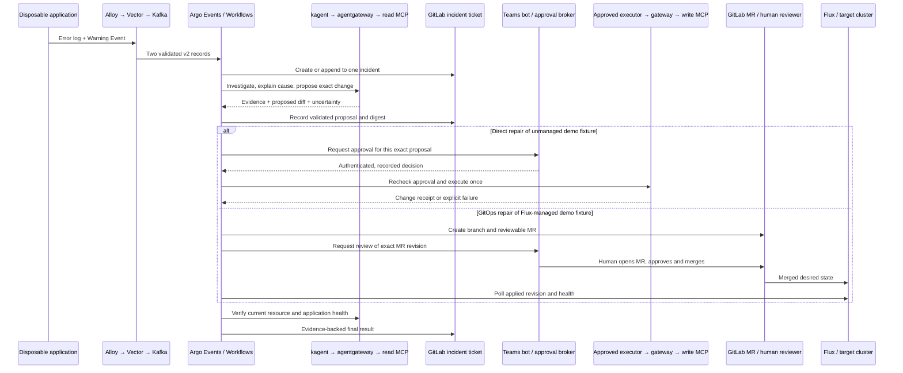

# Planner 1 — approval-bound Kubernetes repair and GitOps repair

Extend the verified home-lab v2 triage path with one incident record, one immutable remediation proposal, and two execution choices. Use a disposable application that emits an error log and a Kubernetes Warning Event when its startup configuration is wrong. Read-only kagent discovers the cause from live evidence without a diagnosis runbook. Argo records its proposed change in GitLab and requests a Teams decision. For direct repair, an approved execution workflow calls a narrow write Kubernetes MCP; for GitOps repair, a GitLab bot prepares an MR, a human reviews and merges it, and Flux reconciles it. Both end with read-only cluster verification and a ticket containing the evidence. This document is a proposal based on repository inspection; no new runtime proof was collected.

## Existing evidence

The repository establishes a useful starting point, but its separately documented components need integration:

| Repository source | Evidence or design it contributes | Limit |
|---|---|---|
| `work-agent-bundles/homelab-verified-triage-replication/README.md`, `config/`, and `evidence/VERIFICATION-2026-07-24.md` | Recorded proof of real log and Event ingestion, read-only triage, GitLab issue creation, correlation and failure handling | Historical lab proof; not evidence that the current cluster still runs those objects |
| `work-agent-bundles/homelab-verified-triage-replication/FINDINGS-AND-FIXES.md` | Corrected canonical config; v2/v3 incompatibility, agent application errors, concurrent claim and missing-ticket fixes | Does not establish remediation or approval integration |
| `platform/kubernetes-mcp/README.md` | Read-only isolation, explicit context routing, denied dangerous tools; version snapshot for Kubernetes MCP v0.0.66 | A write endpoint and its approval controls remain proposed |
| `platform/teams-hitl/BOT-CONTRACT.md`, `sensor.yaml`, `eventsource.yaml`, and `workflow-approval-template.yaml` | Request/callback examples and Argo approval flow | Sensor pattern filters are not signature verification or a durable record of consumed approval IDs |
| `work-agent-bundles/hitl-remediation-approval/README.md` | Required approval identity, scope and execution evidence | A proof contract, not proof that this incident path satisfies it |
| `work-agent-bundles/gitlab-mcp-gitops-pr/README.md` | Branch, file change, MR and review evidence contract | MR creation alone does not prove merge, Flux reconciliation or recovery |
| `platform/agentgateway/README.md`, `AUTHENTICATION.md`, and `DEMO-SCHEMA-GATE.md` | Gateway routing, caller identity and installed-schema validation entrypoints | New MCP routes and argument checks must be proven against the actual gateway release |
| `STATEMENT-OF-WORK.md` and `AGENTS.md` | Flux delivery ownership and separation of agent front doors from execution credentials | Architecture intent, not a current inventory |

One concrete correction is required before reusing the Teams template: its `suspend.duration: "24h"` releases the suspension on timer completion. Duration is an automatic-resume setting, as specified by [Argo's field reference](https://argo-workflows.readthedocs.io/en/latest/fields/). A resumed workflow therefore needs an independent approval check. Remove the template's low-tier auto-execution path from this demo. None of the remediation actions may bypass the human gate.

## Demo scenarios

Use the same small application in two separate runs with distinct case IDs and fixture ownership. In the direct run, its Deployment is intentionally outside Flux's inventory. In the GitOps run, an equivalent Deployment in a separate demo namespace is managed by a dedicated Flux Kustomization. Never suspend a shared Flux reconciler to accommodate the direct run.

The application's startup configuration is deliberately invalid. It writes a bounded error describing the configuration failure, waits long enough for Alloy collection, then exits nonzero. Kubernetes subsequently emits a Warning BackOff Event. The corrected configuration starts an HTTP health endpoint and stays running. The fixture must make both observations real; an informational marker log alongside a healthy pod would prove transport but would not prove repair.

The read-only agent is given the observed failure, target locators and a diagnostic objective. It inspects Deployment configuration, pod state, previous logs and Events. Its instruction must not contain a symptom-to-fix lookup or the expected answer. A deterministic action policy restricts which fields and values may be proposed; that policy controls execution and does not supply the diagnosis. A conflicting or insufficient diagnosis produces a ticket for manual investigation.

Within each run, the log and Event belong to one incident and one ticket. Repeated CrashLoop observations should append evidence rather than mint remediation workflows. A later run has a new case ID so a previously repaired incident is not accidentally reused.

## Flow and trust boundaries

1. **Ingest and correlate.** Retain the canonical `observability.triage.v2` envelope and `automation_allowed: false`. Do not turn an incoming signal into permission by flipping that field. Use the existing separate log/Event Sensors, schema checks, claims and issue lookup. Validate Warning type and allowlisted namespace. Record produced and consumed Kafka messages; `AGENTS.md` records why a disk buffer's accepted-write metric is insufficient. Keep guarded Argo step chains in a sub-template so skipped outputs cannot cause hard expression errors.
2. **Create an incident timeline.** Store the incident ID, workflow UID, source record IDs and issue IID durably. The first eligible record creates the issue; later records append sanitized evidence to it. A ticket note failing to post remains a retryable audit failure. Do not allow multiple execution attempts just because log and Event arrived separately.
3. **Read-only diagnosis.** Argo invokes the kagent diagnostic agent through agentgateway. The agent can reach only the read Kubernetes MCP route. Allow `get/list/watch` for selected Pods, Deployments, ReplicaSets and Events plus bounded pod logs in the demo namespaces. Use an exact nonempty MCP tool allowlist confirmed from discovery; deny mutation, exec, attach, port-forward, kubeconfig export, Secrets, TokenRequests, service accounts and RBAC resources. Require an explicit allowed context and namespace before any Kubernetes request. The MCP backend credentials have no remediation permissions.
4. **Validate and freeze the proposal.** A model may describe a fix, but the workflow validates the structure and allowed diff before asking for approval. Preserve evidence references, rationale and uncertainty separately from executable arguments. Reject empty diagnoses and kagent application errors even if HTTP status is 200, following the canonical bundle's findings. Freeze the proposal; a modification creates a new digest and invalidates the old approval.
5. **Request a human decision.** Argo creates a pending approval record before publishing the Teams card. The card says what will change, where, why, how to roll back, when approval expires, and which issue or MR contains the full evidence. Use a real Teams bot and user identity for final proof. A mock bot may isolate workflow mechanics during development but must be labeled as a mock.
6. **Persist and consume approval.** A small approval broker authenticates the Teams integration and resolves the actual user from trusted bot activity, not a caller-supplied email field. It validates a signed callback or equivalent authenticated transport, allowed approver group, approval ID, workflow UID, proposal digest, decision and expiry. It atomically changes pending state to approved/rejected/expired and records identity and time. Duplicate callbacks return the existing result. Conflicting decisions cannot replace a consumed decision.
7. **Handle timing safely.** Argo suspends on the approval node. The broker durably records early callbacks and retries reconciliation when that exact node appears; it does not discard a fast user's click. An expiry worker marks pending approvals expired and stops their workflows. Manual resume, timer resume or restored workflow state is only a scheduling event. Immediately before any mutation, the executor independently verifies an unexpired approval bound to its workflow UID and proposal digest. A restarted workflow cannot reuse another run's approval.
8. **Direct branch.** Select a deterministic MCP client in a dedicated Argo execution workflow for the first implementation. It has no diagnostic model turn, so it cannot enlarge the approved action. Its caller identity alone can reach the write Kubernetes MCP route through agentgateway. The write service offers a proposed typed operation, `execute_approved_deployment_change`, accepting the approved proposal ID and digest. The service loads the approved change from durable state, validates the target and old value, and performs a narrow Kubernetes patch with resource UID/version preconditions. This tool is a proposed adapter, not an existing upstream tool. It rejects arbitrary commands and manifests. A separate backend service account gets only patch/read on the named direct-demo Deployment through a namespace Role; field restrictions remain the adapter's responsibility because RBAC cannot restrict one Deployment field. Gateway authentication, backend network isolation, context checks and API RBAC all apply. Triage cannot reach the executor or obtain its credentials. A write-capable kagent executor could later consume the same frozen proposal, but must retain the same server-enforced gate.
9. **GitOps branch.** A scoped GitLab capability writes only a sandbox branch and one allowed fixture path, opens an MR, and adds the incident evidence. It cannot approve or merge. CI renders and validates the manifest and rejects unrelated diffs. Teams presents an authenticated link labeled “Review and approve MR”; the eligible human approves in GitLab and a human with merge permission merges after checks. If a literal Teams approval API call is later required, it needs delegated user identity and a revision-bound GitLab authorization flow. A shared bot token would record the bot's approval. GitLab's [approvals API](https://docs.gitlab.com/api/merge_request_approvals/) documents authenticated-user approval and the head-SHA check.
10. **Verify and report.** Argo begins bounded read-only polling after merge: first wait roughly 30 seconds, then inspect every 10 seconds for up to three minutes as a configurable lab budget. Match GitLab's actual merge/squash commit to the Flux Source artifact and Kustomization applied revision, inspect current Ready conditions and observed generation, then inspect the Deployment's desired config, Ready replicas and application health. The [Flux documentation](https://fluxcd.io/flux/components/kustomize/kustomizations/) defines applied revision and health checks; an old Ready result cannot certify a new commit. If another commit overtakes the demo change, inspect ancestry and the applied manifest or report uncertainty rather than falsely requiring an obsolete branch head. The final kagent verification summary cites these observations; its prose does not replace deterministic checks.

The minimum proposal and execution records are:

| Record | Required fields |
|---|---|
| Immutable proposal | Schema version, incident ID, workflow UID, branch choice, allowed context, namespace, kind/name/UID, observed resourceVersion, old value, exact requested change, evidence references, risk, rollback description, expiry, canonical SHA-256 digest |
| Approval | Approval ID, proposal digest, workflow UID, verified approver identity/group, decision, trusted receipt time, expiry, consumed/execution state |
| Execution receipt | Execution key, proposal digest, before/after versions, Kubernetes response category, action timestamp, outcome or uncertainty |
| GitOps receipt | Project/MR identity, MR head SHA, reviewer and merge records, applied Git revision, Flux conditions, workload observations |

Use an execution key derived from workflow UID and proposal digest. A lost response cannot safely be handled by blindly reissuing the mutation. The write adapter checks its action ledger and live before/after state before deciding whether to return the existing receipt, retry safely or require investigation. Rollback is another resource change with explicit human approval; cleanup actions are separately described in the demo script.

The read and write MCPs are distinct deployments, routes and Kubernetes identities. Merely advertising fewer tools on one shared privileged endpoint would not prove separation. Upstream Kubernetes MCP v0.0.66 exposes broad full-resource application through `resources_create_or_update`; its [pinned source](https://github.com/containers/kubernetes-mcp-server/blob/v0.0.66/pkg/toolsets/core/resources.go) is why this design requires a typed write adapter instead of assuming an arbitrary resource writer enforces the approved diff.

For pod churn, v2's literal pod-name fingerprint needs additional care. Prefer a coordinator-owned index that resolves Pod → ReplicaSet → Deployment UID and joins both source records to that identity, while retaining their existing v2 wire envelope. Do not rely on a `service` label absent from pure Events or assume a name-suffix regex proves ownership. Verify which source locator/UID fields survive normalization. If the original Pod is gone and identity cannot be established, retain an unresolved record rather than guess. This enrichment/index is new work and must preserve the current dedupe, claim and issue-reuse behavior under regression tests.

## Build phases

| Phase | Deliverable and dependency | Effort estimate | Exit evidence |
|---|---|---:|---|
| 0 | Read-only inventory of installed Argo, kagent, gateway and MCP versions; Teams bot availability, GitLab approvals, Flux fixture inventory | 0.5 day | Capability matrix; uncertainties assigned owners |
| 1 | One real log and one real Event through existing v2 path; one GitLab incident and read-only diagnosis | 1–2 days | Signal IDs, workflow UID, issue IID, diagnostic transcript |
| 2 | Frozen proposal, bounded field policy and ticket state transitions; ownership correlation regression | 1–2 days | Valid/invalid proposals, one correlated ticket across retries |
| 3 | Real Teams broker, durable approval ledger, early callback, expiry and manual-resume denial | 2–3 days | Actual user decision plus negative-case receipts |
| 4 | Typed write MCP and direct execution workflow for unmanaged fixture | 1–2 days | Approved action succeeds once; wrong targets/fields denied |
| 5 | Scoped MR creation, CI, human review/merge and Flux revision verification | 1–2 days | MR and commit chain plus cluster recovery evidence |
| 6 | Repeatable screen-safe demo script, cleanup and outage rehearsal | 0.5–1 day | Both branches pass with recorded failure paths |

About 7–12 engineering days assuming the existing ingestion path, a usable Teams bot and Flux are available. The smallest useful slice is Phase 1 plus a validated proposal from Phase 2. Teams provisioning or unsupported gateway identity policy is a separate dependency. These estimates are planning estimates, not committed delivery dates.

## Acceptance tests

| Test | Required result |
|---|---|
| Real trigger | Error log and Warning Event are consumed from Kafka and visible in one incident ticket |
| Read isolation | Diagnosis may inspect its allowed target; mutation, arbitrary context, sensitive-resource read and direct write-route calls fail |
| No implicit approval | Timeout, manual resume, missing approval, forged identity or wrong digest cause zero cluster changes |
| Decision race | Early callback survives until the suspension exists; duplicate click/replay causes one recorded decision and at most one action |
| Changed target | Drifted UID/version, changed proposal or updated MR revision invalidates permission and requires review |
| Direct recovery | Only the approved direct fixture field changes; Ready and HTTP health agree; an action receipt and final ticket note exist |
| GitOps recovery | MR review, CI and merge are attributable; Flux applies the expected desired state and the read agent observes healthy workload state |
| Delivery failure | Agent outage, GitLab write failure, bot outage, write-result uncertainty or Flux timeout produce explicit degraded/failed status, never a success marker |
| Correlation | Concurrent log/Event, duplicate Kafka delivery and Pod replacement do not generate duplicate execution or silently lose evidence |
| Teardown | Direct fixture removed by its owner; GitOps fixture removed through a reviewed Git change and Flux prune; approval and incident ledgers retained long enough for audit |

The rehearsal script will show, in order: healthy baseline; injected direct-demo fault; two source signals and one ticket; diagnosis and exact proposal; workflow visibly waiting; Teams approval; write receipt and recovered pod; completed incident note. Then repeat using the Flux fixture, showing the MR diff, human approval and merge, source/applied revision and recovered pod. Include a short reject/expiry demonstration before enabling the final happy path. Capture sanitized screenshots of Teams, Argo, GitLab and cluster state, plus source/decision/action/verification timestamps. Retain failed attempt evidence and label mock components explicitly.

## Risks and open decisions

- Confirm a real Teams bot can receive interactive decisions in this home-lab tenant. Incoming notification delivery alone does not establish a working approval callback.
- Confirm the installed gateway can authenticate diagnostic and executor callers separately. Schema validity alone is insufficient; a triage-to-write denial call is a required proof.
- Confirm which Kubernetes MCP tools and server-side argument checks exist at the selected digest. The proposed typed writer is additional work, with a deliberately small supported action set.
- Confirm GitLab tier and approval rules. An MR's generic approved flag can be true with no mandatory reviewer; require a recorded eligible human decision.
- Confirm that fault collection remains enabled during the planned rehearsal window; the working-hours gate may intentionally suppress it. Any demo exception needs to be bounded and documented when implemented.
- Keep direct and Flux-managed fixture inventories distinct. Avoid automatic “repair” loops when Flux removes an unauthorized live patch.
- Treat malformed diagnosis, uncertain workload identity and missing audit persistence as visible blocked states. This demo does not establish general autonomous remediation quality.

## Why this approach

The two runs use the same observable fault, so the difference between direct execution and desired-state delivery is easy to follow. Argo owns sequencing and execution authority; kagent reasons over read-only evidence; Teams supplies an attributable decision; MCP and gateway boundaries enforce the permitted action; GitLab retains the incident history. The success claim ends at fresh cluster observations, making the eventual demonstration reviewable and repeatable.

Output: `/Users/davidgardiner/Desktop/repo/kagent-public/docs/plans/homelab-triage-hitl-demo/run-02/plan-01-primary.md`
