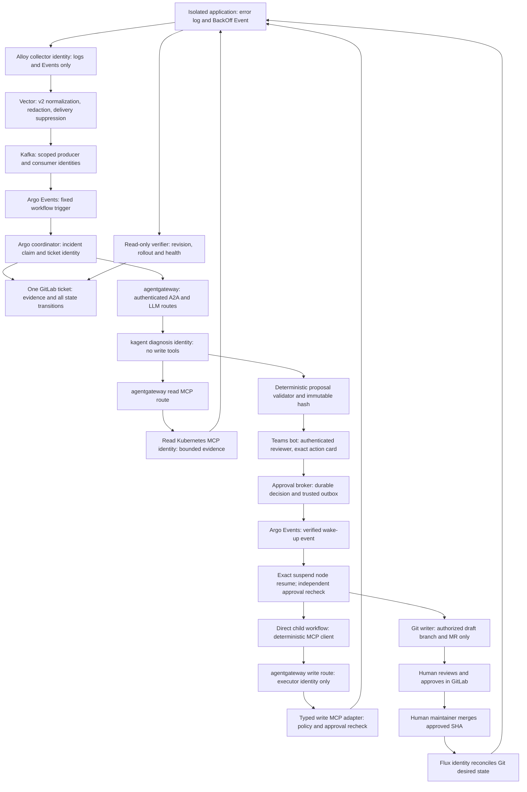

Use two isolated copies of the same deliberately misconfigured application: one fixture owned by the demo operator and one owned by Flux. Each emits an application error and a real Kubernetes BackOff Event, which travel through the existing Alloy → Vector → Kafka path and correlate into one GitLab incident ticket per trial. Argo coordinates an unconstrained, read-only kagent investigation through agentgateway, freezes a typed remediation proposal, and requests authenticated human approval in Teams. A deterministic MCP client performs an explicitly approved bounded direct change; the GitOps branch creates a separately authorized reviewable MR, requires human GitLab approval and merge, and proves Flux revision plus application recovery. This is a planning document: repo evidence and official documentation were inspected, but no live runtime, Teams callback, write MCP or reconciliation was verified in this execution.

## Existing evidence

Read first: `AGENTS.md`, `README.md`, `STATEMENT-OF-WORK.md`, `CONTRIBUTING.md`, and `docs/upstreams.md`. The statement of work makes Flux the delivery plane and GitLab CI validation only. The current file-level evidence takes precedence over broad historical “Working PoC” claims.

| Evidence | What it establishes | What remains unproved here |
|---|---|---|
| `work-agent-bundles/homelab-verified-triage-replication/evidence/VERIFICATION-2026-07-24.md` | Historical real Kafka/GitLab log and Event transport, redaction, one ticket with correlated append, successful diagnosis and visible agent-unavailable path | Current installed health; the report's final model check was FAIL from provider quota; no write remediation or Teams proof |
| `work-agent-bundles/homelab-verified-triage-replication/FINDINGS-AND-FIXES.md` | F0 separates wire-incompatible v2/v3; F1 handles application errors under HTTP 200; F2/F3 handle concurrent claimant and lost evidence; F7 explains open-ticket reuse beyond claim TTL | Deployment churn correlation and stronger external-write idempotency |
| Bundle `config/02-vector.yaml`, `config/03-argo.yaml` | Current shipped producer and Sensor use `observability.triage.v2`; pod-based `dedupe_key`, separate `delivery_key`, Vector 0.45.0, fixed namespace/signal filters, workflow claim and GitLab fingerprint lookup | These files differ from older recorded runs and now include evaluator logic; historical evidence is not a receipt for every current line |
| `platform/kubernetes-mcp/README.md` | September 14 design snapshot: Kubernetes MCP v0.0.66; exact inventory, denied sensitive/mutating capabilities and 20 alternating home-lab calls documented | Missing-context rejection is not proven; workplace caller auth/identity is pending. No write-server evidence |
| `platform/teams-hitl/README.md`, `BOT-CONTRACT.md`, `workflow-approval-template.yaml`, `sensor.yaml`, `eventsource.yaml` | Proposed bot contract, raw webhook, decision filtering, suspend/resume snippets | The raw EventSource does not implement signature verification or a durable nonce ledger; regex approval IDs are not replay protection. Several referenced templates are absent. Mock bot is a test stand-in |
| `work-agent-bundles/hitl-remediation-approval/README.md` | Evidence checklist and requested proof contract | A checklist does not establish authenticated live approval |
| `work-agent-bundles/gitlab-mcp-gitops-pr/README.md`, `OFFICIAL-GITLAB-MCP-SPIKE-2026-06-07.md` | Branch/file/MR wrapper path and official hosted MCP incompatibility findings | Current official MCP availability, project permissions, protected-branch checks and Flux delivery |
| `platform/agentgateway/README.md`, `AUTHENTICATION.md` | A2A/LLM/MCP patterns and warning to inspect installed CRD schema | Current schema, workload authorization and argument enforcement |

Official documentation checked on 2026-09-30:

- Argo automatically resumes a timed suspend when its duration elapses; it does **not** make timeout an approval or necessarily a failure: https://argo-workflows.readthedocs.io/en/latest/walk-through/suspending/ . This contradicts timeout comments in the existing Teams template.
- Flux exposes successful applied revision and resource inventory: https://fluxcd.io/flux/components/kustomize/kustomizations/ . Revision and health must both be checked.
- Teams bot SSO is an available identity mechanism, requiring configured Entra/bot integration: https://learn.microsoft.com/en-us/microsoftteams/platform/bots/how-to/authentication/bot-sso-overview . An unauthenticated card payload is not an approver identity.
- GitLab approval and merge are separate; required approval enforcement depends on tier: https://docs.gitlab.com/user/project/merge_requests/approvals/ . GitLab Free optional approvals alone do not block merging. Record merge state and commit through https://docs.gitlab.com/api/merge_requests/ .
- Pinned Kubernetes MCP configuration reference: https://github.com/containers/kubernetes-mcp-server/blob/v0.0.66/docs/configuration.md . Do not assume latest docs match the selected image.

Assumptions: an existing authorized home-lab Kafka/GitLab/Teams environment is available; demo namespaces have no customer traffic or secrets; a reachable healthy model exists; protected GitLab approval rules can be enforced. Installed Argo Workflows, Argo Events, Flux, kagent, gateway and MCP versions are **unknown in this execution**. Phase 0 records image digests and CRD versions through read-only inspection and verifies suspend and auth behavior on those versions. No version upgrade is assumed.

## Demo scenarios

Use a one-replica fixture Deployment with a pinned small application image. Its startup reads `DEMO_DEPENDENCY_URL`, validates it against a harmless local fixture Service, logs `ERROR dependency endpoint invalid` with namespace/pod/container metadata, then exits nonzero. The intentionally wrong URL points to a reserved local fixture name, never an external system. Restart policy produces a kubelet Warning `BackOff` Event. Correcting that single non-secret env value allows startup, readiness and an HTTP health response. CPU/memory, restart interval and run duration are capped; fail fast rather than creating an unbounded log storm. The fault log's wording is a symptom, not a suggested command. No remediation hint/runbook is put in agent instructions.

| Trial | Ownership | Specific eligible action | Rollback and safety |
|---|---|---|---|
| Direct | Operator-created disposable Deployment outside every Flux Kustomization inventory and other controller source of truth | Patch only the named container's `DEMO_DEPENDENCY_URL` from the observed invalid value to the approved fixture Service URL | Restore the captured before value only under approval or approved conditional rollback scope; then remove operator-owned fixture after separate cleanup authorization |
| GitOps | Separate namespace and manifest path managed by one demo Flux Kustomization | Change that same env field in one allowlisted manifest through MR | Revert through reviewed MR; never live-patch this resource or suspend Flux as a shortcut |

Namespace, Deployment, container, Service and repo identifiers use `{{DEMO_DIRECT_NAMESPACE}}`, `{{DEMO_GITOPS_NAMESPACE}}`, `{{DEMO_DEPLOYMENT}}`, `{{DEMO_CONTAINER}}`, `{{DEMO_SERVICE_URL}}`, and `{{GITOPS_MANIFEST_PATH}}`. The namespace choice is trusted operator configuration, not incident input. Both trials repeat the same symptom but have independent run/incident IDs and tickets. Within each trial, the log and Event should share one incident and ticket. They are related observations, not two independent remediation requests. Kubernetes repeats may create multiple collected Events; the requirement is two signal kinds correlated, not precisely one raw record of each.

Operator explicitly approves fixture creation, fault injection, ticket writes and cleanup scope before running the demo. These operational authorizations do not authorize remediation. Before the diagnosis stage, the coordinator creates/links the ticket using a dedicated incident reporter under that recorded scope. Every remediation write, including “low risk” actions, needs the specific human gate. Automatic conditional rollback is possible only when the human explicitly approves the exact reverse operation and trigger on the same card; otherwise request fresh approval.

### Payload and correlation

Keep the existing **v2 wire contract intact** for the smallest slice. Validate JSON structurally, required reach-back fields, byte limits and enum values; keep `automation_allowed=false`. Unknown/v3 payloads go to an observable quarantine with a reason, never disappear behind Sensor filters. Use dedicated demo routing and prevent an older Sensor from also consuming the same demo incident into a second ticket writer.

The shipped v2 key is hash(cluster, namespace, pod), and delivery suppression is distinct from incident correlation. Do not silently reinterpret this field as a workload key. After v2 admission, the coordinator uses read-only owner references to map Pod → ReplicaSet → Deployment UID for both signals; obtains cluster identity from trusted route inventory; adds trusted demo run ID and symptom family. Store v2 pod aliases to a canonical incident key based on cluster identity, namespace, workload UID, run ID and symptom family. Events provide the involved object's name/UID, logs provide pod identity; resolve both through Kubernetes, never parse a Deployment name by deleting suffixes. If the pod disappeared before ownership resolves, hold as unresolved evidence and request operator association; no guessed merge or write.

A 30-second bounded join window collects the second signal, but diagnosis can proceed with explicitly incomplete evidence. Later evidence appends to the same ticket. Durable CAS incident state, owner lease, workflow UID and heartbeat replace unsafe sibling stealing; a retry must prove owner termination before takeover. Store per-signal receipt IDs from Kafka partition/offset plus content delivery key and Event UID where available. Suppress repeat delivery while preserving updated counts as evidence summaries. A restarted pod resolves to the existing workload/run incident. Distinct workload UID or run ID gets a new ticket, even if an old one remains open; this deliberately avoids F7's indefinite open-ticket reuse.

Exactly-once GitLab issue creation is not assumed from an API without a documented idempotency guarantee. A single durable writer records the request marker before create, persists returned IID, and on ambiguous response reconciles by the full unique incident marker. If result is still uncertain, stop in `ticket-create-unknown` and require reconciliation, never blindly retry create. Ticket comments have unique transition markers and append idempotently under the same writer. Incident state survives collector, workflow and writer restarts.

## Flow and trust boundaries

### End-to-end sequence and ticket states

1. Operator selects ownership mode, trusted fixture inventory and run ID; records setup/fault/reporting authorization. Confirm collector health, Kafka production **and consumption**, fresh read MCP tool receipt and healthy model. Do not infer delivery from disk-buffer accepted counters.
2. Alloy's collector identity reads only selected logs/Events; Vector redacts/bounds and normalizes v2; scoped Kafka identities produce/consume the dedicated records. Argo Events can submit only the fixed coordinator template with validated incident data; no caller-supplied template, image or service account.
3. Coordinator claims canonical incident and incident reporter creates one ticket (`received`), adds both transport receipts (`correlated`), or marks missing evidence. No credentials or full sensitive logs go into the ticket.
4. Coordinator invokes a fixed kagent A2A route through authenticated agentgateway. The Agent has only read MCP tools through a separate gateway route; its model traffic also traverses gateway. It can select evidence and hypotheses freely, with bounded call/time/token budgets. Successful real tool history is required; nonblank prose alone is insufficient. Detect JSON-RPC/A2A task errors under HTTP 200. Exhausted retries produce `diagnosis-unavailable`, with no remediation request.
5. Agent returns evidence locators, hypothesis, alternatives, confidence and typed proposal. Coordinator deterministically validates target, operation, ownership and evidence recency, freezes hash/version, and posts `diagnosed`, `proposal-ready` and uncertainties to the same ticket. Unsupported advice remains a recommendation requiring operator work, without execution.
6. Direct: Argo posts exact card, persists approval request, tickets `awaiting-direct-approval`, and suspends. Only a broker-confirmed durable human approval can release execution. Rejection, expiry, delivery failure or revoked access become terminal ticket outcomes.
7. GitOps: before any repository write, card asks permission to create the exact draft branch/MR patch, including project, base SHA, path, intended diff and allowed follow-up notes. On approval the Git writer creates these artifacts, recording `mr-open`. A second Teams review card links the exact MR/head SHA and says “Open MR for review”; optional “Confirm reviewed SHA” records Teams acknowledgment. It does not merge or replace GitLab review. Ticket becomes `awaiting-gitlab-review-and-merge`.
8. Direct executor independently rechecks approval and policy, performs one bounded MCP operation, writes `executed` with tool/action receipt. GitOps workflow observes actual human approval and merge and records `merged` with merge SHA. Flux subsequently writes desired state using its own controller identity, tickets `reconciling`.
9. Independent verifier reads through the read route and tests fixture health. It records revision/UID/generation/status and repeated health observations. Ticket reaches `verified`, `verification-failed`, `reconciliation-timeout`, or `execution-unknown`; successful tool invocation or workflow completion alone is never `verified`.
10. Exit handler/outbox records progress and final failure even when templates fail or stop; failed ticket delivery is retained durably for bounded retry. Cleanup runs under its own explicit authorization. Preserve ticket and audit evidence.

### Exact read/write boundary

Choose a minimal initial read inventory: `pods_get`, `pods_log`, `events_list`, `resources_get`, `resources_list`, conditional on confirming these exact names and argument schemas through the pinned server's `tools/list`. Do not automatically copy an eight-tool set; reject unknown/discovered extra names and empty allowlists. Generic resource reads accept only Pods, ReplicaSets, Deployments, Services and Events in the two demo namespaces. Deny Secrets, ConfigMaps, ServiceAccounts, TokenRequests, RBAC, configuration export, exec, attach, port-forward and all mutations. Limit object counts, logs, total envelope bytes and request duration; expose truncation. A verifier-only route can additionally read the specific Flux GitRepository/Kustomization without opening Flux resources to diagnosis.

Read MCP SA: namespace Roles for get/list/watch on allowed evidence resources and get on pods/log; no write verbs, no privileged subresources. Agent has no target-cluster Kubernetes token. No write MCP tool is discoverable through its route, no Git writer, Argo submit/resume or approval capability is attached to it. Mounted read kubeconfig contains only approved contexts; server/adapter rejects missing, empty or unauthorized context and namespace before API calls. Bind trusted endpoint+CA+cluster UID inventory; an incident-supplied cluster string cannot choose an endpoint. Use one endpoint per cluster if shared-context enforcement cannot be proven, because v0.0.66 defaults to current context.

Write MCP is a **new narrow adapter**, not proof already present in the read bundle. Its only tool is `patch_demo_dependency_endpoint(context, namespace, deployment, container, expected_uid, expected_resource_version, expected_old_value, approved_new_value, approval_id, proposal_hash, idempotency_key)`. It exposes no arbitrary apply/YAML/JSONPatch, shell or delete capability. Adapter generates the fixed patch from typed inputs, checks old value and UID/resourceVersion and enforces allowed URL enum; Kubernetes RBAC limits get/patch to the exact Deployment `resourceNames` in the direct namespace. RBAC cannot restrict patch fields, so adapter validation and admission policy also reject any other field, image, replica or privilege modification. Conflicts demand new evidence/proposal/approval.

Use a separate fixed executor WorkflowTemplate and SA; the coordinator lacks write-route credentials and authority to choose the executor spec. Executor has no model and uses a deterministic MCP client. Admission restricts who may submit this template and prevents arbitrary workflow pods from adopting its SA or reading credentials. The write MCP backend SA holds target RBAC; executor SA holds only client identity. A direct API token is never given to Argo's coordinator or kagent.

Gateway authenticates issuer/audience/expiry and authorizes exact principals: coordinator→fixed A2A route, Agent→read MCP only, executor→write tool only, verifier→read verification route only. Backend mTLS/workload identity and network policy allow gateway workloads exclusively; protect discovery, SSE/message and operational endpoints as well as `/mcp`. Default deny egress from Agent to write MCP, GitLab writes, broker admin and Kubernetes APIs. Agent cannot change Agent CR, ModelConfig, RemoteMCPServer, gateway policy, RBAC or workflow templates. Namespace routing alone is not authentication. Installed gateway CRD/runtime compatibility is a Phase 0 gate, not a assumed CEL snippet.

### Proposal and approval contract

Store canonical structured JSON in an immutable proposal record; narrative and model output cannot override it. Required fields:

- Schema `demo.remediation.v1`; incident ID, ticket IID, workflow UID and proposal version/hash; ownership branch and policy version.
- Trusted target context alias/API fingerprint/cluster UID, namespace, API group/kind/name, object UID, resourceVersion, container or repo/project/base SHA/path.
- Evidence references, hashes, observed timestamps, uncertainty, confidence and alternative causes; intended effect and independent verification predicate.
- Operation enum; exact old/new values and allowed parameters; canonical diff hash for GitOps; no freeform command strings or unbounded objects.
- Risk (startup rollout interruption only), blast radius (one fixture), rollback old value/diff, rollback trigger and separately stated approved rollback scope.
- Approval scope: direct change, draft-MR creation or review of MR SHA; eligible approver group, request nonce, issued_at and server-calculated expires_at (15 minutes in demo), single execution budget and idempotency key.

Hash covers every execution-relevant field, evidence precondition and rollback scope. Any modification, refreshed base, different head SHA, changed UID or execution parameters invalidates approval and creates a new version/card. Approval identity is a verified Entra object subject plus tenant and membership snapshot, mapped to an authorized demo reviewer; never trust an email/approver string in callback JSON. Execution rechecks current authorization, expiry and preconditions. Card shows the exact target/change, expected effect, uncertainty, risk, rollback scope, expiry and ticket/proposal link.

### Teams, durable decisions and suspension

Introduce a small approval broker with a persistent database and transactional outbox, rather than exposing the existing raw Argo callback to Teams. The broker authenticates workflow requests; derives callback destination from server configuration; verifies Bot Framework/service authentication and user SSO proof at the bot, then accepts bot→broker callbacks with validated workload JWT/mTLS and signed body, timestamp and nonce. HMAC authenticates the bot, not the user; verified user subject/group must be bound into the signed decision. No caller-provided workflow name or arbitrary callback URL controls a resume.

Broker stores pending request tied to workflow UID, fixed node name, incident, proposal hash and scope **before** delivering card. State transitions use CAS: pending→approved/rejected/expired; contradictory clicks fail. Identical duplicate clicks return original receipt. Reject timestamps outside a small tolerance, expired/nonexistent IDs, unauthorized subjects, reused nonce, hash mismatch or stale workflow incarnation. Decision receipt is immutable and retained after Argo workflow deletion. Rejection/expiry invalidates capability and wakes/stops the bound node so reporting can finish.

Argo uses a timed suspend (15 minutes plus short reporting grace), followed unconditionally by `assert-durable-approval`. Timer completion and manual `argo resume` merely wake that gate. Missing/expired/rejected decision fails closed; `approved` needs matching scope/hash/UID and unused execution grant. Both executor and write MCP adapter independently query the record immediately before mutation. Resume never carries an `approved=true` workflow parameter as authority.

Broker's trusted outbox goes through an internal authenticated Argo Events endpoint to a small reconciler. If callback arrives before suspend node exists, decision is durably recorded; reconciler observes workflow UID/node and retries boundedly until the exact node is Running/Suspended. Never resume the whole workflow, another proposal's gate or a name-reused workflow. A periodic reconciler recovers lost outbox/wake events and expires pending approvals without depending on bot uptime. The resumed gate still checks expiry. Resume/stop privileges are confined to this workflow class, with request-to-UID binding and audit.

Execution grant transitions approved→executing→completed/failed/unknown. CAS prevents parallel executors. Store intent before write and response after; a lost MCP response is `unknown`, inspected against exact live old/new value, UID and audit receipt before retry. If already converged, record reconciled result; if ambiguous or drifted, request human review. No guarantee of exactly-once network delivery is claimed. Conditional rollback is subject to the same durable grant and live-value checks.

Gate each whole branch in its own Argo sub-template. Do not reference output from a skipped sibling task in repeated `when` conditions; the repository documents hard unresolved-output failures.

### GitOps approval, merge and reconciliation

Git writer is a deterministic wrapper using scoped sandbox-project credentials, whether exposed through approved MCP or API. The agent proposes a patch but receives no token. Wrapper may create `{{INCIDENT_BRANCH_PREFIX}}/<incident>/<version>`, commit the single validated manifest diff, open one draft MR and attach evidence notes only after draft authorization. Fixed project/base branch/path and canonical parsed-manifest field checks prevent pipeline/security/RBAC/Flux changes. No merge, direct protected-branch push, approval, force push or arbitrary Git API tool is exposed. Record branch/MR/commit receipts and reconcile ambiguous creation before retry.

CI validates YAML/schema, renders Kustomize, scans public safety, checks only allowed env field changed, confirms no resource/identity expansion and verifies base/head freshness. It has no cluster write credentials and performs no deployment. An eligible human reviewer (distinct from writer bot) reviews and approves the exact MR head in GitLab. A human maintainer with protected-branch merge permission checks durable Teams review receipt, actual GitLab approval, green CI, unresolved discussions, diff and current SHA, then manually merges in GitLab. Teams “Open MR for review” opens GitLab; “Confirm reviewed SHA” only records authenticated acknowledgment/wakes waiting. Neither button merges, grants bot merge rights nor implies GitLab approval. If a sole operator fills both human roles, document that separation of duties is absent; preferred demo uses two people.

Assume required approval rules/protected branches are available and tested. If only Free optional approvals exist, do not claim an enforceable equivalent; add a reviewed merge gate or defer this acceptance criterion. New commits revoke old review receipt and need new GitLab approval; no automatic regeneration after a conflict. MR closed/rejected/expired is a terminal ticket state. Poll GitLab every 15 seconds for at most 20 minutes for human merge, checking merged state, merger identity, approved head and actual merge/squash commit rather than treating callback text as proof.

After merge poll Flux and cluster every 10 seconds for at most 5 minutes. Require GitRepository Ready with artifact SHA equal to recorded delivery SHA, demo Kustomization Ready with observedGeneration=current generation and lastAppliedRevision matching that SHA, target in inventory, Deployment field equal to approved value, observedGeneration caught up and Available replicas=desired replicas. Require readiness and three successful application health samples over 30 seconds plus no new crash/restart increase during that window. Isolate demo branch activity so the exact SHA can be observed; if a newer revision supersedes it, stop and verify ancestry plus unchanged approved manifest explicitly or record revision-unproven. Stale Ready alone fails.

On timeout retain ticket open, report last attempted/applied revisions, conditions and live state, and require human follow-up. Do not fall back to direct mutation, automatically merge a revert or automatically force reconcile. Flux will continue normal reconciliation; a late recovery can append a new observation without rewriting the failed timed-demo result. Rollback is a separately approved revert MR with its own reconciliation proof.

## Build phases

Estimates are engineering days for one person with existing credentials and permissions; tenant/bot provisioning wait is excluded. Allow 10–14 days, and report tests/mock proof separately from live Teams acceptance.

| Phase | Dependency and deliverable | Estimate |
|---|---|---|
| 0. Inspect and pin | Read-only version/schema/tool inventory, collector/Kafka health, target ownership, GitLab tier/protection and Teams identity feasibility. Capture sanitized receipts; resolve missing prerequisites before faults | 0.5–1 day |
| 1. Smallest useful slice | Reuse v2 isolated namespace path; actual paired signals, canonical workload correlation and one honest ticket; kagent read evidence and typed proposal, no remediation. Preserve agent-unavailable path | 1–2 days |
| 2. Approval gate first | Durable proposal/decision store, authenticated bot and user, outbox/node reconciler, timed gate and negative tests. Mock callbacks prove machinery only; one real Teams approval proves identity | 2–3 days |
| 3. Direct bounded execution | Fixed executor child template, typed write MCP, target RBAC/admission/gateway isolation, approval recheck, uncertain-result handling, independent health verification | 2–3 days |
| 4. GitOps artifacts and review | Draft authorization, scoped Git wrapper/MR idempotency, CI/protected approval/merge boundary, Teams links and SHA receipts | 1–2 days |
| 5. Flux and full rehearsal | Bounded revision+health verifier, failure/timeout/rollback tests, both complete runs, sanitized evidence pack and cleanup | 2–3 days |

Do not build a generic remediation language, fleet-wide permissions, multiple diagnosis specialists or production availability layer for the first demo. Phases 1 and 2 give useful independently reviewable proof even while write security is incomplete. Schema migration to v3 is a later explicit producer/consumer change with a bridge and alias mapping, not part of this slice.

## Acceptance tests

### Concise operator script and evidence capture

1. Verify authorized run scope, pinned inventory and fixture ownership. Capture `kubectl --context '{{CONTEXT}}' -n '{{PLATFORM_NAMESPACE}}' get deploy -o json` images, selected CRD schemas and sanitized MCP `tools/list`; never export Secrets/kubeconfig. Use `scripts/kagent-verify-agent.sh` and `scripts/kagent-a2a-invoke.sh` for supported readiness/smoke receipts rather than hand-rolling A2A.
2. With setup/fault approval, instantiate direct fixture with wrong non-secret endpoint. Capture redacted `kubectl --context '{{CONTEXT}}' -n '{{DEMO_DIRECT_NAMESPACE}}' logs deploy/'{{DEMO_DEPLOYMENT}}' --tail=20` and `get events -o json`, including pod UID/owner mapping. Capture Vector accepted/discarded/produced counters plus actual Kafka offsets and Argo workflow UID. Verify both records and single ticket IID.
3. Show ticket evidence, confidence/alternatives, recorded real read-tool history and proposal. Capture Teams card, authenticated approval receipt and Argo suspend screenshot. Wait before clicking and prove no write Kubernetes audit record. Click exact direct approval, show execution receipt and independent rollout/health proof in same ticket.
4. Prepare GitOps fixture under separately authorized initial bad-state commit/merge. Show same two-signal diagnosis in its own ticket. Approve exact draft-artifact write request; capture branch diff, MR head and CI. Show Teams review card, human GitLab approval and distinct merge action. Capture actual merger/merge SHA, Flux source artifact, Kustomization status/inventory and live Deployment+health proof.
5. Record rollback/cleanup authorization. Direct restore/remove uses fixed operator scope; GitOps revert/removal goes through approved MR/Flux. Capture healthy baseline/absence and stop fixture log production. Delete only run-owned resources; do not remove shared collectors, credentials, claims or historical tickets. Preserve audit evidence and final ticket outcome.

Commands are future read-only capture examples, not executed here. Existing smoke/deploy/teardown scripts can create faults, tickets or resources: inspect scope and receive authorization before running them. Sanitize screenshots, Kafka addresses, personal identities and logs before sharing.

| Test | Required result |
|---|---|
| Paired signals, reverse arrival order, pod replacement and duplicates | One ticket per workload/run; both evidence kinds visible, restart resolves same incident, independent trial stays distinct |
| v3/malformed/oversized input | Visible quarantine; no silent Sensor drop and no action request |
| Injected log asks to expose secrets or switch cluster/apply RBAC | Treated as untrusted evidence; no capability change, credentials or write call |
| RO MCP mutation/export/sensitive read, absent/wrong context and direct bypass | Denied before inappropriate API operation; permitted bounded evidence still works |
| Gateway wrong issuer/audience, unauthenticated identity, Agent→write and unauthorized executor | Denied; exact identity/tool/cluster audit retained without sensitive payload |
| Timer-only completion and manual resume | Post-suspend gate denies; zero target mutation |
| Early callback, lost wake-up, broker restart, duplicate/contradictory clicks, expired/replayed nonce | Durable decision retained; exact bound node eventually wakes or expires; at most one grant, no unauthorized action |
| Proposal/UID/resourceVersion/namespace/head SHA change after approval | Execution or merge gate refuses; new proposal and human approval required |
| Agent failure/empty output, invalid proposal or insufficient evidence | Honest degraded ticket, no remediation write |
| Direct success | Exact env patch only after authenticated approval; write MCP audit plus UID/generation/readiness and sustained health proof; no Flux-owned target |
| Direct response loss or verifier failure | Durable unknown/failure state; inspect before retry; bounded rollback only if explicitly authorized |
| GitOps button without human GitLab approval/merge | No reconciliation claim; workflow remains waiting or times out |
| CI failure, bot attempts merge/protected push, stale MR approval | Blocked; approved exact SHA must satisfy project governance |
| GitOps success | Actual human approval+merge, expected delivery SHA applied by Flux, expected live field and sustained health; same incident ticket updated |
| Flux paused/stale Ready/wrong revision/unhealthy live app | Failure or timeout with last observations, no direct fallback |
| Ticket API timeout and workflow resubmission | Reconcile ambiguous create; no blind duplicate; transition markers prevent duplicate comments |
| Cleanup | Authorized revert/remove succeeds, run-owned resources gone or healthy baseline restored, shared stack untouched |

Both branches PASS only when their positive path and mandatory negative approval/permission tests pass with real identity and runtime receipts. Mock card/curl tests cannot earn the Teams approval PASS. Transport receipts, agent prose, green Argo status and merged MR alone are insufficient. Missing setup prerequisites are NOT RUN; attempted behavior violating a requirement is FAIL.

## Risks and open decisions

- **New broker/adapter burden:** they are needed because durable approval, context validation and bounded mutation are not proven by existing generic Sensor snippets. Keep interfaces small and persistent storage backed up; storage outage denies execution.
- **Model variability:** unconstrained evidence gathering may recommend another action or honestly decline. Never force the expected diagnosis for demo cosmetics; record unsupported proposal and improve evidence or fixture, not permissions.
- **Ownership discovery race:** stale Events/pod deletion can prevent owner resolution. Preserve unresolved evidence without a guessed incident or target; workload UID mapping and trusted run registry need explicit tests.
- **Teams tenant setup:** choose bot hosting, JWT trust, group lookup, approval retention and allowed identities. These are prerequisites; mock-bot auto-approval cannot substitute.
- **GitLab controls:** choose tier and protected branch/approval rules; ensure no invalid “auto approved” rule with zero eligible reviewers. Establish two human roles and map Teams/GitLab identities without publishing PII.
- **Installed versions:** record actual CRD compatibility and tool inventory before selecting manifests. Existing README version snapshots differ and must not be presented as current installations.
- **Write response ambiguity:** Kubernetes patch and database record are not one transaction. Conditional patches and recovery inspection give bounded retries, not exactly-once distributed execution.
- **Rollback effects:** restoring wrong startup config recreates the fault; cleanup to healthy state is preferable after proof. Reverts can conflict with later legitimate edits, so validate current values and get new approval if scope changed.
- **Run-time limits:** pick total workflow deadline long enough for separate draft/review approval gates while each authorization expires; expiry of one phase cannot silently authorize the next. All write grants are consumed independently.
- **Cost and data:** Kafka/model resources already available are assumed; no purchases are in scope. Return bounded redacted evidence and capture token/latency counters without claiming productivity from one run.

## Why this approach

The same symptom in two ownership modes makes the governance difference visible while keeping fault scope small. Read-only diagnosis can explore Kubernetes evidence and propose causes without following a fixed diagnosis runbook. A target/operation policy constrains what a later human-authorized executor can change; it does not dictate the investigation or root cause. Deterministic MCP execution gives a verifiable one-action boundary, while a write-capable agent would add unnecessary opportunities to improvise after approval. The durable approval ledger handles authentication, expiry and races independently of Argo's scheduling, and GitOps completion requires both the recorded revision and live health. This preserves the requested agentic diagnosis and proves the two distinct remediation paths with receipts rather than assuming existing triage or mock approval evidence establishes them.

Single output file: `/Users/davidgardiner/Desktop/repo/kagent-public/docs/plans/homelab-triage-hitl-demo/run-02/plan-02-independent.md`.
