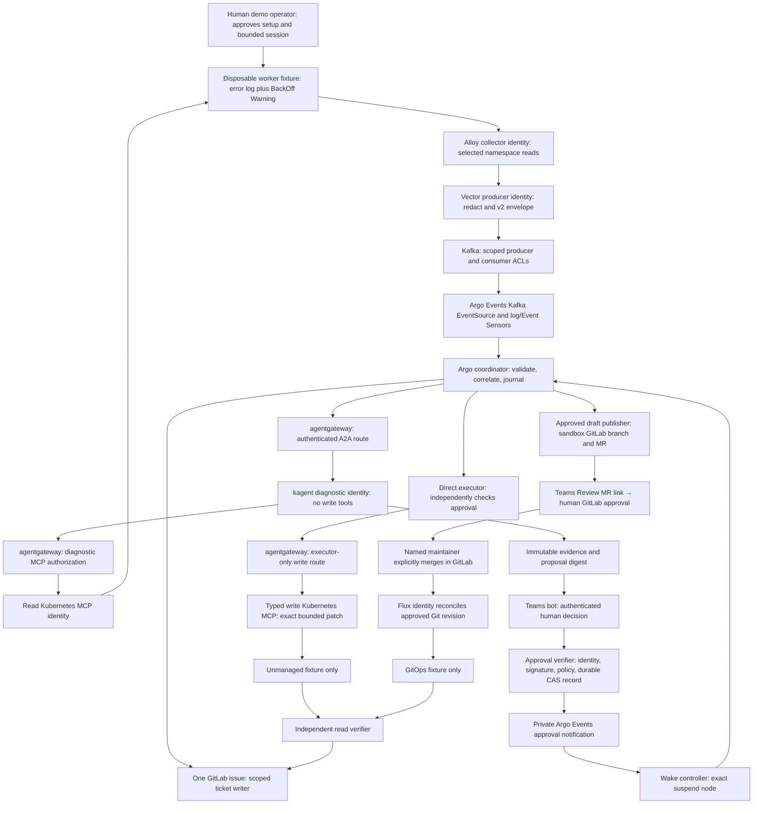

Use one correlated incident and one GitLab ticket per demonstration episode, with the existing Alloy → Vector → Kafka v2 transport retained and a new deterministic incident coordinator added after Argo Events. A read-only kagent agent reached through agentgateway freely investigates a reversible application configuration failure and returns a structured proposal. Separate human approvals govern a typed Kubernetes MCP execution path and a GitLab MR path; neither workflow progress nor a Teams click substitutes for an authorization record. Demonstrate direct remediation only on an explicitly unmanaged fixture, and desired-state remediation only on a Flux-managed fixture. This is a planning document based on repository inspection and official documentation on 2026-09-30; it includes no fresh live proof and makes no changes to connected systems.



## Existing evidence

Read first: `AGENTS.md`, `README.md`, `STATEMENT-OF-WORK.md`, `CONTRIBUTING.md`, and `docs/upstreams.md`. They establish the public-safety rules, workflow-held execution permissions, GitOps direction, and upstream verification requirements. Existing local work must be preserved.

| Evidence inspected | What it supports | What it does not establish |
|---|---|---|
| `work-agent-bundles/homelab-verified-triage-replication/README.md`, `evidence/VERIFICATION-2026-07-24.md` §§6–7 | Historical real log and Event transport, available/degraded agent analysis, correlated GitLab work items, concurrent claimant behavior | Current health, authenticated Teams callbacks, direct write remediation, Flux remediation |
| Same bundle `FINDINGS-AND-FIXES.md`, especially F0–F3, F7; `config/02-vector.yaml`, `config/03-argo.yaml` | Canonical v2 bundle; failure detection; CAS claims; append/fingerprint fallback; v2/v3 incompatibility; pod correlation and open-ticket lifetime behavior | Controller-stable incident identity or durable business approvals |
| `platform/kubernetes-mcp/README.md` | Security design based on Kubernetes MCP v0.0.66; historical eight-tool lab inventory, denied dangerous operations, two-context routing and alternating-call proof | Missing-context enforcement, authenticated workplace callers, new typed write tool |
| `platform/teams-hitl/{README.md,BOT-CONTRACT.md,eventsource.yaml,sensor.yaml,workflow-approval-template.yaml}` | Proposed request/callback contract and Argo suspend/resume skeleton | Implemented HMAC checking, authenticated approver resolution, replay ledger, approval recheck |
| `platform/teams-hitl/mock-bot/app.py` | Development stand-in; source explicitly says no authentication, HMAC or persistence | A real Teams approval or durable approval proof |
| `work-agent-bundles/hitl-remediation-approval/README.md` | Required proof markers | Completed end-to-end proof; its title and acceptance statements are requirements |
| `work-agent-bundles/gitlab-mcp-gitops-pr/{README.md,OFFICIAL-GITLAB-MCP-SPIKE-2026-06-07.md}` | Scoped branch/file/MR/note wrapper path; historical official MCP OAuth/tool discovery blocker | Official hosted GitLab MCP working now or approval/merge/Flux completion |
| `platform/agentgateway/{README.md,AUTHENTICATION.md}` | Historical v1.1.0 chat and secret-rotation evidence; documented v1.3.1 install baseline; identity and backend credential separation | v1.3.1 runtime policy acceptance or A2A/MCP caller isolation on today's lab |

Source review found two safety corrections required before reuse. The approval template contains a tier-dispatched auto-execute route and must be replaced with an approval requirement for every mutation. Its suspend comment claims timeout fails; official Argo documentation says duration automatically resumes. The Sensor checks body fields and a nonce-shaped string, but no source here implements the claimed HMAC or durable deduplication. An IP allowlist or a matching `approval_id` pattern cannot fill those gaps.

Official sources checked, with version limitations:

- Argo duration automatically resumes: https://argo-workflows.readthedocs.io/en/latest/walk-through/suspending/ . This supports the approval-recheck design; installed controller version remains unverified.
- Kubernetes MCP v0.0.66 configuration and exact allowlists: https://github.com/containers/kubernetes-mcp-server/blob/v0.0.66/docs/configuration.md ; tool source: https://raw.githubusercontent.com/containers/kubernetes-mcp-server/v0.0.66/pkg/toolsets/core/pods.go and https://raw.githubusercontent.com/containers/kubernetes-mcp-server/v0.0.66/pkg/toolsets/core/events.go . Pin a reviewed digest and verify actual `tools/list`; this plan does not assume the newest release is installed.
- Gateway JWT documentation: https://agentgateway.dev/docs/kubernetes/latest/documentation/security/jwt/setup/ . Latest documentation is guidance; the installed CRD schema and negative runtime tests are the release gate.
- Teams SSO: https://learn.microsoft.com/en-us/microsoftteams/platform/bots/how-to/authentication/bot-sso-overview . Bot identity infrastructure must be registered and tested; no tenant availability is assumed.
- GitLab approval semantics and tier limits: https://docs.gitlab.com/user/project/merge_requests/approvals/ . Free-tier approvals are optional; required rules need an appropriate tier.
- Flux status and inventory: https://fluxcd.io/flux/components/kustomize/kustomizations/ . Applied revision, observed generation and live health are distinct checks.

Before implementation, collect controller images/digests, Helm metadata, CRD schemas, Agent/RemoteMCPServer status, gateway route/policy status, GitLab version/tier/protected-branch settings, and Flux source/Kustomization configuration using read-only commands. No connected-system reads were made during this planning run, so all installed versions and current wiring are explicit unknowns.

## Demo scenarios

**Common failure:** build a tiny local-only HTTP fixture with an already reviewed image digest and an environment variable `DEMO_MODE`, whose valid enum is `healthy|invalid`. In invalid mode it prints one stable `ERROR invalid demo configuration: DEMO_MODE=invalid` line, exits nonzero, and eventually causes the kubelet's genuine `Warning/BackOff` Event. In healthy mode it serves `/healthz` successfully and stays running. It needs no database, credentials, external network or mounted ConfigMap. Limits: one replica, 50m CPU/32Mi memory, non-root, read-only root filesystem, no capabilities, no service-account token. A healthy startup/probe contract must be measured before the demo. This extends the existing `fixtures/crashloop-fixture.yaml` pattern, rather than claiming that its unconditional `exit 1` is already remediable.

Use two different approved namespaces and deployment targets, represented as `{{DIRECT_NAMESPACE}}/{{DIRECT_DEPLOYMENT}}` and `{{GITOPS_NAMESPACE}}/{{GITOPS_DEPLOYMENT}}`. Each episode emits one representative log and one genuine Event; repeated crashes are expected and suppressed. Show both evidence records in one incident, not two tickets. Use distinct episode IDs for the two branch demonstrations.

**Direct:** the fixture Deployment is outside all Flux/Helm/other controller desired-state inventories except its own ReplicaSet ownership. Human explicitly authorizes the fault and bounded setup first. Agent discovers the env error from logs, Deployment specification, pod status and Events; proposes changing only `DEMO_MODE` from `invalid` to `healthy`. Direct admission rejects any Flux-managed target. Do not suspend Flux, strip ownership, or create an exclusion merely to force this branch.

**GitOps:** the second Deployment is owned by a dedicated Flux Kustomization pointing at a sandbox repository path. Human reviews and merges the setup/fault commit first. Agent proposes the same environment change in that one manifest. The writer creates a reviewed draft after separate approval, then a human reviews and merges it; Flux performs the cluster mutation. The direct write MCP has no RBAC in this namespace.

Diagnosis is unconstrained within bounded evidence tools: do not tell the agent the fault variable, expected answer, command sequence or runbook. The fixture's design is known to the test operator but is withheld from the diagnostic prompt. Policy restricts executable operations, not the agent's hypotheses. If it recommends an unsupported fix or cannot establish the cause, retain its findings in the ticket and request human investigation; do not coerce a supported answer or claim remediation success.

## Flow and trust boundaries

### End-to-end flow and one ticket

1. Human signs an immutable demo-session authorization: approved cluster/API CA identity, two namespaces/targets, Kafka/topic scope, sandbox GitLab project, Teams audience, time window, ticket/card budgets, setup and cleanup scope. Explicitly approve each fixture/fault write. This also authorizes the bounded ticket creation/updates and approval-card communications needed for the demo; it is not approval for a model's later resource change. Default budget: one issue per episode, at most two active episodes, 20 issue notes per episode, three approval cards, no automatic reopening. If this authorization is absent, report locally and perform no external writes.
2. Alloy's collector identity reads only approved worker pod logs and Events. Vector redacts, caps evidence and preserves `observability.triage.v2`, `dedupe_key`, `delivery_key`, and `automation_allowed:false`. Kafka producer/consumer principals have separate topic ACLs. Actual consumed records and broker-produced counters prove delivery; buffer acceptance alone is insufficient for Vector 0.45.0.
3. Kafka EventSource plus separate log/Event Sensors invoke the coordinator using a pinned template reference. Validate schema, cluster inventory, namespace, timestamp within 24h, signal kind, Warning type, size, and session budget again in the workflow. Quarantine unsupported/stale records. The old acceptance of an empty Event type is tightened for this new demo, after checking Alloy actually carries type; do not silently copy that relaxed filter.
4. Coordinator resolves the pod to controller identity through trusted Kubernetes reads and stores both raw v2 keys and an internal incident key. Acquire a CAS incident lease and queue both signals. Open the authorized GitLab ticket immediately with evidence/status `collecting`, rather than waiting for the model. Append the second signal with a delivery-key note marker. Give the first arrival a 30-second coalescing window; late arrivals append without creating another diagnostic owner. A missing ticket acknowledgement blocks a second creation until recovery proves whether the first exists.
5. Argo's diagnostic caller reaches an authenticated agentgateway A2A route to a pinned read-only Agent. Use `scripts/kagent-a2a-invoke.sh` as the reference for trailing-slash JSON-RPC/text semantics; use `scripts/kagent-verify-agent.sh` for readiness gates during build. Gateway also mediates the agent's model and read-MCP routes. Calls through a controller-local bypass do not satisfy this requested gateway path.
6. Agent investigates using read tools; returns evidence citations, hypotheses, uncertainty and a structured recommendation. Store redacted evidence and its digest outside model-writable state. Ticket writer records proposed action or diagnosis failure. No result text is a shell command, callback URL, resource name authority or workflow template reference.
7. Deterministic validator builds the canonical proposal from registry-owned target data plus allowed model parameters. It checks current state, management ownership and operation policy. Human sees exact target/change/risk/rollback on the Teams card linked to the ticket. Approval verifier and wake path operate as below.
8. Direct executor rechecks the durable approval and executes one typed MCP operation. GitOps publisher instead uses approved draft authority, then waits for human GitLab review and merge. The same ticket receives each state: `awaiting-approval`, `approved|rejected|expired`, `executing|mr-open`, `waiting-flux`, `verifying`, `succeeded|failed|timed-out|outcome-unknown`.
9. Independent verifier records actual state and audit/artifact references. Coordinator finalizer runs for failed/rejected/expired flows too and uses the existing issue IID. If GitLab is unavailable, journal the final update in durable outbox, report ticket-update pending and retry with the same note marker. Do not disguise notification failure as end-to-end PASS.

### v2 compatibility and correlation

Do not rename or reinterpret v2 `dedupe_key`: it currently hashes cluster/namespace/pod and is not stable under Deployment churn. Preserve v2 transport and create a separate internal `demo.incident.v1` record with `episode_id`, trusted cluster ID, namespace, owner UID, signal delivery IDs and issue IID. Resolve pod → ReplicaSet → Deployment with bounded reads; both logs and Events carry the pod locator but neither is assumed to carry a reliable service label. Pod-name parsing alone is insufficient. If the pod has gone, use the immutable owner mapping captured when it existed; if no trustworthy mapping exists, quarantine for human correlation rather than guessing. Bind the episode ID in the operator registry, not in log text.

Internal key = hash(approved cluster ID, namespace, controller UID, authorized episode ID). A new pod under the same Deployment therefore enriches the existing episode, while another fault episode creates another incident. Store raw pod UIDs and source timestamps as evidence. One durable record stores incident lease, issue IID, evidence markers, proposal version and state. Existing ConfigMap CAS logic can be reused for a first laboratory slice with explicit retention, but this plan chooses a dedicated transactional store with unique keys and durable outbox for approval/execution records; workflow TTL must not erase them.

GitLab has no assumed cross-system exactly-once transaction. Serialize writers under the lease, embed a full incident marker in issue body/label, recover ambiguous POSTs by lookup, and block uncertain cases for review. This trades a stalled ticket for duplicate creation. Do not let the original pod-key ticket writer run alongside the new controller-key coordinator for these namespaces. Keep source topic unchanged where required; scope Sensors so only the new consumer owns the demo records. v3 records enter a separate versioned topic/consumer with separately tested adapter; feeding them to v2 Sensors must fail visibly, never silently mix fields.

### Read/write MCP boundary

| Principal | Tools/permissions | Explicit denial |
|---|---|---|
| Diagnostic Agent | Proposed exact `enabled_tools`: `pods_get`, `pods_list`, `pods_log`, `events_list`, `resources_get`, `resources_list`; core only, `read_only=true` | Configuration export, context switching, exec/attach/port-forward, mutations, secrets, credentials, RBAC, workflow submission, ticket writes, approval-store writes |
| Read Kubernetes MCP service | Namespace Role: get/list/watch pods, get pods/log, get/list/watch Events, Deployments, ReplicaSets and Services | ConfigMaps/Secrets/ServiceAccounts/TokenRequests, RBAC, any create/update/patch/delete; no default cluster-admin binding |
| Direct executor workload | Only typed `demo_set_mode` on executor-only gateway route; read approval endpoint | No A2A/model call, arbitrary tool name, arbitrary JSON/YAML patch, shell, approval creation, GitOps namespace |
| Write MCP service | Separate credential/context; Role get/patch on exactly `{{DIRECT_DEPLOYMENT}}` using resourceNames | No create/delete, other deployments, pods/exec, scale, image/command/RBAC/credential changes |
| MR publisher | Branch/file/MR/note wrapper tools on approved sandbox project and one path | Merge, approvals, settings, protected branch push, arbitrary repository/project |
| Ticket writer | Issues and notes in approved sandbox project within budgets | Repository changes, approvals or cluster execution |
| Callback verifier/wake service | CAS approval records; read exact workflow UID; bounded resume notification | Cluster mutation or model execution |
| Flux reconciler | Desired-state authority scoped to GitOps namespace | Direct namespace |

The proposed read list is intentionally smaller than the historical eight-tool inventory; verify exact names and discovery on the pinned runtime. For generic resources_get/list, argument adapter admits only the listed GVKs and exact namespace; resource reads still meet RBAC. Bound reads to 50 objects, 100 log lines, 32KiB response, 5 seconds per call and 12 model tool calls, with explicit truncation; adjust only after review.

Gateway authenticates issuer/audience/signature/expiry and authorizes workload subject plus route/tool. Reject spoofable identity headers. Each backend has its own credential, authenticated encrypted gateway connection, and direct-access-denying network policy. Omitted/empty/unknown contexts and namespaces fail before any Kubernetes call. Bind context to expected API endpoint/CA and registry target, never model strings. Prefer one single-context endpoint per branch if the argument-aware adapter cannot enforce this.

`demo_set_mode` is a new typed Kubernetes MCP adapter, not a claimed upstream tool. Its closed parameters are approval ID, proposal digest and idempotency key; it retrieves server-owned exact target and patch from durable state. It uses Kubernetes JSON Patch with tests for UID, resourceVersion and current env value before replacing exactly the named container's `DEMO_MODE`. Identify container/env indices from current validated state and bind the resolved patch hash; if state changes, require a fresh proposal/approval rather than applying a stale indexed patch. API audit must show the separate write identity. Because RBAC cannot restrict Deployment patch fields, a fail-closed admission rule for this identity limits the same env change and rejects all other field changes; bootstrap it under separate human authorization.

The workflow has no Kubernetes write credential. The write adapter independently verifies approval and atomically claims the execution slot, so compromising a diagnostic prompt or manually resuming a workflow cannot supply authorization. The adapter is reachable only by the executor identity; diagnostic Agent specs/ToolGrants cannot be model-edited. Operator controls protect changes to templates, registry, gateway policies, identities and admission rules.

### Remediation proposal contract

Example shape; placeholders describe server-filled values, not arbitrary model-controlled selectors:

```json
{
  "schema_version": "demo.remediation.v1",
  "incident_id": "{{INCIDENT_ID}}",
  "proposal_version": 1,
  "branch": "direct",
  "target": {
    "cluster_id": "{{APPROVED_CLUSTER_ID}}",
    "context": "{{APPROVED_CONTEXT}}",
    "namespace": "{{DIRECT_NAMESPACE}}",
    "api_version": "apps/v1", "kind": "Deployment",
    "name": "{{DIRECT_DEPLOYMENT}}", "uid": "{{TARGET_UID}}",
    "resource_version": "{{OBSERVED_RESOURCE_VERSION}}"
  },
  "evidence_refs": ["{{LOG_ARTIFACT}}", "{{EVENT_ARTIFACT}}", "{{LIVE_READ_ARTIFACT}}"],
  "evidence_digest": "{{EVIDENCE_DIGEST}}",
  "hypothesis": "Invalid application configuration causes startup exit",
  "uncertainty": "{{UNCERTAINTY_AND_DISCONFIRMING_EVIDENCE}}",
  "operation": "demo_set_mode",
  "parameters": {"container": "{{APPROVED_CONTAINER}}", "env": "DEMO_MODE", "from": "invalid", "to": "healthy"},
  "risk": "One disposable replica is replaced; expected interruption during rollout",
  "rollback": {"operation": "demo_set_mode", "from": "healthy", "to": "invalid", "requires_separate_approval": true},
  "verification": {"replicas": 1, "stable_seconds": 120, "timeout_seconds": 300},
  "approval_scope": "One execution of this immutable proposal on this UID",
  "expires_at": "{{UTC_EXPIRY}}",
  "idempotency_key": "{{INCIDENT_PROPOSAL_OPERATION_HASH}}",
  "policy_version": "{{POLICY_DIGEST}}",
  "proposal_digest": "{{CANONICAL_PROPOSAL_HASH}}"
}
```

Canonicalize deterministic JSON and hash the whole target/change/evidence/rollback/scope/expiry/policy contract, excluding its hash field. For GitOps add project ID, branch/base SHA, one approved file path, exact diff digest, source SHA and Flux object identities. A card shows the human-readable resolved contract plus digest. Approval expires after ten minutes by server time; execution must start within that window and finish within five minutes. A changed digest, policy, owner UID, precondition or source SHA invalidates approval. Model confidence never raises authority.

### Teams, suspend/resume and durable approval

Use a real Teams bot with Entra SSO for the approving human and authenticated bot activities. Verify the actor's stable directory object ID and tenant against `{{APPROVER_GROUP}}`; do not trust a body-supplied email or Teams user ID as the authorization identity. Confirm current group membership at decision time and execution time. Keep actual identifiers in the private audit store; public receipts replace them with placeholders.

Argo registers immutable `pending` record before sending the card. Bot submission is idempotent on approval ID/version. Teams callback enters an approval-verifier service using TLS and bot-service authentication plus HMAC over exact raw bytes, timestamp and nonce, or equivalent verified signed transport. Verify issuer/audience/expiry, allowlisted callback route, bounded size, decision enum, request/workflow UID, human identity, proposal digest and server expiry. Persist first valid decision with CAS before acknowledgement. Then publish a minimal authenticated notification to private Argo Events; Sensor invokes a fixed wake workflow and never directly trusts callback-supplied namespace/name to resume any workflow.

Approval state: pending → approved/rejected/expired/cancelled; approved → claimed → executed/failed/outcome-unknown. Same decision delivery is an idempotent acknowledgement. Conflicting decisions after final CAS are rejected and audited. Old proposal approvals and callbacks with reused nonce, altered workflow UID or expired timestamps never execute. A workflow retry cannot resurrect an approval for another UID; reattach to the same immutable record only for recovery, otherwise request a new one.

Place the whole branch chain in its own template gated once, avoiding skipped-step output references per `AGENTS.md`. Use a ten-minute timed suspend followed unconditionally by `require-durable-approval`; the latter checks the record, caller, digest, expiry and policy. Argo's duration automatically resumes, so timer completion means only “wake and check.” Manual resume is also only a wake. An independently authenticated human approval record is mandatory both here and in the write adapter.

Callback-before-suspend: persist first; wake controller retries for up to 60 seconds to locate the exact pending approval node and expected workflow UID. The workflow checks the record immediately before entering suspend and after it; if approved already, it skips waiting and still runs authorization recheck. A decision arriving between that check and node creation is recovered by the wake controller. Scheduled reconciling wake checks ensure a transient EventBus loss causes delay rather than lost approval. Node-scoped resume must be verified against installed Argo APIs; never resume all unrelated suspend nodes.

Rejection/expiry wakes to a non-writing finalization path and records why in the ticket. The gate itself rejects unauthorized continuation; stopping a workflow alone is not the durable rejection mechanism. Approval/card delivery failure leaves pending state and reports failure; it must not fall back to auto-approval. Mock/curl tests carry `simulated` provenance and cannot pass real Teams acceptance.

### Direct execution and recovery

Use a deterministic MCP client, not a write-capable kagent agent: after approval there is no need for another model to reinterpret the action. Recheck approval at the adapter, field policy, namespace/context, UID/resourceVersion, ownership and current value; CAS `approved→claimed` and record the outgoing patch hash before calling Kubernetes. One operation only, no best-effort fallback to kubectl.

If the MCP response is lost, read audit/current state. When exact desired state plus matching audit proves success, mark recovered; when unchanged and no write occurred, retry only under the same still-valid claimed operation with safe preconditions. Ambiguous state becomes outcome-unknown and requires human resolution; never blindly retry or acquire a new approval to hide uncertainty. Verify Deployment generation observed, one ready/available replica, correct env, healthy endpoint and stable restarts for 120 seconds. Old BackOff Events remain historical; check new timestamps and fresh counters rather than requiring Event deletion.

Rollback is a separately approved inverse change after checking current UID/state; reverting to invalid deliberately restores the demonstration failure, so cleanup to a healthy baseline or removal is preferable after its own explicit authorization. No automatic rollback or low-risk bypass.

### GitOps authority, approval, merge and Flux

1. Agent produces a proposed exact diff and rationale without GitLab write tools. Teams asks “Approve creation of this draft MR” with sandbox project, branch, base SHA, path and diff. This human approval allows the deterministic publisher to create one branch, commit, draft MR and evidence note. It does not authorize merge or cluster mutation. Session ticket-writing scope does not cover repository writes.
2. Publisher uses the reviewed GitLab-lite/API wrapper until official MCP is actually proven. Token grants are project-scoped; wrapper enforces branch prefix and single path. Branch/MR recovery uses incident/proposal markers and never creates duplicates on retries. Branch creation or file update errors leave the ticket blocked.
3. CI checks rendered Kustomize output, YAML/API schema, public-safe scan, exact path/field diff, unchanged image/permissions/resources, policy compatibility and fixture probe expectations. CI validates only; it has no kubeconfig or deployment credentials. Record source SHA and pipeline result. Source/base changes require rebuilt diff and fresh draft authorization if content changes.
4. Teams next asks the named `{{GITOPS_REVIEWER}}` to review and approve the MR. Button **Review MR** opens the authenticated GitLab MR page; it does not approve or merge. Reviewer approves in GitLab after reading diff/evidence, giving an authoritative GitLab user/approved-SHA record. Teams optional **I reviewed** is an acknowledgement and never substitutes for GitLab evidence.
5. A separate human `{{GITOPS_MAINTAINER}}` verifies the current SHA, reviewer approval, CI, unresolved discussions and durable proposal record, then explicitly clicks Merge in GitLab. Publisher cannot approve or merge; disable auto-merge. Configure protected branches and required approval rules/reset-on-push where available. If GitLab Free cannot enforce approval, label the lab assurance weaker and require a witnessed maintainer check; do not claim enforced approval. Prefer a tier with enforceable rules for acceptance.
6. Coordinator polls read-only every 15 seconds for up to ten minutes. It verifies MR state=merged and merger identity, records actual merge/squash commit `{{EXPECTED_GIT_REVISION}}`, and checks it contains the approved diff. Then read Flux GitRepository Ready/artifact revision and Kustomization Ready, observed generation, inventory and lastAppliedRevision against the expected revision. Freeze unrelated sandbox commits during this demonstration so exact equality is meaningful; otherwise report superseded and revalidate actual diff, not generic Ready.
7. Require the live Deployment env/generation and endpoint/restart checks from the direct branch too. Flux Ready without the expected revision, or healthy old pods before the merged change, is not PASS. Flux `lastAttemptedRevision` is not applied proof. Polling does not request reconcile or suspend Flux; those would be separate writes needing explicit consent.
8. Merge not observed by deadline, CI failure, branch changed, Flux stalled/wrong revision or live health failure updates the same issue with exact phase, elapsed time and last observations. After merge timeout the change may still reconcile later: record continuing reconciler authority, do not claim cancellation. Recovery requires human-approved revert MR and normal review/merge; no emergency direct patch of the managed workload.

## Build phases

Estimates are engineer-days for one engineer, assuming access exists; tenant registration, approvals and platform waiting time are additional. Each phase produces a reviewable implementation proposal before authorized deployment.

| Phase | Deliverable/dependencies | Effort | Exit gate |
|---|---|---:|---|
| 0 | Read-only version/ownership inventory, explicit session authority, fixture image/probe contract; dependency: lab/operator access | 0.5–1 | Exact target and runtime matrix, evidence gaps named |
| 1 | Smallest useful slice: one fixture log+Event through v2 to one ticket, gateway A2A and read-MCP evidence, no remediation credentials | 1–2 | Two sources, one incident/ticket, no diagnostic mutation; replay/race proof |
| 2 | Durable incident/approval/outbox store, canonical proposal validator, real Teams bot verifier and early-callback-safe wake template; dependency: phase 1 and Entra/bot registration | 2–4 | Authentication, rejection/expiry/replay/manual-resume negative tests pass |
| 3 | Typed write MCP and field admission, unmanaged direct fixture, deterministic executor and independent verifier; dependency: phase 2 | 1.5–3 | Exactly one approved patch; negative tool/context/field tests pass |
| 4 | Scoped GitLab publisher, draft gate, CI, enforced review/protected branch, dedicated Flux fixture, exact revision polling; dependency: phases 1–2 and GitLab/Flux readiness | 2–3 | Human review/merge then expected revision plus live health proof |
| 5 | Combined rehearsal, failure drills, sanitized screenshots, rollback/cleanup and artifact review; dependency: both branches | 1–2 | Acceptance matrix complete; no unresolved evidence-delivery failure |

Total estimate 8–15 engineer-days. Teams registration or GitLab tier limitations can dominate elapsed time. Mock tests help phase 2 development but do not shorten the real-human proof gate. Build both branches as separate templates and identities; do not start with broad mutation tools and narrow them later.

## Acceptance tests

### Concise demonstration and evidence capture

Prepare the preapproved healthy baselines, bounded collection, retention/outbox and dedicated sandbox ownership. Pin a session/episode ID and record the approved setup actions. Execute the fault setup only after explicit operator approval, then run the following sequence once for each branch:

1. Show healthy fixture, immutable runtime/policy inventory and zero active remediation credentials in the diagnostic pod.
2. Operator authorizes and introduces invalid mode. Capture fresh error log and genuine BackOff Event; read Kafka consumed record for each kind with common episode mapping and unchanged v2 schema.
3. Show one ticket with both evidence records, read-only gateway/MCP trace and uncertainty. Show that no mutation is possible before approval.
4. Direct: show Teams exact-action card, authenticated approver and suspended node; approve; show durable decision, one MCP patch audit, rollout and fresh healthy check.
5. GitOps: approve draft creation, show exact MR diff and green CI; Teams Review MR opens GitLab; show reviewer approval and separate maintainer merge; show Flux expected revision and live health. Ticket is the same IID throughout each episode.
6. Close the issue only after separately authorized final state/cleanup; preserve sanitized audit artifacts. Reset healthy baselines and remove only this episode's explicitly authorized fixtures, branches and cards. Never tear down shared Alloy/Kafka/Argo/Flux infrastructure.

Read-only capture commands (fill placeholders privately; avoid dumping credential fields):

```sh
kubectl --context '{{WORKER_CONTEXT}}' -n '{{DEMO_NAMESPACE}}' get deployment '{{DEMO_DEPLOYMENT}}' -o jsonpath='{.metadata.uid} {.metadata.generation} {.status.observedGeneration} {.status.availableReplicas}'
kubectl --context '{{WORKER_CONTEXT}}' -n '{{DEMO_NAMESPACE}}' get pods -l '{{DEMO_LABEL_SELECTOR}}' -o wide
kubectl --context '{{WORKER_CONTEXT}}' -n '{{DEMO_NAMESPACE}}' logs '{{DEMO_POD}}' -c '{{DEMO_CONTAINER}}' --previous --tail=10
kubectl --context '{{WORKER_CONTEXT}}' -n '{{DEMO_NAMESPACE}}' get events --field-selector involvedObject.name='{{DEMO_POD}}' -o json
kubectl --context '{{MANAGEMENT_CONTEXT}}' -n '{{WORKFLOW_NAMESPACE}}' get workflow '{{WORKFLOW_NAME}}' -o json
kubectl --context '{{WORKER_CONTEXT}}' -n '{{FLUX_NAMESPACE}}' get gitrepository '{{FLUX_SOURCE}}' -o json
kubectl --context '{{WORKER_CONTEXT}}' -n '{{FLUX_NAMESPACE}}' get kustomization '{{FLUX_KUSTOMIZATION}}' -o json
```

Export and sanitize captured JSON before sharing; workflow inputs/artifact URLs may contain private details. Additional receipts: Kafka offset/partition and producer/consumer counters, gateway trace of A2A and read/write MCP callers, exact tool inventory, approval-record digest/state transitions, Kubernetes audit patch body/result, GitLab IID/MR source and merge SHA/approval identities/pipeline, endpoint health and two-minute restart series. Screenshots: one combined evidence ticket; real Teams card and resolved approval; Argo suspend and independent gate; direct before/after; GitLab diff/reviewer/merge; Flux revision/live health; final ticket proof. A screenshot alone never substitutes for structured receipts.

### Pass/fail matrix

| Test | Required result |
|---|---|
| Log plus real Event, reversed arrival, simultaneous arrival, repeats, Kafka replay, coordinator restart | One episode record and one issue, both evidence kinds, no lost append; uncertain creation blocks visibly |
| Deployment pod churn and another authorized episode | Same controller/episode reuses ticket; new episode creates new ticket; missing owner mapping quarantines |
| v3 to v2, malformed/oversize/stale/wrong-cluster record, Normal Event | No diagnosis/ticket/execution beyond bounded quarantine reporting |
| Prompt injection in log/Event or malicious model shell/URL/target | Treated as data; no privilege change; rejected proposal; audit no forbidden calls |
| Read Agent calls write MCP, omitted context, another namespace, kubeconfig export/secret/exec/RBAC | Denied by gateway/adapter/RBAC; no Kubernetes mutation |
| Invalid callback signature, forged approver, wrong audience/tenant, expired approval, wrong workflow UID | No approved durable state and no write |
| Timed suspend completion; manual resume without record; callback before node exists | First two finalize without writes; early legitimate decision safely wakes and rechecks |
| Duplicate click/callback, conflicting second decision, old nonce, changed proposal/policy/preconditions | One decision/execution at most; stale/conflicting inputs fail closed |
| Adapter caller lacks approved record despite resumed workflow | No write even if workflow gate is bypassed |
| Direct approved action | One exact env patch by write MCP identity on unmanaged target; expected audit, generation and healthy 120-second stability |
| Direct target is Flux-owned or changed image/command/security field | Reject; no Flux suspension, ownership stripping or bypass |
| Lost MCP result, workflow retry, approval expiry during recovery | Recover by state/audit or outcome-unknown; no blind second mutation |
| Teams Review MR click alone, publisher merge attempt, CI failure or changed source SHA | No merge; no completed remediation claim |
| GitOps full success | Approved draft, authorized GitLab reviewer, separate human merger, passed current-SHA CI, matching Flux applied revision, actual healthy workload |
| Flux Ready at old revision, source newer than expected, failed health or timeout | Not PASS; one ticket records phase/revision mismatch and continuing risk |
| Rejection/expiry, bot/ticket/store outage, rollback or cleanup without permission | No automatic write or rollback; durable failure/outbox pending status; cleanup requires explicit authority |

Both branches pass only with real human authentication, exact approval scope, one ticket per episode, no diagnostic write authority, intended action proof and independent health proof. Historical bundle verification, mock bot success, a resumed node, a created MR, a merged MR alone, or an Argo Succeeded badge is insufficient.

## Risks and open decisions

- **Teams capability:** confirm lab tenant, bot registration, Entra consent, approver group membership and audited activity transport. Owner: demo operator/platform identity maintainer. Without real Teams identity, retain simulator results as development evidence and mark final demonstration blocked.
- **Installed APIs:** confirm controller images/digests, node-selective resume API and gateway policy schema before implementation. Owner: platform engineer. A docs example is not a schema/runtime gate.
- **GitLab tier:** choose enforceable protected branch and required review settings, including non-author approver and reset-on-push. Free-tier witnessed review is a documented weaker variant, not enforced HITL proof.
- **Durable storage choice:** transactional store introduces operation cost, but solves nonce/claim/outbox lifetime beyond workflow TTL. Decide backup, retention (suggest 30 days of sanitized audit), clocks and least-privilege roles. Store failure blocks execution; never falls back to workflow annotations as authority.
- **MCP adapter:** typed write tool and admission policy are new work. Test UID/resourceVersion preconditions and array-position binding; do not expose generic apply as an expedient substitute.
- **Observation loss:** Vector in-memory dedupe, Alloy position restarts and Kafka replay require tested source retention/delivery proof. Do not claim delivery from Vector buffering alone or rely on untested disk buffering.
- **Incident boundaries:** v2 pod key is insufficient for churn; trustworthy owner mapping is essential. Episode correlation suits this demo; production incident recurrence requires a separately designed recovery/window policy.
- **Cross-system uncertainty:** issue creation, patch responses and merges lack one universal transaction. Journal intent and recover ambiguity; outcome-unknown is an acceptable safety result but fails successful-remediation acceptance.
- **Fixture validity:** the selected failure must generate a real Warning through current Alloy parsing without broadening ingestion to other namespaces. Capture both native source and normalized fields before tuning.
- **Flux overlap:** prove direct fixture absent from inventory and other reconcilers. Concurrent repository commits complicate exact revision proof; freeze sandbox writes during the demo or handle superseded revision explicitly.
- **Approval is scoped:** every mutation, including low-risk actions, rollback, repository draft writes, setup/fault and cleanup, requires explicit authority. Preapproved bounded ticket/card bookkeeping is recorded separately from per-proposal execution consent.

## Why this approach

The useful demonstration is a model discovering and explaining a real fault, followed by verifiable human control over a precise change. Keeping the existing v2 transport avoids a schema migration obscuring that story, while trusted controller correlation fixes the pod-churn limitation without redefining historical fields. Separating diagnostic credentials, approval authority, deterministic write MCP execution, GitLab drafting and Flux ownership gives each component a small responsibility and produces auditable failure states. The policy limits where and how a change may occur; it does not prescribe how the agent must diagnose. A supported recommendation may be approved, an unsupported one remains a useful investigation record, and human authorization never grows out of a timer or a model assertion.

Output: `/Users/davidgardiner/Desktop/repo/kagent-public/docs/plans/homelab-triage-hitl-demo/run-02/plan-03-independent.md`
