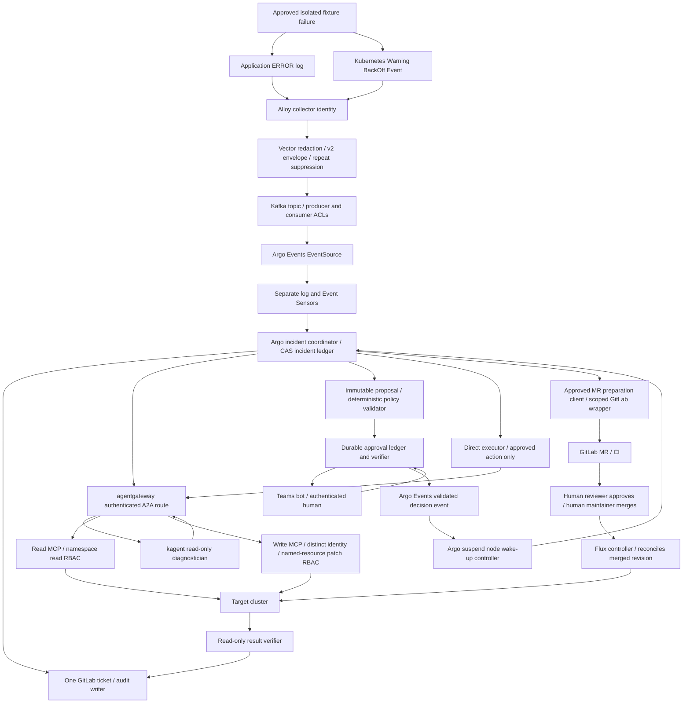

# Independent proposal 04: evidence first, approval as durable authorization

Build one incident coordinator around the existing Alloy → Vector → Kafka v2 path, with an isolated crashloop fixture for each remediation branch. The kagent diagnostician gathers evidence through agentgateway and a read-only Kubernetes MCP, reasons freely about cause, and returns a typed proposal. Argo records the incident and every state transition in one GitLab ticket. A durable approval service authenticates Teams decisions and binds them to immutable action content; Argo suspend is only a waiting mechanism. Direct execution uses a deterministic MCP client and a separate, narrowly privileged write MCP. GitOps execution prepares a reviewable MR after explicit preparation approval, then requires human GitLab approval and a separate human merge before Flux deployment. This document is a design, based on repository and official documentation inspected on 2026-09-30; it claims no new runtime proof.



## Existing evidence

Repository paths below are relative to `/Users/davidgardiner/Desktop/repo/kagent-public`.

| Evidence inspected | What it establishes | Limit for this demo |
|---|---|---|
| `README.md`, `STATEMENT-OF-WORK.md`, `CONTRIBUTING.md`, `docs/upstreams.md`, `AGENTS.md` | Flux delivery, Argo orchestration, read/write separation and placeholder safety are repository intent | SOW uses historical paths and broad PoC claims; current implementation and receipts take precedence |
| `work-agent-bundles/homelab-verified-triage-replication/README.md`, `evidence/VERIFICATION-2026-07-24.md` | Recorded live logs and Events through real Kafka to a GitLab issue, with read-only diagnosis | Historical home proof, not current deployment inventory or remediation proof |
| Same bundle `FINDINGS-AND-FIXES.md` | F1 detects HTTP-200 A2A application failures; F2/F3 preserve sibling evidence; F0 warns about incompatible v2/v3 payloads | Concurrent ticket search is a backstop, not distributed exactly-once delivery |
| Same bundle `config/02-vector.yaml`, `config/03-argo.yaml` | Current files emit `observability.triage.v2`, `dedupe_key`, `delivery_key`, `automation_allowed:false`; separate Sensors and CAS claims; current diagnosis code also checks evaluator/tool evidence | Dedupe is pod-derived; replica churn needs coordinator correlation. Kafka example disables certificate verification: change configuration only in a separately authorized build |
| Same bundle `fixtures/crashloop-fixture.yaml` | Small restricted pod emits ERROR then exits, producing BackOff | Its synthetic authentication error is not a safe remediation proposal; use a purpose-built configuration fixture |
| `platform/kubernetes-mcp/README.md` | Kubernetes MCP v0.0.66 security snapshot; historic eight-tool and two-context isolation proof; `configuration_view` and optional context hazards | Workplace auth and server-side missing-context rejection explicitly remain unproven; write MCP is additional work |
| `platform/agentgateway/AUTHENTICATION.md`, `gateway-resources.yaml`, `README.md` | JWT caller identity, separate upstream identity, version-dependent policies; documented v1.3.1 baseline | Repo version statement is not an installed version receipt |
| `platform/teams-hitl/README.md`, `BOT-CONTRACT.md`, `sensor.yaml`, `workflow-approval-template.yaml` | Callback and suspend sketches, mock option, decision Sensors | Sensors filter decision/namespace/nonce shape, not authenticated approver or durable replay state. Missing referenced templates, tier bypass and timeout claims must not be copied as proof |
| `work-agent-bundles/hitl-remediation-approval/README.md`, `CHECKLIST.md` | Desired evidence and acceptance checklist | Checklist is TODO, not live Teams or write remediation proof |
| `work-agent-bundles/gitlab-mcp-gitops-pr/README.md`, `OFFICIAL-GITLAB-MCP-SPIKE-2026-06-07.md` | Wrapper branch/file/MR/note path; historical hosted MCP OAuth/404 obstacle | Do not assume current official GitLab MCP availability or kagent OAuth compatibility |

Official checks: Argo documentation says a duration automatically resumes a suspend; expiration does not imply failure or approval. https://argo-workflows.readthedocs.io/en/latest/walk-through/suspending/. Kubernetes MCP v0.0.66 documentation confirms an explicit tool allowlist and separate read-only configuration. https://github.com/containers/kubernetes-mcp-server/blob/v0.0.66/docs/configuration.md. These checks verify documented semantics, not the lab installation. Phase 0 must record actual controller versions, CRD schemas, image digests, MCP `tools/list` schemas, authentication and Flux/GitLab settings. No connected systems were inspected or changed for this planning execution.

## Demo scenarios

### Common reversible failure

Use a dedicated namespace `{{DEMO_NAMESPACE}}`, no production dependencies, one replica, restricted pod security, no mounted service-account token, small resource limits and pinned fixture image. A simple application checks a Deployment environment value `STARTUP_MODE` against its supported value `healthy`; with `broken`, it emits `ERROR unsupported STARTUP_MODE=broken; startup aborted` and exits nonzero. It contains no proposed repair command or credential. Repeated exits under Deployment restart policy produce a genuine kubelet Warning BackOff Event referring to the same pod. Capture the actual Event type/reason before filming; do not fabricate an Event if a kubelet behaves differently.

Run separately for `{{DIRECT_DEPLOYMENT}}` and `{{GITOPS_DEPLOYMENT}}`. Both have the same failure mechanism and evidence requirements, but separate incident episodes. Healthy baseline and failure injection require explicit operator approval. The unhealthy application remains confined to a disposable fixture. Limit collection to the demo namespace, cap admission to two incidents per session, disable collection for the fixture after the evidence window, and keep an operator cleanup timer. Do not rely on a self-healing timer during the demonstration, since it could counterfeit repair success.

The diagnostician can inspect previous/current pod logs, pod exit status, Deployment environment/probes and ReplicaSet owner chain; it may conclude configuration mismatch, challenge alternatives, or report insufficient evidence. It receives no cause-to-action recipe. The permitted operation is an execution safety policy: one named Deployment and one environment field. A supported recommendation is `STARTUP_MODE: broken → healthy`; unsafe or unsupported recommendations become human-only ticket outcomes.

### Direct branch

Provision the direct fixture by an explicitly approved ephemeral setup workflow, outside every Flux/Helm/other controller desired-state inventory. Do not temporarily suspend Flux or remove ownership to make this branch work. Check registry ownership and all relevant Flux inventories before proposing direct action; reject uncertain or GitOps-managed ownership. A deterministic MCP operation applies a conditional patch of the one environment value on the same Deployment UID/resource version, causing a rollout. The approved inverse patch is the bounded rollback; restoring `broken` recreates the deliberate fault and is only appropriate inside this demo. A stopped rollout or ambiguous ownership does not authorize alternative repairs.

### GitOps branch

Keep the second fixture continuously owned by Flux from `{{GITOPS_PROJECT}}`, path `{{APPROVED_MANIFEST_PATH}}`, branch `{{TARGET_BRANCH}}`. Inject the unhealthy environment value through an approved setup MR and merge. Recovery edits that same field in Git and proceeds through a separately reviewed MR. No direct patch of the managed Deployment is allowed. Each branch yields one incident ticket carrying both log and Event evidence; running both scenarios produces two tickets, one per separately approved episode, rather than conflating separate workloads.

## Flow and trust boundaries

### Numbered handoffs and ticket lifecycle

1. An authenticated operator approves a session scope: fixture identities, fault/setup/cleanup actions, expiry, incident volume ceiling, and automatic audit writes to one sandbox GitLab project. This scope authorizes ticket creation/progress updates and internal workflow/ledger writes, not remediation or MR preparation. Every operational write, including low-risk changes, requires explicit approval. Operator setup authority must never become a runtime agent credential.
2. Alloy's read collector emits both signal kinds; Vector redacts and bounds payloads, preserves v2 fields, suppresses exact repeats and publishes using a topic-scoped producer. Kafka partition/offset, delivery key and source timestamps become evidence references. Verify actual produced and consumed records rather than buffer-accepted counters; retain the proven in-memory Vector buffering for this slice.
3. Argo Events consumes with a dedicated consumer group and namespace/cluster/version filters. Its Sensor identity may submit only the fixed incident WorkflowTemplate. Admission forbids arbitrary pod specs, service-account substitution, privileged templates or caller-selected template references. The workflow validates bytes/schema/freshness and `automation_allowed:false`; this field never becomes permission to remediate.
4. Coordinator validates target against a configured inventory and resolves pod UID → ReplicaSet UID → Deployment UID through read MCP. It CAS-claims the incident episode, creates/reuses the single ticket and appends both sources. Ticket state becomes `detected`, containing collector timestamps, raw/redacted evidence hashes, correlation confidence and workflow UID. Diagnostic failure still produces a visibly degraded ticket.
5. Argo calls the kagent agent through an authenticated agentgateway A2A route. Agent identity can call only the read MCP route and its model route. Agent gathers bounded evidence with explicit target context; tool traces establish actual reads. Argo checks HTTP status, A2A task state, application error metadata, non-whitespace output and proposal schema; failure yields `diagnosis-unavailable`, no execution gate.
6. Agent returns evidence-backed cause, alternatives, confidence and proposed diff. Deterministic validator resolves ownership/target, rejects unsupported operations and constructs a canonical immutable proposal hash. Ticket transitions `proposed` or `manual-review-required`; include uncertainty and rollback, not just generated prose.
7. Direct action gate or GitOps preparation gate persists `pending` approval before sending its Teams card. Card shows exact diff, target, evidence links, risk, rollback, expiry and stage label. Ticket records `awaiting-approval` and request ID. Argo enters its corresponding suspend sub-template.
8. Verified human decision becomes a durable approval record; its validated decision event enters Argo Events. A narrow wake-up controller matches workflow UID, request and suspend node, then wakes it. Ticket records approver identity, decision, proposal hash and time. Rejection/expiry exits with a ticket update and no remediation.
9. Direct executor independently rechecks durable approval, target ownership and preconditions, atomically claims the idempotency key, and invokes only the bounded write MCP operation. Ticket becomes `executing` then `verifying` with API/MCP receipts.
10. GitOps preparer independently verifies its preparation approval, creates one branch/commit/MR and links the diff and head SHA to the ticket. Teams sends a second card asking the designated human to review in GitLab. Reviewer approves there; designated Maintainer merges there. Argo validates those independent GitLab facts, records merge actor/revision and transitions `awaiting-flux`.
11. A distinct read verifier checks actual rollout, healthy application and expected field/revision. Ticket ends `verified`, `rejected`, `expired`, `execution-failed`, `verification-failed` or `reconciliation-timeout`, with timestamps and sanitized evidence. Only verified recovery can close the ticket automatically under the approved audit scope. An exit handler/outbox retries ticket updates without repeating remediation; an unavailable GitLab leaves local durable outcome plus visible workflow failure.

### MCP, RBAC and credential boundaries

| Identity | Tools/capabilities | Final authorization boundary |
|---|---|---|
| kagent diagnostician → read route | Exact list: `pods_get`, `pods_list`, `pods_log`, `resources_get`, `resources_list`; no other tools | Server `read_only=true`; narrow namespace get/list/watch for pods, pods/log, Events, Deployments, ReplicaSets. Generic resource arguments restricted to these kinds; deny Secret, ConfigMap, RBAC, ServiceAccount, token, exec, attach, port-forward, configuration export |
| Read result verifier | Same Kubernetes reads plus named Flux GitRepository/Kustomization status and sandbox GitLab MR/CI/approval reads | Separate identity and namespace-scoped Flux read Role; never inherit remediation credential |
| Direct executor → write route | New typed MCP operation `set_startup_mode` only; no arbitrary manifest, shell, resource apply, delete or exec | Distinct MCP service account: get/patch only `deployments.apps` with `resourceNames:[{{DIRECT_DEPLOYMENT}}]` in `{{DEMO_NAMESPACE}}`; admission constrains permitted patch field/value and pod security |
| MR preparation client | Fixed project; branch prefix, commit one allowlisted file, create MR, add notes | Dedicated wrapper credential; no protected-branch pushes, approval, merge, membership, settings or CI-definition changes; wrapper validates path/diff and base SHA |
| Teams approval verifier | Authenticate bot/user, validate decisions, update ledger, emit validated events | No Kubernetes workload patch, Git merge or arbitrary workflow resume authority |
| Argo wake-up controller | Resume known labeled workflow/node after querying ledger | Admission/API facade constrains workflow UID and node; never trust callback-provided name or SA |
| Flux controller | GitOps reconciliation | Existing Flux identity and inventory; agent cannot change source/controller configuration |

The write MCP is proposed new work, not an existing upstream restricted patch tool. A small typed server directly using the Kubernetes API is safer than enabling a broad `resources_create_or_update` tool. Its MCP schema contains explicit context, namespace, name, UID, resource version, container name, expected old value, approved new value and proposal/request IDs. It verifies the authorization record itself, rejects arbitrary extra fields, and reconstructs JSON Patch from validated values. Use a resource-version and old-field test plus an exact env-field replacement; RBAC cannot constrain patch fields by itself, so add admission and server validation. Deny every other discovery/invocation, including direct backend bypass.

Agentgateway checks issuer, audience, signature, expiry, subject and route scope. Read and write routes use distinct backend identities and non-empty allowlists; agent identity receives no write route grant. Restrict backend traffic to gateway workloads using NetworkPolicy plus workload identity/mTLS. Read-side credentials never contain write context; mount config read-only, disable unused HTTP/SSE/discovery listeners and protect operational endpoints. A mandatory argument adapter rejects omitted/empty/unknown contexts and mismatched namespace/endpoint/CA before API calls, because v0.0.66 otherwise defaults context. Executor verifies context against registered API endpoint/CA and target UID, not log strings. The agent cannot submit execution workflows, edit approval policy, select another service account, mint credentials or dynamically attach tools.

Bound reads to 100 objects, 200 log lines, 64 KiB per result and 10 seconds, with truncation metadata; these are proposed demo limits, not upstream defaults. Store full approved evidence only in access-controlled artifacts with retention; tickets/cards get redacted summaries. Treat logs, Events, tool results and agent output as untrusted. Parse structured artifacts with a JSON serializer; never interpolate them into shell, YAML template expressions or commands. Prompt injection may alter recommendations, never credentials, targets or permission checks.

### Immutable proposal and approval contract

Canonical `remediation.proposal.v1` contains:

- Incident episode ID, workflow UID, ticket IID, proposal revision, issued/expires timestamps, policy version and branch choice.
- Registered cluster alias, API identity fingerprint, namespace UID, resource GVK/name/UID/resourceVersion, container name and ownership evidence.
- Evidence IDs/hashes, observed state/time, actual tool-call IDs, diagnosis, alternatives, confidence and explicit unknowns.
- Typed operation, expected old value `broken`, allowed new value `healthy`, exact field path/diff, one-resource/one-field scope, bounded execution time and success predicates.
- Risk: single fixture rollout and temporary unavailability; inverse diff/preconditions and a rollback authority scope, or a requirement for new approval if rollback content changes.
- For GitOps: project/path/base SHA/source branch/target branch, expected content diff, MR head SHA when available, required CI and approver/merger roles.
- Approval stage (`direct-execute`, `prepare-mr`, `review-mr`), eligible approver group, nonce, proposal digest and idempotency key derived from incident episode + action digest + stage.

Validator owns allowed parameter values, not the model. Canonical action digest excludes incidental log text but includes target, preconditions, exact change, rollback and policy version. Changed action/target/diff or expired approval creates a new proposal and request; old requests become superseded. If harmless resource-version drift occurs before execution, fail closed and obtain fresh approval rather than weakening the CAS condition. A duplicate executor call returns the existing durable result; a lost response triggers read reconciliation, not a blind second patch.

### Teams and Argo waiting design

Use a real Teams bot with Microsoft Entra authenticated user identity and an authenticated bot-to-verifier channel. Teams bot SSO documentation establishes an identity path, not this application's authorization policy: https://learn.microsoft.com/en-us/microsoftteams/platform/bots/how-to/authentication/bot-sso-overview. A plain incoming webhook/mock bot does not establish a human approver. Resolve stable tenant/user subject and current approver-group eligibility server-side; reject caller-supplied email as authority. Public artifacts replace identity values with `{{APPROVER_SUBJECT}}`.

Implement a small approval verifier with transactional durable storage, rather than claiming existing Sensors verify HMAC. Verify a signed bot message over raw bytes with timestamp/event nonce (or mTLS plus authenticated signed assertion), issuer/audience/expiry, user provenance and allowed decision. CAS state `pending → approved|rejected|expired`; repeated identical decision is a no-op, contradictory decision conflicts, late/stale/superseded request is rejected. Record verified subject, group check, request stage/hash, receipt time and expiry; exclude tokens. Request expiry is 15 minutes for the demo. Eligibility and current expiry are rechecked at execution. Argo receives only verifier-generated events.

Persist before card dispatch, use a durable delivery outbox and send once by request ID. A callback arriving before suspend creation is recorded and acknowledged; wake-up work retries until the exact suspend node exists, the request expires, or the workflow terminates. Never discard early approval. A callback cannot name an arbitrary workflow: ledger determines workflow UID and node selector. Controller crash recovery reloads outstanding delivery/wake-up work.

Choose timed suspend for a 15-minute waiting deadline followed immediately by a ledger gate. Timer completion, manual `argo resume`, stopped/resubmitted workflows and node success are not evidence of approval. The ledger gate fails any pending/expired/rejected/mismatched record; the write MCP rechecks again at the point of effect. A valid recorded early decision can proceed when the node appears. Retries/resubmissions with a new workflow UID need a fresh approval; an in-run duplicate uses the same idempotency key. Group each conditional branch into its own sub-template with one outer guard, avoiding unresolved outputs from skipped steps as required by `AGENTS.md`.

### GitOps approval, merge and observed reconciliation

MR preparation is a write and needs its own Teams approval of the exact project/file/base/diff; diagnostic agent produces the proposal, deterministic GitLab wrapper materializes it. No merge capability is exposed to that wrapper. Ticket audit writes use the explicit session authorization from step 1.

Second card displays MR URL, immutable head SHA, exact diff, successful CI evidence, risk/rollback and expiry. Its **Review in GitLab** button opens the MR; it does not approve or merge. An optional **Review acknowledged** button records only that acknowledgement and can wake a wait to inspect GitLab, never authorizes merge. `{{GITLAB_REVIEWER}}`, an eligible human, records approval in GitLab against the reviewed head. `{{GITLAB_MAINTAINER}}`, an authorized human, checks CI and approval and presses Merge in GitLab. A solo lab operator may hold both roles; record that limitation and two distinct actions. Changed commits invalidate review and require fresh approval; no auto-merge setup.

Require CI on the exact head/merged result: render Kustomize, YAML/schema validation for pinned APIs, placeholder/public-safety scan, constrained diff policy (only the environment value), no altered RBAC/images/commands/CI/Flux objects, and healthy fixture contract. Use protected target branch with human-only merge and required approvals if the GitLab tier supports it. GitLab Free approvals are optional and do not block merge; if that is the lab tier, report the enforcement limitation and do not claim prevention of maintainer bypass. Source: https://docs.gitlab.com/user/project/merge_requests/approvals/. A planned API-based merger would require a separate explicit human merge approval and source SHA match, but is outside this slice; GitLab documents that source-SHA mismatch is rejected. https://docs.gitlab.com/api/merge_requests/.

Argo reads the actual merged state, approval/head history, merge actor/time and resulting target-branch SHA (handle squash/merge commits; source head is not necessarily deployed SHA). Wait at most 30 minutes for human merge, then leave the MR/ticket pending and terminate without cluster writes. Poll every 15 seconds for at most 10 minutes after merge. Require Source artifact revision and Kustomization `lastAppliedRevision` to match the expected merged target revision, `Ready=True`, current observed generation, Deployment desired environment and rollout generation/availability, and application health. Configure one isolated demo branch so unrelated revisions do not obscure proof; a newer revision yields `superseded-needs-review`, never PASS solely because Ready is true. Flux documents these status fields and health checks: https://fluxcd.io/flux/components/kustomize/kustomizations/.

Do not trigger `flux reconcile` automatically: it is another write, and normal interval polling is enough. On missing source, auth failure, failed health, closed MR or timeout, preserve the same ticket with exact last observed revision/condition and uncertainty. No fallback direct patch. Rollback is an explicitly approved revert MR and human merge, followed by the same Flux/recovery proof; a reviewed rollback strategy alone does not authorize an arbitrary revert.

### Payload version and incident correlation

Keep v2 wire fields unchanged; do not feed v3 `incident_fingerprint` payloads into v2 Sensors or silently redefine producer `dedupe_key`. Enforce exact v2 schema in Workflow validation and reject incompatible payloads into a bounded DLQ/quarantine, with metered unsupported-version counts. Because existing Sensor version filters can drop messages before Workflow validation, add a separate quarantine consumer or mutually exclusive reject Sensor; test that invalid versions have an observable destination.

Retain v2 `delivery_key` for transport-repeat suppression and pod-level CAS claims for compatibility. Add a coordinator ledger `incident-correlation.v1` after schema validation, mapping validated pod UID/owner chain to stable Deployment UID + registered cluster + namespace UID + explicit episode. Both source records get unique evidence IDs (Kafka partition/offset and delivery key); appends dedupe those IDs independently. The source-signal time window and matching Deployment owner establish one incident; a generic workload label or pod-name suffix heuristic alone is insufficient. An unresolved owner remains pod-scoped with visible uncertainty and cannot trigger execution.

CAS incident ownership and one leased ticket writer prevent log/Event workflows from separately creating tickets; late siblings enqueue evidence instead of stealing a live lease. Ticket IID persists before remediation. Handle GitLab create-response loss by a unique full incident marker and search/reconciliation under the same lease; if an ambiguous create cannot be resolved, stop for operator resolution rather than create another ticket. The existing 16-character fingerprint label and search-only race guard cannot promise exactly-once creation. Close each completed episode explicitly; later failure starts a new episode with a new approved session mapping. New pod evidence during rollout maps to the same open incident, but cannot recursively authorize another remedy.

## Build phases

| Phase | Deliverable and gate | Dependencies | Estimate |
|---|---|---|---|
| 0 | Version/digest/CRD inventory, namespace/project/identity map, approvals capability and actual Teams bot access; sanitized baseline receipts | Read access and operator | 0.5–1 day |
| 1 | Smallest useful slice: approved ephemeral fixture, genuine log + BackOff, v2 pipeline, stable correlation, one ticket, read MCP diagnosis and typed proposed action; no remediation | Existing Kafka/Alloy/Vector/Argo/kagent path | 1–2 days |
| 2 | Durable approval verifier/store/outbox, authenticated Teams card, suspend wake-up and expiry/replay/race tests; demonstrate no write on unauthorized resume | Actual Teams application/Entra setup; storage and ingress | 2–4 days |
| 3 | Typed write MCP, constrained Role/admission/gateway routes, direct precondition/approval gate, result verification and bounded rollback | Phase 2 accepted; ownership proven absent | 1.5–3 days |
| 4 | MR preparation gate/wrapper, CI/branch protection, real human review/merge and exact revision Flux verification | GitLab project/tier, Flux ownership and Phase 2 | 2–3 days |
| 5 | Full negative tests, crash/replay drills, ticket outage recovery, two filmed successful branches and cleanup receipts | All preceding gates | 1–2 days |

Estimate 8–15 engineering days, excluding Teams/Entra registration or GitLab license waits. Phase 1 is a useful demo even if approval integration is blocked, but label it read-only diagnosis only. Mock callbacks support developer tests in Phase 2 and never satisfy the real Teams acceptance gate. During implementation use existing `scripts/kagent-verify-agent.sh`, `scripts/kagent-a2a-invoke.sh` and public-safety helper where applicable; narrow server dry-runs/schema checks precede any explicitly approved deployment. Do not modify helper scripts without their required smoke test.

## Acceptance tests

### Demonstration script and evidence

1. Show the approved session, identities/routes, fixture ownership and healthy baseline. Capture digests/versions and non-secret policy/RBAC receipts.
2. Operator approves the bounded fault injection. Show an application ERROR and genuine BackOff on the same pod; capture redacted Kafka v2 records and Vector produced/consumed counters. Show one incident/ticket with both sources, owner-chain evidence and no automatic write.
3. Show the agent’s actual read tool calls and structured proposal, evidence/alternatives/confidence, exact field diff, target, risk/rollback and expiry. Screenshot GitLab proposal and Argo suspended node.
4. Direct run: eligible human clicks Approve in the real Teams card. Capture verified identity/hash/time record, then write MCP/API audit receipt occurring after approval, rollout/environment checks, healthy response and same-ticket final evidence. Show read-agent mutation denial separately.
5. GitOps run: human approves preparation; show one branch/commit/MR/CI and linked ticket. Teams Review button opens GitLab. Capture human GitLab approval, distinct Merge action and merge actor, merged target SHA, Flux statuses and application verification. Show the same ticket progressing through waiting/reconciliation/verified.
6. Operator executes approved cleanup; capture fixture removal, reverted Git desired state if appropriate, no residual pending approvals, no remediation retries and no further ticket admission.

Read-only capture command examples; substitute placeholders privately and redact outputs before publication:

```sh
kubectl --context '{{TARGET_CONTEXT}}' -n '{{DEMO_NAMESPACE}}' get deployment '{{DEPLOYMENT}}' -o json
kubectl --context '{{TARGET_CONTEXT}}' -n '{{DEMO_NAMESPACE}}' logs '{{POD_NAME}}' --previous --tail=50
kubectl --context '{{TARGET_CONTEXT}}' -n '{{DEMO_NAMESPACE}}' get events --field-selector involvedObject.name='{{POD_NAME}}' -o json
argo get '{{WORKFLOW_NAME}}' -n '{{WORKFLOW_NAMESPACE}}' -o json
kubectl --context '{{TARGET_CONTEXT}}' -n '{{FLUX_NAMESPACE}}' get gitrepository '{{FLUX_SOURCE}}' -o json
kubectl --context '{{TARGET_CONTEXT}}' -n '{{FLUX_NAMESPACE}}' get kustomization '{{FLUX_KUSTOMIZATION}}' -o json
```

Also capture MCP discovery and gateway denied/allowed calls without tokens; GitLab issue/MR/CI/approval API snapshots; approval ledger state with request/hash and redacted subject; Kubernetes audit target/verb/time; health response and a 120-second stable Ready window with no additional restarts or new startup errors. Old Events may persist; their continued presence does not mean recovery failed. Kafka consumer snapshots must use a separate authorized read group, never disrupt the triage consumer offsets.

| Test | Expected evidence / pass criterion |
|---|---|
| Both source arrival orders and concurrent delivery | Exactly one ticket per incident, both distinct evidence IDs, one diagnostic owner; duplicate input only appends once |
| Pod restart and replacement | Incident mapping stays stable through Deployment UID; unknown owner fails closed, new episode starts only after explicit close |
| Wrong schema, stale signal, malformed/oversized input | Quarantine/DLQ receipt and counter; no diagnosis or write; no invisible Sensor drop |
| A2A HTTP-200 failure, blank output, evaluator failure | Degraded ticket and blocked remediation, no false successful analysis |
| Unauthenticated/wrong-audience user or bot, unauthorized group | Reject before approval state transition; no execution |
| Reject/no response/timer completion/manual resume | Ledger still unapproved/expired/rejected; zero write MCP effects and honest ticket outcome |
| Early callback, duplicates, conflicting clicks, replay, controller restart | Durable first valid decision; exact node eventually wakes once; no duplicate effect |
| Changed proposal/MR head or different workflow UID | Old approval cannot authorize; fresh request required |
| Agent tries write route, config export, Secret/RBAC access, exec or omitted context | Denied via gateway/server/RBAC; no target API effect for invalid context |
| Logs ask to patch another namespace or gain permissions | Recommendation may be rejected, but narrow deterministic policy holds; no credential/tool escalation |
| Direct resource belongs to Flux or UID/version has changed | Executor refuses; ticket identifies policy/precondition failure |
| Lost response after patch/ledger crash | Observe resulting state and reconcile one idempotent operation; do not repeat blindly |
| Teams acknowledgment without GitLab approval/merge | MR remains unmerged, Flux unchanged, ticket remains waiting or expires |
| GitLab CI failed, changed SHA, unauthorized merger, MR closed | No accepted GitOps completion; explicit blocker, no fallback patch |
| Flux Ready at old SHA, never reconciles, or unhealthy workload | Not PASS; bounded timeout with actual revision/condition and open ticket |
| Successful direct and GitOps paths | Authenticated approval precedes effect; exact approved target/diff; observed healthy rollout; same ticket proof; GitOps additionally proves approved head, human merge and expected Flux revision |
| Ticket write outage | Durable pending audit result and visible failure; recovery updates same ticket without a second action |

Cleanup is also a write: approve fixture deletion, removal of ephemeral permissions/routes and sandbox branch/MR cleanup explicitly, retain sanitized audit receipts and expire request IDs before tearing down ingress. GitOps fixture deletion/revert goes through a new reviewed cleanup MR and Flux. Direct cleanup uses the separately approved setup/cleanup workflow, not the diagnostician or an expanded write MCP. Rollback content outside the signed inverse/scope needs a new approval. Global kill switch disables execution immediately without erasing evidence.

## Risks and open decisions

- Actual installed versions and tool schemas are unknown from this read-only repository review. Do not assume latest docs match the lab; pin and test before deployment. Argo Events chart/app pin and kagent/agentgateway versions must be recorded separately.
- Real Teams bot registration, Entra approver lookup, bot transport trust and approved callback ingress are the largest external dependency. A webhook card screenshot, mock auto-approval or IP allowlist is insufficient approval proof.
- Choose transactional storage and retention (suggest existing PostgreSQL if available; avoid a new distributed system for this demo). ConfigMap-only state needs proven CAS/restart semantics and does not replace a ticket-create recovery protocol.
- Verify available GitLab tier/required-approval enforcement and whether two separate people are practical. On Free, approval observations demonstrate the procedure, not enforced prevention of Maintainer bypass.
- Direct-field restrictions require a custom typed write MCP plus admission policy. RBAC alone authorizes the whole named Deployment patch, so compromise of that service must not unlock arbitrary pod-spec edits.
- Real owner-chain evidence depends on Pod/Event UID capture or timely read-back. Missing/deleted pod lookup needs retained owner mapping; refuse execution when provenance is insufficient.
- Flux exact revision proof can race later commits; dedicate a demo branch/path and treat supersession explicitly. Ready alone never proves the reviewed change reached the cluster.
- Model recommendation variability can yield manual review, an acceptable safety result but not a successful filmed remediation. Rehearse with evidence and report failure honestly; do not hide an enforced diagnosis recipe inside the prompt.
- Kafka offsets, Vector buffering, claim TTL and open-ticket reuse have different lifetimes. Explicit incident episodes and bounded admission prevent recurrence/restart storms from creating unbounded tickets.
- Approval can expire between preflight and effect; write MCP must enforce expiry at execution, and rollback authorization must be explicit. Sensitive Kubernetes reads still need redaction and byte limits.

## Why this approach

The demo proves that an agent can infer a repair from live facts while lacking the ability to execute it. A narrow operation policy constrains the eventual effect without prescribing how to diagnose the failure. A deterministic MCP client is chosen instead of a write-capable kagent agent because there is no reasoning task after the human approves the exact change: reintroducing a model would create an opportunity to reinterpret scope. Durable authorization and effect-side rechecking remain necessary even when Argo is resumed manually or automatically. Separate Flux ownership fixtures retain both requested branches and make a direct-change reversion impossible by construction rather than relying on suspended reconciliation. Each outcome stays attached to the original incident, giving a reviewer a complete evidence and identity timeline.

Planning output: `/Users/davidgardiner/Desktop/repo/kagent-public/docs/plans/homelab-triage-hitl-demo/run-02/plan-04-independent.md`.
