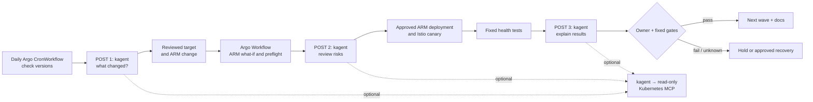

# TL;DR: AKS and Istio upgrades with kagent

**Proposed flow.** The [current dry-run scaffold](upgrade-automation-dry-run/README.md) is suspended and uses fixtures; it does not call Azure, kagent or MCP.

**POST target:** `http://{{KAGENT_CONTROLLER}}:8083/api/a2a/{{NAMESPACE}}/{{AGENT}}/` (keep the final `/`). Send an A2A JSON-RPC `message/send` request with the upgrade run ID and bounded, redacted evidence; the text part needs `"kind":"text"`. The existing [A2A helper](../../../scripts/kagent-a2a-invoke.sh) builds the full envelope and handles the response.

**Agent vs workflow:** Argo POSTs to kagent; a configured agent may then call read-only Kubernetes MCP tools such as `k8s_get_resources` and `k8s_get_events`. Before a *new* cluster exists, give the agent release/request artifacts rather than asking it to inspect that cluster. Argo's approved identity runs ARM/CLI and Istio changes. The agent returns cited advice; fixed tests and the owner decide promotion.

The endpoint and tool binding follow [kagent's A2A guide](https://kagent.dev/docs/kagent/0.x/examples/a2a-agents/) and [MCP guide](https://kagent.dev/docs/kagent/0.x/getting-started/first-mcp-tool/). Verify both against the installed kagent version before wiring the workflow.
