# LangChain SRE Agent vs the kagent smart-triage workflow

Research and adoption decision for
[issue #85](https://github.com/davidmarkgardiner/kagent-public/issues/85) and
[issue #86](https://github.com/davidmarkgardiner/kagent-public/issues/86).

The upstream comparison is pinned to
[`langchain-samples/sre-agent@a03bebec`](https://github.com/langchain-samples/sre-agent/tree/a03bebec0c5ea90b16cee7d1ab4bfe4425895c60),
inspected on 2026-08-21. Upstream claims below are versioned research, not proof
of its behaviour in this environment. Local claims are limited to the checked-in
POCs and the public-safe homelab evidence linked below.

## Executive verdict

**Keep kagent + Argo as the platform architecture, and borrow the LangChain
sample's best operating patterns. Do not import its Deep Agents/LangGraph
runtime as a second orchestration plane.**

The upstream sample is ahead as an integrated single-cluster SRE product: it
has a polished Slack/web human-approval experience, a change-executor,
Postgres-backed checkpoints and LangSmith evaluation hooks. Our design is the
better fit for a multi-cluster AKS platform because deterministic Argo
Workflows own routing, budgets and failure boundaries, existing kagent agents
remain reusable specialists, and the current path has no write tools.

There is no single winner across every category:

| Decision area | Winner | Why |
|---|---|---|
| Platform control plane | **kagent + Argo** | One deterministic orchestration plane already aligned with Argo Events, GitOps and existing kagent/A2A agents. |
| Read-only security | **kagent POC** | No apply, patch, delete, scale, restart or exec capability is installed or invoked. |
| Fleet/AKS targeting design | **kagent POC** | Exact approved target gate and request-specific kubeconfig plan; upstream uses the pod's current Kubernetes client context. |
| Routine-check efficiency | **Draw** | Upstream uses direct Kubernetes reads plus one structured model call; our unchanged lifecycle replay uses zero specialist, synthesis and tool calls, while a focused new incident uses 3 calls rather than the 9-call unconditional baseline. |
| Specialist decomposition | **Draw** | Both use eight read-only investigation domains; our POC reuses existing agents instead of deploying another permanent specialist set. |
| Typed findings and lifecycle | **Draw, with a stricter kagent failure boundary** | Both have structured findings and stable lifecycle state. Our POC refuses a durable-dedupe claim when state is unavailable instead of falling back to memory. |
| Human approval UX | **LangChain sample** | Slack buttons, web UI, resumable checkpoints and an explicit change-executor are already integrated. Its current approval/RBAC defaults are not acceptable for adoption unchanged. |
| Evaluation and traces | **LangChain sample today** | LangSmith trajectory/evaluator scaffolding is more complete. Our deterministic fixtures and homelab receipts are stronger for reproducible control-flow claims, but live model/A2A trajectories remain unproven. |
| Safe remediation architecture | **kagent direction** | Keep remediation outside the investigator and execute only a separately authorised GitOps/Argo workflow identity. The upstream sample gives the same pod a broad writer role and relies on agent-layer approval. |

**Practical answer:** the LangChain repository validates the direction taken in
issues #85 and #86. It also shows the next useful capabilities to add: durable
management-plane state, trajectory evaluation, and an operator-friendly
approval experience. It does not justify replacing Argo, kagent or the
read-only boundary.

## Architecture comparison

```mermaid
flowchart TB
    subgraph LC[LangChain sample: integrated agent application]
      LC1[Scheduler / Slack / Web / CLI] --> LC2[Deep Agents orchestrator]
      LC2 --> LC3[Eight read-only subagents]
      LC2 --> LC4[Change executor]
      LC4 --> LC5{Agent-layer HITL interrupt}
      LC5 -->|approved| LC6[Kubernetes write tools]
      LC2 --> LC7[Postgres checkpoints and finding state]
      LC2 --> LC8[LangSmith traces and evals]
    end

    subgraph KG[kagent target: deterministic platform workflow]
      KG1[Alertmanager / human / scheduled signal] --> KG2[Argo Events]
      KG2 --> KG3[Argo Workflow]
      KG3 --> KG4{Approved exact target?}
      KG4 -->|no| KG5[Blocked; zero tool calls]
      KG4 -->|yes| KG6[Deterministic router and budgets]
      KG6 --> KG7[One to three existing kagent specialists via A2A]
      KG7 --> KG8[Finding v1 validation]
      KG8 --> KG9[Management-plane lifecycle state]
      KG9 --> KG10[One GitLab-ready human report]
      KG10 -. future, separate approval .-> KG11[GitOps / Argo remediation workflow identity]
    end
```

The key difference is ownership. In the sample, the agent runtime plans,
delegates, pauses and resumes writes. In our target, Argo owns the predictable
workflow and kagent owns only bounded reasoning. Any future writer is a separate
workflow service account, not an extra tool on the read-only investigator.

## What the upstream sample actually provides

At the pinned revision, the sample contains:

- a Deep Agents orchestrator with eight read-only subagents covering pods,
  scaling, performance, logs, security, reliability, batch jobs and
  configuration hygiene;
- a ninth `change-executor` subagent containing all Kubernetes write tools,
  configured to interrupt before every write tool call;
- a scheduled fast path that collects Kubernetes data without an agent loop and
  asks one model call for a typed `HealthReport`;
- stable finding fingerprints, new/ongoing/escalated/resolved state,
  acknowledgement expiry and notification suppression;
- Postgres persistence for LangGraph checkpoints, sessions, finding state and
  append-only human-approval audit records, with an in-memory fallback;
- Slack Socket Mode, a FastAPI/web front end, CLI entry point and LangSmith
  evaluation scaffolding; and
- call-count middleware and per-tool-output truncation added after a documented
  runaway context/cost incident.

Source entry points:

- [`agent.py`](https://github.com/langchain-samples/sre-agent/blob/a03bebec0c5ea90b16cee7d1ab4bfe4425895c60/agent.py)
- [`schemas.py`](https://github.com/langchain-samples/sre-agent/blob/a03bebec0c5ea90b16cee7d1ab4bfe4425895c60/schemas.py)
- [`monitor_state.py`](https://github.com/langchain-samples/sre-agent/blob/a03bebec0c5ea90b16cee7d1ab4bfe4425895c60/monitor_state.py)
- [`scheduler.py`](https://github.com/langchain-samples/sre-agent/blob/a03bebec0c5ea90b16cee7d1ab4bfe4425895c60/scheduler.py)
- [`persistence.py`](https://github.com/langchain-samples/sre-agent/blob/a03bebec0c5ea90b16cee7d1ab4bfe4425895c60/persistence.py)
- [`subagents/change_executor.py`](https://github.com/langchain-samples/sre-agent/blob/a03bebec0c5ea90b16cee7d1ab4bfe4425895c60/subagents/change_executor.py)
- [`evals/evaluators.py`](https://github.com/langchain-samples/sre-agent/blob/a03bebec0c5ea90b16cee7d1ab4bfe4425895c60/evals/evaluators.py)
- [`api.py`](https://github.com/langchain-samples/sre-agent/blob/a03bebec0c5ea90b16cee7d1ab4bfe4425895c60/api.py)
- [`k8s/clusterrole.yaml`](https://github.com/langchain-samples/sre-agent/blob/a03bebec0c5ea90b16cee7d1ab4bfe4425895c60/k8s/clusterrole.yaml),
  [`k8s/role-writer.yaml`](https://github.com/langchain-samples/sre-agent/blob/a03bebec0c5ea90b16cee7d1ab4bfe4425895c60/k8s/role-writer.yaml) and
  [`k8s/rolebinding-writer.yaml`](https://github.com/langchain-samples/sre-agent/blob/a03bebec0c5ea90b16cee7d1ab4bfe4425895c60/k8s/rolebinding-writer.yaml)

## Pattern mapping: borrow without adding a second control plane

| LangChain sample component | kagent/Argo equivalent | Decision |
|---|---|---|
| Deep Agents orchestrator | Argo Workflow for control flow; kagent incident commander only for bounded synthesis | **Do not import.** Keep deterministic routing, retries, concurrency and timeouts in Argo. |
| Eight read-only subagents | Existing kagent Kubernetes, Grafana, network, deployment, GitOps, policy, knowledge and trace capabilities | **Reuse.** Invoke only the one to three capabilities selected for the signal. |
| `HealthReport` / `Finding` | `smart-triage-finding/v1` | **Adopted.** Validate every specialist result before synthesis. |
| Finding fingerprint and diff | Finding-lifecycle service | **Adopted and extended.** Include subscription scope and cluster; exclude upstream alert ID, literal pod name and model title. |
| Scheduled one-call health path | Lifecycle gate followed by selective deterministic routing | **Adopted principle.** Unchanged findings stop before any specialist/model call. Consider a one-call bounded digest only when a human summary is needed. |
| Postgres checkpoints/state | Management-plane lifecycle store | **Adopt durability, not topology.** Production state must be highly available outside the monitored failure domain and must fail closed. |
| Slack notifier and approval buttons | GitLab/SRE queue plus future Teams or portal approval surface | **Borrow UX.** Authenticate the actor and bind approval to an immutable proposed change. |
| LangSmith evaluators | Deterministic fixtures, A2A receipts and future trajectory evaluator | **Expand.** Score evidence coverage, target correctness, tool choice, severity and SRE feedback regressions. |
| `change-executor` | Separate GitOps/Argo remediation WorkflowTemplate and service account | **Defer and redesign.** Never add writer tools to the investigator identity. |

## Security comparison

| Control | LangChain sample at `a03bebec` | kagent POC / target |
|---|---|---|
| Investigator tools | Main orchestrator and eight specialists are read-oriented, but the same application can delegate to a writer. | Current selective workflow and agent manifests contain no write tool. |
| Kubernetes read RBAC | Cluster-wide reader; its wildcard rule can read all resources in all API groups. | Must remain allow-listed and least-privilege per specialist/target; current public fixture performs no Kubernetes reads. |
| Kubernetes write RBAC | `sre-agent-writer` is a cluster-wide `ClusterRole` including wildcard custom-resource create/patch/update/delete, bound to the application ServiceAccount. | No writer. Future changes use a separately reviewed workflow identity and GitOps/HITL path. |
| Approval enforcement | Agent interrupt before each write. Slack can restrict approvers, but an empty allowlist permits anyone who sees the message; `/api/approve` is unauthenticated at this revision. | No write approval surface yet. Target requires authenticated actor, immutable request hash, expiry, separation of duties and append-only receipt before a writer workflow starts. |
| Target isolation | Uses the Kubernetes client context available to the pod. | Unknown/ambiguous target is blocked before credentials or tools. Planned unique kubeconfig is per request and never changes shared current context. |
| State outage | Loudly falls back to in-memory operation; durability and audit history are then lost. | Returns `STATE_UNAVAILABLE`, preserves the human investigation path, and refuses automatic ticket eligibility or a durable-dedupe claim. |
| State failure domain | Example Postgres is deployed in the monitored cluster. | POC SQLite/PVC is also not production-grade; target is an HA management-plane store outside the monitored worker failure domain. |
| Secret handling | Tool/output limits exist, but broad reader RBAC includes all resources through the wildcard rule. | Finding schema rejects credential-like evidence; identity specialists must not retrieve Secret or token values. Runtime RBAC still needs proof in the work environment. |

The sample's HITL design is valuable, but human approval is not a substitute for
RBAC. A compromised process with its current writer binding already has the
Kubernetes permissions; the interrupt is an application control, not an API
server security boundary. We should retain independent enforcement at the
workflow service account, gateway/tool allowlist and target-cluster RBAC.

## Efficiency comparison

| Path | LangChain sample | kagent POC evidence |
|---|---|---|
| Unchanged known incident | Stateful diff suppresses repeated notification after collection and one structured analysis call. | Lifecycle gate returned `ONGOING`; 0 specialist calls, 0 synthesis calls and 0 tool calls. |
| Focused new incident | Full interactive agent can selectively delegate, but the system prompt asks a health audit to call all eight specialists. | CrashLoop selected Kubernetes + Grafana: 2 specialist calls + 1 synthesis step = 3, versus the 9-step unconditional baseline. |
| Full health audit | Eight read-only specialists plus orchestration/synthesis. | All eight only when `full_health_audit=true`, concurrency capped at 3; 9 selected-path calls. |
| Output growth | Global model/tool call limits, tighter filesystem limits and a configurable per-tool character cap. | 4096 bytes per specialist and 16384 bytes total synthesis evidence; truncation is explicit. |
| Always-on cost | Scheduler and application run continuously; scheduled path is optimized to one analysis call. | No new always-on specialist Deployments; existing agents are reused. The lifecycle service is one always-on POC Deployment. |

These numbers are not an apples-to-apples model-cost benchmark. The kagent
measurements are deterministic fixture calls with `modelCalls=0`; live provider
tokens, latency and cost remain a work-environment acceptance gate.

## What yesterday's implementation proves

The public-safe homelab run on 2026-08-20 proves:

- the dated evidence record captured 16 finding-lifecycle tests and 15
  selective-orchestrator tests passing; re-running the current verifiers on
  2026-08-21 passed 17 and 18 tests respectively;
- the management-plane lifecycle fingerprint remained stable across pod and
  upstream alert-ID churn;
- new, ongoing, escalated, resolved, recurrent, acknowledged, provisional and
  stale paths were exercised;
- SQLite state survived replacement of the lifecycle pod on its bound PVC;
- Alertmanager → Argo Events → selective Workflow completed;
- focused CrashLoop, scheduling, workload-identity and explicit full-audit
  routing produced the expected capability lists and call counts;
- unknown target, invalid contract, timeout, output truncation and
  `STATE_UNAVAILABLE` paths failed closed or preserved explicit `UNKNOWN`
  evidence; and
- SRE feedback about a false positive was retained as a regression fixture.

Evidence:

- [finding lifecycle design](../../a2a/smart-triage-fanout-demo/finding-lifecycle/README.md)
- [finding lifecycle homelab evidence](../../a2a/smart-triage-fanout-demo/finding-lifecycle/HOMELAB-EVIDENCE-2026-08-20.md)
- [selective orchestrator design](../../a2a/smart-triage-fanout-demo/selective-orchestrator/README.md)
- [selective orchestrator homelab evidence](../../a2a/smart-triage-fanout-demo/selective-orchestrator/HOMELAB-EVIDENCE-2026-08-20.md)

It does **not** prove live model/A2A specialist behaviour, Azure
authorization, a real `az aks get-credentials`, AKS-MCP access through a
request-specific kubeconfig, production HA state or a real GitLab write.

## Patterns deliberately not adopted

- A second LangGraph/Deep Agents control plane alongside Argo Workflows.
- Cluster-wide write RBAC attached to the same application that investigates.
- Wildcard custom-resource writes guarded only by an agent interrupt.
- An unauthenticated approval endpoint or unrestricted-by-default approvers.
- A state database inside the cluster whose outage is being investigated.
- Silent operational continuation that could be mistaken for durable state or
  a complete audit trail after persistence failure.
- A permanent new Deployment for every specialist.
- Slack-specific coupling as the only SRE work queue.
- Unconditional eight-agent fan-out for a single known signal.

## Recommended delivery sequence

### P0 — complete the read-only live proof

1. Connect the approved target registry and UAMI/workload-identity path.
2. Prepare one unique kubeconfig for the exact cluster and request; never use
   `--admin`, shared current context or `az account set`.
3. Invoke only selected existing kagent specialists through A2A/approved MCP
   tools and require Finding v1 JSON.
4. Capture live call count, tokens, latency, tool denials and A2A receipts.
5. Prove that unknown targets, unavailable credentials and malformed specialist
   output produce blocked/partial outcomes, not an all-clear.

### P1 — production lifecycle and feedback loop

1. Replace single-replica SQLite/PVC with an HA management-plane store outside
   the monitored cluster's failure domain.
2. Wire `CREATE`, `UPDATE` and recurrence to one canonical GitLab issue and
   retain human acknowledgement and SRE outcome.
3. Convert SRE corrections into versioned fixtures and score severity, evidence
   coverage, tool selection, false positives and false all-clears.
4. Add trace correlation across event, Argo Workflow, A2A calls, tool calls and
   the canonical ticket without retaining secrets or raw unbounded logs.

### P2 — operator experience

Add a Teams/portal or GitLab approval view for recommendations and future
changes. Approval must identify the actor, exact target, immutable proposed
diff/action, expiry and policy decision. A read-only recommendation does not
need a mutation approval.

### P3 — optional remediation, separately authorised

Only after P0–P2 evidence is accepted, introduce a separate remediation
WorkflowTemplate with narrow service accounts per action class. Prefer GitOps
changes; require human approval before workflow submission; re-observe state
after execution; and write an append-only receipt. Do not give the triage agent
or its MCP tools direct apply/delete privileges.

## Decision to carry forward

The LangChain sample is a useful reference implementation and confirms that
typed findings, stable incident state, selective specialist delegation,
bounded tool output, human approval and trajectory evaluation are the right
building blocks. Our issues #85 and #86 have already adopted the highest-value
read-only parts and added stricter target and state-failure boundaries.

Proceed with the kagent/Argo architecture. Use the upstream sample as a test and
UX backlog, not as a replacement runtime. The next acceptance milestone is a
single authorised non-production AKS incident proven end to end with live
specialists and no write capability.
