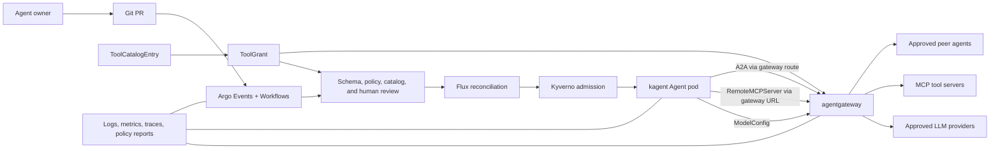

# Epic: Governed Agent Runtime Behind Agent Gateway

## Executive summary

Build the governance, security, and compliance control set for a regulated
agent platform where kagent agents can call LLMs, MCP tool servers, and other
agents only through agentgateway-controlled paths.

The engineering platform already has the core patterns: kagent `Agent`,
`ModelConfig`, and `RemoteMCPServer` resources; agentgateway LLM/MCP/A2A
routing; BYO-kagent onboarding with `ToolCatalogEntry` and `ToolGrant`; Kyverno
admission policy; NetworkPolicy; Argo Workflows review gates; and selective AKS
pod sandboxing guidance. This epic packages those patterns into the evidence,
policy, and operating model required for governance sign-off.

## Business outcome

The compliance and governance team can approve agent workloads because every
agent interaction has an explicit owner, identity, route, tool grant, data
handling expectation, audit trail, and exception path.

## Scope

In scope:

- Governance model for kagent agents, MCP tool servers, model providers, and
  A2A endpoints.
- Security baseline for agent pods, tool-server pods, shared model configs, and
  gateway routes.
- Policy-as-code controls for admission, egress, tool grants, model routing,
  namespace boundaries, and destructive action approval.
- Compliance evidence pack and operational review process.
- Architecture diagrams and control mapping that another team can use for
  sign-off and risk review.

Out of scope:

- Rebuilding kagent or agentgateway upstream features.
- Granting production access to any specific model, tenant, or tool.
- Applying manifests to a live cluster from this document.
- Capturing private hostnames, subscription IDs, tenant IDs, tokens, or
  environment-specific values.

## Current evidence in this repository

| Area | Existing material | Relevance |
|---|---|---|
| Agent gateway runtime | `platform/agentgateway/README.md`, `TEST-PLAN.md`, `DEMO-SCHEMA-GATE.md` | LLM routing, A2A route shape, gateway policies, rate limits, observability, schema-gated caveats. |
| MCP authorization | `docs/agentgateway-mcp-tool-auth/` | Pattern for agentgateway as MCP auth, discovery filtering, and tool-call enforcement. |
| Agent sandboxing | `docs/security/pod-sandboxing.md` | Decision matrix for Kata on BYO MCP, custom-code agents, and higher-risk tool servers. |
| BYO agent controls | `infra/byo-kagent/README.md` | Tool catalog, grants, quarantine flow, Kyverno admission, Flux/Argo review model. |
| Sandbox onboarding | `infra/byo-kagent/SANDBOX-ONBOARDING.md` | Practical threat model for escape paths: tool RBAC amplification, egress, tokens, prompt injection, A2A escalation, and LLM exfiltration. |
| kagent runtime contracts | `docs/security/kagent-runtime-contracts-reference.md` | Repo-local note covering `Agent`, `ModelConfig`, `RemoteMCPServer`, A2A, MCP, `toolNames`, `requireApproval`, `allowedHeaders`, and discovered tools. |
| agentgateway contracts | `docs/security/agentgateway-contracts-reference.md` | Repo-local note covering LLM/MCP/A2A proxy role, JWT/API-key/OAuth auth, CEL authorization, tools/list filtering, and tools/call denial. |

## Target architecture

Runtime rule: the agent runtime can request model, tool, or peer-agent access,
but agentgateway and platform policy decide what is reachable and what is
denied. Agent-side `toolNames` remains a useful client allowlist, not the only
security boundary.

## Governance principles

1. All model calls route through approved `ModelConfig` resources that point at
   agentgateway unless an explicit exception is approved.
2. All MCP tool calls route through agentgateway-fronted MCP endpoints once a
   tool leaves quarantine.
3. A tool is usable only when it is present in a verified catalog entry and
   granted to the specific agent, namespace, and tool names required.
4. A2A endpoints are treated as privileged APIs. An agent must not be able to
   invoke a more privileged agent unless identity, authorization, and audit are
   in place.
5. Agent pods and tool-server pods use the lowest practical privilege: restricted
   pod security, no unnecessary service account token, narrow RBAC,
   default-deny network policy, explicit resource limits, and no wildcard tools.
6. Kata pod sandboxing is selective. Use it for BYO MCP quarantine servers,
   custom-code agents, shell/code-execution tools, and write-capable tool
   servers where the threat model justifies hardware isolation.
7. Human approval is required for destructive verbs, privilege expansion,
   direct model-provider egress, high-risk tool onboarding, and A2A access to
   platform agents.

## Control model

| Control family | Minimum control | Evidence artifact |
|---|---|---|
| Ownership | Every agent, tool server, model config, and gateway route has team, owner, cost-center, data-classification, and expiry metadata. | Git manifest metadata, PR approval, inventory export. |
| Identity | Agent identity is stable and propagated to gateway policy using trusted headers, JWT, mTLS, or ingress-side identity. | Agentgateway policy, Istio auth policy, request logs. |
| Authorization | Tool access comes from `ToolCatalogEntry` plus `ToolGrant`; A2A access requires explicit route authorization; direct MCP bypass is denied by network policy. | ToolGrant list, gateway MCP policy, Kyverno policy report. |
| Network isolation | Agent and tool namespaces are default-deny egress with allowlists for DNS, agentgateway, approved MCP services, and required platform APIs. | NetworkPolicy manifests and live connectivity tests. |
| Runtime hardening | PSS restricted, non-root, dropped capabilities, seccomp RuntimeDefault, resource limits, read-only filesystem where supported, no host networking. | Pod specs, Kyverno reports, admission tests. |
| Sandbox isolation | Kata runtime for higher-risk BYO MCP, custom-code, shell/code-exec, and broad write-capable tools. | RuntimeClass evidence, node pool config, boundary smoke test. |
| Data protection | External LLM egress is classified and approved; sensitive-data agents use approved data-residency or self-hosted models. | ModelConfig inventory, route policy, DLP/prompt guard config. |
| Prompt/tool safety | Prompt injection mitigated by least-privilege grants, content guardrails, destructive verb approval, and tool output review rules. | System prompt baseline, gateway guardrails, HITL workflow records. |
| Audit and monitoring | Gateway logs/metrics/traces, kagent tool-call logs, Argo workflow history, Kyverno policy reports, spend dashboards, alert rules. | Dashboard screenshots, query pack, retention config. |
| Change management | Agent, tool, and gateway changes enter through PR, schema checks, policy dry-run, security review, and Flux reconciliation. | PR template, check results, approval trail, Flux status. |

## Child features

### Feature 1: Agent and tool inventory

Create a governed inventory covering every `Agent`, `RemoteMCPServer`,
`ModelConfig`, `ToolCatalogEntry`, `ToolGrant`, gateway route, and A2A endpoint.

Acceptance criteria:

- Inventory includes owner, environment, namespace, purpose, data
  classification, model route, tool grants, A2A exposure, expiry, and approval
  status.
- Inventory is generated from Git and can be compared with live cluster state.
- Unowned or expired agents, tools, and grants produce policy findings.
- Inventory output is safe to share in a public/sanitized evidence pack.

### Feature 2: Model access governance

Require all normal agent LLM access to go through agentgateway-managed
`ModelConfig` resources.

Acceptance criteria:

- Direct provider `baseUrl` values are denied unless an approved exception
  annotation and review record exist.
- Model configs record data residency, provider, model, cost tier, owner, and
  token budget.
- Agentgateway enforces rate limits, timeout, prompt guardrails, and telemetry
  for model traffic.
- Sensitive-data workloads have an approved route to an in-region or
  self-hosted model.

### Feature 3: MCP tool authorization and discovery

Make agentgateway the runtime enforcement point for MCP discovery and execution.

Acceptance criteria:

- New MCP servers enter quarantine before promotion.
- Tool discovery is captured in `RemoteMCPServer.status.discoveredTools` and
  promoted into immutable catalog entries.
- Each agent has explicit `ToolGrant` resources for allowed tools.
- Agentgateway filters unauthorized tools from `tools/list` and denies
  unauthorized `tools/call`.
- Agent-side `toolNames` is kept aligned with the grant, but gateway policy is
  treated as the authoritative enforcement point.

### Feature 4: A2A governance

Define which agents can call which peer agents, and enforce the policy at the
gateway or ingress layer supported by the installed CRD version.

Acceptance criteria:

- Every A2A route has a caller, callee, purpose, owner, and expiry.
- Calls from tenant agents to platform-trust-root agents are denied by default.
- A2A identity uses a trusted boundary: JWT, mTLS, service identity, or
  ingress-validated source policy. Plain spoofable headers are not accepted
  unless direct access is network-restricted.
- A2A route tests prove allowed calls succeed and denied calls fail.
- Where agentgateway lacks native A2A authorization in the installed CRD, the
  compensating control is documented at the Istio/ingress layer.

### Feature 5: Agent and tool sandbox baseline

Define baseline hardening for agent and MCP pods, with a tiered isolation model.

Acceptance criteria:

- All ordinary agents and tools use PSS restricted settings, non-root,
  seccomp RuntimeDefault, dropped capabilities, resource limits, and
  default-deny egress.
- Service account tokens are disabled where the pod does not need Kubernetes API
  access.
- Write-capable, BYO, custom-code, shell/code-exec, and broad tool servers are
  flagged for Kata sandboxing review.
- A live proof exists for each sandbox tier: regular restricted pod, restricted
  MCP tool server, and Kata-isolated high-risk tool server.

### Feature 6: Destructive action control

Prevent prompt injection or tool chaining from producing destructive platform
actions without explicit approval.

Acceptance criteria:

- Tools are classified as read, write, destructive, credential-accessing, or
  external-egress.
- Destructive or credential-accessing tools require HITL approval and narrower
  RBAC.
- `requireApproval` is used where the kagent CRD supports it, and workflow-level
  approval is used for resource-changing Argo operations.
- Policy blocks dangerous verbs from leaving MCP quarantine unless a manual
  risk exception exists.

### Feature 7: Evidence and audit pack

Produce the compliance evidence pack for sign-off.

Acceptance criteria:

- Evidence pack includes architecture diagrams, control matrix, threat model,
  policy register, exception process, validation commands, sample policy
  reports, telemetry screenshots, and residual-risk decisions.
- Evidence distinguishes verified cluster behavior from intended target-state
  controls.
- Every compensating control has an owner and expiry.
- Evidence can be regenerated after each platform release.

## Minimum validation plan

| Test | Proof |
|---|---|
| Agent cannot bypass gateway for LLM egress | Debug pod direct call to public model endpoint fails; agentgateway route succeeds. |
| Agent/tool workloads cannot bypass approved egress | Curl to direct model providers, arbitrary external HTTP, cross-namespace services, and Azure IMDS (`169.254.169.254`) fails from agent/tool namespaces unless explicitly allowlisted. This proves workload isolation, not agentgateway data-plane egress. |
| Agent cannot call ungranted MCP tool | Tool absent from discovery and direct call denied by agentgateway. |
| Agent cannot invoke privileged peer agent | A2A route denied without approved identity and policy. |
| Dangerous tool cannot leave quarantine | Kyverno/scan fails PR or admission. |
| Tool server has least-privilege RBAC | `kubectl auth can-i` checks match approved verbs and namespaces. |
| High-risk MCP runs isolated | Kata runtime class present and pod kernel differs from node kernel. |
| Change path is auditable | PR, Argo workflow, Flux status, Kyverno report, and gateway telemetry correlate to the change. |

## Governance handoff deliverables

- Approved target architecture and data-flow diagrams.
- Agent and tool inventory schema.
- Control matrix mapped to internal policy domains.
- Threat model focused on prompt injection, tool RBAC amplification, A2A
  escalation, network egress, service account token leakage, LLM data egress,
  and resource exhaustion.
- Exception process for direct LLM access, broad tools, write tools, A2A trust,
  and sandbox bypass.
- Evidence pack template and recurring review cadence.
- Residual-risk register with control owners.

## Decisions needed from governance and compliance

1. Which data classes may be sent to external LLM providers through an approved
   gateway route?
2. Which model providers, regions, and retention terms are approved for
   regulated workloads?
3. Which tool classes require mandatory human approval?
4. Which workload classes require Kata or equivalent hardware-backed isolation?
5. What retention period is required for prompts, tool calls, A2A calls, gateway
   telemetry, and policy reports?
6. What is the maximum approved lifetime for `ToolGrant`, A2A route, and BYO
   model exceptions?
7. Which identity mechanism is required for production: JWT, mTLS, workload
   identity, ingress source policy, or a combination?

## Suggested first milestone

Deliver a non-production governance proof using one read-only agent, one
quarantined MCP server, one gateway-fronted LLM route, and one denied A2A route.
The proof is complete when the evidence pack shows:

- Git PR creates or updates the agent and grants.
- Admission accepts only compliant manifests.
- Agent reaches the model only through agentgateway.
- Agent sees only granted MCP tools.
- Denied MCP and A2A attempts are logged.
- Default-deny egress blocks agent/tool workloads from IMDS, direct model
  providers, and arbitrary external endpoints unless explicitly approved.
- Compliance can trace owner, approval, route, policy, and runtime evidence.
