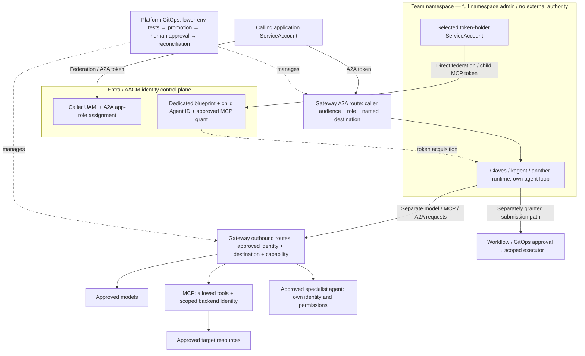

# Shared agentic cluster — onboarding and integration ADR brief

Prepared: 1 October 2026. Status: proposed decisions for discussion, not accepted ADRs or evidence of a deployed integration.

Claves is treated here as the agent harness/SDK described by the team. Its exact package, version, API support, and deployment model have not been verified. No Claves-specific implementation is assumed.

## What is an ADR?

An **Architecture Decision Record** is a short document recording a significant architecture choice: the problem, alternatives, decision, reasons, and consequences. It gives future teams the answer to “why did we build it this way?”

An ADR normally has a title, status (proposed, accepted, rejected, or superseded), context, decision, alternatives, consequences, owner, and date. This meeting should agree decisions or assign unresolved questions; agreement can then be recorded in the organisation's ADR template.

## Opening explanation for the meeting

“We provide a shared agentic cluster so teams can bring agents to market quickly. Teams get full administration within their onboarded namespaces and use shared gateway, MCP, model-guard and LLM capabilities. They can choose Claves, kagent, or another runtime. The platform owns cluster-wide infrastructure and shared access configuration. Changes follow our existing GitOps delivery process: lower-environment testing, promotion, and human approval before the target cluster is changed.”

## Agreed operating model

This brief follows the delivery and access model supplied by the platform team. It covers a shared agentic cluster; Claves is one supported onboarding path, not the cluster's sole tenant or mandatory framework.

- **Shared platform:** agentgateway, approved MCP services, model guard, approved LLM access/configuration, identity integration, observability and platform-owned cluster-wide prerequisites.
- **Team namespace:** the onboarded team has full Kubernetes/AKS administration inside its allocated namespace(s). It has no authority over other namespaces, shared platform namespaces or cluster-scoped objects.
- **Runtime choice:** Claves SDK, kagent harness/runtime, or another approved implementation. The common gateway and capability contract remains the same.
- **Existing change process:** reviewed code is tested in a lower environment, promoted through GitOps, and approved by a human before it changes the target cluster. Runtime API calls subsequently use the permissions established by those approved changes.

Teams have namespace-scoped RBAC admin access. They can use the CLI or their pipeline to manage namespace-scoped objects in their onboarded namespaces. Cluster-admin access remains with the platform team. Objects outside the team's scope require collaboration with the platform team; a shared Git repository is the proposed handoff, review and delivery mechanism.

### Shared capabilities and runtime adapters

| Capability | What onboarded teams receive | Platform responsibility |
|---|---|---|
| agentgateway | Approved endpoints and identity contract for model, MCP and agent traffic | Shared deployment, routes, access policies and operational support |
| MCP tools | Discoverable, explicitly granted tools and resource scopes | Catalog/service ownership, authorisation and downstream permissions |
| Model guard | The agreed model safety/data controls on supported traffic | Define the actual service/product, enforcement placement, policy owner and failure behaviour |
| LLM access / ModelConfig | Approved model selection and configuration | Provider integration, access approval, identity, usage visibility and shared configuration |
| Claves SDK | Claves-managed harness onboarding and developer experience | Claves team owns its SDK templates, support and compatibility with the shared contract |
| kagent harness/runtime | Platform-supported kagent onboarding and developer experience | Publish templates, approved model/tool references, runtime support and identity setup |
| Another runtime | A standard integration contract and compatibility path | Approve platform capabilities and prerequisites without requiring a harness migration |

`ModelConfig` is the kagent-specific Kubernetes configuration object when using kagent. Claves and other runtimes receive equivalent approved endpoint/model/authentication settings through their native configuration. “Model guard” is retained as the platform capability requested by the team; its concrete product and wiring remain to be confirmed rather than inferred to be a particular upstream feature.

### One common onboarding contract, multiple harness journeys

1. **Common platform onboarding:** request namespace/environment, owner, cost attribution, data class, identity and initial model/MCP/agent capabilities. Platform delivers the namespace access and shared prerequisites through the existing tested, promoted and human-approved GitOps process.
2. **Claves journey:** Claves' team supplies its own harness onboarding for its users, starter application, configuration, documentation and support. It consumes the common platform namespace and access contract; it does not grant cluster-wide access or bypass destination capability approvals.
3. **kagent journey:** platform supplies a supported runtime/Agent template, approved ModelConfig and MCP references, identity/token setup, sample use case and validation guide. Pin the supported kagent version and use its actual installed resource model; do not assume that a separate AgentHarness CR is mandatory.
4. **Other-runtime journey:** team supplies its runtime and uses the published model/MCP/A2A contract. Platform reviews only the required identity, capabilities, operational requirements and cluster-wide prerequisites, then proves compatibility.
5. **Completion:** deliver a working starter in the lower environment, demonstrate permitted calls and denied cross-team access, promote the reviewed configuration, and collect human approval before the target-cluster reconciliation. Record endpoints, owners, support, revocation and review dates.

Make the common inputs reusable so teams do not repeat platform onboarding for every harness. Reuse approved templates and existing capabilities to minimise setup; a new tool, new destination or broader resource scope goes through a capability-change request.

## Architecture and interaction pattern



The arrows show separate requests. A model call does not automatically run an MCP tool. The harness receives a model's proposed tool call, decides whether to execute it, and sends a separate MCP request. An A2A call delegates a task to another agent; that agent makes its own model and tool requests.

| Component | Responsibility |
|---|---|
| Claves harness | Agent loop, prompts, state, tool selection, client authentication, cancellation, and application behaviour |
| agentgateway | Shared traffic boundary for approved model, MCP, and agent routes; request policy and telemetry |
| Model provider | Inference; returns text or proposed tool calls |
| MCP server | Exposes named tools and enforces access to the target systems/data |
| Platform agent / kagent | Optional specialist reasoning and task delegation; separate runtime from Claves |
| Argo / GitOps | Deterministic execution and governed delivery of approved changes |

agentgateway is the traffic and policy layer, not the agent loop or a durable workflow engine. Claves does not need to become a kagent Agent merely to consume the gateway. kagent interoperability is an additional integration choice.

The Kubernetes gateway control plane reconciles platform-owned Gateway API resources, backends, and policies into data-plane configuration. Claves consumes published endpoints; the platform manages the shared gateway configuration.

### Example: diagnose a problem in the team's namespace

1. An authenticated application/user asks Claves to investigate a workload.
2. Claves obtains a short-lived token for the gateway and calls an approved model route.
3. The model proposes an approved read tool. Claves sends an authenticated MCP call through the gateway.
4. The gateway checks caller and tool permissions. The MCP backend checks that the requested resource is inside its permitted scope.
5. Claves returns a bounded result to the model and produces a diagnosis with evidence.
6. If useful, Claves delegates a bounded question to an approved specialist agent through an authenticated A2A route. The specialist uses its own identity and permissions.
7. A suggested fix becomes a reviewable plan. Any actual change uses a separately authorised workflow or GitOps path.

## Entra security: two separately authorised calls

The 28 September [Entra request and ownership map](../../work-agent-bundles/kagent-agentgateway-tenant-isolation/ENTRA-AGENT-ID-REQUEST-OWNERSHIP.html) records two distinct boundaries. Apply the same separation to Claves; the SDK's Agent ID token acquisition and automatic renewal still need verification.

1. **Caller → named agent (Request 1):** the calling application's ServiceAccount federates to its caller UAMI. Entra issues a token for the protected A2A API with the assigned invoke role. The gateway checks the signed token and approved caller-to-target-agent mapping before forwarding to Claves or a platform agent. The blueprint is not involved in this incoming call.
2. **Running agent → MCP (Request 2):** the agent's selected token-holder ServiceAccount federates directly to a dedicated Agent ID blueprint. It obtains a token representing the child Agent ID for the protected MCP API. The gateway checks the exact child identity, MCP audience and role, and permitted tool before forwarding. The MCP server independently enforces target-resource permissions.

An agent calling another agent must obtain a token for that destination's protected A2A API and have an explicit caller-to-destination grant. An MCP token is not an A2A token. The original incoming caller's permission does not automatically become the running agent's outbound permission.

The current request design uses declared/inheritable MCP permissions plus an approved grant on the blueprint principal. All children within that inheritance boundary share the approved grant; gateway policy still allow-lists the specific child identity and tool. Use separate blueprints for independent trust boundaries, or a separately proven broker. Do not place an identity with privileges exceeding the approved team trust domain in a namespace fully administered by that team.

**Evidence limit:** the local ownership map records a disposable AKS pilot with direct ServiceAccount-to-blueprint federation and negative tests. That pilot used a direct child MCP grant and a caller blueprint for the inbound test, rather than the proposed inherited grant and caller UAMI. It also used manual token update/restart. This brief does not claim fresh workplace proof of the complete proposed chain. The previously attempted ServiceAccount → UAMI → blueprint middle hop failed and is not the Request 2 design. The referenced detailed pilot/request files are not present in this checkout; their raw evidence was not independently reviewed here.

## Resource scope and ownership

**Kubernetes scope and platform ownership are different axes.** The team can manage namespace-scoped objects through its CLI or pipeline in its onboarded namespaces. It cannot manage objects in other namespaces or install cluster-scoped objects. Namespaced objects are not themselves a guarantee of isolation: shared permission enforcement must remain outside team control, in platform/service-owner namespaces, external identity administration or platform-owned cluster-level controls.

| Resource | Kubernetes / external scope | Proposed owner and delivery |
|---|---|---|
| Deployment, application Service, ConfigMap, ordinary application Secret | Namespaced: onboarded team namespace | Team through its approved application delivery path |
| Runtime ServiceAccount | Namespaced: onboarded team namespace | Team administers it; Entra owner controls federation/grants. No identity in this namespace exceeds approved team authority |
| kagent Agent, ModelConfig, RemoteMCPServer, ToolGrant instances, if used | Namespaced custom resources | Team administers local configuration; platform authorises actual shared access at the gateway/backend. CRDs are platform-installed. Other runtimes use native configuration |
| HTTPRoute | Namespaced: shared gateway namespace recommended | Platform GitOps after access approval; team supplies a request, not an unrestricted route |
| Gateway and listeners | Namespaced: shared gateway namespace | Platform GitOps; controls listener, TLS, and which namespaces may attach routes |
| AgentgatewayPolicy and AgentgatewayBackend | Namespaced: shared gateway or approved backend namespace | Platform/service owner GitOps; protects signed-claim checks, tool policy and backend credentials |
| ReferenceGrant | Namespaced: referenced backend's namespace | Backend owner approval for shared targets. A team-owned grant can expose its own backend, not grant access to another namespace |
| NetworkPolicy, Role, RoleBinding, quota, LimitRange | Namespaced | Team has full namespace administration. Platform owns cross-team enforcement; do not rely solely on an editable team NetworkPolicy |
| Namespace object and its security labels | Cluster-scoped | Platform onboarding GitOps; team does not change trust/admission labels |
| GatewayClass, CRDs, ClusterRole, ClusterRoleBinding, admission policies/webhooks | Cluster-scoped | Platform infrastructure repository and privileged reconciler; no team installation |
| CiliumNetworkPolicy / CiliumClusterwideNetworkPolicy | Namespaced / cluster-scoped respectively | Platform network owner; use installed CNI-supported enforcement and audit additive policies |
| Entra API registrations, blueprints, child identities, FICs and app-role assignments | Entra/Azure resources, outside Kubernetes RBAC | Identity/AACM owner through approved private identity workflow or supported IaC |
| UAMI, Azure role assignments, private DNS/network configuration | Azure resources | Platform/cloud owner; distinct from Entra API app roles |

A team installing a Helm chart must identify CRDs, cluster roles, webhooks, Namespace objects, and any shared gateway objects first. Platform installs the approved prerequisites; the team's chart deploys only permitted namespaced components. A RoleBinding may reference a platform-created ClusterRole while granting permissions only within its namespace; this is not permission to create that ClusterRole.

## HTTPRoute: routing consent is not caller permission

The route contract needs all of the following:

- **Attachment:** `parentRefs` selects the platform Gateway and, preferably, the named listener using `sectionName`. Gateway `allowedRoutes` restricts attachment to platform-controlled route namespaces. Cross-namespace route-to-Gateway attachment uses `allowedRoutes`, not ReferenceGrant.
- **Matching:** fixed hostname, path, and supported methods select the approved destination. Keep A2A paths mapped to a named agent; validate rewrites, trailing slashes, encoded paths, appended paths, and discovery metadata so another agent endpoint cannot be selected through the same route.
- **Backend reference:** `backendRefs` names the approved Service or AgentgatewayBackend. A cross-namespace backend reference needs a ReferenceGrant in the target namespace, subject to installed implementation support for the referenced kind. Restrict its target name. ReferenceGrant authorises configuration references; it does not authorise HTTP callers or grant Kubernetes RBAC.
- **Request permission:** platform-owned policy attached through `targetRefs` requires strict JWT validation and matches approved signed caller identity, API audience, role, destination, and permitted capability. No matching access grant means deny. Validate effective policy merging and missing-policy behaviour against the installed version.
- **Tool/resource permission:** MCP tool allow-lists govern `tools/call` and permitted discovery; backend identity and adapter validation constrain target resources and arguments. Hide unapproved tool metadata where supported and test the actual listing. Unknown tools and arbitrary backend URLs are denied.
- **Bypass prevention:** backend ingress admits only the gateway or an approved execution path. Caller egress allows only needed DNS, Entra token acquisition, gateway, and explicit application dependencies. Block direct agent pods, controller APIs, MCP Services, alternate ingress and provider endpoints where applicable.

A team can consume a gateway route without owning an HTTPRoute. If self-service route creation is added later, it requires a dedicated listener plus admission restrictions on hostnames, paths, references and required policies; do not attach arbitrary team routes to shared listeners.

### What the existing examples actually show

| Inspected source | Finding | Claves decision |
|---|---|---|
| [gateway-resources.yaml](gateway-resources.yaml) | Gateway listener uses `allowedRoutes.namespaces.from: All`; KubeAI ReferenceGrant permits Service targets without a name restriction | Do not copy this attachment/grant breadth into the tenant onboarding contract; use restricted route namespaces and named backend targets |
| [route-a2a-fleet-agent.yaml](route-a2a-fleet-agent.yaml) | HTTP prefix route rewrites to one kagent controller agent path and reaches a cross-namespace Service | Useful routing example; exact target and rewrite must be validated. It does not by itself restrict callers |
| [service-a2a-fleet-agent.yaml](service-a2a-fleet-agent.yaml) | Despite its filename, it contains a ReferenceGrant in the kagent namespace for the named controller Service | Backend owner's configuration consent, not an agent permission grant |
| [policy-a2a-fleet-agent.yaml](policy-a2a-fleet-agent.yaml) | Older fallback policy provides rate limit and timeout; comments defer identity checking to ingress | Insufficient alone for the proposed caller-to-agent permission model; unsigned `x-kagent-*` headers are not authority |
| [Entra A2A policy example](../../work-agent-bundles/kagent-agentgateway-tenant-isolation/profiles/aks-entra/chat-a2a-policy.yaml) | Strict JWT plus A2A app-role check | Add approved exact caller/target mapping and test effective default denial; role possession alone is insufficient for per-agent isolation |
| [Entra MCP policy example](../../work-agent-bundles/kagent-agentgateway-tenant-isolation/profiles/aks-entra/chat-mcp-policy.yaml) | Strict JWT, MCP role, and named tool check | Add exact child identity and downstream resource scope; validate token refresh and deny tests |
| [MCP route patches](../../work-agent-bundles/kagent-agentgateway-tenant-isolation/profiles/aks-entra/mcp-route-patches.yaml) | MCP/discovery paths use separate listeners; browser CORS example is broad | Keep discovery behaviour compatible; narrow origins for browser clients if needed. CORS is not workload authorisation |

These are source-review findings, not statements about the workplace's live configuration. Leave existing manifests unchanged until the target contract and installed schema are verified.

## Permission approval and delivery process

**Proposed collaboration mechanism:** a shared Git repository where teams submit changes for anything outside their namespace scope and the platform team reviews and delivers those changes. Teams continue to manage their own namespace-scoped objects through their CLI or pipeline. Entra changes use an approved private identity request. **Existing delivery process:** use the established GitOps testing, promotion and human-approval gates for delivery. Every change is tested in a lower environment, promoted as reviewed code, and human-approved before touching the target cluster. Repository layout can follow the existing organisation convention; a new repository is not mandatory. Teams can propose platform changes through a PR or submit a ticket for the platform team to prepare that PR. Repository write access does not confer deployment authority.

1. **Request:** record caller identity, target agent/MCP, exact tool names, target resources, business purpose, data class, environment, owner, expiry/review date, and whether writes are requested.
2. **Classify:** platform reviews the rendered chart/manifests and assigns every object to team namespace, protected namespaced platform configuration, cluster-wide prerequisite, or external identity/cloud configuration.
3. **Approve:** destination agent/MCP owner approves the capability; platform/security approves trust and network changes; Entra/AACM approves API roles, federation and blueprint grants. Keep the reviewed access record as the source of truth for gateway policy.
4. **Prepare:** platform authors the protected HTTPRoute, policy, backend reference, necessary ReferenceGrant, identity and network changes. Prefer a reviewable bundle committed to the platform repository. If manifests are copied from the team, review and pin that exact copy there rather than apply a mutable attachment.
5. **Prepare delivery:** separate scoped GitOps reconcilers deliver cluster prerequisites and protected configuration only through the existing promotion and human-approval gates. Entra changes use the authorised identity delivery mechanism. Team reconciliation cannot write cluster objects or overwrite platform guardrails. Avoid two reconcilers owning the same fields/resources.
6. **Test and promote:** in the lower environment, verify route `Accepted` and `ResolvedRefs`, relevant Gateway readiness/programming conditions, token claims, approved calls, denied calls, backend scope and direct-path network denial. Configuration acceptance alone is not access proof. Promote the reviewed revision and evidence, obtain human approval before target reconciliation, then verify the target outcome. Do not confuse approval to change platform configuration with approval for each individual read call.
7. **Operate:** give the team only the approved endpoint, identity/token contract, tool surface and support information. Record the grant expiry, review and revocation owner. Remove permission through the same controlled paths and verify fresh calls stop; define active-stream termination.

If a team supplies manifests by copying them to the platform team, the platform team reviews and incorporates them into its GitOps source. The copied files follow the same lower-environment tests, code promotion and human approval before reconciliation. Copying is a handoff mechanism, not a separate deployment or permission path.

### Access-grant register: what explicit permission means

| Caller | Destination | Capability | Default |
|---|---|---|---|
| Approved application UAMI | Named Claves/agent A2A API | Invoke that specific agent | Deny unless granted |
| Approved Claves child Agent ID | Named platform specialist A2A API | Delegate the approved task class | Deny unless granted |
| Approved Claves child Agent ID | Named MCP API | Listed read tools against listed resources | Deny unless granted |
| Approved agent/workload identity | Workflow submission endpoint | Named workflow with constrained inputs | Deny unless separately granted |

This is a logical approval record, not a claim that a new access CRD is installed. Broad roles such as `Mcp.Read` must be combined with caller/destination/tool/resource restrictions. A prompt, SDK configuration, `toolNames`, or editable ToolGrant is not a runtime permission boundary for arbitrary clients.

**Namespace admin constraint:** full namespace administration remains the agreed model. Standard NetworkPolicies are additive, and the team can change namespaced policies or run pods as ServiceAccounts inside its namespace. Therefore, a security boundary must not depend solely on team-owned policy or isolation between identities controlled by that same team. Use platform-owned cluster-level admission/CNI controls where required and destination-side restrictions in shared/other namespaces; do not silently reduce namespace administration. Within one namespace, networking alone cannot generally distinguish two agents that share one process, pod or credential. If the requirement forbids even direct in-namespace agent traffic, use separately enforced identities and runtime boundaries, or separate namespaces, and test those paths explicitly.

**Standing permission versus per-call approval:** reviewed grants permit future calls within the approved scope; they do not mean a human approves every read request. Mutating capabilities need a separate workflow/approval design. If the business requires human approval for each A2A delegation, add a durable approval gate before issuing the task rather than interpreting a static API role as that gate.

## Additional acceptance tests for isolation

- Claves may invoke agent A but not agent B, even if both share the same controller or MCP/tool backend.
- A caller with the correct generic role but an unregistered identity is denied.
- An A2A token cannot invoke MCP, and an MCP token cannot invoke A2A.
- A permitted tool cannot target another namespace, cluster, subscription or data-owner scope through its arguments.
- A team retains full namespace admin but cannot attach its routes to shared listeners, alter platform policy, weaken enforced cross-namespace isolation, assume identities outside its trust domain, or reference unapproved shared backends. It may create objects inside its namespace; those objects must not confer external access.
- Direct requests to agent pods, controller APIs, MCP Services and alternate routes fail, including applicable same-namespace paths.
- Network-denied tests show dataplane drop evidence and unchanged backend invocation counters; a gateway 401/403 only proves an authentication/authorisation denial on a reachable path.
- Removal/expiry of a grant is exercised with previously issued tokens as well as fresh tokens. Token expiry alone may delay revocation; use gateway deny policy and session handling for the required revocation speed.

## Three proposed ADRs

### ADR 1 — Provide a shared agentic cluster with multiple harness choices

**Context:** Multiple teams need quick access to shared agent capabilities while choosing Claves, kagent or another runtime.

**Proposed decision:** Offer one common platform onboarding contract with Claves-owned, platform-supported kagent, and other-runtime journeys. Host workloads in fully team-administered namespaces on the shared agentic cluster. Keep harness choice independent of governed gateway access. Prove each starter in a lower environment before promotion and human-approved delivery.

**Alternatives:** Require all agents to use kagent; allow standalone Claves with direct provider/tool access; use a dedicated cluster for Claves.

**Reason:** This preserves the team's runtime choice while reusing platform identity, routing, governance, and support patterns.

**Consequences:** The team owns SDK upgrades, agent behaviour, session storage, and client compatibility. The platform owns the shared gateway contract. A namespace provides logical isolation; stronger compute isolation may require dedicated nodes or a separate cluster following the workload assessment.

**Before acceptance:** Identify the exact SDK/version, owner, licence/support posture, runtime needs, and representative use case. Confirm model API, remote MCP transport, and optional A2A compatibility with that version.

### ADR 2 — Use agentgateway as the governed integration boundary

**Context:** Claves needs models, tools, and potentially platform specialist agents.

**Proposed decision:** Publish approved routes for three distinct interactions: model invocation, MCP tool access, and optional A2A delegation. Authenticate every caller and grant only named capabilities. Block direct access to shared backends through network and backend identity controls.

**Alternatives:** Direct provider/MCP connections; separate gateways for each protocol; a bespoke Claves-to-kagent adapter for all requests.

**Reason:** A shared integration boundary centralises access decisions, revocation, operational visibility, and backend configuration.

**Consequences:** Gateway availability becomes a dependency. Agree timeouts, streaming, concurrency, error handling, and token refresh. Retry model calls only within agreed bounds; never blindly replay a write tool or workflow submission. MCP and A2A support must be tested against the installed gateway and client versions.

**Before acceptance:** Confirm published endpoints, identity contract, route/tool allow-lists, data classification, telemetry retention, service ownership, and compatibility. Route names and CRD fields are implementation details to validate against the installed version.

### ADR 3 — Separate namespace administration from platform execution authority

**Context:** The team will have admin rights in its namespace, but shared services can reach resources beyond that namespace.

**Proposed decision:** Grant full administration inside onboarded namespaces, with no external or cluster-scoped authority. Enforce shared trust boundaries using platform-owned cluster-level controls and protected destination namespaces. Keep shared gateway routes, grants, policies, backend credentials, and federated-identity administration platform-owned. Use distinct caller and backend identities. Keep the first integration read-only; add mutations through separately authorised workflow executors.

**Alternatives:** Give the harness broad backend credentials; rely on namespace RBAC alone; require platform operators to manage every team application change.

**Reason:** Kubernetes namespace RBAC does not scope remote HTTP/MCP access. A permitted tool name also does not constrain its resource arguments or downstream credentials.

**Consequences:** Treat namespace admins as trusted for identities and secrets available within their namespace: they may be able to launch pods as another ServiceAccount or read credentials. If agents in that namespace need mutually isolated authority, use an additional enforced boundary rather than assuming ServiceAccounts alone provide it. Platform-owned guardrails must not be editable by the team. A generic arbitrary-command tool is not made namespace-safe merely by putting it behind the gateway.

**Before acceptance:** Record the actual namespace-scoped Kubernetes/AKS admin assignments, platform control ownership, and whether the intended identity scope matches the namespace trust boundary. Prove cross-team denial and direct-backend denial.

## Identity and ownership contract

Recommended workload pattern, subject to the existing onboarding design and installed-version proof:

```text
Claves pod ServiceAccount
  -> AKS Workload Identity federation to approved team UAMI
  -> short-lived Entra token for the gateway audience
  -> gateway validates issuer, audience, signature, expiry, caller and roles
     -> model backend uses platform-owned provider identity
     -> MCP backend uses approved downstream identity and resource permissions
```

UAMI means user-assigned managed identity. Federation permits token acquisition; gateway app-role assignment grants gateway access. Neither automatically grants downstream Kubernetes or model permissions. Do not forward the caller token to a backend unless a separately designed delegation contract requires it.

An end-user calling Claves is a separate authentication boundary. Decide whether downstream access uses the application's service identity or the user's delegated permissions. Do not imply that a workload token preserves an end user's personal entitlements.

| Onboarded team / harness owner owns | Platform / service owners own |
|---|---|
| Runtime image, SDK, agent code, prompts, sessions | Shared gateway deployment, routes, policies, approved backends |
| Namespaced workload and client token refresh | Federation approval, app-role grants, protected identity configuration |
| Use-case tests and required capabilities | MCP onboarding, downstream permissions, policy enforcement |
| Application availability and support | Gateway availability, revocation, shared telemetry and incident response |

## Questions to resolve in the meeting

1. What is the exact Claves library/version, and who owns it?
2. Is the first use case model-only, model plus tools, or specialist-agent delegation?
3. Can Claves supply a configurable model base URL and refreshed auth headers, remote MCP transport, streaming, and cancellation? Does it actually need A2A?
4. Are permissions application-owned or delegated from an end user?
5. Which exact tools and target resources are needed? Are any writes required?
6. What can namespace admins change, and which controls remain platform-owned?
7. What data may leave the namespace, and what may be logged? What are the retention and residency requirements?
8. Who owns costs, support, rollout, rollback, and offboarding?

## Pilot acceptance evidence

- One real Claves request succeeds through the approved model route, including the required streaming mode.
- One approved MCP tool succeeds against an allowed resource with bounded output.
- Missing/expired tokens, wrong audience, wrong caller, unapproved tools/models, and cross-namespace resource requests are denied.
- Direct shared-backend access is denied; test network bypass as well as API authentication.
- Token refresh and gateway/runtime restart work without widening permissions.
- Caller, route, outcome, latency, and available token usage can be correlated without logging credentials or unapproved content. Team attribution uses trusted identity, not caller-controlled labels.
- Revocation stops fresh requests; define and test the handling of existing streams/sessions.
- If A2A is included, authenticate its ingress and prove the caller cannot drive a more privileged agent beyond its approved delegation scope.

Agree measurable rate/concurrency/token limits. Local per-replica throttles are not a guaranteed aggregate spending cap.

## Official security references

- https://gateway-api.sigs.k8s.io/docs/concepts/security/
- https://gateway-api.sigs.k8s.io/reference/api-types/referencegrant/
- https://agentgateway.dev/docs/kubernetes/latest/documentation/security/authorization/
- https://learn.microsoft.com/en-us/entra/agent-id/agent-blueprint

## Source and evidence boundary

This brief adapts the repository's [application-team front sheet](APPLICATION-TEAM-ONBOARDING-FRONT-SHEET.md), [onboarding design](APPLICATION-TEAM-ONBOARDING-PLAN.md), and [gateway architecture](README.md). These are design inputs, not live Claves proof. The [BYO-kagent material](../../infra/byo-kagent/README.md) supplies related catalog/admission patterns; its platform-specific ToolGrant resources do not automatically enforce permissions for an external SDK.

Official upstream architecture and protocol references checked for this brief:

- https://agentgateway.dev/docs/kubernetes/latest/documentation/about/overview/
- https://agentgateway.dev/docs/kubernetes/latest/documentation/agent/
- https://github.com/agentgateway/agentgateway/blob/main/README.md

Latest upstream capabilities are not a guarantee of support in the workplace's installed gateway. No cluster changes or live integration tests were performed to prepare this brief.
