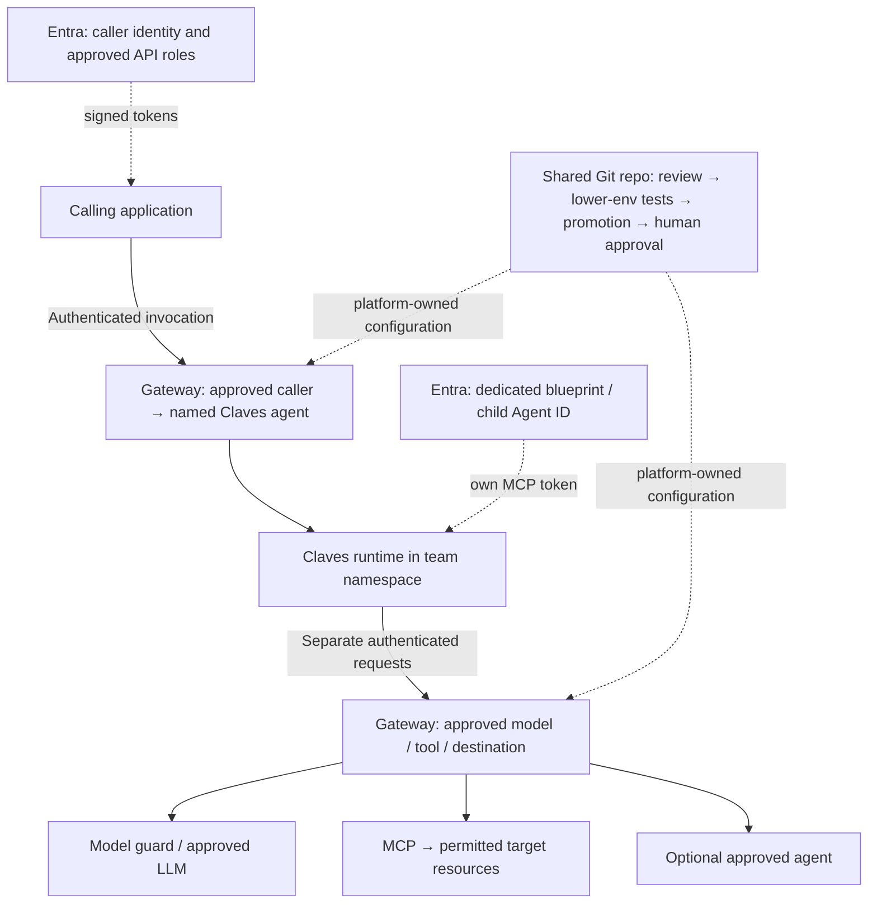

# Claves on the agentic platform — meeting brief

Prepared: 1 October 2026. Status: proposed integration and onboarding decisions for discussion.

## What we want to enable

Give Claves users a quick, repeatable way to deploy their agents into an onboarded namespace and use shared model, tool and agent capabilities. The Claves team owns the harness experience; the platform team owns the shared infrastructure and access controls.

“Your team brings the Claves runtime and agent logic. We provide your namespace, governed gateway access and approved shared capabilities. You manage namespace-scoped objects through your CLI or pipeline. For anything outside that scope, we work together through a proposed shared Git repository and our existing testing, promotion and human-approval process.”

## What Claves users receive

| Capability | What the platform provides | What Claves configures |
|---|---|---|
| Namespace access | Namespace-scoped RBAC admin in onboarded namespaces | Runtime, application Services, configuration and namespaced deployment pipeline |
| agentgateway | Published endpoints and authentication contract | Gateway URLs, client authentication, token renewal and supported request protocols |
| LLM access | Approved models, provider integration and native client configuration | Model selection, prompts, streaming, timeouts and agent loop |
| Model guard | Agreed model safety/data controls | Compatible client requests and agreed data handling |
| MCP tools | Explicitly approved tools and target-resource scope | MCP client, tool selection and bounded handling of tool results |
| Other agents, if needed | Approved destination routes and invocation permissions | Optional task delegation; no automatic access to every agent |
| Operations | Shared-service ownership, telemetry and support route | Harness support, application availability and use-case validation |

The exact Claves SDK/version, model API compatibility, MCP transport and optional agent-delegation protocol need confirmation. “Model guard” is included as a shared capability; its concrete product, placement and failure behaviour remain to be agreed.

## Architecture and request flow

The Claves harness runs the agent loop. The gateway authenticates, authorises, routes and observes requests. A model may propose a tool call; Claves then makes a separate authenticated MCP request to execute an approved tool. Delegation to another agent is also a separate request with its own permission.

## Entra: permission for each boundary

1. **Caller → Claves agent:** a caller's ServiceAccount federates to its UAMI. Entra issues a token for the protected agent API with the approved invoke role. The gateway validates signature, issuer, audience, expiry, caller identity and named destination.
2. **Claves agent → MCP:** the proposed Agent ID design uses direct federation from the selected agent token-holder ServiceAccount to a dedicated blueprint. The runtime obtains a token representing the child Agent ID for the MCP API. The gateway checks child identity, audience, role and allowed tool; the MCP service enforces resource scope separately.
3. **Claves agent → another agent:** approve the caller-to-destination mapping and obtain the appropriate destination API token. An MCP token does not authorise agent invocation.

The incoming application's permissions do not automatically become the agent's outbound permissions. Blueprint inheritance, if selected, must be explicitly approved; independent trust boundaries should not share a blueprint credential boundary. The team controls identities inside its fully administered namespace, so none should have authority beyond the approved team scope.

Automatic token acquisition and renewal in Claves, the chosen grant design and the complete workplace path need verification. This is a design brief, not evidence that the integration is live. Real identity identifiers and token evidence belong in the approved private work system.

## What your team can manage

Teams have **namespace-scoped RBAC admin access**. They can use their CLI or pipeline to manage namespace-scoped objects in their onboarded namespaces. **Cluster-admin access stays with the platform team.** Objects in other namespaces and cluster-scoped objects require platform collaboration.

| Object / change | Scope and owner | How we work together |
|---|---|---|
| Claves Deployment, application Service, ConfigMap, Secret, ServiceAccount | Team namespace; team-managed | Team CLI or pipeline within its namespace |
| Shared Gateway, HTTPRoute, gateway policy and model/MCP backend | Namespaced in platform/service-owner namespaces; platform-managed | Team requests endpoint/capability; platform reviews and delivers configuration |
| ReferenceGrant for a shared backend | Referenced backend namespace; backend owner | Owner approves named reference; platform delivers the reviewed grant |
| CRDs, GatewayClass, cluster roles, cluster admission/network prerequisites | Cluster-scoped; platform-managed | Team supplies requirements or chart; platform installs approved prerequisites |
| Entra federation, API roles, blueprint and child identities | External identity administration | Private identity request with platform and identity owners |
| Cross-team network and backend isolation | Platform-owned enforcement | Platform proves direct bypass and unapproved cross-team access are denied |

An HTTPRoute is namespaced, but a shared route in the platform namespace is outside your namespace scope. Creating a route or grant in your own namespace does not give access to a shared Gateway or somebody else's backend. Namespace administration does not grant remote API or MCP permissions.

## Proposed collaboration and delivery process

Use a **shared Git repository** to propose changes outside the team's namespace scope. Agree its location, access, reviewers and ownership with the platform team. Existing organisation repository conventions can be reused.

1. **Request:** Claves supplies the use case, namespace/environment, owner, data class, required models, exact MCP tools/resources and optional destination agents.
2. **Classify:** the platform team separates team-owned namespaced components from shared namespaced configuration, cluster prerequisites and external identity work. Render Helm charts before assigning ownership.
3. **Review:** destination/service owners approve requested capabilities; platform and identity owners review the corresponding controls. Record purpose, grant scope, owner and review/expiry date.
4. **Build and test:** teams and platform prepare their respective changes. Test the complete starter and positive/negative access cases in a lower environment.
5. **Promote and approve:** promote reviewed code through GitOps and obtain human approval before it changes the target cluster. Platform reconciliation delivers protected/shared objects; team delivery stays namespace-scoped.
6. **Verify and hand over:** verify target access, provide approved endpoints and configuration, and record support, renewal, revocation and rollback responsibilities.

If Claves hands manifests to the platform team by copying them, incorporate the reviewed copy into the shared GitOps source. Copying is a handoff, not a bypass of testing, promotion or human approval.

## Claves-owned harness onboarding

The Claves team owns its user journey: SDK installation, starter application, harness configuration, agent development guidance and support. The platform supplies a reusable namespace-and-capability contract underneath that journey.

A practical starter should include:

- A pinned SDK/runtime version and namespaced deployment template.
- Approved gateway/model settings and working token acquisition/renewal.
- One useful model call and one approved read-only MCP tool.
- Optional agent delegation only when explicitly required and approved.
- Clear success checks, common error guidance and escalation contacts.

Reuse the common onboarding record for later users and agents in the same approved team scope. Broader tools, new destinations or more resource permissions require a capability-change request.

## How explicit permission is enforced

| Layer | What it decides |
|---|---|
| Gateway listener attachment | Which namespaces may attach routes; team routes cannot automatically join shared listeners |
| HTTPRoute + ReferenceGrant | Approved destination and consent to cross-namespace configuration references |
| Strict token authentication and route authorisation | Approved signed caller, audience, role and destination |
| MCP policy and backend permissions | Exact allowed tools and permitted target resources/arguments |
| Platform-owned network controls | Prevent direct calls that bypass shared gateway policy |
| Controlled GitOps delivery | Reviewed and tested configuration reaches the target only after promotion and human approval |

A ReferenceGrant is configuration consent, not caller permission. Tool names alone do not scope resources. Editable client settings, prompts and request headers are not authority. Full namespace admin remains the team model; cross-team security must not rely solely on a NetworkPolicy the team can edit.

Standing permission allows future requests within the reviewed scope; human approval of a configuration change does not mean approval of each individual read call. Mutations need a separately agreed workflow and approval path. If each delegation needs approval, define that as a separate durable task gate.

## Decisions for this meeting

An **ADR (Architecture Decision Record)** records the context, decision, alternatives and consequences of an architecture choice. These are proposed decisions to capture after discussion:

| Proposed ADR | Decision to agree | Consequence |
|---|---|---|
| Claves adoption | Claves owns its runtime and harness onboarding; platform supplies shared capabilities | Clear division of support and delivery responsibilities |
| Gateway integration | Use governed model, MCP and optional agent routes with explicit permissions | Client compatibility and token renewal must be proven |
| Resource ownership and delivery | Team CLI/pipeline manages namespace-scoped objects; shared/out-of-scope changes use platform collaboration via Git | Shared repository and reviewer ownership need agreement; existing delivery gates remain |

## Questions to settle together

1. Which Claves SDK/version and starter use case are we onboarding first?
2. Which exact models, model-guard controls, MCP tools and resource scopes are required?
3. Is calling another agent necessary, and which named destinations should be approved?
4. Does access use workload permissions or delegated end-user permissions?
5. Who owns Claves onboarding, platform onboarding, identity setup and support?
6. Where is the shared repository, and who can propose, review and deliver each class of change?
7. What streaming, timeouts, concurrency, usage limits, data residency and logging rules must the client support?

## What proves onboarding is ready

- The actual Claves starter completes an approved model call and MCP tool call.
- Wrong identity, audience or role, unapproved agents/tools/models and out-of-scope resources are denied.
- Direct access to shared agent/MCP backends cannot bypass the gateway.
- The team can administer its namespace through CLI/pipeline and cannot administer other namespaces or cluster-scoped resources.
- Token renewal, restart, revocation and relevant active-session handling work.
- Requests can be correlated without logging credentials or unapproved prompt/data content.
- The tested revision passes promotion and human approval before target-cluster changes; target behaviour is then verified.

## References and evidence boundary

This brief reflects the agreed platform delivery model and source-reviewed architecture. No live permissions, deployment or SDK compatibility is claimed.

- https://gateway-api.sigs.k8s.io/docs/concepts/security/
- https://gateway-api.sigs.k8s.io/reference/api-types/referencegrant/
- https://agentgateway.dev/docs/kubernetes/latest/documentation/security/authorization/
- https://learn.microsoft.com/en-us/entra/agent-id/agent-blueprint
