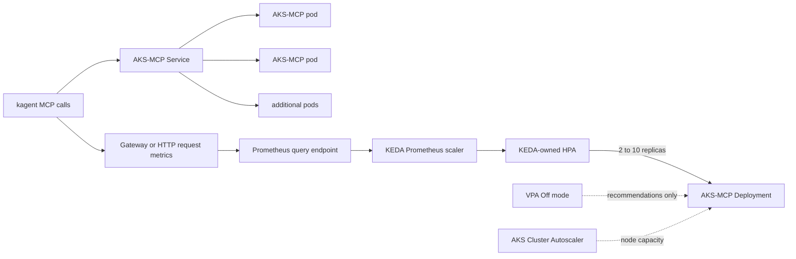

# AKS-MCP autoscaling on AKS

## Decision

**KEDA with a Prometheus request/concurrency trigger is the winner for the
current remote HTTP AKS-MCP deployment.** Native CPU HPA is a useful fallback,
not the preferred signal. VPA should run only in `Off` recommendation mode.

| Option | Security | Efficiency | Decision |
|---|---|---|---|
| KEDA + Prometheus | Supports a dedicated workload identity scoped only to `Monitoring Data Reader`; no metric credential belongs in the AKS-MCP pod | Reacts to MCP demand even when Azure and Kubernetes calls are I/O-bound; supports a warm floor and metric-failure fallback | **Use this** |
| Native HPA on CPU | No extra metric identity; depends on the AKS resource metrics path | Simple, but CPU can remain low while slow remote calls consume concurrency | Keep as a mutually exclusive fallback |
| VPA | No request-path credential, but automatic updates can restart or resize pods | Useful for learning correct CPU/memory requests, not for bursts of simultaneous calls | Enable only with `updateMode: "Off"` |

KEDA creates and manages an HPA internally. Never run the chart's KEDA mode and
native HPA mode against the same Deployment.



## What is implemented

The chart now supports three mutually exclusive values:

```yaml
autoscaling:
  mode: disabled # disabled, keda, or hpa
```

The production-target example is
[`chart/values-autoscaling-aks.yaml`](chart/values-autoscaling-aks.yaml). It
renders:

- a KEDA `ScaledObject` with a Prometheus trigger;
- a dedicated Azure Workload Identity `TriggerAuthentication` for the metric
  reader;
- a two-replica minimum, ten-replica maximum, and two-replica fallback if the
  metric query fails;
- slow scale-down behavior to reduce interruption of long MCP calls;
- a `PodDisruptionBudget`, topology spreading, and a pre-stop drain delay; and
- a VPA object with `updateMode: "Off"`; and
- an ingress `NetworkPolicy` that admits only `app=agentgateway` pods in the
  `agentgateway-system` namespace.

The chart pins its default image to `Chart.appVersion` (`v0.0.16`) instead of
`latest`. This matters because AKS-MCP `v0.0.20` changed to stdio-only. A
stdio-only process cannot be horizontally scaled behind this HTTP Service
without a separately designed gateway/wrapper and its own session tests.

## Pick the metric before applying

The example deliberately contains:

```yaml
query: '{{AKS_MCP_ACTIVE_REQUESTS_OR_RPS_PROMQL}}'
```

Replace it with a query that returns exactly one scalar or one-element vector.
Use this order of preference:

1. **In-flight requests** at the gateway or proxy. This best represents slow
   or streaming MCP calls. A starting target is ten active requests per pod.
2. **Request rate** over two minutes. Use this when no active-request gauge is
   available. A starting target is ten requests/second per pod.
3. **CPU utilization at 70%** only as the native HPA fallback.

Illustrative queries follow; label names must be proven against the work
metrics endpoint rather than copied blindly:

```promql
# Preferred when the proxy exports an active-request gauge.
sum(envoy_cluster_upstream_rq_active{envoy_cluster_name=~".*aks-mcp.*"})

# Fallback when the request counter and routing labels are known.
sum(rate(http_requests_total{namespace="aks-mcp",service="aks-mcp"}[2m]))
```

Before rollout, run the chosen query in the actual Prometheus workspace and
record all three results:

| State | Required result |
|---|---|
| No AKS-MCP traffic | One numeric result, normally zero |
| Steady test traffic | Non-zero and directionally proportional to requests |
| Metric endpoint unavailable | KEDA reports scaler errors and holds the configured two-replica fallback |

`ignoreNullValues: "false"` is intentional. An empty query result is treated as
a scaler failure rather than silently appearing to be zero demand.

## Identity and security boundaries

There are two separate user-assigned managed identities:

| Identity | Runs as | Minimum scope |
|---|---|---|
| AKS-MCP UAMI | AKS-MCP ServiceAccount/pods | Only the approved AKS and Azure read operations documented in the main README |
| KEDA Prometheus UAMI | KEDA operator through `TriggerAuthentication` | `Monitoring Data Reader` on the specific Azure Monitor workspace |

Do not give the metric-reader identity AKS cluster permissions, and do not give
the AKS-MCP identity broad monitoring or subscription-wide access merely to
make scaling work. On AKS Standard, enable workload identity before enabling
the managed KEDA add-on. Azure Managed Prometheus requires the KEDA identity;
an unauthenticated in-cluster Prometheus endpoint can omit the
`TriggerAuthentication`, but its network reachability should still be
restricted.

The KEDA identity is independent of the AKS-MCP UAMI swap: changing AKS-MCP's
authentication or worker-cluster authorization does not require changing the
scaler identity.

The production values assume the repository's agentgateway is the authenticated
front door. Keep its authentication policy enabled and verify the generated
gateway pods carry `app=agentgateway`; otherwise the NetworkPolicy correctly
denies all AKS-MCP ingress. Do not expose the Service directly while OAuth is
disabled. Horizontal autoscaling rejects the chart's process-local OAuth mode.

## Install sequence on AKS

1. Verify the deployed AKS-MCP version still serves `streamable-http` and pin
   its image tag.
2. Enable the managed KEDA add-on on AKS Standard, or confirm KEDA is already
   present on AKS Automatic.
3. Confirm `ScaledObject` and `TriggerAuthentication` CRDs exist.
4. Configure the dedicated metric-reader workload identity and assign
   `Monitoring Data Reader` on the Azure Monitor workspace.
5. Replace every placeholder in `values-autoscaling-aks.yaml`.
6. Prove the PromQL query under idle and controlled-load conditions.
7. Render, inspect, and install:

   ```bash
   helm template aks-mcp ./chart \
     --namespace aks-mcp \
     -f ./chart/values-autoscaling-aks.yaml

   helm upgrade --install aks-mcp ./chart \
     --namespace aks-mcp --create-namespace \
     -f ./chart/values-autoscaling-aks.yaml
   ```

8. Send several concurrent MCP initialize/tool calls through the real kagent
   route. Prove calls succeed while two or more pods receive traffic.
9. Raise controlled traffic above the threshold. Record `ScaledObject` status,
   the KEDA-owned HPA, replica changes, request success rate, and latency.
10. Stop load and prove the Deployment returns gradually to two replicas after
    the stabilization window without terminating an active call.

Do not lower the minimum to zero. This is an interactive tool endpoint, not a
queue worker, and cold-start/session failure is more costly than two warm
replicas. Cap maximum replicas against Azure API throttles and downstream
cluster capacity; more MCP pods do not create more permitted Azure request
quota.

## Acceptance commands

```bash
kubectl -n aks-mcp get scaledobject,triggerauthentication,hpa,vpa,pdb
kubectl -n aks-mcp describe scaledobject aks-mcp
kubectl -n aks-mcp get deploy aks-mcp -w
kubectl -n aks-mcp get pods \
  -l app.kubernetes.io/name=aks-mcp -o wide
```

The repository render test is:

```bash
platform/aks-mcp/scripts/verify-autoscaling.sh
```

It proves chart structure and guardrails. It does not prove the work metric,
workload identity, live KEDA control loop, multi-replica MCP behavior, Azure
throttling, or node capacity.

## Sources

- [KEDA on AKS](https://learn.microsoft.com/en-us/azure/aks/keda-about)
- [AKS horizontal pod autoscaling](https://learn.microsoft.com/en-us/azure/aks/horizontal-pod-autoscaler)
- [AKS vertical pod autoscaling](https://learn.microsoft.com/en-us/azure/aks/vertical-pod-autoscaler)
- [KEDA Prometheus scaler](https://keda.sh/docs/2.18/scalers/prometheus/)
- [KEDA ScaledObject specification](https://keda.sh/docs/2.18/reference/scaledobject-spec/)
- [AKS-MCP v0.0.20 release](https://github.com/Azure/aks-mcp/releases/tag/v0.0.20)
