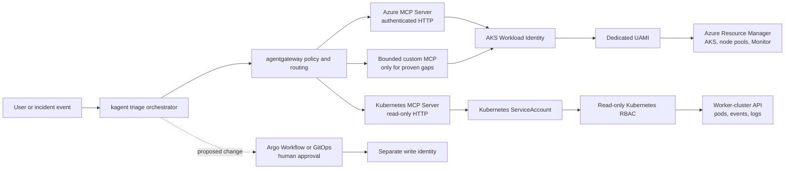

# AKS tooling for kagent after AKS-MCP v0.0.19

Status: proposed direction for review

Last upstream review: 2026-08-21

## Executive decision

Use AKS-MCP `v0.0.19` as a **time-limited compatibility bridge**, not as the
permanent platform.

The recommended long-term design is a composite tool plane:

1. **Azure MCP Server over authenticated HTTP** for supported Azure and AKS
   control-plane queries, using AKS Workload Identity and a dedicated UAMI.
2. **A read-only Kubernetes MCP server** for pods, events, logs, workloads and
   other Kubernetes API evidence, using Kubernetes ServiceAccount RBAC.
3. **Small, bounded custom MCP tools** only for proven capability gaps such as
   an AKS diagnostic that neither supported server provides.
4. **kagent as the orchestrator**, with explicit tool allowlists and
   agentgateway policy. Mutating operations remain outside the read-only tool
   plane and go through an approved Argo Workflow or GitOps/HITL path.

This is the winner because it preserves UAMI-based, secretless Azure access and
kagent compatibility without making an unsupported network deployment of
current AKS-MCP the permanent dependency.

Do not implement this as one unrestricted replacement for `call_az` and
`call_kubectl`. Split Azure and Kubernetes authority so each tool server has
only the permissions it needs.

## Why a decision is required

[AKS-MCP v0.0.20](https://github.com/Azure/aks-mcp/releases/tag/v0.0.20)
removed SSE, Streamable HTTP, OAuth/OBO, container publishing and Helm/Kubernetes
deployment support. Upstream says remote, proxy and gateway deployments are
outside its supported security boundary. A remote deployment cannot therefore
be upgraded in place from `v0.0.19`.

`v0.0.19` did support Streamable HTTP and included Host/Origin validation, so it
can continue to serve the existing kagent `RemoteMCPServer` pattern for a
bounded transition. It is nevertheless a frozen pre-breaking-change release;
remaining on it indefinitely means owning security fixes, image provenance and
compatibility risk.

The transport change does **not** invalidate AKS Workload Identity. Transport
and Azure authentication are separate concerns:

```text
kagent -> MCP transport -> tool process -> Workload Identity -> UAMI -> Azure
```

The replacement tool process can continue to use the same UAMI pattern even
when the MCP implementation changes.

## Target architecture



The UAMI authenticates the Azure-facing server to Azure. It is not inbound MCP
authentication and it does not grant Kubernetes API permissions. These are
three independent boundaries:

| Boundary | Recommended identity/control |
|---|---|
| kagent caller to MCP endpoint | Entra/JWT or mTLS at agentgateway, NetworkPolicy and an MCP tool allowlist |
| MCP workload to Azure | AKS Workload Identity federation to a dedicated UAMI with least-privilege Azure RBAC |
| Kubernetes MCP to a cluster API | Dedicated ServiceAccount and Role/RoleBinding, or another explicitly proven per-user/remote credential path |

## Options

| Option | UAMI | kagent fit | Tool coverage | Support and security position | Decision |
|---|---:|---:|---:|---|---|
| Pin AKS-MCP `v0.0.19` on private Streamable HTTP | Yes | Direct `RemoteMCPServer` | Broad AKS-MCP tools | Frozen legacy remote model; risk grows over time | **Use temporarily** |
| Run AKS-MCP `v0.0.20+` with kagent `MCPServer` stdio adapter | Technically yes | kagent can adapt stdio to HTTP | Broad AKS-MCP tools | kagent supports the mechanism, but AKS-MCP explicitly excludes proxy/gateway remote deployments from support | **Lab POC only** |
| Local-stdio AKS specialist exposed to kagent through A2A | Yes | kagent calls an A2A specialist rather than a remote MCP | Broad, but curated by the specialist | MCP remains local to the specialist, but the remote capability and shared identity still need explicit security/support review | **Candidate bridge** |
| Azure MCP Server HTTP plus Kubernetes MCP Server HTTP | Yes for Azure; Kubernetes uses its own RBAC | Native remote MCP composition | Good combined control-plane and data-plane coverage | Uses purpose-built remote transports and separates authority | **Strategic winner** |
| Bounded custom FastMCP/Go server using Azure and Kubernetes SDKs | Yes | Native `RemoteMCPServer` | Exactly what is implemented | Best least-privilege surface, but we own code, tests and maintenance | **Add only for gaps** |
| Maintain a private fork of AKS-MCP `v0.0.19` | Yes | Direct | Broad | Full ownership of security patches and divergence | **Last resort** |
| Wait for AKS-MCP remote support to return | Unknown | Unknown | Potentially broad | No delivery date or commitment | **Monitor, not a plan** |

kagent's current `MCPServer` API can attach ServiceAccount annotations and pod
labels, so the generated pod can carry the Workload Identity client-ID
annotation and `azure.workload.identity/use` label. That proves the identity
configuration is expressible; it does not make the AKS-MCP remote pattern
supported. Because `v0.0.20` also removed official container-image
distribution, this option would require an internally built and maintained
image containing the release binary, adding supply-chain ownership.

## What each strategic server contributes

### Azure MCP Server

The current [Azure MCP Server authentication model](https://github.com/microsoft/mcp/blob/main/docs/Authentication.md)
supports HTTP hosting with inbound Entra authentication and an outbound
`UseHostingEnvironmentIdentity` strategy. In AKS, that hosting identity can be
a UAMI reached through Workload Identity. No access token needs to be copied
into a Kubernetes Secret.

The current [Azure MCP Server AKS tools](https://learn.microsoft.com/en-us/azure/developer/azure-mcp-server/tools/azure-kubernetes)
cover read-only cluster and node-pool discovery/details. This does not yet
replace the complete AKS-MCP surface: it must be tested against the actual list
of tools we use, especially Azure Monitor detectors, Advisor, Fleet, networking,
Cilium/Hubble and Kubernetes logs/events.

Only enable explicitly approved tools. Do not expose every Azure MCP namespace
to the triage agent.

### Kubernetes MCP Server

The `containers/kubernetes-mcp-server` project currently supports Streamable
HTTP, read-only mode, tool filtering, denied resource types, OAuth/OIDC and
in-cluster ServiceAccount access. See its
[configuration reference](https://github.com/containers/kubernetes-mcp-server/blob/main/docs/configuration.md).

For triage, start with only:

- list/get pods;
- read pod logs;
- list warning events; and
- get/list the small set of workload resources needed to identify the owning
  Deployment, StatefulSet, DaemonSet, Job or CronJob.

Do not enable `exec`, Secrets, ConfigMaps, ServiceAccounts, RBAC inspection,
apply, delete, scale or Helm by default. Kubernetes RBAC remains the final
authority even when the MCP server also has a read-only/tool allowlist.

## Multi-cluster design

There are two viable patterns. Choose deliberately rather than allowing a
shared kubeconfig to become the accidental architecture.

### Pattern A: per-cluster read-only Kubernetes MCP

Deploy one small Kubernetes MCP server in each worker cluster with local
ServiceAccount RBAC. Register each endpoint with a stable cluster identifier
and let the kagent orchestrator route to the correct server.

Advantages:

- no central kubeconfig containing access to the fleet;
- each cluster enforces its own RBAC;
- failures and credentials are isolated; and
- the tool server naturally reaches private API endpoints.

Costs:

- a GitOps-managed component exists in every cluster; and
- kagent needs a registry/routing convention for many tool endpoints.

This is the preferred Kubernetes data-plane design when the fleet can accept a
small per-cluster component.

### Pattern B: central credential broker

Run a bounded server in the management cluster. For every request it receives
an immutable target tuple such as subscription, resource group and cluster,
acquires fresh credentials with the UAMI, and creates a request-scoped client.

If `az aks get-credentials` must be used, never update a shared default
kubeconfig. Use an isolated file/directory for the request, point only that
subprocess at it, validate the returned cluster identity, and remove the
request-scoped material afterwards. Concurrent requests must not be able to
change each other's current context.

Advantages:

- one centrally operated service; and
- easy integration with the existing management-cluster kagent deployment.

Costs:

- larger fleet-wide blast radius;
- more complex credential, concurrency and private-network handling; and
- the central UAMI needs carefully scoped access across subscriptions.

Choose this only if per-cluster deployment is rejected and the isolation tests
below pass.

## UAMI and federation requirements

For an Azure-facing tool server running on the management AKS cluster, obtain:

- `{{AZURE_TENANT_ID}}`;
- `{{UAMI_NAME}}` and `{{UAMI_CLIENT_ID}}`;
- `{{UAMI_PRINCIPAL_ID}}` for Azure role assignments;
- `{{MANAGEMENT_CLUSTER_OIDC_ISSUER}}`;
- the Kubernetes namespace and ServiceAccount name;
- every target subscription, resource group and AKS cluster;
- the exact Azure operations/tools required; and
- the approved Azure RBAC role and scope for each operation.

Create a federated identity credential with:

```text
issuer:   {{MANAGEMENT_CLUSTER_OIDC_ISSUER}}
subject:  system:serviceaccount:{{MCP_NAMESPACE}}:{{MCP_SERVICE_ACCOUNT}}
audience: api://AzureADTokenExchange
```

Annotate the ServiceAccount with:

```yaml
azure.workload.identity/client-id: "{{UAMI_CLIENT_ID}}"
```

Label the pod template with:

```yaml
azure.workload.identity/use: "true"
```

The workload-identity webhook injects a projected token file and Azure identity
environment variables. The Azure SDK or CLI exchanges that token as needed;
there is no token-refresh CronJob and no access-token Secret.

Assign the UAMI only the Azure roles required at the narrowest practical scope.
If the same service spans subscriptions, assign scoped roles in each approved
subscription rather than granting a broad tenant-level identity.

## Staged delivery plan

### Phase 0: stabilise the existing service

1. Pin AKS-MCP to the immutable `v0.0.19` image digest; do not use `latest`.
2. Keep it ClusterIP/private with no public ingress.
3. Use the UAMI through AKS Workload Identity; do not store Azure access tokens.
4. Run read-only, enable only required components/tools and restrict namespaces.
5. Restrict ingress to agentgateway/kagent and enforce an independent
   agentgateway tool allowlist.
6. Record every tool call, target cluster, duration and result without logging
   tokens or kubeconfig content.
7. Set a review date and removal criterion for `v0.0.19`.

### Phase 1: inventory and contract tests

Capture the tools the agents actually call for representative incidents. Map
each one to:

- Azure MCP Server;
- Kubernetes MCP Server;
- an existing Grafana/observability tool;
- a bounded custom tool; or
- not required.

The output is a small required-tool contract, not the full AKS-MCP catalogue.

### Phase 2: read-only composite POC

1. Deploy Azure MCP Server HTTP with inbound authentication and outbound
   hosting identity through the UAMI.
2. Deploy one read-only Kubernetes MCP against a non-production cluster.
3. Register both as separate kagent MCP servers with explicit tool names.
4. Run the same incident questions against `v0.0.19` and the composite path.
5. Compare factual correctness, latency, tool-call count, denied operations and
   evidence completeness.

### Phase 3: close only proven gaps

Implement a bounded custom MCP tool only when the Phase 2 evidence shows a
required capability is absent. Prefer Azure/Kubernetes SDK calls with typed
parameters over a generic shell command. A tool should encode target
validation, timeouts, output limits and auditable errors.

### Phase 4: cut over and retire the legacy service

Cut over only after the acceptance gates pass. Keep a rollback window, then
remove the `v0.0.19` Deployment, Service, RemoteMCPServer entry and obsolete
permissions. Do not leave the old broad identity active as a silent fallback.

## Acceptance gates

The replacement is ready only when all of these are proven with runtime
evidence:

- kagent discovers only the approved tools;
- the pod exchanges its projected token for the expected UAMI without a token
  Secret;
- Azure calls succeed in every approved subscription and fail outside scope;
- Kubernetes calls reach the selected cluster, not the previous request's
  context;
- pods, events and logs can be gathered for a representative incident;
- Secret reads, exec, apply, delete and unapproved Azure operations are denied;
- concurrent calls to different clusters cannot cross contexts;
- agentgateway records caller, server, tool, target and outcome;
- a tool-server outage fails closed and produces a useful kagent response; and
- the composite result is at least as useful as the `v0.0.19` baseline.

## Questions for Microsoft and the platform teams

1. Will AKS-MCP regain a supported authenticated remote transport?
2. Is a kagent `MCPServer` stdio adapter considered a supported local MCP
   client arrangement, or an unsupported gateway deployment?
3. Is an A2A specialist that launches AKS-MCP locally over stdio within its pod
   inside the intended support boundary?
4. Which AKS-MCP tools are genuinely required beyond current Azure MCP Server
   and Kubernetes MCP Server coverage?
5. Can worker clusters accept a small per-cluster read-only MCP, or must all
   access originate from the management cluster?
6. Must audit identity be per human caller, or is a dedicated shared triage UAMI
   acceptable for machine-to-machine read-only investigations?

## Source snapshot

- [AKS-MCP v0.0.19 release](https://github.com/Azure/aks-mcp/releases/tag/v0.0.19)
- [AKS-MCP v0.0.20 breaking change](https://github.com/Azure/aks-mcp/releases/tag/v0.0.20)
- [kagent kmcp `MCPServer` API](https://kagent.dev/docs/kmcp/reference/api-ref/)
- [kagent deploy MCP servers](https://kagent.dev/docs/kmcp/deploy/server)
- [Azure MCP Server authentication](https://github.com/microsoft/mcp/blob/main/docs/Authentication.md)
- [Azure MCP Server AKS tools](https://learn.microsoft.com/en-us/azure/developer/azure-mcp-server/tools/azure-kubernetes)
- [Kubernetes MCP Server configuration](https://github.com/containers/kubernetes-mcp-server/blob/main/docs/configuration.md)
- [AKS Workload Identity](https://learn.microsoft.com/en-us/azure/aks/workload-identity-overview)

Upstream capabilities are time-sensitive. Recheck these sources and pin tested
versions/digests before implementation.
