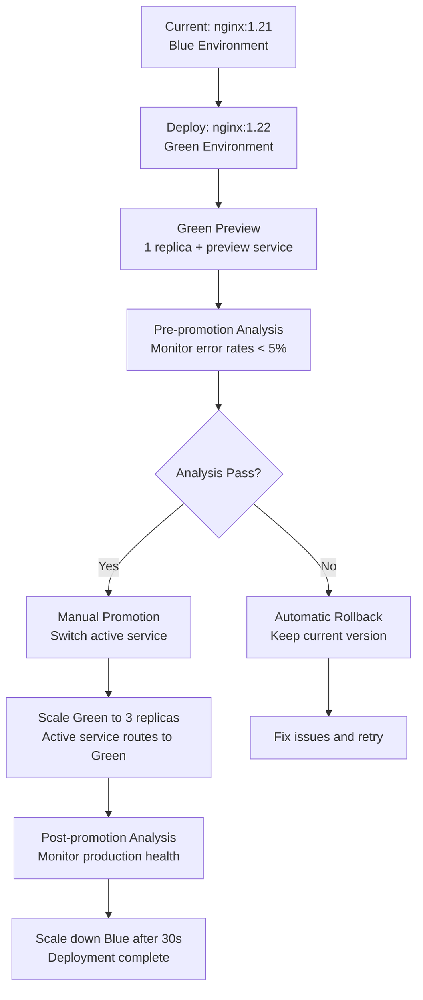

# Blue-Green Deployment Demo with Argo Rollouts & Workflows

This demo showcases a complete blue-green deployment implementation using Argo Rollouts for deployment strategy and Argo Workflows for orchestration.

## 🎯 What is Blue-Green Deployment?

Blue-Green deployment is a technique that reduces downtime and risk by running two identical production environments called **Blue** and **Green**:

- **Blue** = Currently running version (production traffic)
- **Green** = New version being deployed (staging/preview)

When the new version (Green) is ready and tested, traffic is switched from Blue to Green. If issues arise, traffic can instantly be switched back to Blue.

## 🏗️ Architecture Overview

```
┌─────────────────┐         ┌─────────────────┐         ┌─────────────────┐
│                 │         │                 │         │                 │
│  Argo Workflows │────────▶│  Argo Rollouts  │────────▶│   Kubernetes    │
│   (Orchestrate) │         │  (Blue/Green)   │         │    Services     │
│                 │         │                 │         │                 │
└─────────────────┘         └─────────────────┘         └─────────────────┘
         │                           │                           │
         │                           │                           │
         ▼                           ▼                           ▼
┌─────────────────┐         ┌─────────────────┐         ┌─────────────────┐
│                 │         │                 │         │                 │
│  Test Workflow  │         │   Blue/Green    │         │  Active Service │
│   Validation    │         │   ReplicaSets   │         │  Preview Service│
│                 │         │                 │         │                 │
└─────────────────┘         └─────────────────┘         └─────────────────┘
```

## 📋 Components

### 1. Argo Rollout (`rollout.yaml`)
- **Purpose**: Defines the blue-green deployment strategy
- **Key Features**:
  - 3 replicas for production (Blue)
  - 1 replica for preview (Green)
  - Manual promotion (autoPromotionEnabled: false)
  - Health checks via liveness/readiness probes
  - Pre/post promotion analysis with Prometheus

### 2. Services (`services.yaml`)
- **blue-green-active**: Routes production traffic to the current live version
- **blue-green-preview**: Routes test traffic to the new version being validated

### 3. Analysis Templates (`analysis-templates.yaml`)
- **pre-promotion-analysis**: Validates the preview environment before promotion
- **post-promotion-analysis**: Monitors the active environment after promotion
- Uses Prometheus metrics for error rate monitoring (≤5% error rate threshold)

### 4. Test Workflow (`test-workflow.yaml`)
- **Purpose**: Orchestrates and validates the blue-green deployment
- **Steps**:
  1. **deploy-demo-app**: Checks if demo application exists
  2. **create-services**: Validates services are created
  3. **create-rollout**: Verifies rollout status
  4. **verify-deployment**: Final validation of all components

## 🚀 How the Test Works

### Phase 1: Initial Deployment
```bash
./blue-green/test-demo.sh
```

1. **Install Components**:
   - Argo Rollouts (handles blue-green deployments)
   - Argo Workflows (orchestrates the process)
   - Required RBAC permissions

2. **Deploy Infrastructure**:
   - Creates two services (active/preview)
   - Deploys initial rollout with nginx:1.21
   - Sets up analysis templates for health monitoring

3. **Execute Test Workflow**:
   - Runs 4-step validation workflow
   - Verifies all components are healthy
   - Confirms blue-green setup is ready

### Phase 2: What Happens in the Test Workflow

The `test-workflow.yaml` orchestrates a 4-step validation process:

#### Step 1: deploy-demo-app
```bash
echo "Checking demo application deployment..."
kubectl get deployment blue-green-demo 2>/dev/null || echo "Rollout already exists, skipping deploy"
```
- **Purpose**: Verify the demo application is deployed
- **Action**: Checks for existing deployment or rollout
- **Success**: Rollout exists and is healthy

#### Step 2: create-services
```bash
echo "Checking services..."
kubectl get service blue-green-active blue-green-preview
```
- **Purpose**: Validate both services are created and accessible
- **Action**: Confirms active and preview services exist
- **Success**: Both services respond with their configurations

#### Step 3: create-rollout
```bash
echo "Checking rollout status..."
kubectl get rollout blue-green-demo
```
- **Purpose**: Verify the Argo Rollout is healthy and ready
- **Action**: Displays current rollout status and replica count
- **Success**: Rollout shows "Healthy" status with desired replicas

#### Step 4: verify-deployment
```bash
echo "Verifying deployment..."
kubectl get rollout blue-green-demo
kubectl get services
```
- **Purpose**: Final comprehensive validation
- **Action**: Double-checks all components are working together
- **Success**: All resources are healthy and accessible

### Phase 3: Blue-Green Deployment Flow

When you trigger an actual deployment (not just the test):



## 🎮 Demo Commands

### Check Current Status
```bash
# View rollout status
kubectl get rollout blue-green-demo -o wide

# Check services
kubectl get svc blue-green-active blue-green-preview

# Monitor workflow
kubectl get workflow blue-green-test-deployment
```

### Run the Complete Demo
```bash
# 1. Install and deploy everything
./blue-green/test-demo.sh

# 2. Check that workflow succeeded
kubectl get workflow blue-green-test-deployment

# 3. View rollout details
kubectl describe rollout blue-green-demo
```

### Trigger a Real Blue-Green Deployment
```bash
# Deploy new version (nginx:1.22)
kubectl patch rollout blue-green-demo --type merge -p '{
  "spec": {
    "template": {
      "spec": {
        "containers": [{
          "name": "demo-app",
          "image": "nginx:1.22"
        }]
      }
    }
  }
}'

# Watch the deployment progress
kubectl get rollout blue-green-demo -w
```

### Manual Operations
```bash
# Promote after validation (if auto-promotion disabled)
kubectl argo rollouts promote blue-green-demo

# Rollback if issues occur
kubectl argo rollouts undo blue-green-demo

# Check analysis results
kubectl get analysisrun
```

## 📊 What You'll See During Deployment

### Initial State
```
NAME              DESIRED   CURRENT   UP-TO-DATE   AVAILABLE   AGE
blue-green-demo   3         3         3            3           5m
```

### During Green Deployment
```
NAME              DESIRED   CURRENT   UP-TO-DATE   AVAILABLE   AGE
blue-green-demo   3         4         1            3           5m
```
- Current = 4 (3 Blue + 1 Green)
- Up-to-date = 1 (Green replica)
- Available = 3 (Blue still serving traffic)

### After Successful Promotion
```
NAME              DESIRED   CURRENT   UP-TO-DATE   AVAILABLE   AGE
blue-green-demo   3         3         3            3           6m
```
- All traffic now routed to Green (nginx:1.22)
- Blue environment scaled down
- Zero downtime achieved

## 🔍 Key Benefits Demonstrated

### Zero-Downtime Deployments
- Traffic switches instantly between services
- No service interruption during deployments
- Rollback capability within seconds

### Risk Mitigation
- New version validated before production traffic
- Automatic rollback on analysis failure
- Manual approval gates for critical deployments

### Automated Quality Gates
- Prometheus-based health monitoring
- Pre/post promotion analysis prevents bad deployments
- Configurable thresholds (5% error rate in demo)

### Complete Observability
- Workflow provides audit trail of all deployment steps
- Real-time status monitoring via kubectl
- Integration with monitoring systems

## 🛠️ Configuration Explained

### Critical Rollout Settings
```yaml
strategy:
  blueGreen:
    activeService: blue-green-active      # Production traffic endpoint
    previewService: blue-green-preview    # Testing/preview endpoint
    autoPromotionEnabled: false           # Requires manual approval
    scaleDownDelaySeconds: 30            # Wait before cleaning up old version
    previewReplicaCount: 1               # Size of Green environment
```

### Analysis Template Logic
```yaml
prometheus:
  query: |
    sum(rate(istio_requests_total{
      destination_service_name="{{args.service-name}}",
      response_code!="200"
    }[5m])) / sum(rate(istio_requests_total{
      destination_service_name="{{args.service-name}}"
    }[5m]))
successCondition: result[0] <= 0.95      # Max 5% error rate
```

## 🎯 Success Criteria

The demo is successful when:

- ✅ **Workflow Status**: `Succeeded` (all 4 validation steps pass)
- ✅ **Rollout Health**: Shows `Healthy` with correct replica count
- ✅ **Service Routing**: Both active/preview services respond correctly
- ✅ **Zero Errors**: No failed pods or connection issues
- ✅ **Ready for Production**: Can trigger actual blue-green deployments

## 🚨 Troubleshooting

### Common Issues

1. **RBAC Permissions**:
   ```bash
   # Fix with:
   kubectl create clusterrolebinding default-workflow-admin --clusterrole=admin --serviceaccount=default:default
   ```

2. **Port Forward Issues**:
   ```bash
   # Use NodePort instead:
   kubectl patch svc argo-server -n argo -p '{"spec":{"type":"NodePort"}}'
   ```

3. **Workflow Stuck**:
   ```bash
   # Check logs:
   kubectl logs -l workflows.argoproj.io/workflow=blue-green-test-deployment
   ```

## 📚 Next Steps

1. **Custom Applications**: Replace nginx with your application
2. **Advanced Metrics**: Add application-specific Prometheus queries
3. **Integration Tests**: Include smoke tests in analysis templates
4. **GitOps Integration**: Connect with ArgoCD for automated deployments
5. **Multi-Environment**: Extend to staging → production pipelines

This demo provides a production-ready foundation for implementing blue-green deployments with Kubernetes-native tools! 🎉