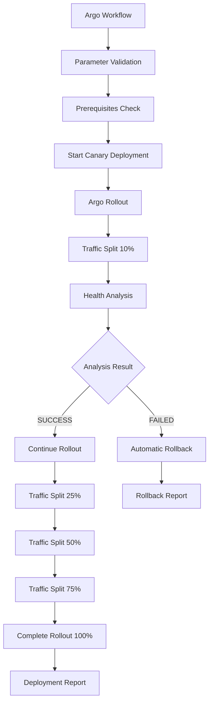

# Podinfo Canary Deployment Test

This directory contains a comprehensive canary deployment demonstration using **Argo Workflows** to orchestrate **Argo Rollouts** for safe, automated deployments with traffic splitting and rollback capabilities.

## Overview

The canary deployment test demonstrates how to:

1. **Orchestrate canary deployments** using Argo Workflows
2. **Manage traffic splitting** with Argo Rollouts (10% → 25% → 50% → 75% → 100%)
3. **Perform automated health checks** on both stable and canary versions
4. **Make promotion decisions** based on analysis results
5. **Generate deployment reports** with comprehensive logging

## Architecture



## Components

### 1. Core Files

- **`podinfo-canary-deployment-template.yaml`** - Main Argo Workflow template
- **`podinfo-canary-analysis-template.yaml`** - Health analysis workflow template
- **`podinfo-rollout.yaml`** - Argo Rollout configuration
- **`podinfo-services.yaml`** - Kubernetes services (stable/canary)
- **`test-canary-deployment.sh`** - End-to-end test script

### 2. Workflow Steps

#### Step 1: Parameter Validation
- Validates image tag format
- Ensures application name is provided
- Performs basic input sanitization

#### Step 2: Prerequisites Check
- Verifies Argo Rollout exists and is healthy
- Confirms stable and canary services are deployed
- Validates cluster permissions

#### Step 3: Canary Deployment
- Updates rollout image using kubectl JSON patch
- Triggers Argo Rollouts canary process
- Initiates traffic splitting (starts at 10%)

#### Step 4: Rollout Monitoring
- Waits for canary pods to be ready
- Monitors traffic weight progression
- Ensures rollout progresses through defined steps

#### Step 5: Health Analysis
- Tests stable service endpoints (`/healthz`)
- Tests canary service endpoints (`/healthz`)
- Performs basic performance comparison
- Returns SUCCESS/FAILED status

#### Step 6: Promotion Decision
- **Auto-promote**: Continues rollout to 100% if analysis passes
- **Manual promotion**: Pauses rollout for manual approval
- **Auto-rollback**: Aborts rollout if analysis fails

#### Step 7: Deployment Report
- Generates comprehensive deployment summary
- Includes timestamps, image versions, and final status
- Logs workflow completion details

## Prerequisites

### Required Infrastructure

1. **Kubernetes Cluster** (minikube, kind, or managed cluster)
2. **Argo Workflows** (v3.4+)
3. **Argo Rollouts** (v1.6+)
4. **kubectl** with cluster access

### RBAC Permissions

The workflow requires a service account with permissions for:

```yaml
# Core Kubernetes resources
- apiGroups: [""]
  resources: ["pods", "services", "configmaps"]
  verbs: ["get", "list", "watch", "create", "update", "patch", "delete"]

# Argo Rollouts resources
- apiGroups: ["argoproj.io"]
  resources: ["rollouts", "analysisruns", "experiments"]
  verbs: ["get", "list", "watch", "create", "update", "patch", "delete"]
```

## Quick Start

### 1. Deploy Prerequisites

```bash
# Enter development environment
devbox shell

# Deploy Argo Workflows and Rollouts
cd k8s/helm
./deploy-argo-workflows.sh
./deploy-argo-rollouts.sh

# Apply RBAC and workflow templates
cd ../argo-workflows
kubectl apply -f rbac.yaml
kubectl apply -f podinfo/
```

### 2. Run the Test

```bash
cd k8s/argo-workflows/podinfo
./test-canary-deployment.sh
```

### 3. Monitor Progress

#### Option A: Command Line
```bash
# Watch workflow progress
argo get -n argo $(argo list -n argo -o name | head -1) --watch

# Monitor rollout status
kubectl argo rollouts get rollout podinfo -n podinfo --watch
```

#### Option B: Argo UI
```bash
# Port forward to Argo Server
kubectl port-forward -n argo svc/argo-server 2746:2746

# Open browser to http://localhost:2746
```

## Test Configuration

### Default Parameters

| Parameter | Default Value | Description |
|-----------|---------------|-------------|
| `newImageTag` | `6.5.0` | Target image version for canary |
| `applicationName` | `podinfo` | Application identifier |
| `namespace` | `podinfo` | Target Kubernetes namespace |
| `autoPromote` | `false` | Enable automatic promotion |

### Customization Options

```bash
# Custom image tag
./test-canary-deployment.sh --image-tag 6.6.0

# Different namespace
./test-canary-deployment.sh --namespace my-app

# Enable auto-promotion
./test-canary-deployment.sh --auto-promote
```

## Rollout Strategy

The canary deployment follows this traffic progression:

```yaml
steps:
- setWeight: 10    # 10% traffic to canary
- pause: {duration: 30s}
- setWeight: 25    # 25% traffic to canary
- pause: {duration: 30s}
- setWeight: 50    # 50% traffic to canary
- pause: {duration: 30s}
- setWeight: 75    # 75% traffic to canary
- pause: {duration: 30s}
- setWeight: 100   # 100% traffic to canary (complete)
```

### Traffic Routing

- **Stable Service** (`podinfo-stable`): Always points to current stable version
- **Canary Service** (`podinfo-canary`): Points to canary version during rollout
- **Main Service** (`podinfo`): Balances traffic between stable/canary based on weights

## Health Checks

The analysis template performs comprehensive health validation:

### Endpoint Tests
```bash
# Stable service health check
curl -s http://podinfo-stable.podinfo.svc.cluster.local/healthz

# Canary service health check
curl -s http://podinfo-canary.podinfo.svc.cluster.local/healthz
```

### Performance Comparison
- Response time measurement for both versions
- Failure rate monitoring
- Basic load testing capabilities

### Success Criteria
- Both services return HTTP 200 status
- Response times within acceptable limits
- No critical errors in application logs

## Troubleshooting

### Common Issues

#### 1. Workflow Fails at Prerequisites
**Symptoms**: `deploy-initial-stable` step fails
**Solution**: Ensure base resources are deployed:
```bash
kubectl apply -f podinfo-rollout.yaml
kubectl apply -f podinfo-services.yaml
```

#### 2. Image Pull Errors
**Symptoms**: `ImagePullBackOff` in workflow logs
**Solution**: Verify image exists and is accessible:
```bash
docker pull stefanprodan/podinfo:6.5.0
```

#### 3. RBAC Permission Denied
**Symptoms**: `rollouts.argoproj.io "podinfo" is forbidden`
**Solution**: Apply updated RBAC:
```bash
kubectl apply -f ../rbac.yaml
```

#### 4. Rollout Stuck in Paused State
**Symptoms**: Workflow times out waiting for canary
**Solution**: Manual promotion or rollback:
```bash
# Promote canary
kubectl argo rollouts promote podinfo -n podinfo

# Rollback canary
kubectl argo rollouts abort podinfo -n podinfo
```

### Debug Commands

```bash
# Workflow status
argo get -n argo <workflow-name>

# Workflow logs
argo logs -n argo <workflow-name>

# Rollout status
kubectl describe rollout podinfo -n podinfo

# Pod status
kubectl get pods -n podinfo -l app=podinfo

# Service endpoints
kubectl get svc -n podinfo
```

## Advanced Usage

### Manual Promotion

```bash
# Pause automatic progression
kubectl argo rollouts pause podinfo -n podinfo

# Promote to next step
kubectl argo rollouts promote podinfo -n podinfo

# Complete rollout immediately
kubectl argo rollouts promote podinfo -n podinfo --full
```

### Rollback Scenarios

```bash
# Abort current rollout
kubectl argo rollouts abort podinfo -n podinfo

# Rollback to previous version
kubectl argo rollouts undo podinfo -n podinfo

# Rollback to specific revision
kubectl argo rollouts undo podinfo --to-revision=1 -n podinfo
```

### Custom Analysis

Create custom `AnalysisTemplate` for advanced health checks:

```yaml
apiVersion: argoproj.io/v1alpha1
kind: AnalysisTemplate
metadata:
  name: custom-podinfo-analysis
spec:
  metrics:
  - name: success-rate
    provider:
      prometheus:
        address: http://prometheus.monitoring.svc.cluster.local:9090
        query: |
          rate(http_requests_total{status=~"2.."}[5m]) /
          rate(http_requests_total[5m])
    successCondition: result[0] >= 0.95
```

## Security Considerations

### Network Policies
- Restrict traffic between namespaces
- Limit egress to required services only
- Implement proper service mesh policies

### RBAC Best Practices
- Use least privilege principle
- Separate service accounts for different workflows
- Regular permission audits

### Image Security
- Use signed container images
- Implement image scanning policies
- Restrict image registries

## Performance Considerations

### Resource Limits
```yaml
resources:
  limits:
    cpu: 200m
    memory: 128Mi
  requests:
    cpu: 100m
    memory: 64Mi
```

### Scaling Configuration
```yaml
spec:
  replicas: 3
  strategy:
    canary:
      maxUnavailable: 25%
      maxSurge: 25%
```

### Analysis Duration
- Shorter analysis windows for faster feedback
- Longer windows for more reliable metrics
- Consider business hours for production rollouts

## Integration Examples

### CI/CD Pipeline Integration

```yaml
# GitLab CI example
deploy_canary:
  stage: deploy
  script:
    - kubectl create -f - <<EOF
      apiVersion: argoproj.io/v1alpha1
      kind: Workflow
      metadata:
        generateName: podinfo-canary-
        namespace: argo
      spec:
        workflowTemplateRef:
          name: podinfo-canary-deployment-template
        arguments:
          parameters:
          - name: newImageTag
            value: "${CI_COMMIT_SHA}"
          - name: autoPromote
            value: "false"
      EOF
```

### Notification Integration

```yaml
# Slack notification template
- name: notify-slack
  http:
    url: "${SLACK_WEBHOOK_URL}"
    method: POST
    body: |
      {
        "text": "Canary deployment completed",
        "attachments": [{
          "color": "{{workflow.status}}",
          "fields": [{
            "title": "Image Tag",
            "value": "{{inputs.parameters.imageTag}}"
          }]
        }]
      }
```

## Monitoring and Observability

### Key Metrics to Monitor

1. **Deployment Metrics**
   - Rollout duration
   - Success/failure rates
   - Rollback frequency

2. **Application Metrics**
   - Response times
   - Error rates
   - Throughput

3. **Infrastructure Metrics**
   - Resource utilization
   - Pod restart counts
   - Network latency

### Dashboards

Recommended Grafana dashboards:
- Argo Rollouts Dashboard
- Application Performance Dashboard
- Kubernetes Workload Dashboard

## Contributing

To contribute improvements:

1. Test changes with multiple image versions
2. Validate RBAC permissions
3. Update documentation
4. Add integration tests
5. Follow security best practices

## License

This deployment configuration is part of the argo-workflow repository and follows the same licensing terms.