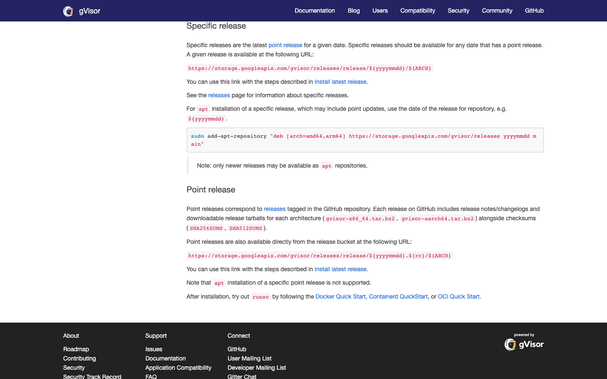
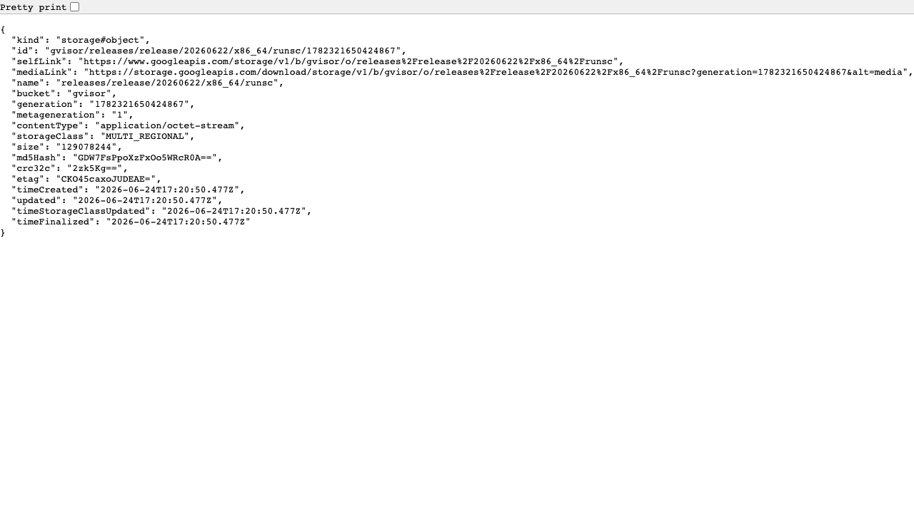

# Public upstream evidence for the pinned `runsc` download

This page is suitable for the work team's **public-source provenance** record. It is not a screenshot of a private vendor portal or a vendor email. No such portal view or correspondence was supplied for publication. The pinned asset is a **bare executable object** in gVisor's public Google Cloud Storage release bucket, so opening its media URL starts a download instead of showing a package-detail page.

For Agent Substrate `v0.0.9` on an `amd64`/`x86_64` worker, the chain is:

1. [Substrate's `SandboxConfig/gvisor-default` chart template](https://github.com/kagent-dev/substrate/blob/v0.0.9/charts/substrate/templates/sandboxconfig-gvisor.yaml) pins `gs://gvisor/releases/release/20260622/x86_64/runsc` and SHA-256 `f18a948bf9c8bbb54eb998549a3a8d719a1c7de2efbe8fdd2ff0ee5fecd06f19`.
2. [gVisor's official installation page](https://gvisor.dev/docs/user_guide/install/#specific-release) describes the dated release path under `https://storage.googleapis.com/gvisor/releases/release/${yyyymmdd}/${ARCH}`. Its [point-release section](https://gvisor.dev/docs/user_guide/install/#point-release) also identifies the release bucket. The screenshot below is a capture of that public page on 2026-09-25, not a reconstructed image.

   

3. [Google Cloud Storage's public object-metadata endpoint](https://storage.googleapis.com/storage/v1/b/gvisor/o/releases%2Frelease%2F20260622%2Fx86_64%2Frunsc) identifies the exact object: bucket `gvisor`, name `releases/release/20260622/x86_64/runsc`, generation `1782321650424867`, `application/octet-stream`, and size `129078244` bytes. This metadata URL displays JSON and **does not download the binary**. The screenshot below captures that public response on 2026-09-25.

   

4. The [direct HTTPS object URL](https://storage.googleapis.com/gvisor/releases/release/20260622/x86_64/runsc) returns the executable. It is expected to download when clicked. On 2026-09-25, a header-only request returned HTTP 200, `application/octet-stream`, and `129078244` bytes; streaming the body through SHA-256 produced the chart's pinned digest above. No work environment was contacted for this verification.

```sh
# Safe metadata check: no binary download.
curl --head --location 'https://storage.googleapis.com/gvisor/releases/release/20260622/x86_64/runsc'

# On a connected, approved acquisition host, check the bytes before mirroring.
set -o pipefail
curl --fail --location 'https://storage.googleapis.com/gvisor/releases/release/20260622/x86_64/runsc' \
  | shasum -a 256
# Expected: f18a948bf9c8bbb54eb998549a3a8d719a1c7de2efbe8fdd2ff0ee5fecd06f19
```

The `arm64`/`aarch64` asset has a **different** pin; see the same Substrate template and [packaging guide](PACKAGE-AND-PRESEED.md). Do not replace a pinned asset with `latest` or assume a future Substrate release uses this path or a single-file `runsc` distribution. The work-side approval record should retain its own download date, exact URL, observed SHA-256, internal mirror digest, and change reference. If an audit requires a vendor email rather than these public upstream sources, obtain it through the approved vendor-contact channel and attach it to the **private** work record, not this public repo.
