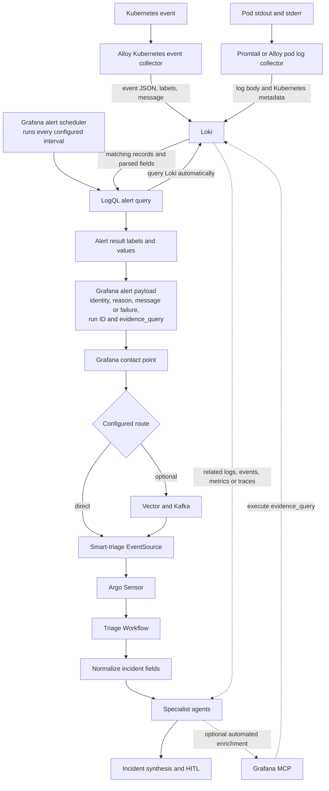

# LGTM Evidence Bridge Gap

## Problem

Metrics-only alerts are not enough for useful agentic triage. An alert that only
contains `cluster`, `namespace`, and `pod` tells the agent where to look, but
not what happened.

For triage to be useful, the alert path needs to preserve or retrieve the
actual evidence:

- Kubernetes event reason and message;
- pod log error pattern or sample error line;
- timestamp or alert evaluation window;
- enough labels or metadata to reconstruct a Loki query;
- optional Grafana Explore URL or query annotation.

## Core Principle

Do not try to make every useful field a Loki label.

Use Loki labels for low-cardinality routing and stream selection:

```text
cluster
namespace
service_name or workload
source_type
severity
event_reason, if bounded
```

Use structured metadata, parsed fields, annotations, or log body for
high-cardinality details:

```text
pod
container
trace_id
run_id
fingerprint
event_uid
full Kubernetes event message
sample log line
exception text
```

This matches Loki's design: labels narrow the stream, then LogQL filters,
parses, and counts records inside that stream.

## Automated Query And Triage Flow



No operator runs the alert query manually. Grafana evaluates the configured
LogQL rule on its schedule. When the result crosses the threshold, Grafana
builds the webhook payload and sends it to the configured contact point.

There are therefore two different automated queries:

1. **Detection query:** Grafana runs the LogQL alert query against Loki. It
   parses fields such as event reason, involved pod, log reason, and failure
   class, then uses those fields in the alert result.
2. **Evidence query:** Grafana includes a ready-to-run `evidence_query` in the
   webhook annotations. The triage agent can submit it through Grafana MCP to
   retrieve the original records and surrounding context without first having
   to discover the cluster, namespace, pod, or time scope.

The webhook should already be useful without the second query. Grafana MCP is
for deeper correlation, not for reconstructing basic incident identity that
the alert should have supplied.

Container image is a separate structured enrichment field. It can be added
from Kubernetes pod metadata during collection or by a bounded pod lookup in
the webhook enrichment stage. It was not part of the live-proven payload and
must not be inferred from an error message.

## Bridge For Kubernetes Events

Target path:

```text
Kubernetes event
-> Alloy loki.source.kubernetes_events or approved equivalent
-> Loki
-> Grafana LogQL alert
-> Alertmanager/Grafana webhook
-> Vector/Kafka
-> triage workflow
```

Minimum event fields required by triage:

```text
source_type=events
cluster
namespace
event_reason
event_type
involved_object_kind
involved_object_name
message
timestamp or alert_window
```

Recommended mapping:

| Field | Where it should live | Why |
|---|---|---|
| `cluster` | label | Needed for routing and query scope. |
| `namespace` | label | Needed for routing and query scope. |
| `source_type=events` | label or alert label | Needed by triage routing/scoring. |
| `event_reason` | label or parsed field | Usually bounded enough to route and group. |
| `event_type` | label or parsed field | Usually `Warning` or `Normal`. |
| `involved_object_kind` | structured metadata or parsed field | Useful context, may be label if low-cardinality. |
| `involved_object_name` | structured metadata | Often high-cardinality. |
| `message` | log body or structured metadata | High-cardinality; do not index as label. |

Example event LogQL alert:

```logql
sum by (cluster, namespace, event_reason) (
  count_over_time(
    {source_type="events", namespace=~"{{TARGET_NAMESPACE_REGEX}}"}
    | event_reason =~ "FailedScheduling|BackOff|FailedMount|ErrImagePull|ImagePullBackOff|Unhealthy"
  [5m])
) > 0
```

If `event_reason` is a Loki label, the query can be narrower:

```logql
sum by (cluster, namespace, event_reason) (
  count_over_time(
    {source_type="events", namespace=~"{{TARGET_NAMESPACE_REGEX}}", event_reason=~"FailedScheduling|BackOff|FailedMount|ErrImagePull|ImagePullBackOff|Unhealthy"}
  [5m])
) > 0
```

Alert labels should include:

```text
source_type=events
cluster={{ $labels.cluster }}
namespace={{ $labels.namespace }}
reason={{ $labels.event_reason }}
```

Alert annotations should include:

```text
summary=Kubernetes {{ $labels.event_reason }} event in {{ $labels.namespace }}
description=Kubernetes event reason {{ $labels.event_reason }} fired in namespace {{ $labels.namespace }}. Query Loki for the alert window to retrieve involved object and message.
loki_query={source_type="events", namespace="{{ $labels.namespace }}"} | event_reason="{{ $labels.event_reason }}"
```

If Grafana cannot include a full Explore URL, passing the `loki_query` and alert
window is enough for the triage agent or enrichment step to fetch the evidence.

## Bridge For Pod Log Errors

Target path:

```text
pod stdout/stderr
-> OTel Collector, Alloy, or Promtail
-> Loki
-> Grafana LogQL alert
-> Alertmanager/Grafana webhook
-> Vector/Kafka
-> triage workflow
```

Minimum log fields required by triage:

```text
source_type=logs
cluster
namespace
service_name or workload
pod or container, if available
error_class or log_pattern
sample_message or message_summary
timestamp or alert_window
```

Recommended mapping:

| Field | Where it should live | Why |
|---|---|---|
| `cluster` | label | Query and route scope. |
| `namespace` | label | Query and route scope. |
| `service_name` / `workload` | label | Stable service grouping. |
| `source_type=logs` | label or alert label | Triage routing/scoring. |
| `severity` | label or parsed field | Useful if bounded. |
| `pod` | structured metadata | High-cardinality; queryable but not ideal as label. |
| `container` | label or structured metadata | Usually bounded enough, but depends on setup. |
| `error_class` | parsed field or alert label | Use bounded classes, not raw messages. |
| `message` / sample line | log body or annotation | High-cardinality; do not index as label. |

Example generic error-burst alert:

```logql
sum by (cluster, namespace, service_name) (
  count_over_time(
    {namespace=~"{{TARGET_NAMESPACE_REGEX}}", service_name=~"{{TARGET_SERVICE_REGEX}}"}
    |~ "(?i)error|exception|panic|failed"
  [5m])
) >= 5
```

Example smoke marker alert:

```logql
sum by (cluster, namespace, service_name) (
  count_over_time(
    {namespace="{{SMOKE_NAMESPACE}}", service_name="{{SMOKE_SERVICE}}"}
    |= "AGENTIC_TRIAGE_SMOKE_ERROR"
    |= "run_id={{RUN_ID}}"
  [5m])
) >= 5
```

Alert labels should include:

```text
source_type=logs
cluster={{ $labels.cluster }}
namespace={{ $labels.namespace }}
workload={{ $labels.service_name }}
error_class=log_error_burst
```

Alert annotations should include:

```text
summary=Log error burst for {{ $labels.service_name }} in {{ $labels.namespace }}
description=Five or more error-like log lines matched in the alert window.
loki_query={namespace="{{ $labels.namespace }}", service_name="{{ $labels.service_name }}"} |~ "(?i)error|exception|panic|failed"
```

If the alerting system cannot pass a sample line, the `loki_query` plus alert
window is enough for the triage workflow to fetch the relevant lines.

## If Managed LGTM Cannot Pass Enough Context

If the managed service can fire alerts but cannot include useful annotations,
bridge the gap with an enrichment step:

```text
Grafana alert payload
-> Vector or webhook enrichment service
-> query Loki using labels and alert window
-> attach event/log evidence summary
-> Kafka/triage workflow
```

The enrichment step should add:

```text
source_type
reason or error_class
message_summary
loki_query
alert_window
sample_count
sample_lines, redacted where needed
```

This is still preferable to sending only `cluster` and `pod` to the agent.

## Acceptance Tests

### Event Acceptance Test

1. Create a safe unschedulable pod in a test namespace.
2. Confirm the Kubernetes event exists.
3. Confirm the event appears in Loki or the approved alertable backend.
4. Fire a Grafana alert for `FailedScheduling`.
5. Confirm the webhook payload includes or can reconstruct:

```text
source_type=events
namespace
event_reason=FailedScheduling
involved object
message or retrievable query
alert window
```

### Log Acceptance Test

1. Emit five known error lines from a test pod.
2. Confirm the lines appear in `kubectl logs`.
3. Confirm the same lines are queryable in Loki.
4. Fire a Grafana LogQL alert.
5. Confirm the webhook payload includes or can reconstruct:

```text
source_type=logs
namespace
workload/service
error_class or log pattern
sample line or retrievable query
alert window
```

## Decision Rule

The managed LGTM integration is acceptable if it can either:

1. pass the event/log reason and evidence query directly in the alert payload;
   or
2. pass enough stable labels and timing metadata for an enrichment step or
   triage agent to fetch the evidence from Loki.

It is not acceptable for agentic triage if it can only pass:

```text
cluster
namespace
pod
metric threshold
```

That gives symptom location, not source-backed evidence.
