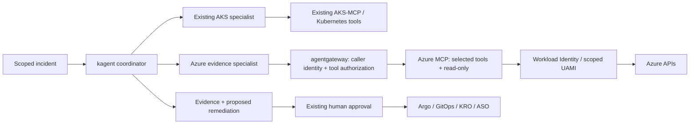

# Azure MCP alongside kagent: local PoC

For a visual overview of the practical scenarios, open [use-cases.html](use-cases.html).
The page is self-contained and includes the architecture, incident walkthrough and
the distinction between verified native MCP checks and pending integration checks.

Recommendation: add a narrowly scoped **Azure evidence specialist** alongside AKS-MCP.
Keep AKS-MCP for Kubernetes/AKS investigation and use Azure MCP for cloud-side inventory
and activity-log correlation. Keep resource changes in approved Argo/GitOps/KRO/ASO flows.

## What is proven

On 2026-10-01, the actual Azure MCP **3.0.0-beta.48** native binary passed MCP
initialization, exact three-tool discovery, read-only annotation checks, missing-required-
parameter rejection and rejection of an unregistered write tool. See
[evidence/stdio-receipt.json](evidence/stdio-receipt.json).
The probe uses a temporary empty home and a stripped environment with no credentials.
It executes no Azure operations. No cluster or Azure resources were deployed or changed.

The first Docker image built, but startup failed because the base image lacked ICU.
The Dockerfile now installs `libicu72` and CA certificates. A rebuild was started;
the session then switched to restricted permissions, which blocked the Docker socket.
**The rebuilt image, HTTP transport, gateway filtering, kagent discovery/A2A, caller
authentication, UAMI federation and Azure RBAC are not runtime-proven.** Initial PoC
containers may remain; cleanup commands are below. Never interpret the stdio receipt
as end-to-end proof.

## Fit with the existing setup



| Component | Responsibility |
|---|---|
| kagent | Choose a specialist, reason about evidence and produce a plan |
| agentgateway | Authenticate callers, authorize exact tools and audit calls |
| Azure MCP | Translate selected MCP requests to Azure service operations |
| AKS-MCP | Existing AKS and Kubernetes operational investigation |
| Workload Identity/UAMI | Azure MCP execution identity; Azure RBAC defines resource access |
| Argo/Flux/KRO/ASO | Existing controlled execution and reconciliation |

Useful first scenario: an AKS node-pool or network incident. AKS-MCP gathers events
and node evidence; Azure MCP lists resources in the already-known resource group and
retrieves recent activity logs for the already-known resource. The specialist correlates
timestamps and operation status without assuming a preceding change caused the incident.
Activity logs capture control-plane operations; they do not replace pod logs or Grafana.

## Why this tool set

The default namespace mode exposes service routers. This PoC uses `--tool` to expose
individual operations, plus `--read-only` and `--disable-proxy-tools`.

| Upstream tool name (runtime verified) | Local backend | Gateway design |
|---|---|---|
| `group_list` | Enabled | Excluded, to test additional gateway restriction |
| `group_resource_list` | Enabled | Allowed |
| `monitor_activitylog_list` | Enabled | Allowed |

No Key Vault, arbitrary CLI, storage-data reads or write tools are selected. Read-only
alone does not prevent sensitive reads, excessive results or out-of-scope enumeration.
Azure RBAC and per-team execution identities must enforce scope. The agent prompt's
`hours=1`, `top=20` and three-call budget are advisory, not server-enforced limits.
The inventory operation can return a large resource group; use a dedicated small test
group. Before broad rollout, add reviewed output caps or a bounded adapter if required.

The current upstream `--learn` option is a **CLI discovery mode**. When placed on
`server start`, it returns CLI metadata instead of starting the MCP service. It is
deliberately absent from compose and the MCP probes. The probes call only discovery
and parameter-validation paths, never a valid Azure operation.

## Run the local gateway rehearsal

From `/Users/davidgardiner/Desktop/repo/kagent-public/work-agent-bundles/azure-mcp-kagent-poc`:

```bash
bash run-local.sh
```

Requires Docker Compose, Python 3 and curl. The build downloads the pinned npm server.
Azure MCP and agentgateway then run on an internal Docker network with no Azure
credentials, credential mounts or runtime internet access. Ports bind only to loopback:
`http://127.0.0.1:18081/mcp` (direct test) and
`http://127.0.0.1:18080/azure/mcp` (gateway test).
Incoming HTTP authentication is disabled **only in this credential-free local fixture**;
this configuration must not be deployed to a cluster or supplied credentials.

The runner verifies discovery, filtering, a routed required-parameter rejection, and
excluded/write-tool rejection. It writes `evidence/local-mcp-receipt.json` only after
all checks pass, and removes its containers/network on exit. A pre-existing receipt
is historical evidence; check its timestamp and the latest process exit code.
Gateway-visible names must come from the receipt; do not guess prefixes.

Manual cleanup, including containers from the interrupted initial run:

```bash
docker compose -p azure-mcp-kagent-poc down --remove-orphans
```

To repeat the proven stdio check with a preinstalled official binary:

```bash
python3 verify_stdio.py /absolute/path/to/azmcp
```

For CLI-only parameter discovery (no Azure operations):

```bash
azmcp group resource list --learn
azmcp monitor activitylog list --learn
```

## Configuration and Azure-connected gates

`manifests/kagent.yaml` is a **connection template**, not a ready deployment.
It uses the repository's `kagent.dev/v1alpha2` RemoteMCPServer and Agent patterns.

| Placeholder | Meaning |
|---|---|
| `{{INGRESS_DOMAIN}}` | Approved TLS gateway hostname |
| `{{GATEWAY_CALLER_AUTH_SECRET}}` | Existing managed/rotated caller-auth reference; do not commit its value |
| `{{GATEWAY_RESOURCE_TOOL_NAME}}` | Exact gateway-discovered inventory tool name |
| `{{GATEWAY_ACTIVITYLOG_TOOL_NAME}}` | Exact gateway-discovered activity-log tool name |
| `{{AZURE_SUBSCRIPTION_ID}}`, `{{AZURE_TENANT_ID}}` | Approved nonproduction scope supplied in the incident |
| `{{RESOURCE_GROUP}}`, `{{CLUSTER_NAME}}`, `{{UAMI_CLIENT_ID}}` | Approved incident target / dedicated execution identity |

Before deployment:

1. Pass `run-local.sh`; review the actual client-visible names and replace the two
   tool-name placeholders. Validate Agent, RemoteMCPServer and gateway configuration
   against the installed versions, including server-side dry-run on the approved cluster.
   Standalone `gateway.yaml` is not an AgentgatewayBackend/Policy CRD manifest.
2. Deploy Azure MCP with authenticated HTTP and explicit
   `--outgoing-auth-strategy UseHostingEnvironmentIdentity`. Configure Entra inbound
   application authentication separately from outbound AKS Workload Identity.
   Match app audience/issuer/required role to the pinned server's authentication docs.
   Prove gateway-to-MCP token acquisition and rotation; a RemoteMCPServer Secret reference
   alone does not implement OAuth or refresh expired tokens.
3. Federate a dedicated management-cluster ServiceAccount with its scoped UAMI.
   Use the workload-identity pod label and ServiceAccount client-ID annotation;
   validate OIDC issuer, federation subject and webhook token injection.
   Start with Reader at the approved test resource-group scope. Additional data-plane
   permissions require separate review; Reader is not a universal data-access role.
4. Gate gateway callers by verified identity; default-deny everything except the two
   approved tools. Block direct backend access with network policy and enforce TLS/mTLS
   across the intended topology. Do not trust self-asserted agent/team headers.
   A shared UAMI lends the same Azure permissions to every authorized caller: use separate
   instances/identities per team or scope unless verified per-caller authorization exists.
5. In a small approved test group, call inventory and a bounded activity-log query.
   Prove an out-of-scope target fails, unauthenticated callers fail, excluded/write tools
   fail and expired credentials fail closed. Do not save raw resource IDs/logs in this repo.
6. Use `scripts/kagent-verify-agent.sh` and `scripts/kagent-a2a-invoke.sh` for Accepted,
   Ready, controller discovery and an actual incident smoke. Record sanitized receipts
   linking Azure operations, Kubernetes evidence and the final answer; verify zero writes.
   No productivity or token-saving claim until representative measurements exist.

## Sources and pins

Reviewed 2026-10-01. The earlier `Azure/azure-mcp` repository is archived;
the active npm package identifies `microsoft/mcp` as its repository.

- Azure MCP source pinned to the release:
  https://github.com/microsoft/mcp/tree/465064b2b34f07a050925088f31f5e3f755a5410/servers/Azure.Mcp.Server
- Authentication guide (moving main; verify against release before deployment):
  https://github.com/microsoft/mcp/blob/main/docs/Authentication.md
- Tool configuration: https://learn.microsoft.com/en-us/azure/developer/azure-mcp-server/tools/
- Security: https://learn.microsoft.com/en-us/azure/developer/azure-mcp-server/security
- AKS-MCP: https://github.com/Azure/aks-mcp
- Gateway authorization example:
  https://github.com/agentgateway/agentgateway/blob/main/examples/authorization/config.yaml

Azure MCP npm version is pinned to `3.0.0-beta.48`; node base and gateway v1.3.1
images have explicit digests. The Debian package install is not snapshot-pinned, so
publish an approved built image digest for GitOps rather than rebuilding this Dockerfile
as a production reproducibility contract. No existing platform manifests were modified.
