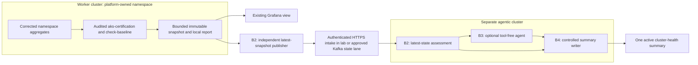

# Architecture and design decisions

Revision 6. Revised after [independent critique](REVIEW-FEEDBACK.md), the accelerated homelab build, the Fox shadow-mesh build, and the offline daily workplace bundle. Values are hypotheses to calibrate, not validated workplace defaults.

## Build the local report before transport

B1 stores reports locally. B2 introduces central storage and connectivity. B3 prepares a tool-free evidence handoff and B4 introduces a separately authorised side-effect boundary. No filesystem spans clusters; workers never access the central database. The accelerated lab uses direct HTTPS/HMAC instead of Kafka and does not claim Kafka validation.

For the initial one-cluster deployment, `cluster-health-system` is the logical worker plane and `agent-health-system` is the logical manager/agent plane on the same API server. The publisher uses authenticated service DNS inside the cluster. Preserve this namespace, identity, credential, and data-contract boundary even though it is not a network or failure-domain boundary. A later two-cluster move replaces the endpoint and placement only; it does not introduce shared storage.

## Reuse and collection ownership

The reuse target is the existing `aks-certification` WorkflowTemplate with audited passive checks and `check-baseline`. Inventory its live version and Flux owner. Existing examples warn about obsolete `bitnami/kubectl:latest` references; verify availability and pin a supported image digest. Do not copy the standalone sentinel as a second scheduled system.

One worker scheduler owns cluster collection every five minutes. It consumes namespace aggregates from a collector polling every 60 seconds. Morning/evening formatting reads saved snapshots and does not rerun collection. B2 moves report publication centrally after an explicit cutover while retaining local artifacts. Never run two writers for the same reporting slot.

Reuse candidates are [the sentinel collector](../../agents/cluster-health-sentinel/02-collector-configmap.yaml), [the certification patch example](../cluster-health-baseline-sentinel/examples/aks-certification-baseline-patch.yaml), and the namespace monitor pinned at `7c785b574c36f7100ae321ec0f880782dfead311`: https://github.com/foxj77/autonomous-monitor/tree/7c785b574c36f7100ae321ec0f880782dfead311

Revision 6 implements the Fox reuse candidate as a separate shadow mesh. The
authoritative namespace inventory is
[`fox-mesh/namespaces.json`](fox-mesh/namespaces.json), and verification fails
if it differs from either the pod-log or Kubernetes-event scope in the current
homelab Alloy configuration. One Fox Deployment runs in the platform namespace
for each selected target namespace; target-namespace Roles grant the reads and
state-ConfigMap writes Fox requires. The workplace image applies the local
state-only adaptation and does not construct Fox's per-finding publisher. The
legacy broker fields are also loopback-failed-closed. Only a separate Vector
sidecar can publish the bounded threshold contract after B1 evaluates the gate.

The workplace delivery cadence is separate from collection cadence. B1 keeps
five-minute current snapshots, but the alert controller emits at most one
record per configured UTC date. Healthy records remain Kafka evidence only;
unhealthy records create one deterministic Argo Workflow. The read-only Agent
has no GitLab identity. A later Workflow step, independently gated and holding
the only project token, reconciles one issue using exact stable labels. Zero
matches creates, one updates, and ambiguity fails closed. It does not close
issues or perform Kubernetes remediation.

B1 reads the named Fox state ConfigMap from each namespace and maps active
findings onto `cluster/namespace/owner-kind/owner-name/symptom-family`. Raw Fox
finding IDs never become snapshot, workflow, or ticket identities. In `shadow`
mode Fox adds coverage, candidate domain impacts, source counts, and bounded
examples but cannot change a domain or gate. There is deliberately no
ConfigMap-backed authoritative mode: namespace administrators may modify that
state. A future authoritative Fox path must enter through a trusted central
state boundary and pass the normal cluster/generation/sequence checks.

Provisioning checks that create probe pods, inspect secrets, or mutate resources are excluded from passive assessment. Preserve named rules `node_cpu_commit`, `pod_cidr_headroom`, and `max_pods_headroom`. CPU commit is requested CPU divided by allocatable CPU, not utilisation. Carry the sentinel's 90% CPU-commit threshold as an initial watch rule. Pod-CIDR estimates are CNI-dependent; mark them unavailable where invalid. Managed AKS subnet capacity needs workplace evidence.

The B1 adapter must expose namespace aggregates without starting the upstream Kafka publisher. `DOWNSTREAM_TRIAGE_ENABLED=false` alone does not disable publishing. B1 must have no broker dependency or default-topic output.

## Correct the monitor before admitting its results

These are required changes or disabled capabilities, not implemented fixes:

| Defect or boundary | Required behaviour |
|---|---|
| Pod-name identity and overlapping checks | Rekey internal state by cluster, namespace, owner kind/name, and symptom family. Combine Pending, not-ready, and FailedScheduling into a scheduling group; keep pod counts and bounded examples |
| Ownership | Follow owner references through ReplicaSet/Deployment and Job/CronJob. Mark unresolved owners; do not merge unrelated pods |
| Resource-spec cardinality | Set `CHECK_RESOURCE_SPECS_ENABLED=false`; compute hygiene as namespace counts without per-container state |
| Completed pods, readiness age, historical OOM/logs | Exclude successful Job completion; use transition times and explicit recency windows |
| Restart-window logic | Use rolling-window deltas; counter resets and lost observations produce explicit coverage |
| State pruning or failed writes | Never evict active group identities to emit them as new. Report `state_write_result` and `observations_pruned`; mark affected trend checks partial |
| Failed log reads or scanner errors | Mark log coverage partial; selective scanning cannot claim all application logs were searched |
| Configuration parsing | Require explicit `DOWNSTREAM_TRIAGE_ENABLED=false`; reject invalid booleans and unsafe bounds before collection/readiness; strip `ai_triage_required` and `cooldown_until` from output |
| Suppression errors | Report an error metric and scan status; block automated use of affected results rather than treating failed suppression as empty |
| Warning-event noise | Use a versioned reason allowlist; count excluded reasons such as audit-only PolicyViolation; exceptions have owner and expiry |
| Synchronous publishing | Polling never waits for Kafka. B2 uses an independent publisher with a replaceable one-snapshot slot |

Source references: https://github.com/foxj77/autonomous-monitor/blob/7c785b574c36f7100ae321ec0f880782dfead311/monitor.go and https://github.com/foxj77/autonomous-monitor/blob/7c785b574c36f7100ae321ec0f880782dfead311/config.go

## Snapshot contract and its limits

The primary contract describes current observable state. Do not map the upstream finding `id` to a transport record ID. Snapshot identity is `(cluster_id, source_generation, snapshot_seq)`, constant for retries of that snapshot. A conflicting checksum for the same identity is quarantined.

Each snapshot contains:

- Schema version, trusted cluster/environment identity, generation, monotonic sequence, start/end times, checksum, and policy/baseline versions.
- Expected namespaces and check families, coverage, exclusions, error/pruning counts, and source observation ages.
- Domain outcomes and complete aggregate counts, including affected and total eligible workloads and namespace totals.
- Stable problem-group identities, top-N examples, and per-section `truncated` and `membership_complete` flags.

Limit each serialized snapshot to 256 KiB and inline agent evidence to 32 KiB. Aggregates remain authoritative when examples are trimmed. If aggregate coverage itself exceeds a bound, mark the section partial rather than dropping scope silently.

Absence from top-N examples is never resolution. Resolve a group from an explicit current zero count or absence from an exhaustive inventory with `membership_complete=true`. Otherwise retain unresolved status or request fresh detail. Whole-cluster recovery requires complete required domain coverage. A partial snapshot updates attempt/freshness status but cannot replace the previous complete view as healthy; display that view with its original age.

Short-lived incidents between snapshots and intermediate states during a broker outage can be lost. Existing retained events/logs and urgent alerting cover that history. The guarantee is current-state convergence within declared coverage, not lossless incident delivery. A latest snapshot cannot reconstruct old reports, historical baselines, or trend windows.

Persist sequence state with one collector writer and non-overlap. Register a new `source_generation` through controlled configuration after sequence-state loss or restore. Never compare counters from unrelated generations as one stream. Check clock skew. A sequence-state write failure is visible and blocks emission of an untrusted sequence.

## B2 transport and recovery

The accelerated homelab implementation uses one authenticated HTTPS request per latest snapshot. The intake enforces a private-CA connection, HMAC timestamp/signature, 256 KiB body limit, and configured cluster/generation binding before PostgreSQL storage. This is an intentionally smaller implementation of the same latest-state boundary: the worker keeps no spool, collection never waits for publication, partial attempts cannot replace the last complete view, and identical replay is idempotent. The workplace transport choice remains subject to its existing platform and security standards.

Use a per-cluster Kafka topic with `cleanup.policy=compact`, keyed by cluster ID, subject to workplace topic policy. Topic ACLs and a central topic-to-cluster map bind identity. Validate the producer's namespace allowlist centrally. Kafka records do not automatically expose authenticated producer identity to consumers.

The publisher holds only the latest pending snapshot. A new snapshot replaces pending older state, with superseded counts visible. Bound the Kafka client's internal queue and retries too. Do not persist a historical spool or flush old per-finding traffic on reconnect. An older in-flight snapshot can arrive late; central sequence checks prevent regression.

Compaction is asynchronous. A consumer can still see many historical records. During catch-up/restore, disable side effects, capture partition high-water marks, coalesce through that boundary, then require a fresh eligible assessment. Do not dispatch once per historical snapshot. Reference: https://kafka.apache.org/41/design/design/#log-compaction

Use PostgreSQL from B2 for latest attempts, last complete assessments, and immutable report history unless an existing approved store supplies the same atomic replacement. A small Go consumer validates and atomically stores newer snapshots, then commits offsets. Repeats cannot regress state. No intake outbox or per-finding dedupe table is needed. Database failure disables side effects and makes central coverage stale.

After a 30-minute broker outage, the next complete current snapshot restores current health. After restoring an old database backup, current health converges within one healthy collection interval. Baseline history, admission budgets, and ticket mappings require their own restore/reconciliation; snapshots do not restore those records.

Keep local scheduled reports and central report history for an initial 30 days, plus a bounded rolling collection history for drift. Compacted Kafka is latest-state recovery, not the report archive. Define and test decommission/tombstone behaviour. Preserve active summary mappings until operator closure and recovery verification.

## Placement and tenant isolation

Run collectors in a platform-owned namespace, initially one process per pilot namespace if that minimises changes. Read-only RoleBindings in watched namespaces reference platform service accounts. Configure state storage separately in the platform namespace; the upstream default conflates watched and state namespaces and needs adjustment.

Only the platform publisher holds the Kafka credential. Tenant namespace admins cannot access its Secrets, pod exec, service accounts, or aggregate-submission endpoint. Aggregates derive from approved API reads, not unauthenticated tenant submissions. Central intake quarantines namespaces outside the producer allowlist. Collectors have no workload mutation, secret-read, or exec permissions.

B1 measures list calls, response/log bytes, memory, and throttling per namespace. Before B2, decide between per-namespace processes and a sharded multi-namespace collector using those measurements and target fleet size. Do not defer this decision until workplace rollout.

## Health gates and reporting

Report the display score, domain outcomes, coverage, and `triage_mode` separately. Domains remain nodes/scheduling, workload availability, shared services, resource pressure, and delivery. Optional score weights remain 30%, 25%, 20%, 15%, and 10%, with values 100/80/50/0 for healthy/watch/degraded/critical. This weighted mean never controls admission or recovery.

Any required domain degraded for two consecutive complete assessments is a breach. Any domain critical is an immediate breach, even when another domain is unknown. Recovery requires two complete assessments with all required domains healthy or watch. Unknown coverage blocks recovery. A high score never enables ticketing.

Rules use impact shares with explicit denominators and rollout grace periods. Initial workload rule: sustained unavailability in more than 10% of eligible workloads is critical; a smaller nonzero share is degraded, with an override for an unavailable critical service. Test 1 versus 200 affected out of 1,000 and missing denominators. Hygiene remains advisory. Enumerate all 1,024 combinations of four statuses across five domains, plus unknown-coverage cases, against an SRE-reviewed expected-state table.

Version absolute headroom rules separately from the operator-accepted historical baseline. Historical comparison cannot normalise away absolute failures. Calibrate B1 over at least 10 working days spanning a real weekend, at least 20 weekday report slots, and measured false-positive rates per rule. Report-only still consumes resources and operator time; measure both.

Namespace aggregates become stale after three missed 60-second polls; cluster snapshots after three missed five-minute intervals. Preserve source observation ages so republishing old data cannot refresh its health.

Format reports at 07:30 and 16:30 in `Europe/London`. Use `concurrencyPolicy: Forbid`, a report-slot identity, and initial `startingDeadlineSeconds: 1800`. Within the grace period, label a report late; beyond it, record a missed slot and do not backfill ticket bursts. Those reporting times are outside the DST transition hour. Focus tests on controller outage/catch-up, with DST as a small regression. Reference: https://argo-workflows.readthedocs.io/en/latest/cron-workflows/

## State-lane ownership

Adopt the separate state lane in [the proposed routing addition](../../docs/observability/dual-source-kafka-triage-routing.md). It owns snapshots and one labelled cluster-health summary, never individual workload-incident tickets. Existing evidence/metric lanes retain incident ownership. Summaries link confirmed incident IDs through a bounded central mapping/results lookup and add cluster-level impact.

With both paths deliberately enabled, one crash-looping workload can create one existing incident ticket and one cluster summary: at most two tickets in the coexistence test. If one ticket total is required, keep the state lane report-only or explicitly disable the old writer for the pilot scope. No routing change is implied by this document. Summary limits do not protect an uncontrolled legacy writer; its own dedupe/budgets must pass before coexistence.

## B3 evidence-only analysis

Create a new Agent with zero tools and zero sub-agents. Do not reuse `cluster-health-orchestrator` or `k8s-readonly-agent`: their in-cluster tools would query the agentic cluster. Deny Kubernetes API routes to this agent while permitting its model gateway. Plan a `platform.com/evidence-only: "true"` validator rule that permits empty tools and rejects every tool/delegation entry. The current validator requires nonempty tools; change and test it during B3, not this plan revision.

The workflow fetches a pinned report and approved runbook excerpts, then inlines them as data. The agent prioritises evidence, identifies contradictions, and proposes next checks. It cannot verify worker state or claim to have done so. Every factual claim references supplied evidence; mechanical validation checks reference existence, while fixture/human review checks entailment. Missing evidence remains unknown. Measure time saved over the deterministic report and omit B3 if value is low.

Persist an assessment revision only for material domain/group/coverage changes. Timestamps alone do not trigger analysis. PostgreSQL reserves a unique `(cluster, assessment_revision)` request and atomic budgets. A controller reconciles admitted requests to deterministic Workflow names. This small request ledger handles B3 dispatch failures without an ingestion outbox. Do not blindly retry ambiguous model completion. Reports and B4's deterministic fallback remain independent of model availability.

## B4 ticket lifecycle and budgets

Keep one active summary per cluster/environment. Label it with `health-summary`, a stable cluster label, and `health-incident::<id>`. Store its ID and operation status centrally. Reconcile with the project Issues API using URL-encoded exact `labels=` filters, `state=all`, `scope=all`, and pagination. Check returned labels for equality. Do not use full-text `search=` for identity. Reference: https://docs.gitlab.com/api/issues/

After mapping loss, the stable cluster label finds candidates and the incident label verifies the selected issue. Multiple candidates, missing labels, permission uncertainty, or an ambiguous result blocks automatic creation. Exact filtering is not uniqueness or an exactly-once guarantee. Keep a single writer claim, a persisted pending operation, and no blind retry after uncertain create/update.

After restore, pause side effects and reconcile labels/operations. If recent budgets cannot be reconstructed, reserve them as spent for the remaining rolling window. Fresh snapshots restore health, not permission to write.

| Control | Initial two-worker limit |
|---|---|
| Concurrent investigations | One per cluster, two globally |
| Routine investigations | One per cluster/30 minutes, on material change only |
| Total investigations including critical changes | Four per cluster/hour, eight globally/hour |
| New summaries | One per cluster/rolling 24 hours, two globally/rolling 24 hours |
| Unscheduled updates | Two per cluster/rolling 24 hours, four globally/rolling 24 hours |
| Scheduled updates | Dedicated 07:30 and 16:30 slot per local date/cluster, unavailable to unscheduled changes |

Nominal total is four updates per cluster on a normal day. Around the autumn clock change, a rolling 24-hour window can contain three scheduled slots. Retain distinct slots instead of hiding that exception in a global four-update cap. Global scheduled capacity is one update per cluster per slot. Failed/ambiguous operations retain reservations until reconciled.

Reports render independently of GitLab budgets. Put blocked updates, new incidents, and missing evidence at the top, and alert through the existing operational route if delivery is blocked. Human closure followed by a new fault within the create window produces a visible report/alert and waits for owner reconciliation. Do not create replacement loops. Urgent on-call alerts remain independent.

## Proof boundaries and deferred work

B1 needs one worker API server. B2 needs a separate agentic API server for transport proof. Simulated worker identities prove message isolation only; add a second real worker before claiming multi-worker network isolation. Shared-host clusters do not prove independent infrastructure failure domains.

Per-finding delta transport, historical spooling, an intake outbox, and broad delta replay are deferred unless a later requirement demands lossless incident history. AKS checks, workplace tenancy, Kafka governance, routing, GitLab permissions, and production scale still require workplace receipts. Automatic remediation is excluded.
