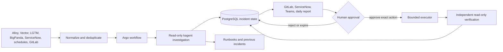

# Dice delivery status

Date: 2026-09-14

## Executive update

Dice is a shared way to send operational work to agents through kagent and agentgateway. Argo owns long-running workflows. MCP servers provide bounded access to Kubernetes, PostgreSQL, GitLab, and future service-management systems. PostgreSQL stores workflow state. Humans approve any action that changes a cluster or merges code.

The project is past the architecture-only stage. The incident path has completed a live lab run from a Kafka-compatible event through investigation, approval, remediation, and verification. The next useful release is the current incident path plus a daily cluster-health report in observe mode. Work integrations remain gated on approved identities, endpoints, and non-production acceptance runs.

## Current position

| Workstream | Current evidence | Status | Next gate |
|---|---|---|---|
| Event-driven incident triage | Redpanda offset `11` created Argo Workflow `incident-local-p8j9c`. A read-only kagent investigated, Argo suspended for approval, a separate executor changed one allow-listed Deployment, and read-only verification passed. | Lab proven | Connect the work Alloy and Vector contract to Confluent, then prove one non-production event with work identities. |
| Daily cluster health | Workflow `cluster-certification-qxv9l` completed all nine nodes on `red` on 2026-09-14. Four of six checks passed. The agent traced the two failed checks to one chronic broken spike agent and returned GitOps-only guidance. No ticket or cluster change occurred. | Lab proven in `log-only` mode | Review thresholds and the finding, choose a daily report destination, then provide a warm-agent or proven scale-to-zero activation path before enabling the suspended 07:00 schedule. |
| PostgreSQL compliance MCP | Both passwordless Entra and password-based bundles exist. The FastMCP path has server-side row, byte, cell, and timeout limits. Offline tests and a bounded lab transport run passed. | Built and bounded | Patch the existing work deployment only. Prove its approved views, grants, workload identity, gateway route, and before/after token use. |
| ServiceNow incident intake | The incident coordinator has a ServiceNow relay contract and durable incident identifiers. No ServiceNow MCP or work relay has completed a live run. | Interface defined | Choose webhook, IntegrationHub, or approved MCP. Map one ServiceNow incident to the common incident contract and prove read-only history lookup. |
| Knowledge and previous-incident lookup | Querydoc and GitLab knowledge-base update bundles exist. During the health run, the cluster-health agent reached the knowledge-agent path but received `429 insufficient_quota`; no historical answer was invented. | Lab path reached; model quota blocked | Restore the model quota, then index approved runbooks and resolved-incident summaries. Require citations and return `NO_RELEVANT_DOCS` when the evidence does not match. |
| LGTM and BigPanda intake | Alloy, Vector, Kafka, Argo, and BigPanda normalization assets exist. The expected BigPanda field map still needs a real payload spike. | Partial | Keep BigPanda as the canonical paging route. Send a duplicate sanitized stream to Dice and prove correlation without changing paging. |
| GitLab issues and merge requests | The incident bundle can create an issue, draft a change, bind approval to the exact merge-request SHA, and use a separate merge executor. Unit tests pass; the recent lab run disabled external GitLab writes. | Implemented, not live-integrated | Use an approved non-production project and prove issue reuse, draft MR, pipeline gate, approval, exact-SHA merge, and ticket closure. |
| Teams approval | The callback contract records the decision before Argo resumes. The lab used a simulated responder. | Contract proven | Connect the work Teams relay and verify actor identity, expiry, replay rejection, and the 72-hour timeout. |
| Bring-your-own agent | The onboarding bundle defines team identity, ToolGrant policy, allowed tools, and deny tests. | Static bundle | Onboard one read-only team agent through the shared agentgateway and prove both allowed and denied calls. |
| Application onboarding | Argo application-onboarding workflows and agent patterns exist in the repository. | Assets exist | Pick one low-risk application and generate a reviewable GitOps change. Keep merge and deployment as separate approvals. |
| Cluster onboarding | KRO, Azure Service Operator, AKS-MCP, and cluster-onboarding agent assets exist. | Assets exist | Prove one non-production cluster request through validation, plan, GitOps review, provisioning, certification, and handover. |
| Engineering board work | GitLab issue and agent delivery patterns exist, but Dice does not yet have one proven controller that claims board work and returns a reviewed MR. | Design stage | Define labels, assignment, lease, acceptance criteria, worktree isolation, peer review, and human merge rules. Prove one documentation issue first. |

## One operating model

Every source uses the same incident fingerprint, cluster identity, evidence fields, and audit timeline. A healthy daily check produces a report and stops. A failed check creates an incident candidate. The coordinator rechecks live state before it proposes an action. The approval identifies one action, target, proposal version, and resource version or commit SHA.

## Recommended first release

Ship two paths together in a non-production work cluster:

1. Route one allow-listed Alloy or Vector signal through Confluent into the existing incident workflow.
2. Run the cluster-health workflow at 07:00 in `log-only` mode and publish one daily report.
3. Send failed or changed health checks to the same incident coordinator.
4. Create or update one GitLab issue for the incident fingerprint.
5. Keep Kubernetes and GitLab writers disabled until the exact Teams approval is recorded.

This release proves the common operating model without waiting for ServiceNow, BigPanda, fleet-wide rollout, or automatic remediation.

## Controls that remain non-negotiable

- Investigation and mutation use separate agents, MCP servers, credentials, and service accounts.
- The coordinator has no Kubernetes write permission.
- Database tools expose approved, typed, bounded operations. They do not expose unrestricted SQL.
- Healthy, unavailable, and failed are different states. Missing evidence never means healthy.
- Event and ticket delivery is idempotent. A retry updates the same incident.
- Approval expires and fails closed if the target version changes.
- Verification uses a read-only identity and records before-and-after evidence.
- BigPanda remains the paging path until Dice has its own operational acceptance evidence.

## Measures for the update

Report these numbers each week:

| Measure | First target |
|---|---|
| Alert or request to first agent finding | Under 5 minutes |
| Duplicate incidents for one fingerprint | 0 |
| Agent findings with live evidence or a cited source | 100% |
| Cluster writes without a matching approval | 0 |
| Approved actions with independent verification | 100% |
| PostgreSQL responses over the configured byte or row limit | 0 |
| Daily reports delivered by 07:15 | 95% during the pilot |
| Suggested changes accepted by an engineer | Measure during the pilot; do not set a target before baseline data exists |

## Decisions needed from the project team

1. Name the first non-production cluster, GitLab project, and SRE owner.
2. Confirm the work incident contract and required fields from Alloy, Vector, BigPanda, and ServiceNow.
3. Choose the ServiceNow integration method and the approved knowledge sources.
4. Approve one read-only PostgreSQL view set and its result limits.
5. Confirm the daily report destination and whether 07:00 Europe/London is the right time.
6. Select the first application and team-owned agent for onboarding.

## Evidence links

- Incident workflow: `work-agent-bundles/aks-incident-management/README.md`
- Incident lab receipts: `work-agent-bundles/aks-incident-management/VERIFICATION.md`
- Cluster health: `work-agent-bundles/cluster-health-baseline-sentinel/README.md`
- PostgreSQL MCP: `work-agent-bundles/POSTGRES-MCP-WORK-START-HERE.md`
- Triage transport: `work-agent-bundles/homelab-verified-triage-replication/README.md`
- Knowledge-base loop: `work-agent-bundles/kagent-triage-v2-kb-gitlab-mcp/README.md`
- Bring-your-own agent: `work-agent-bundles/byo-kagent-onboarding/README.md`
- Fleet reporting: `work-agent-bundles/aks-fleet-reporting-day2/README.md`
- Daily health lab receipt: `work-agent-bundles/dice-programme/daily-health/VERIFICATION.md`
