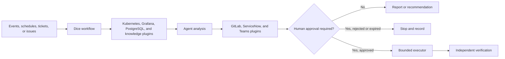

# Dice agentic platform

Date: 2026-09-14

## What Dice is

Dice is a reusable agentic automation platform for platform engineering, SRE, and compliance work. It connects operational events or human requests to agents that gather evidence, consult approved data, propose a response, and pass controlled actions to existing delivery systems.

Dice does not replace Kubernetes, Argo, GitLab, Grafana, ServiceNow, or Teams. It connects them through reusable plugins and governed workflows:

- kagent runs the agents and their skills.
- agentgateway controls model and tool access.
- Argo Events and Argo Workflows run durable processes.
- MCP servers give agents narrow access to platform systems.
- human approval gates control changes and merges.
- independent checks record whether an approved action worked.

The same platform can use Terra, Luna, or an approved self-hosted model. The workflow and security rules stay separate from the model.

## Reusable plugins

In this document, a plugin is a reusable Dice capability. A plugin can contain an MCP server, an agent skill, an Argo template, policy, or a combination of these. Plugins do not run a business process by themselves. Dice workflows compose them.

| Plugin | What it provides | Current evidence | Status |
|---|---|---|---|
| Event intake | Accepts events from Alloy, Vector, Kafka-compatible queues, Alertmanager, Grafana, BigPanda, schedules, or human requests. It normalizes them into one work item. | Redpanda to Argo completed a live lab run. Alloy, Vector, Grafana, and BigPanda assets exist. | Lab proven for Redpanda. Work sources need canaries. |
| Kubernetes evidence | Uses a read-only Kubernetes MCP to inspect workloads, events, configuration, and cluster state. It can route across approved cluster contexts. | The incident and daily-health workflows used live read-only cluster evidence on `red`. | Lab proven. |
| Grafana evidence | Uses Grafana MCP to query metrics, logs, dashboards, alerts, and data sources. It produces links and evidence packs for another agent or an SRE. | The Grafana bundle, agent, skills, access model, and smoke scripts pass static checks. | Built. Work Grafana proof remains. |
| PostgreSQL compliance data | Exposes approved views through typed, bounded MCP tools. It limits rows, bytes, cells, and query time before data reaches the model. | The password and Entra workload-identity bundles pass their checks. Bounded transport has lab evidence. | Lab proven. Work views and identity remain. |
| Knowledge lookup | Searches approved runbooks, platform documents, and resolved-incident summaries. It returns sources with the answer or reports that no matching evidence exists. | Querydoc, the knowledge agent, and the GitLab knowledge update loop exist. A live health run reached the path but model quota blocked the answer. | Built. Quota and work corpus remain. |
| Human approval | Suspends an Argo workflow, records the approver, decision, scope, and expiry, then resumes or stops the same workflow. | The reusable HITL bundle passes its checks. The incident workflow completed a simulated approval and bounded action on `red`. | Lab proven. Work Teams identity remains. |
| Teams notification | Sends a finding, ticket link, proposed action, and approval request to the correct support channel. It accepts signed approval callbacks. | The Teams contract, Argo EventSource, Sensor, policy, and mock bot exist. | Contract and mock built. Work bot remains. |
| GitLab delivery | Creates or updates an issue, prepares a branch and merge request, posts evidence, and binds merge approval to an exact commit. | GitLab issue and merge-request bundles pass static checks. The official GitLab MCP spike reached authentication but its tool endpoint returned `404`. | Partial. Work MCP proof remains. |
| ServiceNow incident | Reads a human-raised incident, adds evidence, updates its state, and closes or escalates it under service-management rules. | ServiceNow appears throughout the workflow and output contracts. No ServiceNow MCP implementation or live receipt exists in this repository. | Design only. |
| Bounded remediation | Gives a separate executor only the write tools needed for one approved action. It rereads the target before changing it. | The lab executor changed one allow-listed Deployment and recorded before-and-after evidence. | Lab proven for one Kubernetes action. |
| Independent verification | Uses a read-only identity to check the result after remediation or merge. It can reopen or escalate a failed action. | The incident workflow verified the approved lab change independently. | Lab proven. |
| Peer review and evaluation | Sends a finding or proposed change to a second agent, applies acceptance criteria, and returns review evidence to the human. | Evaluation schemas, scorecards, peer-review packages, and A2A examples exist. | Components exist. One board-to-MR flow remains. |
| Identity and policy | Assigns each agent its own identity, ToolGrants, MCP permissions, network policy, and audit boundary. | Agentgateway onboarding, tool-auth, workload-identity, and deny-test bundles exist. | Built. Team onboarding canary remains. |
| Bring your own agent | Validates a team-owned Agent CR and its MCP requests, assigns an identity and budget, routes model calls through agentgateway, and produces a reviewable GitOps change. | Agent and MCP request patterns, `ToolCatalogEntry` and `ToolGrant` CRDs, Kyverno policies, Argo templates, and a sandbox guide exist. | Architecture and assets exist. One team canary remains. |

## Workflows built from the plugins

### SRE incident triage

An alert arrives through Alloy and Vector, Kafka, Grafana, BigPanda, or ServiceNow. Dice identifies the affected cluster and workload, then gathers Kubernetes and Grafana evidence. The agent checks the knowledge base and creates or updates the incident record. A proposed change goes through human approval, a bounded executor, and independent verification.

Uses: event intake, Kubernetes evidence, Grafana evidence, knowledge lookup, GitLab or ServiceNow, Teams notification, human approval, bounded remediation, and independent verification.

Current position: the Redpanda, Argo, kagent, approval, Kubernetes action, and verification path is lab proven. Work telemetry and ticketing systems remain to be connected.

### Daily cluster health

Argo runs scheduled control-plane, node, add-on, DNS, storage, and baseline checks. Healthy results form a morning report. A failed or changed result becomes an incident candidate and enters the same triage workflow.

Uses: scheduled intake, Kubernetes evidence, Grafana evidence, knowledge lookup, notification, and incident triage.

Current position: a manual run on `red` completed all nine workflow nodes. The 07:00 Europe/London schedule is installed but suspended until the team accepts the thresholds, report destination, and agent availability method.

### Compliance data assistant

An engineer or auditor asks an approved compliance question. Dice maps the question to a typed PostgreSQL operation, enforces response limits, and returns a source-aware answer. Large analysis and unrestricted SQL stay outside the chat path.

Uses: PostgreSQL compliance data, identity and policy, knowledge lookup, and audit records.

Current position: the bounded MCP implementation is lab proven. The work database team must approve the views, grants, workload identity, and result limits.

### Service desk incident assistant

Dice picks up a human-raised ServiceNow incident, classifies it, checks similar incidents and runbooks, gathers live platform evidence, and writes guidance back to the incident. The SRE owns the response unless a separate approved remediation starts.

Uses: ServiceNow incident, knowledge lookup, Kubernetes evidence, Grafana evidence, Teams notification, and human approval.

Current position: the workflow shape exists, but the ServiceNow plugin has not been implemented or proven.

### Bring your own agent and MCP

An application or engineering team submits an Agent CR request and selects an approved model route. The team can request existing MCP tools or submit a new MCP server for quarantine and inspection. Dice checks the request, generates the namespace, identity, `ToolGrant`, network policy, budget, and GitOps files, then returns a merge request for review. Flux deploys the approved change, and Dice runs an A2A smoke test.

The platform owns agentgateway, the shared model routes, the MCP catalog, admission policy, audit, and platform support. The team owns the agent instructions, evaluation cases, data classification, expected tools, service ownership, and usage budget. A team cannot bypass agentgateway or grant its agent an unapproved MCP tool.

Uses: bring your own agent, identity and policy, GitLab delivery, peer review, human approval, and independent verification.

Current position: the repository contains the architecture, CRDs, policies, catalog examples, Argo workflow design, and manual sandbox guide. The next proof must onboard one read-only team agent and one safe MCP through the shared gateway. See `work-agent-bundles/dice-programme/BYO-AGENT-AND-MCP.md`.

### Application onboarding

An application team submits its runtime, model, data, tool, and support requirements. Dice validates the request and generates a reviewable GitOps change for the namespace, identity, gateway route, tools, agent, and policies.

Uses: identity and policy, GitLab delivery, human approval, peer review, Kubernetes evidence, and independent verification.

Current position: onboarding agents, request templates, policies, and bundles exist. One non-production application must complete the full path.

### Kubernetes cluster onboarding

Dice validates a cluster request, prepares the infrastructure and GitOps plan, provisions through the approved platform workflow, runs certification, and records the handover. Cluster creation and production admission remain human-approved operations.

Uses: identity and policy, GitLab delivery, human approval, Kubernetes evidence, daily cluster health, and independent verification.

Current position: cluster-onboarding, KRO, Azure Service Operator, and AKS MCP assets exist. The complete non-production lifecycle has not been proven as one run.

### Engineering issue to merge request

Dice claims an eligible GitLab issue, creates an isolated work area, proposes a change, runs tests, requests peer review, and returns a merge request to the engineer. The agent cannot merge its own work.

Uses: GitLab delivery, peer review and evaluation, knowledge lookup, human approval, and independent verification.

Current position: the parts exist, but one controller has not yet proven the complete board-to-MR lifecycle.

### Observability onboarding

Dice inspects existing Grafana data sources and application telemetry. It proposes Alloy collection, dashboards, alert rules, routing labels, and validation queries as a GitLab merge request.

Uses: Grafana evidence, GitLab delivery, peer review, and human approval.

Current position: the Grafana MCP bundle and cert-manager example exist. Work Grafana discovery and GitLab delivery remain to be proven.

## How the pieces combine

The workflow chooses the plugins. The agent does not receive every tool by default. A read-only triage agent can use evidence plugins but cannot use a remediation or merge tool. Approval grants one separate executor permission for one target and one proposal version.

## Recommended first work release

Release the platform as a small plugin set, then add workflows:

1. Install event intake, Kubernetes evidence, knowledge lookup, GitLab issue output, Teams notification, human approval, and independent verification.
2. Run incident triage and daily cluster health in one non-production work cluster.
3. Keep GitLab merge, ServiceNow write, and Kubernetes remediation disabled during the observation period.
4. Add the Grafana plugin when live data-source and query access pass.
5. Add the PostgreSQL plugin after the data owner approves its views and limits.
6. Add ServiceNow after the team chooses an approved MCP or API integration and proves it in a sandbox.
7. Onboard one team-owned read-only agent and one safe MCP through the bring-your-own-agent workflow.

## Current programme assessment

Dice is a real collection of related components, not one finished product. The repository repeatedly implements the same control pattern: gather evidence with read-only agents, propose work, record a human decision, use a separate writer, and verify the result. The next step is product assembly. We need to publish the shared plugins once, compose them into named workflows, and stop duplicating integration logic inside each proof of concept.

## Repository evidence reviewed

The repository history starts on 2026-05-10. The audit fetched both configured remotes and reviewed all reachable history through 2026-09-14: 473 commits, 29 local branches, and 17 remote refs. The largest repeated themes are triage, Grafana, PostgreSQL, GitLab delivery, approval, onboarding, agentgateway, and compliance.

Representative sources:

- `work-agent-bundles/dice-programme/DELIVERY-STATUS.md`
- `work-agent-bundles/dice-programme/BYO-AGENT-AND-MCP.md`
- `work-agent-bundles/aks-incident-management/`
- `work-agent-bundles/hitl-remediation-approval/`
- `work-agent-bundles/gitlab-mcp-gitops-pr/`
- `work-agent-bundles/sre-grafana-mcp-observability/`
- `work-agent-bundles/postgres-fastmcp-entra-uami/`
- `platform/teams-hitl/`
- `agents/cluster-health-sentinel/`
- `agents/kagent-triage/`
- `observability/managed-lgtm-integration/`
- `platform/agentgateway/`
