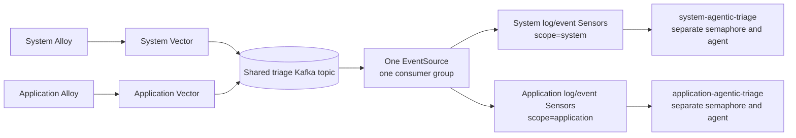

# System and application triage rollout

Two independent collection lanes keep system and application telemetry
separate, while both publish normalized incidents to one Kafka topic.

## Segregation contract

Each Alloy instance adds `triage_scope` (`system` or `application`). Vector
carries it into the Kafka envelope as `scope`. Four Sensors read the same
EventSource, but filter on `body.scope` and `body.signal_kind`:

- system log and system event Sensors trigger `system-agentic-triage`;
- application log and application event Sensors trigger
  `application-agentic-triage`.

Use separate semaphore keys, rate limits and read-only agents for the two
WorkflowTemplates. Separate Sensors alone route work; those separate limits
are what isolate backend capacity.

## Tiers

| Tier | Both Alloy lanes | Vector/Argo admission |
|---|---|---|
| 1 | enabled | critical logs and critical Kubernetes events |
| 2 | enabled | priority/error logs and additional actionable events |
| 3 | enabled | broad warning/error/event review |

Alloy owns fixed, non-overlapping namespace lists in every tier. The tier
files change Vector's `incident_signals.condition` and the matching Argo
event-reason allow-list. Promote only after the previous tier has clean Alloy
queue logs, Kafka produced-message metrics, and a scoped workflow smoke.
