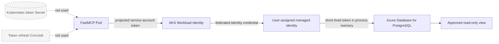

# FastMCP PostgreSQL UAMI workload identity walkthrough

This guide covers the passwordless target for the FastMCP PostgreSQL bundle:
an AKS Pod uses AKS Workload Identity to act as a user-assigned managed
identity (UAMI), obtains a short-lived Microsoft Entra token in process memory,
and presents that token directly to Azure Database for PostgreSQL.

It does **not** require `az login --identity` in the Pod, an Azure client secret,
a token-refresh CronJob, or an access token stored in a Kubernetes Secret.

> "No token" means no operator-managed or persisted token. PostgreSQL Entra
> authentication still uses a short-lived access token during each new database
> connection. `DefaultAzureCredential` and the PostgreSQL Entra adapter obtain
> and refresh that token without exposing it to the deployment configuration.

## Target flow



The federated identity credential is an exact trust tuple:

```text
issuer:   {{AKS_OIDC_ISSUER}}
subject:  system:serviceaccount:{{FASTMCP_NAMESPACE}}:fastmcp-postgres-entra
audience: api://AzureADTokenExchange
```

The issuer, subject, and audience must match exactly. The UAMI may be in a
different Azure subscription from the AKS cluster, but this bundle assumes the
AKS cluster and UAMI use the same Microsoft Entra tenant.

## What to request

Your initial list is close. Ask for the following values.

### AKS and OIDC values

| Variable | Required value | Why it is needed |
|---|---|---|
| `AKS_SUBSCRIPTION_ID` | Subscription containing the target AKS cluster | Selects the cluster for lookup; it is not part of the federation tuple |
| `AKS_RESOURCE_GROUP` | AKS resource group | Used to look up the cluster |
| `AKS_CLUSTER_NAME` | Target AKS cluster name | Used to obtain the OIDC issuer |
| `AKS_OIDC_ISSUER` | Cluster-specific issuer URL | Becomes the federated credential's `issuer` |
| `AKS_TENANT_ID` | Microsoft Entra tenant ID used by AKS | Confirms the UAMI is in the expected tenant |
| `FASTMCP_NAMESPACE` | Namespace where FastMCP will run | Forms part of the federated `subject` |
| `FASTMCP_SERVICE_ACCOUNT` | `fastmcp-postgres-entra` | Forms part of the federated `subject`; already fixed by this bundle |

There is no separate "OIDC endpoint subscription" value. Obtain the issuer URL
from the AKS cluster in `AKS_SUBSCRIPTION_ID`. Do not construct or shorten the
URL manually, and preserve its exact value, including any trailing slash.

### UAMI values

| Variable | Required value | Why it is needed |
|---|---|---|
| `UAMI_SUBSCRIPTION_ID` | Subscription containing the UAMI | Selects the identity for lookup and federation; may differ from AKS |
| `UAMI_RESOURCE_GROUP` | UAMI resource group | Used by the identity and federation commands |
| `UAMI_NAME` | User-assigned managed identity name | Used by `az identity` commands |
| `UAMI_CLIENT_ID` | Application/client ID | Added to the Kubernetes ServiceAccount annotation |
| `UAMI_OBJECT_ID` | Service-principal object ID, also returned as `principalId` | Used to create the PostgreSQL Entra principal |
| `UAMI_RESOURCE_ID` | Full Azure resource ID | Useful for narrowly scoped RBAC and audit evidence |
| `UAMI_TENANT_ID` | UAMI's Microsoft Entra tenant ID | Must match the assumed AKS tenant for this bundle |
| `FEDERATED_CREDENTIAL_NAME` | For example, `fastmcp-postgres-entra-{{ENVIRONMENT}}` | Names the trust record on the UAMI |
| `UAMI_ROLE_NAME` | Unique Entra display name | Becomes the quoted PostgreSQL role name |

The client ID and object ID are different. Do not use the client ID in the
PostgreSQL principal-creation function.

### PostgreSQL and deployment values

| Variable | Required value |
|---|---|
| `POSTGRES_HOST` | Approved private Flexible Server FQDN |
| `POSTGRES_DATABASE` | Approved database name |
| `APPROVED_SCHEMA` | Owner-approved schema |
| `APPROVED_VIEW_NAME` | Owner-approved read-only view |
| `DENIED_BASE_TABLE_NAME` | Base table used to prove direct access is denied |
| `FASTMCP_IMAGE` | Internally scanned and signed image pinned by digest |
| `WORK_KUBE_CONTEXT` | Approved deployment context |
| `MODEL_CONFIG` | Existing approved kagent model configuration |

Also confirm that private DNS, routing, firewall rules, and any NetworkPolicy
allow the FastMCP Pod to reach the PostgreSQL private FQDN on TCP 5432.

## Access needed and who should do what

| Activity | Minimum capability | Preferred owner |
|---|---|---|
| Read the AKS OIDC issuer | `Microsoft.ContainerService/managedClusters/read` on the target cluster | AKS/platform team or a cluster Reader |
| Enable AKS OIDC and workload identity, if disabled | `Microsoft.ContainerService/managedClusters/write` | AKS/platform owner |
| Read UAMI identifiers | Read access to the exact UAMI resource | Identity owner or requester with scoped read access |
| Create the federated identity credential | UAMI read plus `federatedIdentityCredentials/read` and `federatedIdentityCredentials/write` on the exact UAMI | Identity owner |
| Deploy the Kubernetes resources | Permission to create/update the namespace, ServiceAccount, Deployment, Service, and related Gateway/kagent resources | AKS application/platform deployer |
| Create the PostgreSQL Entra principal and grants | Approved PostgreSQL Microsoft Entra administrator | Database team |
| Verify network access | Read/diagnostic access across AKS networking, private DNS, and the database firewall | Platform/network team |

The relevant Azure actions for federation are:

```text
Microsoft.ManagedIdentity/userAssignedIdentities/read
Microsoft.ManagedIdentity/userAssignedIdentities/federatedIdentityCredentials/read
Microsoft.ManagedIdentity/userAssignedIdentities/federatedIdentityCredentials/write
```

If a custom least-privilege role is not available, the built-in **Managed
Identity Contributor** role contains the required federation actions but is
broader than this task. If it is used, scope it to the exact UAMI resource and
prefer time-bound/PIM access. The safest handoff is for the identity-owning team
to run the supplied federation command themselves.

Having permission to use a UAMI is not automatically permission to modify its
federated credentials. Verify the actions above rather than assuming a role
named "operator" is sufficient.

The runtime UAMI does not need permission to create federated credentials or
Azure role assignments. PostgreSQL data access is controlled by its mapped
database role and grants, not by granting the FastMCP UAMI broad Azure RBAC.

## Walkthrough

### 1. Set the non-secret setup variables

Use placeholders until the owning teams provide approved values. These are
coordinates and identifiers, not credentials, but keep work-specific values
out of the public repository.

```sh
export AKS_SUBSCRIPTION_ID='{{AKS_SUBSCRIPTION_ID}}'
export AKS_RESOURCE_GROUP='{{AKS_RESOURCE_GROUP}}'
export AKS_CLUSTER_NAME='{{AKS_CLUSTER_NAME}}'

export UAMI_SUBSCRIPTION_ID='{{UAMI_SUBSCRIPTION_ID}}'
export UAMI_RESOURCE_GROUP='{{UAMI_RESOURCE_GROUP}}'
export UAMI_NAME='{{UAMI_NAME}}'

export FASTMCP_NAMESPACE='{{FASTMCP_NAMESPACE}}'
export FASTMCP_SERVICE_ACCOUNT='fastmcp-postgres-entra'
export FEDERATED_CREDENTIAL_NAME='fastmcp-postgres-entra-{{ENVIRONMENT}}'
```

### 2. Obtain the AKS OIDC issuer

The AKS platform owner first confirms that OIDC issuer and workload identity
are enabled. Reading this state does not modify the cluster.

```sh
az aks show \
  --subscription "$AKS_SUBSCRIPTION_ID" \
  --resource-group "$AKS_RESOURCE_GROUP" \
  --name "$AKS_CLUSTER_NAME" \
  --query '{oidcIssuer:oidcIssuerProfile.issuerUrl,workloadIdentity:securityProfile.workloadIdentity.enabled,tenantId:identity.tenantId}' \
  --output yaml

export AKS_OIDC_ISSUER="$(az aks show \
  --subscription "$AKS_SUBSCRIPTION_ID" \
  --resource-group "$AKS_RESOURCE_GROUP" \
  --name "$AKS_CLUSTER_NAME" \
  --query 'oidcIssuerProfile.issuerUrl' \
  --output tsv)"

test -n "$AKS_OIDC_ISSUER" || {
  echo 'AKS OIDC issuer is empty; stop and ask the AKS owner to enable it' >&2
  exit 1
}
```

If either feature is disabled, stop and ask the AKS owner to enable it under
the normal cluster change process. An authorized cluster owner can use:

```sh
az aks update \
  --subscription "$AKS_SUBSCRIPTION_ID" \
  --resource-group "$AKS_RESOURCE_GROUP" \
  --name "$AKS_CLUSTER_NAME" \
  --enable-oidc-issuer \
  --enable-workload-identity
```

Do not run that update merely to collect the issuer; it is a cluster change.

### 3. Obtain and cross-check the UAMI identifiers

```sh
az identity show \
  --subscription "$UAMI_SUBSCRIPTION_ID" \
  --resource-group "$UAMI_RESOURCE_GROUP" \
  --name "$UAMI_NAME" \
  --query '{name:name,clientId:clientId,objectId:principalId,resourceId:id,tenantId:tenantId}' \
  --output yaml

export UAMI_CLIENT_ID="$(az identity show \
  --subscription "$UAMI_SUBSCRIPTION_ID" \
  --resource-group "$UAMI_RESOURCE_GROUP" \
  --name "$UAMI_NAME" \
  --query clientId --output tsv)"

export UAMI_OBJECT_ID="$(az identity show \
  --subscription "$UAMI_SUBSCRIPTION_ID" \
  --resource-group "$UAMI_RESOURCE_GROUP" \
  --name "$UAMI_NAME" \
  --query principalId --output tsv)"

export UAMI_RESOURCE_ID="$(az identity show \
  --subscription "$UAMI_SUBSCRIPTION_ID" \
  --resource-group "$UAMI_RESOURCE_GROUP" \
  --name "$UAMI_NAME" \
  --query id --output tsv)"
```

Have the identity and AKS owners confirm the tenant IDs match. If they do not,
stop: this manifest does not yet carry an explicit cross-tenant workload
identity configuration.

### 4. Create the federated identity credential

The identity owner runs this command. It modifies the UAMI but does not create
or print an access token.

```sh
az identity federated-credential create \
  --subscription "$UAMI_SUBSCRIPTION_ID" \
  --resource-group "$UAMI_RESOURCE_GROUP" \
  --identity-name "$UAMI_NAME" \
  --name "$FEDERATED_CREDENTIAL_NAME" \
  --issuer "$AKS_OIDC_ISSUER" \
  --subject "system:serviceaccount:${FASTMCP_NAMESPACE}:${FASTMCP_SERVICE_ACCOUNT}" \
  --audiences 'api://AzureADTokenExchange'
```

Record and verify the trust tuple without handling a token:

```sh
az identity federated-credential show \
  --subscription "$UAMI_SUBSCRIPTION_ID" \
  --resource-group "$UAMI_RESOURCE_GROUP" \
  --identity-name "$UAMI_NAME" \
  --name "$FEDERATED_CREDENTIAL_NAME" \
  --query '{issuer:issuer,subject:subject,audiences:audiences}' \
  --output yaml
```

Federated credential changes can take several seconds to propagate. A newly
deployed Pod may need to be recreated after propagation if its first exchange
failed.

### 5. Ask the database team to create the least-privilege principal

Give the database team:

- `UAMI_ROLE_NAME` — the UAMI's unique Entra display name;
- `UAMI_OBJECT_ID` — the service-principal object ID, not the client ID;
- `POSTGRES_DATABASE`;
- the approved schema, view, and denial-test table names.

They render and run these templates in order:

1. [`adapter/01-create-entra-principal.sql.template`](adapter/01-create-entra-principal.sql.template)
   in the `postgres` database;
2. [`adapter/02-grant-approved-view.sql.template`](adapter/02-grant-approved-view.sql.template)
   in `POSTGRES_DATABASE`.

The application principal must remain a non-admin role with only database
`CONNECT`, schema `USAGE`, and `SELECT` on the approved view. The denial checks
for the base table and writes must return `false`.

### 6. Render the UAMI deployment

Copy the committed template to the ignored work values file:

```sh
cd work-agent-bundles/postgres-fastmcp-entra-uami
cp work-values.env.template work-values.env
${EDITOR:-vi} work-values.env
```

Populate `UAMI_CLIENT_ID` from step 3. `UAMI_OBJECT_ID` and `UAMI_ROLE_NAME`
are used to cross-check and render the database-team SQL; they are not runtime
tokens. Then render and reject unresolved placeholders:

```sh
kubectl kustomize . > {{PRIVATE_RENDERED_FILE}}
if grep -n '{{' {{PRIVATE_RENDERED_FILE}}; then
  echo 'unresolved placeholders remain' >&2
  exit 1
fi

kubectl --context {{WORK_KUBE_CONTEXT}} apply --dry-run=server \
  -f {{PRIVATE_RENDERED_FILE}}
```

The rendered ServiceAccount must contain:

```yaml
annotations:
  azure.workload.identity/client-id: "{{UAMI_CLIENT_ID}}"
```

The Pod template must contain:

```yaml
labels:
  azure.workload.identity/use: "true"
```

The deployed namespace and ServiceAccount name must still match the federated
credential's subject. Changing either requires a matching federation change.

### 7. Deploy and prove the passwordless path

Apply only after server-side dry-run succeeds:

```sh
kubectl --context {{WORK_KUBE_CONTEXT}} apply \
  -f {{PRIVATE_RENDERED_FILE}}

kubectl --context {{WORK_KUBE_CONTEXT}} \
  -n "$FASTMCP_NAMESPACE" rollout status deployment/fastmcp-postgres-entra
```

Use the bundle verification steps to prove all of the following before removing
the password deployment or Secret:

1. the Pod has the expected ServiceAccount and workload-identity environment;
2. the approved view query succeeds;
3. direct base-table access is denied;
4. write access is denied;
5. a fresh second database connection succeeds, proving token refresh is not a
   one-off bootstrap;
6. Gateway MCP discovery and the same kagent/A2A question still work;
7. no password, access token, or connection string appears in the Deployment,
   ConfigMap, logs, or stored evidence.

Run the local bundle gate as well:

```sh
scripts/verify-bundle.sh
```

Only after those gates pass should the password Secret be retired through the
approved secret-management process.

## What not to build

Do not add any of the following to this design:

- `az login --identity` in the FastMCP container;
- `az account get-access-token` in an init container or CronJob;
- an access token stored in a Kubernetes Secret, ConfigMap, file, or environment
  variable;
- a sidecar whose only purpose is to copy tokens into shared storage;
- a client secret for the UAMI;
- broad subscription-level RBAC for the FastMCP runtime identity.

The two Azure CLI commands supplied by the identity team are useful as a manual
managed-identity connectivity test on an Azure host that already has that UAMI
assigned. They are not the AKS Workload Identity application pattern.

If the FastMCP database library could not refresh tokens on new connections, a
local in-process connection wrapper would be preferable to persisting tokens.
This bundle already uses `DefaultAzureCredential` and creates a fresh
Entra-authenticated connection for each query, so no external refresh wrapper
is required.

## Access-request text for the identity team

The following can be pasted into a work request after replacing placeholders:

> Please create a federated identity credential on UAMI `{{UAMI_NAME}}` in
> subscription `{{UAMI_SUBSCRIPTION_ID}}`, resource group
> `{{UAMI_RESOURCE_GROUP}}`. Use issuer `{{AKS_OIDC_ISSUER}}`, subject
> `system:serviceaccount:{{FASTMCP_NAMESPACE}}:fastmcp-postgres-entra`, and
> audience `api://AzureADTokenExchange`. Please also provide the UAMI client ID,
> service-principal object/principal ID, full resource ID, and tenant ID. No
> client secret or access token is required. If I am expected to create the
> credential, please grant time-bound access scoped to the exact UAMI with
> UAMI read and federated identity credential read/write actions.

## Troubleshooting order

1. Compare the live AKS issuer with the federated credential issuer exactly.
2. Compare namespace and ServiceAccount with the federated subject exactly.
3. Confirm the ServiceAccount uses `UAMI_CLIENT_ID`, not `UAMI_OBJECT_ID`.
4. Confirm the Pod has `azure.workload.identity/use: "true"` and was recreated
   after the ServiceAccount/federation change.
5. Allow for Entra federation propagation, then retry with a new Pod.
6. Confirm the PostgreSQL role was mapped with `UAMI_OBJECT_ID` and the unique
   display name expected by the connection.
7. Confirm private DNS and TCP 5432 reachability independently of identity.
8. Confirm the requested token audience is Azure PostgreSQL
   (`https://ossrdbms-aad.database.windows.net/.default` in SDK scope form),
   not the database server's FQDN.
9. Inspect logs for error categories, but never enable access-token logging.

## Microsoft references

- [AKS Workload Identity overview](https://learn.microsoft.com/azure/aks/workload-identity-overview)
- [Deploy and configure AKS Workload Identity](https://learn.microsoft.com/azure/aks/workload-identity-deploy-cluster)
- [Azure CLI managed identity authentication](https://learn.microsoft.com/cli/azure/authenticate-azure-cli-managed-identity)
- [Configure Microsoft Entra authentication for Azure Database for PostgreSQL](https://learn.microsoft.com/azure/postgresql/security/security-entra-configure)
- [Connect to PostgreSQL with a managed identity](https://learn.microsoft.com/azure/postgresql/security/security-connect-with-managed-identity)
- [Managed identity Azure built-in roles](https://learn.microsoft.com/azure/role-based-access-control/built-in-roles/identity)
