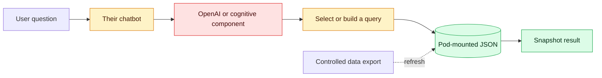

# Quick comparison: MCP tools or a message-to-query function

This is the short version of the
[full architecture comparison](README.md). The other team's design has not
been inspected, so its path below is the current understanding to confirm with
them.

## One-minute summary

Both systems turn a human question into a data answer. The important difference
is where the model stops and deterministic code begins:

- **Our FastMCP path:** the model selects a named tool and typed arguments. The
  tool owns the parameterised query.
- **Their reported function path:** a message is transformed into a query. We
  need to confirm whether the function selects a fixed template, emits a
  structured plan, or generates executable query text.

## Clear verdict

- **One chatbot and a few stable queries: fixed-template function wins** on
  simplicity, latency, cost, and determinism.
- **Several agents or applications sharing the capability: typed MCP wins** on
  reuse, standardisation, central policy, and auditability.
- **Typed MCP beats model-generated executable queries** on security and
  predictability.
- **For our platform direction, typed MCP is the overall winner.** If their
  fixed query function is already tested, expose its approved operations as
  MCP tools rather than rewriting it.

## Our path: live FastMCP and UAMI

**Security:** no database password in the Pod; short-lived identity tokens;
typed tools and database grants restrict access. The MCP endpoint still needs
caller authentication, tool allowlists, rate limits, and audit records.

**Efficiency:** reads only the rows required and avoids copying the full
dataset. It depends on identity, network, and PostgreSQL availability, and each
new supported question shape may require a tool change.

## Their reported path: JSON and pre-built queries

The dotted export is relevant only if the JSON contains copied database rows.
If the JSON contains metadata or query definitions instead, their query must
execute against another data source that is not yet represented here.

**Security:** it may need no live database credential or route. However, a JSON
copy becomes another data asset that must be encrypted, access-controlled,
redacted, versioned, and removed safely. Database row-level controls no longer
protect data after it has been copied.

**Efficiency:** local JSON reads can be fast and remain available during a
database outage. Exporting, distributing, loading, and refreshing the snapshot
adds work and may duplicate the same data across Pods. Answers can silently be
stale unless the snapshot time is shown.

## Security and efficiency winner chart

| Decision | Typed MCP tools | Message-to-query function | Winner |
|---|---|---|---|
| Security with bounded operations | Tool schema, allowlists, Gateway, and database grants | Equally strong if it selects only fixed parameterised templates | **Draw** |
| Security if the model creates executable queries | Model does not need to create SQL | Larger validation and injection surface | **MCP** |
| Raw efficiency for one application | Adds discovery/routing and a network hop | Direct fixed function is normally faster and cheaper | **Function** |
| Reuse across several clients | Standard discoverable interface | Bespoke integration for each caller | **MCP** |
| Central governance and audit | Shared policies and tool receipts | Must be built into the application | **MCP** |
| Deterministic testing | Strong typed-tool tests | Stronger or equal for fixed templates; weaker for generated queries | **Function if fixed; MCP if generated** |
| Enterprise platform fit | Reusable governed capability | Best as an internal implementation detail | **MCP** |

These ratings are architectural expectations, not measured results. Compare
both paths with the same questions before selecting one.

## Suggested approach

1. Confirm whether their function selects a template, emits a structured plan,
   or generates executable query text.
2. Keep both paths separate for an initial comparison using the same questions.
3. Measure correctness, security controls, latency, model cost, retries, and
   operational effort.
4. Keep the direct function if it is a small, fixed, single-chatbot capability.
5. Use MCP when multiple agents or applications need the same governed tools.
6. Prefer exposing their tested fixed query functions as typed MCP operations
   over chaining or duplicating both implementations.

## Copy-ready Teams message

> Hi team — thanks for explaining the chatbot query flow earlier. We are
> comparing it with our typed FastMCP/UAMI path and want to make sure we have
> understood your implementation correctly before proposing any integration.
>
> Our current understanding is that your Pod loads PostgreSQL-related JSON and
> sends the user's message to an OpenAI/cognitive component or function that
> transforms it into a query. Our path has the model select a bounded FastMCP
> tool and typed arguments; the tool owns the parameterised query.
>
> Could you help clarify:
>
> 1. Does the JSON contain copied database rows, schema metadata, query
>    templates, or a combination?
> 2. If it contains rows, how is it exported, refreshed, versioned and
>    reconciled with PostgreSQL, and does the answer show the snapshot time?
> 3. Most importantly, does the model return an intent/template identifier, a
>    structured query plan, or complete executable query text?
> 4. If a query is generated, what validates it before execution and what
>    limits or retries are applied?
> 5. What identity and permissions are used if any query reaches PostgreSQL?
> 6. What security controls protect the JSON inside the Pod and prevent
>    sensitive data being returned to the model or user?
> 7. Could you share a sanitized diagram and one example question-to-answer
>    trace, including the JSON/query version but no private data?
>
> Our initial view is that a fixed-template function may win for one small use
> case because it is simpler and faster, while typed MCP wins when multiple
> agents or applications need shared governance, reuse, and auditability. If
> your query functions are already bounded and tested, one option is to expose
> those operations as typed MCP tools rather than rewrite or chain them. Once
> we confirm the details above, we can score both paths with the same questions.

## Decision to avoid for now

Do not route every question through both systems. That would add latency,
failure modes, and reconciliation work while leaving uncertainty over which
answer is authoritative.
