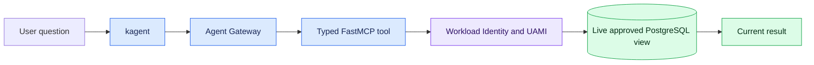
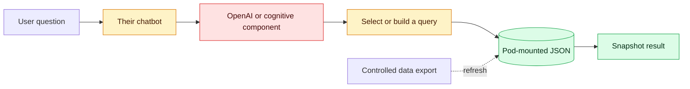

# Quick comparison: live FastMCP or JSON query service

This is the short version of the
[full architecture comparison](README.md). The other team's design has not
been inspected, so its path below is the current understanding to confirm with
them.

## One-minute summary

Both systems turn a human question into a data answer, but they appear to use
different sources:

- **Our FastMCP path:** reads current information from approved PostgreSQL
  views. The Pod authenticates without a database password through AKS
  Workload Identity and UAMI.
- **Their reported path:** uses JSON loaded into the Pod and pre-built or
  model-selected queries. It may be querying an exported data snapshot, or the
  JSON may only describe the database; this needs confirmation.

They can remain separate. The simplest collaboration is to share the business
data contract, expected answers, and test questions. If their chatbot needs
current data, it could call our typed FastMCP tools rather than build another
live PostgreSQL connection.

## Our path: live FastMCP and UAMI

**Security:** no database password in the Pod; short-lived identity tokens;
typed tools and database grants restrict access. The MCP endpoint still needs
caller authentication, tool allowlists, rate limits, and audit records.

**Efficiency:** reads only the rows required and avoids copying the full
dataset. It depends on identity, network, and PostgreSQL availability, and each
new supported question shape may require a tool change.

## Their reported path: JSON and pre-built queries

The dotted export is relevant only if the JSON contains copied database rows.
If the JSON contains metadata or query definitions instead, their query must
execute against another data source that is not yet represented here.

**Security:** it may need no live database credential or route. However, a JSON
copy becomes another data asset that must be encrypted, access-controlled,
redacted, versioned, and removed safely. Database row-level controls no longer
protect data after it has been copied.

**Efficiency:** local JSON reads can be fast and remain available during a
database outage. Exporting, distributing, loading, and refreshing the snapshot
adds work and may duplicate the same data across Pods. Answers can silently be
stale unless the snapshot time is shown.

## Security and efficiency at a glance

| Question | Live FastMCP/UAMI | JSON query service |
|---|---|---|
| Is the answer current? | **Strong:** reads the live approved view | **Depends:** limited by snapshot refresh |
| Is data duplicated? | **No:** result rows are read when needed | **Possibly:** copied rows may live in each Pod |
| Database credential in Pod | **No password:** UAMI obtains short-lived tokens | **None needed** if it reads JSON only |
| Access enforcement | **Layered:** Gateway, typed tool, UAMI role, approved view | **Must be added around JSON:** file, Pod, namespace, query and response controls |
| Arbitrary query risk | **Low** for typed tools; higher if generic SQL is exposed | **Low** for fixed templates; higher if a model generates queries |
| Typical latency | Network and live database query | Fast local read, plus any model call |
| Availability dependency | Requires identity, network and PostgreSQL | Can work offline until the snapshot is stale |
| Operational effort | Tool lifecycle, Gateway, identity and database policy | Export, signing, distribution, refresh and reconciliation |
| Best use | Current operational questions | Stable reference or explicitly dated snapshot questions |

These ratings are architectural expectations, not measured results. Compare
both paths with the same questions before selecting one.

## Suggested approach

1. Keep the two paths separate for an initial comparison.
2. Confirm whether their JSON contains rows, metadata, query templates, or all
   three.
3. Agree one authoritative data contract and a small shared evaluation set.
4. Label every response as `live` or `snapshot`; show the extraction time for
   snapshot answers.
5. Use FastMCP for current data and JSON only where offline, cached, or stable
   reference behaviour provides a clear benefit.
6. Integrate their chatbot with FastMCP only if they need current PostgreSQL
   data; do not chain both systems for every request.

## Copy-ready Teams message

> Hi team — thanks for explaining the chatbot query flow earlier. We are
> comparing it with our typed FastMCP/UAMI path and want to make sure we have
> understood your implementation correctly before proposing any integration.
>
> Our current understanding is that your Pod loads PostgreSQL-related JSON,
> uses an OpenAI/cognitive component to select or build a query, runs that
> query, and returns the result to the chatbot. Our path calls bounded FastMCP
> tools that query approved live PostgreSQL views using AKS Workload Identity
> and UAMI.
>
> Could you help clarify:
>
> 1. Does the JSON contain copied database rows, schema metadata, query
>    templates, or a combination?
> 2. If it contains rows, how is it exported, refreshed, versioned and
>    reconciled with PostgreSQL, and does the answer show the snapshot time?
> 3. Are the queries fixed templates, selected from a catalogue, or generated
>    by the model at runtime?
> 4. If a query is generated, what validates it before execution and what
>    limits or retries are applied?
> 5. What identity and permissions are used if any query reaches PostgreSQL?
> 6. What security controls protect the JSON inside the Pod and prevent
>    sensitive data being returned to the model or user?
> 7. Could you share a sanitized diagram and one example question-to-answer
>    trace, including the JSON/query version but no private data?
>
> Both approaches may be useful: FastMCP for current live answers and your JSON
> path for stable or offline snapshot questions. Once we understand the points
> above, we can compare the same sample questions and decide whether the paths
> should remain separate, share a data contract, or let your chatbot call the
> typed FastMCP tools when it needs live data.

## Decision to avoid for now

Do not route every question through both systems. That would add latency,
failure modes, and reconciliation work while leaving uncertainty over which
answer is authoritative.
