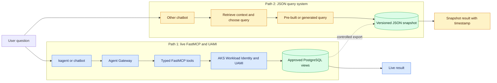

# PostgreSQL natural-language query integration

This note compares two ways to answer natural-language questions from
PostgreSQL and shows how the existing FastMCP + AKS Workload Identity/UAMI
bundle can work with a separate retrieval-assisted query-generation system.

For a shorter explanation, separate diagrams, and a copy-ready team message,
read
[`QUICK-COMPARISON-AND-TEAMS-MESSAGE.md`](QUICK-COMPARISON-AND-TEAMS-MESSAGE.md).

The other system is described from a conversation, not from inspected source
or runtime evidence. Confirm the questions in [Discovery checklist](#discovery-checklist)
before treating its design as established. In particular, confirm whether the
JSON loaded into its Pod contains database metadata, a curated business data
contract, query examples, or actual exported database rows.

Do not put database rows, private schema details, endpoints, identity IDs,
credentials, tokens, or generated work queries in this public repository.

## Executive decision

Treat the systems as parallel answer paths first. Do not chain them merely
because they answer similar questions.

- The FastMCP path reads current data from an approved PostgreSQL view.
- The reported alternative reads a copied JSON dataset or metadata snapshot
  using pre-built or model-selected queries.
- UAMI secures the live PostgreSQL connection. It has no role in a Pod that
  reads only local JSON.
- If both paths answer the same questions, nominate one authoritative result
  and use the other only where it has a distinct freshness, availability, cost,
  or question-coverage benefit.
- Share the business data contract and evaluation cases even if the runtimes
  remain separate.

Integrate them only when the proof demonstrates a real need. The strongest
integration is for the other chatbot to invoke bounded FastMCP tools when it
needs current PostgreSQL data, while retaining JSON for explicitly labelled
snapshot or reference questions.

## The two patterns



The dashed export is optional. If the JSON contains copied rows, it should be a
controlled, versioned export from an authoritative source. If it contains only
schema metadata or query examples, remove that export relationship and treat
the JSON as retrieval context rather than an answer dataset.

### Pattern A: retrieval-assisted text-to-SQL

The reported design appears to be:

```text
question
  -> retrieve relevant PostgreSQL information from Pod-mounted JSON
  -> send question plus retrieved context to an OpenAI endpoint
  -> receive generated SQL
  -> validate and execute the SQL
  -> return results to the chatbot
```

The model may produce novel filters, groupings, and joins without a developer
adding a tool for every question. The cost of that flexibility is that valid
SQL can still be unauthorised, expensive, or semantically wrong. Execution
success and retries do not prove that the query answered the intended question.

### Pattern B: typed FastMCP tools

The current FastMCP/UAMI bundle follows this shape:

```text
question
  -> agent selects a named FastMCP tool and supplies typed arguments
  -> tool constructs parameterised SQL for an approved view
  -> UAMI authenticates the Pod to PostgreSQL
  -> restricted PostgreSQL role executes the query
  -> structured result returns through MCP
```

The current adapter exposes only three operations. It does not accept arbitrary
SQL from the model. This makes the execution path easier to test and audit, but
new question shapes may require new tools or approved templates.

MCP is an interface, not an automatic safety guarantee. An MCP tool such as
`run_sql(sql: string)` would reintroduce most text-to-SQL risks. The useful
boundary is the typed tool contract, independent validation, database grants,
and approved-view design.

## Security and efficiency comparison

| Path | Security advantages | Security disadvantages |
|---|---|---|
| Live typed FastMCP + UAMI | No database password in the Pod; short-lived Entra tokens; typed tools can prevent arbitrary SQL; PostgreSQL grants and approved views enforce the final boundary; Gateway and tool receipts support caller-level audit | Requires protection of the MCP endpoint; UAMI authenticates the Pod to PostgreSQL but does not authenticate chatbot callers; a generic SQL tool would widen the risk; live database connectivity increases the operational blast radius |
| JSON + pre-built queries | Can operate with no live database route or database credential; an immutable read-only snapshot limits direct database impact; pre-built query templates can be deterministic | Copied data creates another sensitive asset; Pod or image access may expose the whole snapshot; stale or unsigned JSON can silently produce wrong answers; generated queries still need validation; row-level database controls no longer protect the copied data |

| Path | Efficiency advantages | Efficiency disadvantages |
|---|---|---|
| Live typed FastMCP + UAMI | Reads only the data required for the question; no full-dataset export or Pod memory footprint; one backend can serve multiple clients; typed tools reduce query-generation tokens and retries | Pays network, token acquisition, and database-query latency; requires PostgreSQL availability; new question shapes may require a new tool; poorly designed live queries can consume database resources |
| JSON + pre-built queries | Local reads can be fast and survive database unavailability; predictable templates may be inexpensive; useful for stable reference data and repeated questions | Export, distribution, refresh, reconciliation, and storage consume resources; each Pod may duplicate the dataset; model-assisted query selection adds inference latency; freshness may require frequent rebuilds or restarts |

### Overall pros and cons

| Concern | JSON query system | Typed FastMCP/UAMI |
|---|---|---|
| Best fit | Stable snapshots, offline/reference use, repeated known questions | Current operational data and centrally governed access |
| New question coverage | Potentially high if it generates queries; bounded if templates only | Limited to approved tool operations |
| Predictability | High for fixed templates; model-dependent for generated queries | High for tested typed tools and parameterised SQL |
| Query correctness | Requires snapshot reconciliation plus semantic evaluations | SQL construction is deterministic; tool selection and source data still require evaluation |
| Freshness | Limited by export and deployment cadence | Reflects the live approved view at query time |
| Data duplication | Yes, if JSON contains rows | No separate answer dataset |
| Failure isolation | Database outage may not affect an already loaded snapshot | Database or identity outage prevents answers rather than serving an unnoticed stale copy |
| Explainability | Retain snapshot version, selected template/query, and validator result | Retain tool name, arguments, SQL-template version, identity, and result provenance |
| Standard integration | Application-specific unless it exposes an API or MCP tools | MCP supplies a discoverable client/server contract |

## How FastMCP/UAMI can work with the other system

### Option 1: remain parallel and share the contract — default

Keep the runtimes independent, but agree the same business definitions,
representative questions, expected answers, data classifications, and freshness
rules. Reconcile the JSON snapshot against the approved PostgreSQL view at each
export.

Use this when the JSON path has a genuine offline, snapshot, latency, or
availability requirement. Every answer must identify `live` or `snapshot` and,
for a snapshot, report its extraction time and contract version.

### Option 2: shared FastMCP backend for live questions

Keep both user experiences but route their approved database operations through
the same FastMCP service:

```text
their chatbot ---------+
                       +-> FastMCP -> UAMI -> approved PostgreSQL views
kagent / Agent Gateway +
```

Their retrieval component converts a question into a tool name and structured
arguments rather than raw SQL. Their application acts as an MCP client, or a
small adapter translates its structured request into an MCP call.

Benefits:

- one implementation of database identity, token refresh, TLS, queries, and
  approved-view enforcement;
- consistent results across both chat front doors;
- independent evolution of each chatbot without duplicating database access;
- shared tool-level receipts and negative tests; and
- no database password or Entra token exposed to either model.

This requires caller authentication and authorisation on the FastMCP endpoint.
The PostgreSQL UAMI authenticates the FastMCP Pod to the database; it does not
authenticate their chatbot to FastMCP. Agent Gateway or another approved front
door must identify callers, restrict tools, rate-limit requests, and preserve
audit context.

### Option 3: shared structured query plan

If their retrieval logic adds material value, define a versioned intermediate
contract such as:

```json
{
  "operation": "namespace_count",
  "filters": {
    "region": "uksouth"
  },
  "group_by": [],
  "limit": 1,
  "data_contract_version": "{{VERSION}}"
}
```

The model may propose this plan, but deterministic code must validate it. The
validated operation is then passed to FastMCP, which owns SQL construction.
Do not allow fields, filters, joins, or operations merely because the model put
them in JSON.

This is the best meeting point when the other team has strong retrieval and
business-language mapping but the platform team wants one execution boundary.

### Option 4: separate text-to-SQL fallback

Keep a generated-SQL path only for questions that cannot be expressed through
the approved tool catalogue. It should use a distinct endpoint, tool name,
database role, policy, telemetry label, and evaluation gate.

Before execution, deterministic controls must:

1. parse the SQL rather than scan it with regular expressions;
2. accept exactly one read-only statement;
3. allow only approved schemas, views, columns, functions, and joins;
4. parameterise user-provided values;
5. reject base tables, system catalogues, DDL, DML, comments, multiple
   statements, and unsafe functions;
6. impose row, statement-time, concurrency, and query-cost limits;
7. optionally preflight with `EXPLAIN` under the same restricted identity; and
8. cap repair attempts and retain every rejected attempt in an owner-approved
   audit store.

The PostgreSQL role remains the final enforcement layer: `CONNECT`, schema
`USAGE`, and `SELECT` on approved views only. Prompt instructions, mounted JSON,
MCP tool descriptions, and retries are not security controls.

## What the mounted JSON should be

A curated, versioned data contract is safer and more useful than a raw database
dump. It should contain only approved metadata such as:

- business terms and their definitions;
- approved view and column descriptions;
- permitted filters, aggregations, and join relationships;
- data classifications and prohibited fields;
- freshness and ownership metadata;
- representative questions and expected operation shapes; and
- a contract version compatible with the deployed tools.

Do not rely on a Pod-start snapshot indefinitely. Publish an immutable,
versioned artifact, record its digest/version in each receipt, and fail closed
when its contract version is incompatible with the FastMCP tool catalogue.

## Correctness and retry policy

There are several independent correctness gates:

| Gate | What proves it |
|---|---|
| Syntax | PostgreSQL parser or an equivalent compatible parser accepts the statement |
| Authorisation | AST policy plus restricted database grants permit only approved objects |
| Operational safety | Cost, row, timeout, and concurrency limits pass |
| Semantic intent | Evaluation cases show the operation answers the user's intended question |
| Data correctness | Source view ownership, freshness, and reconciliation are recorded |

A retry may repair syntax or a stale identifier. It cannot prove semantic
correctness. Permit a small fixed number of retries only for classified,
recoverable errors. Never retry permission denials, policy rejections, unsafe
queries, or ambiguous business questions. Escalate those cases instead.

## Shared acceptance gates

Do not call the combined design complete until it proves:

- the same representative question returns an equivalent result through both
  chatbot front doors;
- tool names and argument schemas are versioned and discoverable;
- the FastMCP Pod obtains a database token through AKS Workload Identity with
  no database password Secret;
- allowed views succeed while base-table reads and writes fail closed;
- callers cannot invoke tools outside their assigned allowlist;
- schema/data-contract drift is detected rather than silently ignored;
- malformed arguments, prompt injection, unsafe SQL, excessive result size,
  timeout, and token-refresh cases have negative tests;
- receipts correlate question, caller, retrieved contract version, model,
  selected tool or query plan, validator outcome, database role, and bounded
  result metadata without recording sensitive rows; and
- an evaluation dataset measures semantic correctness, not only execution
  success.

## Discovery checklist

Ask the other team:

1. Does “cognitive AI” mean Azure AI Search, an Azure AI service, or an internal
   component?
2. What exactly is stored in the Pod-mounted JSON, and can it contain database
   rows or sensitive schema information?
3. Who produces, approves, versions, refreshes, and signs that artifact?
4. Does the model return raw SQL, a structured plan, or an approved template
   identifier?
5. What parses and validates the output before execution?
6. Which PostgreSQL identity executes it, and what are its exact grants?
7. Are approved joins and business definitions explicitly represented?
8. What are the row, timeout, concurrency, and query-cost limits?
9. Which failures trigger retries, and what is the maximum attempt count?
10. How is semantic accuracy evaluated against known questions and answers?
11. What receipt is retained, and how are sensitive prompts, SQL, and rows
    redacted?
12. Can their application call a standard MCP endpoint or emit the shared
    structured query-plan contract?

## Recommended proof sequence

1. Obtain a diagram and sanitized example from the other team; do not infer
   their runtime from the call summary.
2. Agree one approved view, five representative questions, and expected
   answers with the data owner.
3. Map each question to an existing typed tool or one new typed operation.
4. Invoke those tools from their chatbot through a non-production FastMCP
   endpoint.
5. Compare answers, latency, receipts, and failure behaviour with their current
   path.
6. Add the structured-plan contract only if retrieval materially improves
   intent or entity resolution.
7. Evaluate a generated-SQL fallback separately; do not widen the typed path
   merely to make the comparison pass.
8. Select the shared-backend, structured-plan, or intentionally separate model
   using evidence from the proof.

## Related bundles

- [`../POSTGRES-MCP-WORK-START-HERE.md`](../POSTGRES-MCP-WORK-START-HERE.md)
- [`../postgres-fastmcp-entra-uami/`](../postgres-fastmcp-entra-uami/)
- [`../postgres-mcpg-password/`](../postgres-mcpg-password/)
